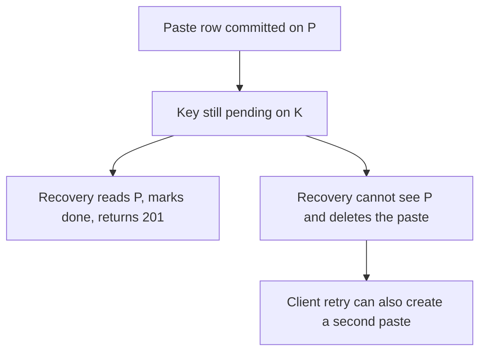

<!-- day-nav -->
[← Day 40 — Transactions that stop at the shard](40-transactions-that-stop-at-the-shard.md) · [Day 42 — Conflicts you can explain →](42-conflicts-you-can-explain.md)

# Day 41 — Sagas and compensation

**Do now**

1. Set a timer.
2. Attempt the problem. Stop at the attempt line. Do not scroll.
3. Then read.

## Time box

40 minutes.

| Minutes | Do this |
|---|---|
| 0–12 | Attempt. A workflow that crosses a boundary. Name each step, the compensation, and the crash window that compensation gets wrong. |
| 12–32 | Read. If every failure "rolls back," you drew a transaction, not a saga. |
| 32–40 | Say the window where the compensation would delete a paste that actually committed. |

## Intent

Facing a workflow that crosses partitions, leave able to use a saga and name the compensation and the crash window. A saga is what you do because day 40's transaction stopped. It is not a distributed transaction with a friendlier name. Compensation can be wrong. That wrongness is the design.

## Problem

> Design a pastebin. People paste text and share a link.

The interviewer says: "The idempotency key lives in a different service than the paste row. You cannot BEGIN across them. Make create correct anyway."

## Attempt before reading

12 minutes. Do not scroll. You spent day 37 putting the key on the same shard so you would not be here. They moved it. The object store is already a second system. Create budget is about **2 seconds**. Ids are never reused.

Write:

1. The steps in order, including the PUT and both commits.
2. For each step, the compensation if a later step fails. "Retry" is not a compensation unless you say what is undone.
3. The crash where the paste row committed and the key service never heard. What must the recovery **not** do?
4. Why you would still rather colocate, in one sentence, after you have shown you can saga.

---

**Stop. Steps, compensations, and one unsafe undo, below.**

---

## Requirements

A saga is a sequence of local transactions plus compensations that undo a local transaction that already committed. There is no global rollback. Once the paste row commits, the only way to "undo" it is another command: delete the row, reap the object. That command is dangerous if you run it because you were confused about whether the commit happened.

You still owe the client one paste per idempotency key, or a clear failure and **no** paste. "Sometimes two, we compensate" is the bug they asked you to remove on day 37.

The happy path remains: do not split these rows. The saga is the answer when the split is forced. Leading with the saga when colocation is available is how you spend the hour on recovery for a boundary you chose.

## Design

### Steps

The key service is shard K. The paste shard is shard P, encoded in the id.

1. Mint the id. Encode P in the prefix. No commit yet.
2. On K, insert `(key, request_hash, paste_id, state=pending)` in one local transaction. If the key exists and is `done`, return the stored 201. If it exists and is `pending`, do **not** mint another id. Go to recovery for the id already stored. If the hash differs, 409.
3. PUT the object at that id.
4. On P, insert the paste row. One local transaction. No idempotency row here. That is the point of the split.
5. On K, set `state=done` and store the 201 body. Return 201 to the client.

Each of 2, 4, and 5 is a local commit. None of them is a distributed commit. Between them the world is inconsistent on purpose, for a short time.

### Compensations

**Step 4 fails** (P refuses, or you get a definite 4xx from your own validation after the pending insert): compensate by setting K to `aborted` and reaping the object if the PUT might have landed. The client gets 503 or 400. A retry with the same key sees `aborted` and may start over with a **new** id, or you treat aborted as "try the whole saga again" under the same key by going back to pending with a new id. Pick one and say it. Simplest: `aborted` means the key is free to become `pending` again with a new paste id, in one update that checks `state=aborted`. You do not leave the client stuck.

**Step 3 fails definite** (bucket says the PUT did not happen): you can compensate K to `aborted` without a reap. If the PUT is **uncertain** (timeout), you do not know. Recovery must reap only after the age floor, and only if step 4 did not commit. Uncertain PUT plus immediate reap is how you delete a byte stream the bucket actually stored and that step 4 then points at. Age floor still applies. The saga does not repeal day 27.

**Step 5 fails:** do **not** compensate step 4. The paste exists. The client timed out and will retry. Recovery is: key is `pending`, paste id is known, read P, the row is there, so set `done` and return the 201. Deleting the paste because `done` was never written is the data loss. Write it down as the forbidden compensation.

**Step 2 never happened:** nothing to compensate. The client retries. No paste.

### The crash window

Pending is not "failed." A worker that treats every pending older than the create budget as aborted will abort keys whose step 4 is still in flight, or whose step 4 **committed** and step 5 has not. The create budget is **2 seconds**. The recovery sweep must wait longer than a stuck create, not longer than a healthy one. Planning: **do not abort a pending key younger than 1 minute**, and before aborting, **read shard P for that paste id**. If the row exists, finish step 5. If the row does not exist and the key is older than a minute, abort and reap with the age floor. If you cannot reach P, you **leave it pending**. Aborting because P was down is the same forbidden compensation: you may be deleting the evidence of a commit you failed to see, or freeing the key so a retry creates a second paste while the first commit is about to land.

That last sentence is the whole lesson. Compensation that runs when it cannot see the other shard will undo a success. The safe action when you are blind is to wait, not to undo.

A retry from the client during pending: look up the key, find pending, run recovery, do not insert a second pending. The unique key on K is what makes the second insert fail. You already know that shape from day 37. The saga did not remove the unique constraint. It moved it.

### What the user sees

In the bad window, the client has no 201 yet. If they GET the id, they might see the paste (step 4 done, step 5 not) or a 404 (step 4 not done). You have not handed out the id, because you have not returned 201. A 404 on an id nobody was told is fine. Do not return the id to the client until step 5 completes. If you return it at step 4, the client holds a link and your compensation might still reap it. **The response is the last step, after done.** That is the same rule as "201 after commit," stretched across two services.

### Why colocation is still the answer

This saga exists because they forced the key onto another service. Every create now has three local commits, a recovery sweeper, and a forbidden undo. Day 37's single transaction has one commit and a reaper you already run for the PUT. When they ask "so you'll do the saga?", you say you can, you name the window, and you recommend putting the key back on the paste shard unless a hard boundary (another team's database, a key they will not let you colocate) forces the split. A saga you chose for style is a crash window you chose for style.

You do not draw a saga framework, an orchestrator product, or a workflow engine. The orchestrator can be the app process plus a sweeper over `pending` keys older than a minute. If the app dies, the sweeper is the orchestrator. If only the app remembers the saga, a crash loses the compensation. State lives in K, in the pending row, not in memory.

## Diagrams

### The undo you must not run

The bottom branch is the compensation that fires while blind.

## Trade-offs

**Choice.** If the key service is forced: pending, PUT, paste insert, mark done. Recovery reads the paste shard before it aborts. Never delete a paste whose key is merely not `done`. Prefer colocation when you have a choice.

**Alternative.** Two-phase commit between K and P, or colocation.

**What you give up.** A single commit, a simple retry, and the right to reap aggressively. You gain a design that survives a team boundary. You take a window, up to about a minute, where a key is pending and a sweeper must be careful. The user who did not receive 201 must not receive a second paste.

**10×.** The saga's cost is operational, not QPS. More creates mean more pending rows in that minute. The forbidden compensation gets more tempting because the pending-age alert is louder. The fix is still "look at P before you undo," not a faster abort.

## Talking points

**Hand-waving.** "We use a saga, so it's eventually consistent." Eventually which state, and what do you refuse to undo? If the compensation is "delete whatever looks unfinished," you will delete a finished paste during a partition.

**Hand-waving.** "The orchestrator handles it." Where is the state if the orchestrator process dies? If the answer is "in the orchestrator," you do not have a saga. You have a memory leak of work.

**If they ask whether the PUT is a saga step.** Yes. It already was, before this interview. The reaper is the compensation, the age floor is the "do not undo too soon" rule, and the 201 comes after the row commit so the client never holds an id you might still reap. Today you added a second database to that story. The discipline is the same.

## Say this in the room

I would still colocate the idempotency key with the paste. If I cannot, create is a saga: mark the key pending with the minted id, PUT the object, commit the paste, then mark the key done and only then return 201. If the paste commit fails I abort the key and reap, and if it succeeded but the done-mark did not, recovery reads the paste shard and finishes the mark. It must not delete the paste because the key still says pending, and if it cannot see that shard it waits. A compensation that runs while blind will destroy a commit and let the retry create a second paste.

## Kit artifact

One checklist row.

| Follow-up | You answer with |
|---|---|
| "This crosses a service boundary." | The steps, the compensation, and the undo you will not run when you cannot see the other side. |

## Design log

One line: the compensation in your attempt that could fire after the real commit.

Next: [Day 42 — Conflicts you can explain](42-conflicts-you-can-explain.md).

---

<!-- day-nav -->
[← Day 40 — Transactions that stop at the shard](40-transactions-that-stop-at-the-shard.md) · [Day 42 — Conflicts you can explain →](42-conflicts-you-can-explain.md)
