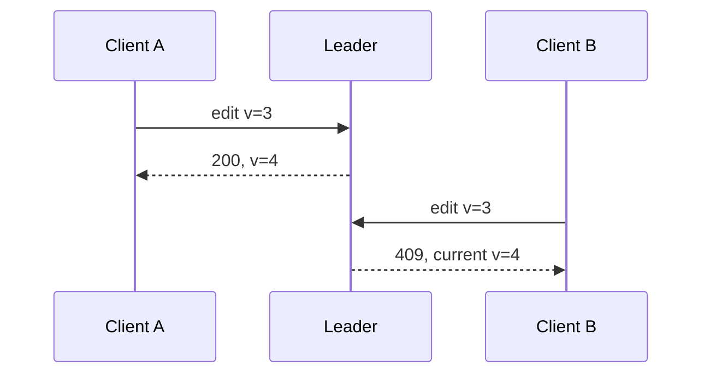

<!-- day-nav -->
[← Day 41 — Sagas and compensation](41-sagas-and-compensation.md) · [Day 43 — Active-passive or active-active →](43-active-passive-or-active-active.md)

# Day 42 — Conflicts you can explain

**Do now**

1. Set a timer.
2. Attempt the problem. Stop at the attempt line. Do not scroll.
3. Then read.

## Time box

40 minutes.

| Minutes | Do this |
|---|---|
| 0–12 | Attempt. Two writers of one row. Pick versions, last-write-wins, or a merge. Say when a CRDT is worth naming. |
| 12–32 | Read. If your merge invents a body neither writer posted, you have not merged. You have edited. |
| 32–40 | Say the rule for this pastebin, and the product for which you would name a CRDT. |

## Intent

Facing two writers, leave able to choose versions, last write, or a merge, and say when a CRDT is worth naming. Conflict is not a failure mode you discover at the end. It is a rule you publish before two regions write, or before two requests race.

## Problem

> Design a pastebin. People paste text and share a link.

The interviewer says: "Suppose we allowed edit. Two clients update the same paste at once. What does the next reader see, and why?"

## Attempt before reading

12 minutes. Do not scroll. Today's product refuses edit. They just forced it. You still have one leader per shard. You may also assume they will ask about two regions later (day 43). Ids never reused. Bodies are opaque text, not a JSON document with fields you understand.

Write:

1. The rule under one leader: what the second writer gets, and what is stored.
2. The rule if two leaders both accept an edit (the day-36 fence failed, or two regions). Last-write-wins needs a clock. Say which clock, and the lie.
3. A merge that is not last-write-wins. What string do you produce from "hello" and "hallo"?
4. Whether you say the word CRDT in this interview. If yes, which type. If no, what product would make you say it.

---

**Stop. Conditional writes under one leader. LWW only with a named clock. No CRDT for opaque text.**

---

## Requirements

Edit is a new requirement. The API grows a conditional write: the client sends the version it read. The row stores a version that only the leader advances. Without that, two PUTs are last-writer-wins by arrival order, which is a rule, and you should still say it. Conditional is better because the second writer learns they lost instead of silently overwriting.

A conflict rule has to produce something a human can understand. Concatenating two bodies with a marker is not a merge of a paste. It is a new product that invents text. Opaque UTF-8 has no field-wise merge. If the body were a shopping cart of line items, a different rule would apply. It is not.

You will not invent a vector clock for one region and one leader. You will not refuse to answer because "CRDTs are hard." You will pick a boring rule and name the product that would force a richer one.

## Design

### One leader: version, or reject

Row has `version`, an integer the leader increments on every successful edit. Read returns the version. Edit is:

```
UPDATE paste SET body=..., version=version+1
WHERE id=? AND version=?
```

Zero rows updated: **409 Conflict**, with the current version and, if you choose, the current body. The client must re-read and decide. They may overwrite on purpose with the new version. That is a human merge, not a server merge.

Two concurrent edits of version 3: one becomes 4, the other gets 409. The leader's lock order decides. There is no sibling. There is no clock. This is the default. It works because day 36 gave you one writer. Do not add a CRDT to a single-leader row "for future multi-region." Future multi-region is day 43, and it may refuse dual writes instead of merging.

Delete is still a versioned write, or a separate tombstone with a version so an in-flight edit cannot resurrect a deleted paste. An edit that races a delete: the delete commits first, the edit's `WHERE version=?` finds no live row and 404s or 409s. Do not apply an edit to a tombstone without a rule. The rule is: tombstone wins unless the edit carries a version **after** the delete in the leader's order, which it cannot if the delete already committed. In-flight is the only race, and the row lock settles it.

### Last-write-wins, when you have no leader agreement

Two regions both accepted an edit. You now have two bodies and two versions that both think they are next. Options:

**Last-write-wins with a wall clock.** Store `updated_at` from the writer's clock. The later timestamp wins. A clock that is 5 minutes fast wins forever until someone else is faster. Client clocks are worse than server clocks. Server clocks still skew. Day 44. You may use LWW if the product accepts the wrong winner occasionally and you say so. A paste that silently loses a sentence because an NTP step jumped is a bad product. Prefer not to.

**Last-write-wins with a hybrid logical clock or a region-stamped version.** Still LWW. You reduce the frequency of wrong order. You do not eliminate the case where two edits commute in time and one body disappears. The lost body is the cost. Say it: **one of the two edits is discarded.** If that is unacceptable, LWW is the wrong rule.

**Keep both as siblings.** The next read returns a conflict object. The client must merge. You have pushed the merge to a human. For a paste, that may be right: show both, let the author pick. Storage grows. The API is no longer a single body. You have designed a different product (a conflict-aware doc). Say that. Do not hide siblings behind a 200 that randomly picks.

### Merge, for values that merge

Counters add. Sets union. Maps of independent keys merge by key. Those are the cases where a CRDT is worth naming: a view count (day 32's salt is a hand-built counter merge), a tag set, a presence map. A CRDT is a datatype whose concurrent updates commute to one value without coordination. Naming it without a type is name-dropping. Naming G-Counter for a view count is fine. Naming "we'll CRDT the paste body" is not, because there is no CRDT of arbitrary UTF-8 that produces a paste either writer would recognize, unless you treat the body as a sequence CRDT (an OT or CRDT text document), which is collaborative editing, day 67, a different interview.

For this forced edit of opaque text: **conditional write under one leader. No automatic merge. No CRDT.** If two regions write, **refuse dual writers** (day 43) or **keep siblings for the author**. Do not LWW a paragraph into silence and call it resolved.

### What you say when they want magic

"Automatic merge" of two edits of the same paragraph is an AI feature or a text CRDT. Both are out of scope for this course (no AI) or a later product day. The staff answer is the refusal plus the conditional write. The interviewer's follow-up will often be "ok, so 409." Take the win. Do not invent three-way merge to look senior. Senior is knowing when the datatype does not merge.

## Diagrams

### Second writer under one leader



B lost. B can re-read and overwrite if the product allows. The server did not invent a third body.

## Trade-offs

**Choice.** Versioned conditional edit under one leader. 409 on conflict. No CRDT for the body. Siblings only if two regions both wrote and you refuse to discard.

**Alternative.** Silent LWW, or a text CRDT, or "the database merges."

**What you give up.** Automatic resolution. One of two concurrent editors must retry. You keep a body that a human wrote, not a concatenation the server invented. You keep the right to say CRDT only when the type is a counter, a set, or a map of independent keys.

**10×.** More concurrent editors on a viral paste. 409 rate rises. That is a product problem (many people editing one paste) as much as a systems one. The rule does not change. A hot edit key is still one row on one leader: day 32's write ceiling applies if edit QPS is large. Salting a body does not work. You cannot merge sixteen body shards into one paste without a rule. Conditional write stays on one row.

## Talking points

**Hand-waving.** "Last write wins." Whose clock, and which write was discarded? If you cannot name both, you do not have LWW. You have hope.

**Hand-waving.** "We'll use a CRDT." Which one, and what is the merge of two conflicting sentences? If the answer is operational transformation for text, say collaborative editing and take it off this pastebin.

**If they ask about Dynamo-style siblings.** You can keep siblings. You must surface them. Returning a random sibling as 200 is LWW with a worse name. The application, not the database, merges. For opaque text, the application is a human.

## Say this in the room

Under one leader I store a version and take a conditional edit, so the second writer with a stale version gets a 409 and must re-read. I will not invent a merged body from two opaque strings. Last-write-wins needs a clock and silently drops one edit, which I refuse for a paste. A CRDT is worth naming for a counter or a set, not for this body. If two regions both accept an edit, I either refuse dual writers or I keep siblings for the author, and I do not call a random pick a merge.

## Kit artifact

One checklist row.

| Follow-up | You answer with |
|---|---|
| "Two writers, same key." | Version and 409, or LWW with a named clock and a discarded write, or siblings. No body CRDT. |

## Design log

One line: the merge rule in your attempt that invented text, or the clock you left unnamed.

Next: [Day 43 — Active-passive or active-active](43-active-passive-or-active-active.md).

---

<!-- day-nav -->
[← Day 41 — Sagas and compensation](41-sagas-and-compensation.md) · [Day 43 — Active-passive or active-active →](43-active-passive-or-active-active.md)
