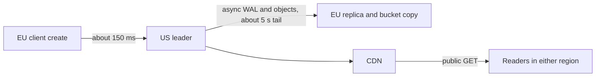

<!-- day-nav -->
[← Day 42 — Conflicts you can explain](42-conflicts-you-can-explain.md) · [Day 44 — Clocks, ids, and order →](44-clocks-ids-and-order.md)

# Day 43 — Active-passive or active-active

**Do now**

1. Set a timer.
2. Attempt the problem. Stop at the attempt line. Do not scroll.
3. Then read.

## Time box

40 minutes.

| Minutes | Do this |
|---|---|
| 0–12 | Attempt. Pick a topology for two regions. Name the conflict or the failover cost, not both as zero. |
| 12–32 | Read. If both regions take creates and you have no conflict rule, you picked active-active by accident. |
| 32–40 | Say RPO, the write path's extra latency, and why bandwidth did not decide this. |

## Intent

Facing users in more than one region, leave able to choose a write topology and the conflict or failover cost that comes with it. Two regions is not a checkbox for "HA." It is a decision about who may commit, and what a reader in the other region is allowed to believe.

## Problem

> Design a pastebin. People paste text and share a link.

The interviewer says: "We have users in the US and in Europe. One region is not the plan anymore. Where do writes go?"

## Attempt before reading

12 minutes. Do not scroll. Creates are about **116/s** average, **350/s** peak. Public reads are mostly on the CDN already. Cross-region round trip, planning: **150 ms**. Idempotency keys exist (day 37). You do not have edit, unless you kept day 42's conditional write. One leader per shard today, in one region.

Write:

1. Active-passive or active-active. Which region accepts POST.
2. What an EU user waits on a create, in milliseconds, on the topology you picked.
3. The failure: either a conflict (two regions both wrote) or a failover (the writer region is gone). Give RPO as seconds of data, not as "we replicate."
4. Whether you replicate metadata only, or the bucket too. They fail differently.

---

**Stop. The topology and the failure you priced are below. Do not change the attempt to match.**

---

## Requirements

Reads of public pastes already leave the region: the CDN is in front. The regional question is about **creates, deletes, and origin misses**, not about a hot GET. If your attempt puts a full copy of the app and the primary in Europe so that GETs are fast, check whether the CDN already did that. Do not pay for a second primary to speed up a read the edge holds.

A topology:

- **Active-passive.** One region commits. The other may serve reads that tolerate lag, and may be promoted. Conflicts: none, while the fence holds. Cost: failover time, replication lag (RPO), and write latency for users far from the writer.
- **Active-active.** Both regions commit. Failover of writes can be "the other region is already writing." Cost: conflicts, or a global order you pay for on every write (which is passive with extra steps).

You do not get zero conflicts and zero failover. Pick.

Bandwidth is not the decider. Say the number so they cannot use it against you. Planning WAL per create, about **1 KB** (row, indexes, overhead — a ceiling you would measure). Average 116/s × 1 KB ≈ **116 KB/s**, under **1 Mbit/s**. Peak 350 KB/s, about **3 Mbit/s**. Cross-region metadata replication is cheap. Body replication, if you turn it on: **100 GB/day** average is 100 × 8 / 86,400 gigabits per second ≈ **9.3 Mbit/s**. At 10×, about **93 Mbit/s**. Real money relative to WAL, still not a reason to drop a region. Correctness picks the topology. The bill is a sentence, not the argument.

## Design

### Active-passive, writer in one region

Pick the US as the writer because you need a concrete answer, not because the US is special. EU creates go to the US primary. They pay about **one transatlantic round trip** on top of the in-region commit, so on the order of **150 ms** plus the PUT, inside the **2 second** create budget. 150 ms is uncomfortable and acceptable. It is not a reason to take writes in both regions. If EU creates became the product's pain, you would revisit. Today 116/s can cross an ocean.

EU origin misses, if any, also cross, or they read an EU replica that lags. Day 34's rules still apply: a replica miss is not a 404, and the uploader's token may force the US primary. The CDN stays at 60 seconds and does not care which region originated the object, as long as one origin is authoritative. Do not put two origins behind one CDN without a rule for which one wins. One origin: the writer region. The passive region's replica is not an origin for the CDN unless you have promoted.

**Failover.** The US region is gone. You promote the EU replica of the metadata and you shift creates. Planning window: **5 minutes**, not the 30-second in-region election. A region failover is traffic shift, DNS or anycast, a database promotion, and a human or a runbook. Call it 5 minutes of **503 on create**. Cache and edge still serve. Say that number before they do.

**RPO.** Async cross-region WAL. Planning lag while healthy: **5 seconds** (worse than the in-region 200 ms, because the pipe and the apply are not the same rack). If the US dies hard, those **about 5 seconds of commits** never arrive. Those users have a 201 and, after promotion, a 404. That is the same tail as day 13, with a number you updated for distance. If you need RPO of zero for metadata, the 201 waits for the EU replica to ack. Every create pays the 150 ms **inside** the commit, and a dead EU replica either blocks creates or you drop back to async under a named policy. For a pastebin you stay async and you own the 5 seconds. Do not wait for the other continent on the 201 unless they make the tail unacceptable.

**The bucket.** Metadata promotion does not bring bytes that lived only in the US bucket. Either the bucket replicates cross-region (async, another tail, another 5-second-class RPO for objects, and ~9 Mbit/s), or a US region loss loses the objects for every paste whose bytes had not copied, which can be **all of them** if you never turned replication on. Say which. Planning choice: **turn on async bucket replication**. RPO is the unreplicated tail of both WAL and objects, budget **5 seconds** healthy, **whatever had not shipped** in a partition. You do not claim zero.

During the 5 minutes, do not let the US come back and accept writes. Fence the old region. Day 36's epoch, at region scale. A healed US that still thinks it is primary will fork idempotency keys and double-create.

### Why not active-active

Both regions accept POST. New ids do not collide if each region has a prefix (you already have a slot prefix; add a region character, or encode region in the slot map). Creates of different ids do not conflict. The conflict is the **retry**:

- Client saves in the EU, times out, retries against the US. The idempotency key was committed in the EU and has not replicated. The US creates a **second paste**. Day 37's guarantee dies at the region boundary.
- Fixing that is either sticky routing (the key's home region, which is passive for that key), or synchronous replication of the key (a cross-region commit on every create), or accepting duplicates. Sticky routing plus "the other region can also write other keys" is active-active in name and a mess in a partition: each region accepts writes the other cannot see, and when the partition heals you merge. Deletes commute (both are deletes). Edits do not, and you refused silent merge on day 42. Idempotency rows that both became `done` for different paste ids do not commute. You would keep siblings or pick a winner and **lose a paste the user believes they saved**.

That is the conflict cost. You refuse it. Active-active is the right conversation when each region **must** take writes during a partition (a chat client that cannot wait, a cart that must not block) and you have a merge rule for the datatype. A paste body and an idempotency key are a bad datatype for that. One writer region is the merge rule: there is nothing to merge.

If they insist on local creates in both regions for latency: region-sticky idempotency, region prefix on the id, async copy of rows after commit, and on heal **delete does not resurrect** (tombstone wins, day 46's direction) and **two dones for one key become a support incident, not a silent drop**. You would rather 150 ms than that incident. Say the latency you refused to save.

### What passive does not mean

It does not mean the EU region is cold and powered off. The replica is applying WAL. The bucket replication is on. A promotion you have never practiced will not finish in 5 minutes. The 5 minutes assumes a drill. You do not design the drill on the whiteboard. You do not call an untested replica "passive HA."

### Staff depth: idempotency forbids the second writer

Active-passive: one writer region; far-region creates pay ~150 ms RTT; CDN keeps public reads local. WAL ~1 Mbit/s average and bodies ~9 Mbit/s are **not** why you refuse active-active — **idempotency** is. A retry that lands in the other region misses the key and saves a second paste. Merge on body is day 42's refusal. Sticky keys still fail open into two writers under a partition.

**RPO ~5 s healthy; failover ~5 minutes** of create outage when the writer region dies. At 350 creates/s that is up to ~105,000 failed creates in a hard window; idempotent clients retry after the map flips. Without keys they double.

**Sync cross-region commit** on every 201 couples regions into one failure domain and adds a RTT to every create — you paid the latency you fled without simplifying idempotency.

**Passive is not idle.** Edges everywhere; after failover the former passive becomes writer with a fence. Interactive GET still does not read lagging replicas (day 34).

**Name the refusal inside each alternative.** Against active-active for latency: you refuse breaking idempotency across regions. Against sync cross-region commit: you refuse coupling regions and adding RTT to every 201. Against reading interactive GETs from the passive: you refuse day 34's false 404s. Against pretending bandwidth forced multi-master: you refuse a 1 Mbit/s WAL story upgraded into a merge product.

**10×.** WAL ~10 Mbit/s; bodies ~93 Mbit/s; failover blocks ~1,160/s × 300s ≈ 348,000 attempts. Bandwidth still does not force active-active.

## Diagrams

### Writes one way, reads mostly at the edge

Readers do not need the EU replica for a hot paste. The replica is for promotion and for a lagging origin read you still mostly refuse.

Caption: "Writes one way; reads mostly at the edge." Write RPO and failover minutes on the picture.

## Failure the user sees

**Writer region down, 5 minutes.** Creates 503; hot reads continue from edge; cold origin reads 503 for ids that miss cache. After promotion, retries with keys succeed once; without keys, duplicates.

**Active-active partition.** Two pastes for one save; or conflicting bodies if edit exists. User sees split links or silent loss under LWW.
## Trade-offs

**Choice.** Active-passive. One writer region. Async metadata and bucket replication. RPO about 5 seconds when healthy. Create outage about 5 minutes when the writer region dies. EU creates pay about 150 ms.

**Alternative.** Active-active with sticky keys, or a synchronous cross-region commit on every 201.

**What you give up.** Local write latency for the far region, and availability of creates during a regional failover. You keep a single idempotency story and no merge. You refuse to pretend bandwidth forced this: the WAL is about 1 Mbit/s average.

**10×.** WAL about 10 Mbit/s average, bodies about 93 Mbit/s if replication stays on. Still not the argument. Create latency is still one round trip. The 5-minute failover now blocks 10× the creates, about 1,160/s × 300 s = **348,000** failed or retried creates if the whole window is hard down. Idempotency makes the retries safe **after** the new region is the only writer and it has the keys. It does not make them safe **during** a split where both regions accept writes. Another reason not to go active-active "so failover is instant."

## Talking points

**Hand-waving.** "We're multi-region active-active." What happens to an idempotency key written on the other side of a partition? If the answer is "replication," replication is what the partition just stopped.

**Hand-waving.** "RPO is zero because we have a replica." Zero only if the 201 waited for that replica. Async means a tail. Say the seconds.

**If they ask who is authoritative for new writes during failover.** The promoted region, after the fence. Not both. Not "whichever client reaches."

**If they ask why not write locally in Europe.** "About 150 ms to the writer region beats a second paste when a retry hits another primary, and the CDN already made public reads local."

**If they ask the failover cost.** "About 5 minutes of create outage and about 5 seconds of RPO when healthy. Idempotent clients retry; others may double."

## Say this in the room

I keep one writer region: Europe's creates pay about 150 milliseconds to reach it, and the CDN already makes public reads local, so I am not standing up a second primary for GET. Replication of the WAL is about a megabit a second, and the bucket about 9 megabits, so this is not a bandwidth decision — idempotency is: a retry in another region would miss the key and save a second paste. If the writer region dies I budget about 5 minutes of create outage and about 5 seconds of tail the survivor may never see. I do not take writes in both regions, and I do not buy sync cross-region commit just to avoid the 150 ms.

### Failover runbook in numbers

Healthy RPO ~5 seconds ≈ 350×5 = **1,750** creates the survivor may miss if the old region never ships them. Failover create outage ~5 minutes ≈ 350×300 = **105,000** failed attempts at peak; with day 37 keys they collapse on retry after DNS/map flip. Status page: "Creates unavailable in region X; existing pastes readable from cache/edge; retry with the same key."

**Why sticky active-active still loses.** Client retries after timeout often change POP and sticky affinity. The second region has no idempotency row. Two pastes. Sticky is a hope; the key on one writer is a guarantee.

**Sync replication tax.** Every 201 waits on the far region. Far-region latency becomes everyone's create latency. You also couple availability: far region down means creates fail everywhere unless you break sync and accept a fork.

### Probes and failures (regions)

**If they ask about read replicas in the passive region.** "Not for interactive origin GET — day 34. Edge serves the public read. Replicas might feed analytics I am not designing today."

**If they ask to sync every commit.** "Then every create waits on the far region and both regions must be up. I paid the latency and coupled availability. Async + fence on failover is the trade I am taking."

**User sees during failover.** Creates fail fast with 503; cached pastes work; after flip, same idempotency key returns the same paste instead of a duplicate.

### Talk track denser

One writer region; ~150 ms far create; CDN for reads; WAL ~1 Mbit/s not the argument — idempotency is. RPO ~5s; failover ~5 min of create 503. Active-active breaks the key or demands a merge you refused. Sync cross-region commit couples availability and adds RTT for everyone.

## Kit artifact

One checklist row.

| Follow-up | You answer with |
|---|---|
| "Make it multi-region." | Who commits, the RTT or the conflict, the RPO in seconds, whether the bucket is in that RPO. |

## Design log

One line: the cost your topology actually pays, failover or conflict, and the number you attached.

Next: [Day 44 — Clocks, ids, and order](44-clocks-ids-and-order.md).

---

<!-- day-nav -->
[← Day 42 — Conflicts you can explain](42-conflicts-you-can-explain.md) · [Day 44 — Clocks, ids, and order →](44-clocks-ids-and-order.md)
