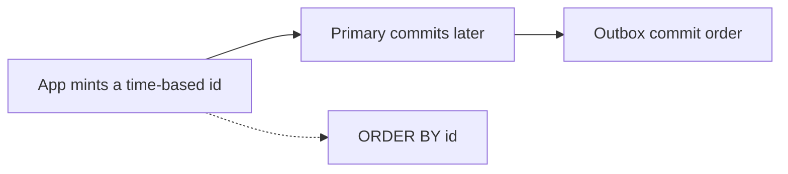

<!-- day-nav -->
[← Day 43 — Active-passive or active-active](43-active-passive-or-active-active.md) · [Day 45 — Schema change and backfill →](45-schema-change-and-backfill.md)

# Day 44 — Clocks, ids, and order

**Do now**

1. Set a timer.
2. Attempt the problem. Stop at the attempt line. Do not scroll.
3. Then read.

## Time box

35 minutes.

| Minutes | Do this |
|---|---|
| 0–10 | Attempt. Does this product need an order across machines? If you mint time-ordered ids, name the reorder you still have. |
| 10–28 | Read. If your id got shorter and guessable, you reopened day 4. |
| 28–35 | Say which clock decides expiry, and which bug a backward step causes. |

## Intent

Facing order across machines, leave able to pick ids and a clock story and name the reorder bug you still have. A timestamp is not an order. A unique id is not an order. The leader's log is an order, for the shard it owns, and only for events it actually committed.

## Problem

> Design a pastebin. People paste text and share a link.

The interviewer says: "I want ids that sort by time, and I want expiry to be fair across your app servers. What clock are you trusting?"

## Attempt before reading

10 minutes. Do not scroll. Ids today are fourteen characters once day 37's slot prefix is on, twelve of them random, base62, never reused. There is no list endpoint. Expiry is `expires_at` set by the server, checked on read. App clocks were already a red-team item on day 27: a fast clock 404s early.

Write:

1. Whether a time-sortable id helps a call you actually serve. If it only helps a list you refused, say that.
2. A sketch of a snowflake-style id: time, machine, sequence. The rate at which the sequence overflows, against **350 creates/s** peak, not against a million per millisecond.
3. The reorder: two app servers, clocks 100 ms apart, or a commit order that disagrees with the id order. Which one can a client observe?
4. What you will not build: a true-time API, a GPS clock, a Spanner. One sentence.

---

**Stop. Random ids stay. The primary's clock expires. The reorder is named and mostly unobservable.**

---

## Requirements

Unguessable ids are still a requirement. A time-prefix id leaks the creation time and, if the sequence is dense, the creation rate. Day 4 closed the width question to stop brute force, not to make URLs pretty. A sortable id that is guessable reopens it. You do not "upgrade" to UUIDv7 or a snowflake because the interviewer likes order. You ask which query sorts. If the answer is "no query, I just like order," you keep the random id.

Expiry does not need a distributed clock. It needs one timestamp stored at commit, and one comparison at read, both in the **primary's** timeline. Two app servers disagreeing about `now` must not be what writes `expires_at`. The primary writes it, or the app writes a duration and the primary adds it to its own clock inside the transaction. You already send a duration (`30d`). Keep that. Do not send a client-computed absolute expiry. Client clocks are worse than app clocks.

You will not implement TrueTime. Bounded clock uncertainty as a product feature is the Spanner appendix. If they want external consistency across regions, that is the synchronous cross-region commit you priced on day 43, not a clock you sketch.

## Design

### Keep the random id

GET is a point lookup. Equality does not care about sort. The slot prefix is routing, not time. Collision handling stays "unique index, remint." No machine id, no sequence, no clock in the id. A backward NTP step cannot duplicate an id, because the id did not come from the clock. That is a feature. Snowflake ids have a whole paragraph of "what if the clock goes back" that you do not need.

What you give up: `ORDER BY id` as a time order, log lines that sort chronologically by id, and the ability to eyeball which paste is newer. You do not serve those. `created_at` on the row is the time, for the sweeper and for support, and it is the primary's timestamp. Support can look at the row. The URL does not have to be a timeline.

### If they force a time-ordered id

Sketch it, then say what it still gets wrong. 64-bit snowflake shape, planning, not a library:

- ~41 bits of milliseconds since an epoch,
- ~10 bits of machine or process id (1024 writers),
- ~12 bits of sequence (4,096 ids per millisecond per machine).

Peak creates are **350/s**, which is **0.35 per millisecond** on the whole product, not per machine. The sequence will not overflow. Overflow is not the bug. Anyone who sizes the sequence against peak QPS and stops has missed the bug.

**Clock skew between minters.** Machine A is 100 ms ahead of machine B. A's ids sort after B's even when B's create was committed later in real time, or the opposite if you define later by the leader. Within 100 ms you will emit ids that sort in an order no user experienced. If nothing sorts by id, nobody sees it. If you then build "recent pastes" on `ORDER BY id`, the page is wrong by the skew. The fix is not a longer sequence. The fix is not to sort by that id, or to sort by the primary's `created_at`, which has one clock.

**Commit order versus mint order.** App A mints id at t1 and then waits on a slow PUT. App B mints at t2 and commits first. The row that exists first has the later id. A consumer tailing "ids greater than X" misses B or double-counts when A lands. You do not have that consumer. If you add one, tail the outbox, which is commit order, not the id.

**Clock steps backward.** A mint that uses wall time must refuse to emit an id less than or equal to the last one it emitted. It stalls until time catches up, or it borrows from a logical counter. If it does neither, you get duplicate or decreasing ids. Duplicates hit the unique index and remint, which saves correctness and destroys the sort. You just paid snowflake's complexity to fall back to day 4's constraint. Another reason not to start.

Guessability: the top bits are time. An attacker who knows the time and the machine id searches the sequence space, 4,096 values per millisecond, not 62^12. That is a different threat model. You would lengthen the random suffix until the search is boring again, and then you have a long id with a time prefix, which is UUIDv7's shape. Still a leak of time. For a paste, time in the URL is a small leak (the `created_at` is not secret if you return it anyway). The sequence search is the real cost. You refuse.

### Expiry's clock

Inside the create transaction the primary sets `expires_at = now() + duration`. `now()` is the primary's clock. Replicas apply the stored timestamp. They do not recompute expiry from their own clock at insert time. On read, the primary compares `expires_at` to its `now()`. A replica used for a read would compare to **its** clock unless you compare against the stored value only and use the primary's notion... A replica's `now()` can be ahead of the primary and expire a paste early, or behind and serve it late. This is another reason day 34 keeps interactive reads on the primary. If a replica read happens, compare `expires_at` to a timestamp you trust, or accept skew. Do not "fix" this with NTP in the answer and then read replicas anyway without a bound.

NTP is an assumption: in a healthy region, skew is on the order of **milliseconds to a few tens of milliseconds**, not minutes. You do not promise that. A clock that is wrong by hours is an incident, and the user-visible effect is early or late expiry. The CDN max-age of 60 seconds is a larger deliberate error than a healthy NTP skew. Spend your care on the 60 seconds, as day 27 said. A backward step of the primary clock can make `now()` less than `expires_at` for a paste you already treated as expired in a previous read, so expiry goes **backwards** for a reader who retries. Monotonic reads of "expired" fail. Mitigation: the primary uses a clock that does not step backward for `now()` used in expiry (a monotonic source, or refuse to expire with a clock older than the last commit). Say that in one sentence if they push. Do not design a clock service.

### Lamport, only if they say causal

A Lamport clock is a counter. You increment on every local event and on every message you receive (`max(local, received) + 1`). It gives you a partial order of things that communicated. It does not give you seconds, so it cannot expire a paste. It does not totally order two creates that never interacted. You have no call that needs "paste A caused paste B." Do not draw one. If they ask "how would you order events without trusting wall clocks," the sentence is: Lamport or a hybrid logical clock for the events that actually pass messages, and the leader's log for events on one shard. Then stop. The pastebin's events on one shard already have that log.

## Diagrams

### Two orders that are not the same

The dotted edge is the bug if anyone treats mint order as commit order. You have no endpoint on the dotted edge. Keep it that way.

## Trade-offs

**Choice.** Random ids. Expiry from the primary's clock inside the transaction. No snowflake. No TrueTime. Reorder of mint versus commit is real and unobservable here.

**Alternative.** Time-ordered ids so logs and a future list sort.

**What you give up.** Sortable URLs. You keep unguessable ids and you keep expiry independent of app-server clocks. If they force the alternative, you name skew, backward steps, and the commit-versus-mint reorder, and you still would not sort a user-facing page by that id.

**10×.** 3,500 creates/s is still under one id per millisecond on average (3.5 per ms). Sequence overflow is still not the problem. Guessability of a time prefix does not improve with scale. It gets worse, because the sequence space per millisecond fills and a miss in your model becomes a hit in theirs. Another reason the random id scales without a new clock.

## Talking points

**Hand-waving.** "We'll use NTP, so order is fine." NTP bounds skew when it is healthy. It does not make two machines' timestamps a single order, and it does not stop a step.

**Hand-waving.** "UUIDv7 gives us order and uniqueness." It gives you a time prefix and a unique rest. The time prefix is the reorder and the leak. Uniqueness was the primary key, which you already had.

**If they ask for Spanner.** "External consistency needs a clock bound I am not going to invent. The appendix is where that lives. Here, one primary's log orders a shard, and I do not pretend two regions' wall clocks do."

## Say this in the room

I keep random ids because nothing I serve sorts by id, and a time prefix is guessable and still not commit order. Expiry is a timestamp the primary writes from its own clock inside the create, from the duration the client sent, not from an app server's now. If I were forced into snowflake ids, the bug at 350 creates a second is not sequence overflow: it is two machines skewed by 100 milliseconds, or a slow PUT that commits after a later id. I will not build TrueTime. A backward step of the primary clock can un-expire a paste, so that clock must not step backward, and the 60-second edge is still the larger lie.

## Kit artifact

One checklist row.

| Follow-up | You answer with |
|---|---|
| "How do you order events?" | Which call sorts. Primary clock for expiry. The reorder you still have if ids carry time. |

## Design log

One line: the order you claimed that no clock you named actually provides.

Next: [Day 45 — Schema change and backfill](45-schema-change-and-backfill.md).

---

<!-- day-nav -->
[← Day 43 — Active-passive or active-active](43-active-passive-or-active-active.md) · [Day 45 — Schema change and backfill →](45-schema-change-and-backfill.md)
