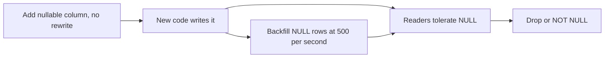

<!-- day-nav -->
[← Day 44 — Clocks, ids, and order](44-clocks-ids-and-order.md) · [Day 46 — Delete, tombstone, retention →](46-delete-tombstone-retention.md)

# Day 45 — Schema change and backfill

**Do now**

1. Set a timer.
2. Attempt the problem. Stop at the attempt line. Do not scroll.
3. Then read.

## Time box

40 minutes.

| Minutes | Do this |
|---|---|
| 0–12 | Attempt. Add one fact to the row without stopping creates. Order the steps. Say what rollback does not mean. |
| 12–32 | Read. If the backfill can overwrite a fresh write, it is not idempotent. |
| 32–40 | Say the lock, the days of backfill, and the step you will not combine with them. |

## Intent

Facing a schema that must change, leave able to plan expand, backfill, and cutover without stopping writes, plus a rollback. The dangerous move is not the new column. It is a rewrite of the live table, or a drop you cannot undo, or a backfill that races the writer.

## Problem

> Design a pastebin. People paste text and share a link.

The interviewer says: "We start storing the language of the paste. Old rows need a value. You may not take a maintenance window."

## Attempt before reading

12 minutes. Do not scroll. About **450 million** live rows. Metadata on the order of **135 GB**. Peak creates about **350/s**. The planning commit ceiling is about **2,000/s** per primary. One shard today. Language is a short code, nullable, not a new lookup key. You still refuse a list-by-language endpoint.

Write:

1. The order: schema, writers, backfill, readers, and anything you refuse to drop in the same week.
2. How the alter avoids rewriting 135 GB. If you do not know, say "I would check whether this alter rewrites" rather than guessing a lock time of zero.
3. Backfill rate, and the wall time. Show the division. Leave headroom under the commit ceiling.
4. Rollback: revert the binary. What you do **not** revert.

---

**Stop. Expand, backfill, cut over, and a rollback that leaves the column, below.**

---

## Requirements

Creates do not stop. A migration that queues 350 writes/s behind an exclusive lock is an outage you named as a plan. Reads do not have to understand the new column on the same deploy as the alter. Old code must keep working against the new schema. New code must keep working against rows that are not backfilled yet. That is the whole compatibility rule: **each step is safe with the previous code and the next code both running**, because a rolling deploy is both.

NULL means unknown. It does not mean English. A reader that treats NULL as `en` will lie for every row you have not backfilled, and then you cannot tell "unknown" from "backfilled to English." Do not collapse them.

You are not adding an index on language in this change. Nobody queries by it. Day 47 is what an index costs. Smuggling one in "while you're altering" is how a small column becomes a write-amp surprise.

## Design

### Expand

`language` is a nullable text column, **no default**. In PostgreSQL 11 and later, adding a nullable column with no default is a catalog change, not a rewrite of every row. That is the form you want. You say the version assumption out loud. If you are on something older, or you add `NOT NULL DEFAULT 'en'`, you may rewrite **135 GB** under a lock that blocks creates. You refuse that single statement.

`NOT NULL` is a later step, after the backfill, and even then you add the constraint as **not valid** and validate it in a pass that does not rewrite the table, or you do not add it at all. Unknown is a legal value for a row you never figured out. Forcing `en` is a data bug, not a constraint win.

The alter still takes a brief lock. It must be short enough that the queue of creates drains inside the create budget. You do not combine it with a backfill in one script that holds the lock. Two steps. The first returns in seconds or you abort it.

Replicas apply the same alter. A replica that cannot apply DDL will stall replication. That stall is day 34's lag going to infinity. You do the alter when you can watch replica lag, and you stop if lag climbs and does not recover. One sentence. Not a migration platform.

### Writers, then backfill

Deploy code that **writes** `language` on create, and that **reads** it as optional. Old rows stay NULL. Old binaries, if any remain during the rollout, leave NULL. New binaries must not require the column to be present in a way that crashes if a replica is a moment behind the alter. Expand finishes before the writer deploy.

Backfill: `UPDATE ... SET language = <detected> WHERE id = ? AND language IS NULL`. The `IS NULL` guard is what makes it idempotent and what stops it from clobbering a value a later feature wrote. You have no edit API, so the only writer of non-NULL is the new create path and this job. Still use the guard. The day someone adds edit, the guard is the difference between a backfill and data loss.

Detection for old rows: you may not have the body in the primary. The body is in the bucket. So the backfill is **not** a pure SQL `UPDATE` from a column you already hold. It is a job: read the row, GET the object, detect, update if still NULL. That job is a worker, rate-limited, idempotent. Do not `UPDATE` 450 million rows in one transaction. You would hold snapshots and bloat for days, and a failure rolls the whole thing back to the start.

Rate: **500 rows/s** planning. Against a 2,000 commit ceiling and a 350/s create peak, 500 + 350 = **850**, under the ceiling with room for the sweeper. If lag or CPU climbs, you slow the job. You do not "finish tonight" at 5,000/s and discover the ceiling was real.

Wall time: 450e6 / 500 = **900,000 seconds**. 900,000 / 86,400 ≈ **10.4 days**. Say ten days. A language column is not worth a create outage to finish faster. If half the rows are expired and gone, the live set is what you backfill, and the number drops. Use the live estimate you actually have. 450 million is the day-3 mix. If you only need language on rows that are still readable, that is the set. Do not backfill objects the sweeper is about to delete. Check `expires_at` in the job.

Ten days means the deploy is not done when the binary ships. Readers that need language must tolerate NULL for those ten days. The cutover is a decision after the fraction of NULL among **live** rows is low enough to accept, not after the binary rollout.

### Cutover and rollback

Cutover: a reader starts treating language as present for product behavior (for example, a header). NULL still means unknown, and the header is omitted. You do not switch the product to "always send en" on the day the column appears.

Rollback of a bad binary: deploy the previous binary. It ignores `language`. The column stays. Creates go back to writing NULL until you roll forward again. The backfill can continue or pause. **You do not drop the column as part of rollback.** Dropping is a new expand in reverse, and the forward binary still expects the column. If you drop and then need to roll forward, you are in an outage.

You also do not restore a backup over the primary to "undo the backfill." That rewinds creates that happened during the ten days. The undo of a bad detection is a forward job: set language back to NULL where the detector version matches the bad one. That is why you store **how** you filled it, or you accept that a bad backfill is repaired by another job, not by time travel. A `language_source` of `detector_v1` versus `client` is the sort of extra column that makes undo possible. If you did not store it, you cannot tell a detected `en` from a correct `en`. Mention it. It is one column, and it is the rollback story for data.

Contract, much later, only if every writer sets the column and you have decided NULL is illegal: validate a constraint. Still no table rewrite if you can help it. And you still have nothing to drop, because you added a column. You did not replace one. Replacing `syntax` with a new encoding would be: add, dual-write, backfill, read new, stop writing old, drop old **only after** no binary reads old. The drop is a separate change with its own rollback plan, which is "you cannot roll back past the drop." So you wait.

## Diagrams

### Steps that can overlap, and the one that cannot

The last arrow is a different week. Rollback walks back to the previous binary and does not take that arrow.

## Trade-offs

**Choice.** Nullable column, no default, no rewrite. Writers first. Backfill at 500/s, about ten days, guarded by `IS NULL`, reading the body from the bucket. Rollback reverts the binary and leaves the column. A bad fill is repaired forward.

**Alternative.** Maintenance window, `NOT NULL DEFAULT 'en'`, one rewrite, done before breakfast.

**What you give up.** A finished migration on the day you deploy. Ten days of NULL. A detector job that can GET 450 million objects if you are careless about expiry (do not; skip rows you are about to reap). You keep creates up, and you keep a rollback that is a deploy rather than a restore.

**10×.** 4.5 billion live rows if the mix scales, which it may not (retention is 45 days of ingest, so 10× ingest is 10× rows, yes, about **4.5 billion**). At 500/s that is **about 104 days**. You would raise the rate only inside the commit ceiling, and you would shard first (day 31), so each shard backfills its own slice. Four shards at 500/s each is 2,000 rows/s total, about 26 days, if each shard's commit headroom allows 500. The arithmetic is the point. "We'll backfill" without a rate is a year you did not notice.

## Talking points

**Hand-waving.** "We'll add the column and backfill." Does the alter rewrite, at what rate, and what does the reader do on NULL this afternoon?

**Hand-waving.** "Rollback is the backup." The backup rewinds the pastes created since the snapshot. That is not a rollback. That is data loss of unrelated writes.

**If they ask about the index.** "Not in this change. Nothing queries by language. If that stops being true, the index is a write cost I will say out loud, not a clause on the alter."

## Say this in the room

I add language as a nullable column with no default so the alter does not rewrite 135 GB, assuming a Postgres that can do that, and new creates write it while old rows stay NULL, which means unknown rather than English. A job fills them at about 500 a second, under the 2,000 commit ceiling, which is 450 million divided by 500, about ten days, and it only updates rows that are still NULL. Readers tolerate NULL the whole time. Rollback is deploying the old binary: I do not drop the column and I do not restore a backup over live creates. A bad detector is fixed by a forward job, so I have to know which rows it wrote.

## Kit artifact

One checklist row.

| Follow-up | You answer with |
|---|---|
| "Migrate this without downtime." | Expand, dual-write, rate-limited idempotent backfill, rollback that does not drop. |

## Design log

One line: the step in your attempt that rewrote the table, stopped writes, or could not be rolled back.

Next: [Day 46 — Delete, tombstone, retention](46-delete-tombstone-retention.md).

---

<!-- day-nav -->
[← Day 44 — Clocks, ids, and order](44-clocks-ids-and-order.md) · [Day 46 — Delete, tombstone, retention →](46-delete-tombstone-retention.md)
