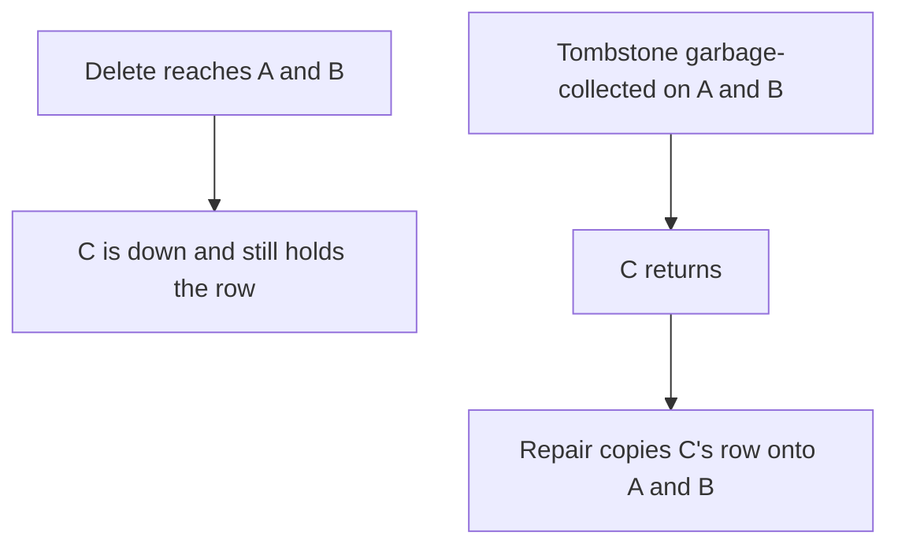

<!-- day-nav -->
[← Day 45 — Schema change and backfill](45-schema-change-and-backfill.md) · [Day 47 — Secondary indexes and data-path cost →](47-secondary-indexes-and-data-path-cost.md)

# Day 46 — Delete, tombstone, retention

**Do now**

1. Set a timer.
2. Attempt the problem. Stop at the attempt line. Do not scroll.
3. Then read.

## Time box

40 minutes.

| Minutes | Do this |
|---|---|
| 0–12 | Attempt. Where a delete can be forgotten, and how long the evidence of that delete has to live. |
| 12–32 | Read. If one TTL covers the cache, the inbox, and a leaderless tombstone, you have mixed three clocks. |
| 32–40 | Say which store needs a tombstone at all, and the resurrection you get if you garbage-collect it early. |

## Intent

Facing a delete, leave able to use tombstones and retention so replicas and indexes do not resurrect the row. A hard delete is not "gone everywhere." It is gone from the log that applied it. Systems that replicate by gossip, or caches that fill late, will put the row back unless the delete is a write they can still see.

## Problem

> Design a pastebin. People paste text and share a link.

The interviewer says: "A paste we deleted came back an hour later. Where was the delete lost, and how long do you keep the proof?"

## Attempt before reading

12 minutes. Do not scroll. You have three copies of "gone" already, and they are not the same mechanism: the primary row, the origin cache, the edge. The replica is async WAL. You do not run a leaderless row store today. Day 35 asked you to imagine one.

Write:

1. For the Postgres replica: can it resurrect a deleted row after it applies the WAL? If not, what failure is lag instead of resurrection?
2. For the origin cache: what you write, and the TTL on that write. Why a bare DEL is not enough.
3. For a leaderless copy that was down during the delete: what it will do when it returns, if nobody still holds a tombstone.
4. Three different retentions you already have (paste TTL, idempotency key, inbox). Why the tombstone does not borrow one of them at random.

---

**Stop. Which copy needs a tombstone, and for how long, is below.**

---

## Requirements

Resurrection means a reader observes a paste **after** a delete that already committed, because some copy reintroduced the old bytes. Lag means a reader observes the old bytes because a copy has not heard the delete yet, and once it hears, the bytes stay gone. You already accepted lag at the edge for 60 seconds, and you refused it at the origin after the tombstone write. Do not call both resurrection. The repair is different. Lag is fixed by waiting for the log. Resurrection is fixed by keeping a delete that wins over the old value for as long as the old value can still show up.

Ids are never reused. You do **not** need a tombstone to stop a new paste from inheriting a deleted id. That problem is already closed. Do not keep a row forever "so the id stays taken." The primary key of a live table is not your id allocator. The allocator is "random, unique constraint, never recycle," which does not require the deleted row to remain.

The body in the bucket is not a database row. Deleting it twice is fine. A copy of the object that a cross-region replica has not deleted yet is lag, until replication or the worker catches up. If a background repair copies an old object back because the destination has no key and the source still does, that is resurrection, and the worker's delete has to win. The outbox job is the proof. If you drop the outbox row before every copy has applied the delete, a slow copy can put the object back only if something replicates from a holder that still has it. Know which systems copy old keys forward. The CDN does not. A bucket replication rule might.

## Design

### WAL replica: no table tombstone

The primary deletes the row. The WAL records the delete. The replica applies the WAL and deletes the row too. When apply has happened, the row is gone. There is nothing to resurrect unless you stop applying and instead **merge** by "keep the row if you have it," which WAL shipping does not do.

Before apply, the replica still serves the row if you read it. That is lag, day 34. You do not read it for interactive GETs. You do not "fix" lag by writing a tombstone into the paste table on a WAL system. The delete **is** the record. A `deleted_at` column you keep forever is a soft delete, which makes every GET check a flag and makes the table retain every paste you have ever removed. That can be a product choice (undelete). It is not this product. Undelete was not in the contract. Hard delete.

An index on `expires_at` loses its entry in the same WAL as the heap delete. You do not tombstone the index separately on Postgres. A **separately built** index, one you update from a stream and might miss a message, is different. You do not have that index. If you add one, the outbox delete is the tombstone for that index: the consumer must apply the delete, and the inbox must not ack before it does. Day 38's wrong order (mark done, then delete from the index) is exactly how an index resurrects a paste you removed from the primary. The retention of that inbox row has to cover redelivery. You already set 8 days. That is the index's protection, and you still do not have the index. Say the mechanism so you do not add the index later without it.

### Origin cache: a short tombstone

Bare DEL of `meta:{id}`: an in-flight GET that read the primary before the delete will SET the old row after your DEL. The paste is back until TTL. The tombstone is a value, `gone`, that a fill is not allowed to overwrite. Its TTL has to cover the in-flight fill, not the life of the paste.

The fill's maximum life is the origin read budget, about **300 ms**, plus a retry you mostly do not do. A tombstone of a few seconds would cover that race. You keep **60 seconds** so a slow fill, a retry you did not intend, and a cache that reorders a SET still lose to `gone`. Sixty seconds is not the stale window for a successful delete. The stale window is "until the tombstone write lands," because 204 waits for it. The 60 seconds is how long the **proof** stays after that, so a late SET cannot win. When the tombstone expires, a fill must miss on the primary and 404, not find the row. That is true only if the primary still does not have the row. It does not. The replica must not be the fill source. If you fill from a lagging replica after the tombstone expired, you have built resurrection with two features you already rejected separately. Together they are the bug the interviewer just described: deleted, then back an hour later, if replica lag or a paused replica can exceed the tombstone TTL. **An hour later is not the 60-second cache.** An hour later means something reintroduced the row. Look at the fill source and at any index consumer, not at max-age.

Do not set the cache tombstone TTL to the paste's 30 days. You would pin every deleted hot key in memory for a month. The race is sub-second. Sixty seconds is the bound. Memory of `gone` is one small value per recent delete, about 116/s × 60 s ≈ **7,000** keys. Nothing.

### Leaderless copy: a long tombstone

If the row lived in the day-35 quorum store, a delete that is only an absence on one node is not a write. The other node still has the row. Read repair and anti-entropy **copy the survivor back**. The delete loses.

So the delete is a write: a tombstone with a version, replicated to W nodes. It has to **stay** until every copy that might still hold the old row has seen it, or until you have decided that a copy which has not seen it will never rejoin.

You cannot know "every copy has seen it" if a copy is partitioned. The rule is a retention you pick on purpose:

- You are willing to **repair** a node that was down for up to **3 days**.
- Tombstones live **7 days**, longer than that repair window, with margin for clock skew on the garbage collector.
- A node down **longer than 3 days** does not rejoin by replaying gossip. You wipe it and stream a fresh snapshot that no longer contains deleted keys. The failure mode if you skip the inequality: tombstone GC at **1 day**, node returns on day **2** with the old row, no tombstone left anywhere, repair copies the old row onto the live nodes. The paste is back. **GC at 1 day and a 2-day partition is resurrection.** Seven days versus a 3-day rejoin limit is the pair. A node that returns on day 4 still meets a tombstone. A node that returns on day 8 must not rejoin by gossip, because the proof is gone. Change either number and you re-check the inequality. Do not copy the cache's 60 seconds into this store. A node is not an in-flight HTTP call.

You are not running this store. You are refusing to import its repair behavior into Postgres, and you are ready to say the retention if someone swaps the engine. The pastebin's actual tombstone is the cache value with a 60-second TTL, plus the outbox job for the object, plus the edge's max-age which is a TTL and not a tombstone at all.

### Do not share retentions

| Proof | How long | Why this number |
|---|---|---|
| Paste row and object | The product TTL, default 30 days, max 365 | The user asked the paste to exist |
| Idempotency response | 25 hours | Client retry window, and it holds the raw delete token |
| Inbox row | 8 days | Longer than a 7-day broker replay |
| Cache `gone` | 60 seconds | Longer than an in-flight fill |
| Leaderless tombstone, if you had one | 7 days | Longer than a 3-day rejoin |

Borrowing the 30-day paste TTL for the cache pins memory. Borrowing 60 seconds for a leaderless tombstone resurrects any node that was down for a minute. Borrowing 25 hours for the inbox misses a day-6 replay of a non-idempotent effect. The numbers are not interchangeable. A single "retention policy: 7 days" in a config file is how you get all three bugs at once.

## Diagrams

### Absence is not a delete, once repair copies forward

If the tombstone still exists when C returns, repair copies the tombstone, not the row. The retention is that "if."

## Trade-offs

**Choice.** Hard delete in Postgres, trust the WAL, do not keep `deleted_at`. Cache tombstone for 60 seconds. Outbox for the object. Leaderless tombstone only if the engine changes, retained 7 days against a 3-day rejoin. No shared TTL.

**Alternative.** Soft delete forever, or one TTL everywhere, or DEL the cache key and hope.

**What you give up.** Undelete. A simple mental model where delete means vacuum. You keep origin correctness after 204, and you keep a downed leaderless node from teaching the cluster the old row. You accept that an hour-later resurrection is a fill or a repair bug, not "caches are hard."

**10×.** Cache tombstones: about **70,000** keys if deletes scale (7,000 × 10). Still nothing. A 7-day leaderless tombstone at 10× delete rate is 1,160/s × 7 days × 86,400 × ~200 bytes ≈ **1.4 × 10^11 bytes**, about **140 GB** of tombstones. That is large enough to tempt someone to cut retention to a day. Cutting it below the rejoin window brings the rows back at 10× the rate. The inequality is the design. The disk is the pressure against it.

## Talking points

**Hand-waving.** "We tombstone everything for 7 days." The cache does not need 7 days, and the WAL replica does not need a tombstone. You will fill the cache with `gone` and still not have explained the replica.

**Hand-waving.** "Delete is idempotent, so we're fine." Idempotent means a second delete does not change the outcome. It does not mean an old replica will not copy the pre-delete value forward. Different sentence.

**If they ask about the edge.** The edge has no tombstone. It has max-age. When max-age passes, the next miss asks the origin, which 404s, and you do not cache that 404. That is how the edge **stops** serving. It is not how you prove the delete to a third region. Do not set max-age to 7 days to match a tombstone you do not have. You would serve deleted pastes for a week.

## Say this in the room

On Postgres the delete is in the WAL, so a replica does not resurrect the row after it applies the log, and lag before that is a stale read I already refused for GET. The origin cache is different: I write a tombstone for 60 seconds, about 7,000 keys, so an in-flight fill cannot put the row back, and a bare delete of the cache key is how it returns. If the store were leaderless, the tombstone would have to outlive the rejoin window, 7 days against 3 days, or repair copies the old row forward. I will not use one retention for the paste, the idempotency key, the inbox, the cache, and that tombstone. An hour-later comeback is a fill or a repair bug, not the edge's 60 seconds.

## Kit artifact

One checklist row.

| Follow-up | You answer with |
|---|---|
| "This deleted row came back." | Which copy reintroduced it. Tombstone versus lag. Retention longer than rejoin or in-flight, not longer than everything. |

## Design log

One line: the copy in your attempt that could reintroduce a deleted paste, and the retention you gave its proof.

Next: [Day 47 — Secondary indexes and data-path cost](47-secondary-indexes-and-data-path-cost.md).

---

<!-- day-nav -->
[← Day 45 — Schema change and backfill](45-schema-change-and-backfill.md) · [Day 47 — Secondary indexes and data-path cost →](47-secondary-indexes-and-data-path-cost.md)
