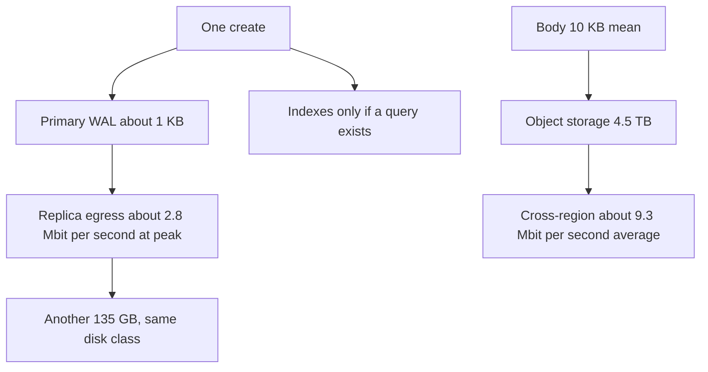

<!-- day-nav -->
[← Day 46 — Delete, tombstone, retention](46-delete-tombstone-retention.md) · [Day 48 — Close the data chapter →](48-close-the-data-chapter.md)

# Day 47 — Secondary indexes and data-path cost

**Do now**

1. Set a timer.
2. Attempt the problem. Stop at the attempt line. Do not scroll.
3. Then read.

## Time box

35 minutes.

| Minutes | Do this |
|---|---|
| 0–10 | Attempt. One extra index or one extra replica. What it writes, what it stores, what it ships. |
| 10–28 | Read. If the replica "increases write amplification" on the primary, separate WAL shipping from a second index. |
| 28–35 | Say the number you would quote for WAL, for a second metadata disk, and for a second copy of the bodies. |

## Intent

Facing an extra index or replica, leave able to state the write amplification, storage class, or egress you just bought. A box that makes reads nicer still has a write, a disk, and a pipe. If you cannot say which of the three got more expensive, you added the box because the diagram had a gap.

## Problem

> Design a pastebin. People paste text and share a link.

The interviewer says: "Add an index on syntax, and add a second replica. What did those just cost? I want units."

## Attempt before reading

10 minutes. Do not scroll. Peak creates about **350/s**. Average about **116/s**. Metadata about **135 GB**. Bodies about **4.5 TB** resident, **100 GB/day**. User-facing peak egress about **1.4 Gbit/s**, mostly at the CDN. You already have a primary-key index and an `expires_at` index. Syntax is not a query you serve.

Write:

1. What a create writes today, without the new index. Heap, which indexes, and a planning size for the WAL record.
2. What the syntax index adds, per create, and which query justifies it. If none, say you refuse it, and still price it.
3. What the second replica adds. Be careful: does the primary write the row twice, or ship a log it already wrote?
4. The storage class of the primary versus the bucket. Why the bodies are not on the disk that fsyncs the commit.

---

**Stop. Three bills, below: writes, disks, and pipes. The syntax index is refused.**

---

## Requirements

You do not add an index for a query the API does not have. Day 4 left `syntax` unindexed on purpose. The interviewer asked for the cost, not for the feature. You can price it and still say no.

Write amplification, as you will use the phrase: **extra bytes the primary must write per user write, beyond the new row itself.** Indexes and WAL count. A replica that applies a log on **its** disk is not amplification of the primary's write. It is a second disk and some egress. Mixing those up makes you delete replicas to "save writes" and add indexes because "replicas are the expensive part." The expensive part depends on which bill.

Storage class means the kind of disk, not the vendor. Commit needs a disk that can fsync at the commit rate and survive a process crash with the WAL. The body needs capacity and durability, and it can be slow. Those are different devices. You already split them on day 14. Today you say the price of putting them back together, and the price of copying either of them.

Egress means bytes leaving a machine or a region. User reads at the CDN, replication of WAL, and replication of objects are three lines. They do not sum into "bandwidth."

## Design

### What one create already writes

Planning bundle, not a benchmark, same status as the 2,000 commit ceiling: one insert is a heap tuple, a primary-key index entry, an `expires_at` index entry, and a WAL record that contains those. Call the WAL **about 1 KB** per create. You would measure it. You will not quote a "10× write amplification" you did not count.

At peak, 350 × 1 KB = **350 KB/s** of WAL, which is 350 × 8 = **2,800 Kbit/s**, about **2.8 Mbit/s**. Average 116 KB/s, about **0.9 Mbit/s**. Day 43 used "about 1 Mbit/s" and "about 3 Mbit/s" for the same bundle. Same story. This is not why the primary is large. 135 GB is the live metadata, mostly heap and the two indexes, not the WAL, which you recycle after checkpoint and after the replica has applied.

The secondary index you already accepted is `expires_at`, because the sweeper has a query. That is the bar. A query, or you do not pay.

### The syntax index you refuse

Every create and every delete maintains it. Planning, another index entry on the order of **100 bytes** plus its slice of WAL. At 350/s that is about **35 KB/s** of index traffic, small next to 350 KB/s. So the honest cost is **not** "we cannot afford the bytes" at this QPS. The honest cost is:

- every create pays a write to a structure no read uses,
- a popular syntax value is a hot index page (the day-32 problem in miniature, a celebrity key you built yourself),
- the day-45 alter, if you build the index by rewriting rather than concurrently, locks or loads the primary for a long time,
- you will be asked for the endpoint that uses it, and you do not have one.

Refuse the index. If they force a "count by syntax" admin page, the page is a batch over the outbox or a nightly rollup, not a secondary index on the create path. Price the forced version as **one more index write per create** and a hot page for the common syntax, not as a new database.

Deletes pay the index too. A delete removes the heap tuple and every index entry in the same WAL. An extra index is extra delete work. Still small. Still unjustified.

### The replica is a disk and a pipe

A second in-region replica applies the WAL you already generate. The primary does not insert the row twice. Anyone who calls that write amplification will "optimize" by dropping the replica and will keep a useless index. Correct words: **the primary's write is unchanged; you add about 135 GB of the same storage class, and you ship about 2.8 Mbit/s peak of WAL to that replica.**

Same storage class, because this replica must be promotable. A cheap disk that cannot fsync at 350 commits/s cannot take over inside the ceiling you promised. The replica is not a place to "save money on disks" if it is your failover. Day 13's async replica is this box. A third replica is another 135 GB and another copy of the same stream, and it buys you a replica that can die during promotion without leaving you with zero copies. That is an availability purchase, not a read-scaling purchase. You still do not send interactive GETs to it.

Cross-region, day 43: the same WAL, about **0.9 Mbit/s** average, plus the bucket if you replicate bodies. Bodies are the other class: **4.5 TB** resident and **100 GB/day**, about **9.3 Mbit/s** average (100 × 8 / 86,400). A second region of objects is 4.5 TB of object-storage class, not 4.5 TB of the primary's fsync disk. Those prices differ by a lot. Say the class when you say the terabytes.

### Where the bytes must not sit

The primary's disk holds metadata and WAL. It does not hold 4.5 TB of pastes. Putting bodies on that disk was day 5's break and day 14's fix: restore time, and a failure domain shared with the commit log. One replica of that mistake is two disks that both cannot be restored, and a WAL disk competing with large sequential body writes. Object storage is the class for the body: durable, cheap per GB, slow relative to a cache, fine because the CDN is in front.

User egress stays the large pipe: about **1.4 Gbit/s** peak at the edge for the mean body. That number is not replication. It is readers. Adding a replica does not reduce it. Adding an index does not reduce it. Do not propose either as a CDN substitute.

Happy-path origin egress, from day 26, is about **8.7 MB/s** when the edge is warm, about **70 Mbit/s**. That is the pipe between bucket and edge for misses. A second replica of metadata does not move it.

## Diagrams

### Three bills, not one "cost"

The index arrow is the one you refuse for syntax. The replica arrow is real and is not a second insert.

## Trade-offs

**Choice.** Keep the `expires_at` index. Refuse syntax. Keep one promotable replica: +135 GB of primary-class disk, WAL shipping about 2.8 Mbit/s peak, no extra primary write amplification. Bodies stay in object storage. A second region of bodies is 4.5 TB and about 9.3 Mbit/s, stated separately from user egress of 1.4 Gbit/s.

**Alternative.** Index every column "for flexibility," and put a replica on the cheapest disk in the building.

**What you give up.** Ad-hoc queries by syntax. A bargain replica that cannot be promoted. You keep create path small and failover real. You also give up the right to say "write amp" when you mean "we pay for another disk."

**10×.** WAL about **28 Mbit/s** peak. Metadata about **1.35 TB** per copy. Bodies about **45 TB** and **93 Mbit/s** of cross-region replication if you still copy them. User egress about **14 Gbit/s**. The index you refused is still not the dominant term. At 10× a useless index is still cheap in bytes and still a hot page if one syntax dominates. The body copy is the term that starts to look like a real line item. The user egress is the term that already did, on day 15, which is why the CDN exists.

## Talking points

**Hand-waving.** "We'll add a replica to scale reads, it's just write amp we can handle." A replica you do not read does not scale reads. A replica you do read is day 34's lag. The write cost is shipping, not a second insert. Say which.

**Hand-waving.** "Indexes are cheap." Cheap in bytes here, yes. Cheap as a product promise of a query you did not design, no. And not cheap if the build rewrites the table during day 45's alter.

**If they ask for the formula.** "Per create I count heap, primary key, one secondary index for expiry, and about 1 KB of WAL. 350 a second is about 2.8 megabits of WAL. A syntax index would be another entry I will not add. A replica copies that WAL and stores another 135 GB. It does not make the primary write the heap twice."

## Say this in the room

A create already writes the heap, the primary key, the expiry index, and about a kilobyte of WAL, about 2.8 megabits a second at 350 creates, and that expiry index stays because the sweeper has a query. A syntax index is another write and a hot page for a query I do not serve, so I refuse it even though tens of kilobytes a second would not melt the disk. A second replica does not make the primary write the row twice: it costs another 135 GB of promotable disk and a copy of that WAL. The bodies are a different class, 4.5 TB of object storage. Copying them cross-region is about 9 megabits a second average, which I will not confuse with the 1.4 gigabits of user egress at the edge.

## Kit artifact

One checklist row.

| Follow-up | You answer with |
|---|---|
| "What does this replica or index cost?" | Writes on the primary, disk class and size, egress. Three numbers or a refusal. |

## Design log

One line: the cost you had collapsed into "cheap," and the unit you can now say.

Next: [Day 48 — Close the data chapter](48-close-the-data-chapter.md).

---

<!-- day-nav -->
[← Day 46 — Delete, tombstone, retention](46-delete-tombstone-retention.md) · [Day 48 — Close the data chapter →](48-close-the-data-chapter.md)
