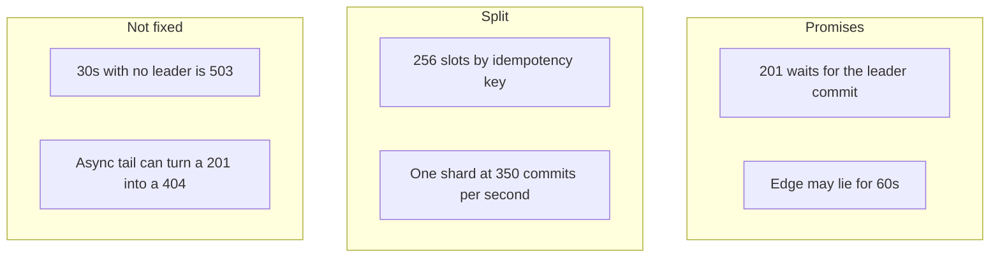

<!-- day-nav -->
[← Day 47 — Secondary indexes and data-path cost](47-secondary-indexes-and-data-path-cost.md) · [Day 49 — Mock: warehouse inventory reservation →](49-mock-warehouse-inventory-reservation.md)

# Day 48 — Close the data chapter

**Do now**

1. Set a timer.
2. Attempt the problem. Stop at the attempt line. Do not scroll.
3. Then read.

## Time box

40 minutes.

| Minutes | Do this |
|---|---|
| 0–15 | Attempt. From memory: the guarantee per call, the partition plan, the failure you accept. No new box. |
| 15–32 | Read. Mark any number you cannot reproduce. Do not add a mechanism this page does not have. |
| 32–40 | Say the three lines out loud. Then close the page. Tomorrow's mock is not this pastebin. |

## Intent

Facing the end of the data section, leave able to close on guarantee, partition plan, and the failure you accept. A chapter that ends in a new component did not end. It hid.

## Problem

> Design a pastebin. People paste text and share a link.

The interviewer says: "Stop adding pieces. In one pass: what each call promises, how the rows are split, and the failure you are not fixing."

## Attempt before reading

15 minutes. Do not scroll. Do not open days 29–47. If you cannot remember a number, write the symbol and move. A wrong number you can recompute is better than a box you invent.

Cover only:

1. POST, origin GET, edge GET, DELETE. One promise and one accepted failure each.
2. The partition key, hash or range, the shard count **today**, and the count at 10× peak writes. Include where the idempotency key lives if you added it.
3. One failure you will not paper over: edge lag, election window, or the async tail. Pick the one you would say first, and give it a number.

---

**Stop. The close is below. If your page has a new system on it, cross it out before you read.**

---

## Requirements

Nothing new. Anonymous paste, 1,000,000 byte cap, TTL allow-list, 201 after durability, expired and missing and bad token are the same 404, a live row with a missing body is a 500. Creates are idempotent **only** when the client sends a stable key, retained 25 hours. That was a contract change on day 37, not a silent default from week one.

Out, still: accounts, search, edit as a product (you can answer the conflict question if asked), a second writer region, a leaderless row store, a syntax index, Raft drawn on the board.

## Design

### Guarantees

| Call | Promise | You accept |
|---|---|---|
| POST 201 | Paste row and idempotency row committed on the leader. Object PUT succeeded. Retry with the same key and body returns this 201. | Async replica may not have it. A new key is a second paste. The PUT can still orphan. |
| Origin GET | Primary, or a cache entry that loses to the delete tombstone. Expiry from the stored timestamp. | Misses are 503 if the leader is gone. Not a replica read. |
| Edge GET | None tighter than max-age. | Up to 60 seconds. About **522,000** serves of one hot deleted paste at 8,700 reads/s. |
| DELETE 204 | Origin will not serve it once the tombstone is written. Outbox row committed with the delete. | Object and edge lag. Worker may run twice. That is safe. |

Linearizable single-row operations on the leader. Refused for the edge and for replica reads. You can say that sentence without the word "strong."

### Partition plan

Key is the paste, hashed into **256 slots**. The idempotency key chooses the slot, and the id carries the slot in two characters so GET does not hash the wrong way. One shard today: peak commits about **350/s**, ceiling about **2,000/s**. Four shards when peak commits are about **3,500/s**, about **875/s** each. Sweeper fans out. A dead shard takes its slots until **its** replica is promoted, about **30 seconds**. The other shards do not have the rows.

You do not salt the paste id. You would salt only a value you can sum, and you would rather not put that value on the GET.

### The failure you accept

Say this one first, because it is the one a stranger can see: **a deleted paste can remain on the edge for 60 seconds.** You are not fixing it with synchronous invalidation.

Say this one second, because it loses a 201: **the async tail.** In-region, the last seconds before a primary dies. Cross-region, about **5 seconds** when healthy, and a **5 minute** create outage if the writer region is what died. You are not waiting for the other region on the 201.

Say this one if they ask about the leader: **about 30 seconds of 503** on create and on cache-miss reads while a shard has no leader. Cache hits and edge hits stay. You will not draw the election. The old leader is fenced.

You do not "fix" these with a quorum you then call linearizable, a CRDT of the body, or a second writer region. Those were considered and refused for this product.

### What is inside the transaction

Create: paste row and idempotency row, repeatable read, unique key, one shard. Delete: row delete and outbox row. PUT before. Purge after. Tombstone before 204. Inbox after the purge, kept 8 days. Cache tombstone 60 seconds. No shared retention. No BEGIN across shards. A saga only if someone forces the key onto another service, and the compensation must not delete a paste it cannot see.

### What you can recompute

116 creates/s average from 10 million a day. 350 peak at 3×. 17,400 reads/s peak at 50 reads per write. Half of that on one key is 8,700, times 60 seconds is 522,000. WAL about 1 KB, so about 2.8 Mbit/s at peak. Idempotency rows about 5 GB for 25 hours. Inbox about 16 GB for 8 days. Backfill, if you ever add a column, 450 million rows at 500/s is about ten days. You do not need all of these in the close. You need the three lines. The numbers are how you defend them when pushed.

## Diagrams

### The whole chapter on one card

If you need a fourth box, it is not part of the close.

## Trade-offs

**Choice.** Stop. The pastebin's data story is the table above.

**Alternative.** One more box so the close feels like a design review.

**What you give up.** The feeling of completeness. 60 seconds, a replication tail, and an election window remain. You keep a story you can say in two minutes, which is the only form that fits the end of a loop.

**10×.** Four shards, about 875 commits/s each, edge number about 5.2 million stale serves of one hot delete, WAL about 28 Mbit/s peak. Same promises. The failure you accept does not get a new mechanism because the number got bigger. If the 60 seconds becomes unacceptable, you shorten max-age and you pay origin reads. You still do not open a consensus lecture.

## Talking points

**Hand-waving.** "And we'd also add Kafka, CRDTs, and active-active." That is a new chapter. The interviewer asked you to close.

**Hand-waving.** "We're consistent and partitioned." Per call, per key, and the failure. Three nouns are not the close.

**If they ask what you would revisit first in production.** The hit-rate assumptions that keep the primary at about 87 reads/s, and the replica lag you page on. Not the id width. Not Raft.

## Say this in the room

A 201 is a commit on the leader of one shard, together with the idempotency row, and an edge read can still show a deleted paste for 60 seconds. I hash into 256 slots, I run one shard at today's 350 commits a second, and at about 3,500 commits a second I would run four shards, about 875 a second each, each with its own replica. A dead leader is about 30 seconds of 503 on writes and cache misses, not a 404, and not a protocol I draw. The failure I am not fixing is that 60-second edge, and the async tail that can lose a 201. I am not adding a second writer region or a body merge to make the close look finished.

## Kit artifact

One checklist row.

| Follow-up | You answer with |
|---|---|
| "Wrap this up." | Guarantee per call, key and shard count, one numbered failure you accept. |

## Design log

One line: which of the three you could not say without looking. That is the gap you take into the mock, as a skill, not as a fact about tomorrow's product.

Tomorrow is a closed-book mock. It is not the pastebin, and it is not the schema, index, or retention lessons. Do not open days 45–47, and do not open this page, once you start the timer.

Next: [Day 49 — Mock: warehouse inventory reservation](49-mock-warehouse-inventory-reservation.md).

---

<!-- day-nav -->
[← Day 47 — Secondary indexes and data-path cost](47-secondary-indexes-and-data-path-cost.md) · [Day 49 — Mock: warehouse inventory reservation →](49-mock-warehouse-inventory-reservation.md)
