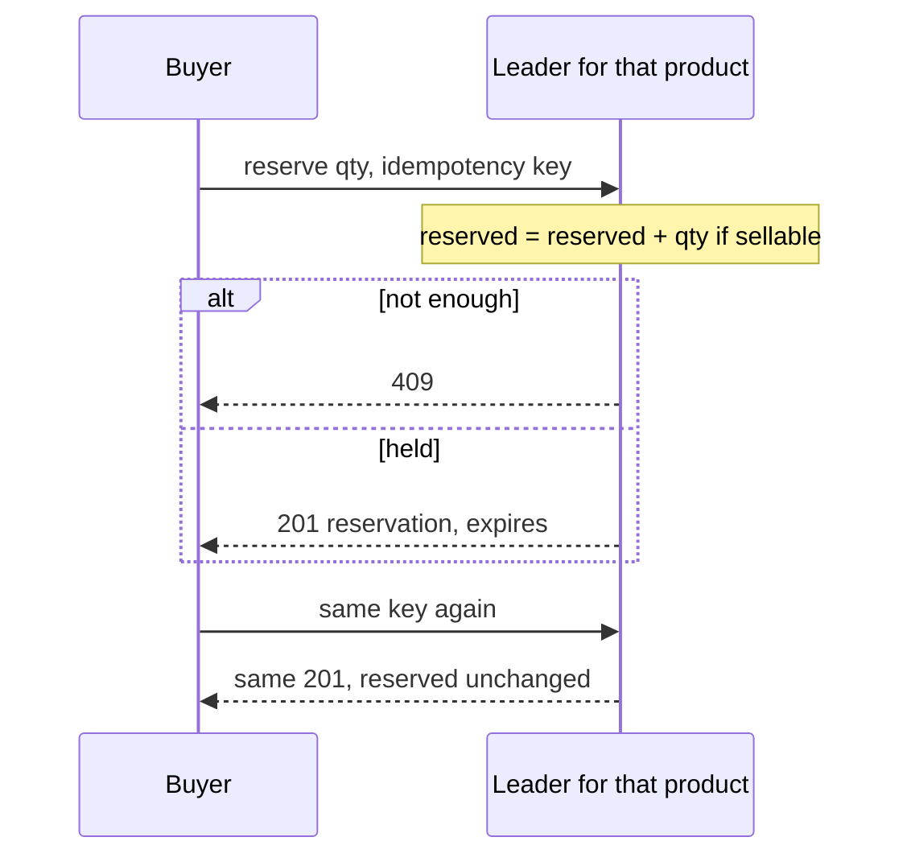
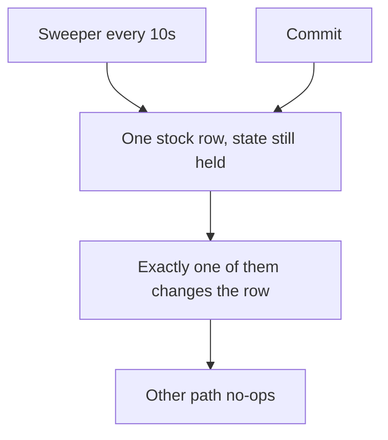

<!-- day-nav -->
[← Day 48 — Close the data chapter](48-close-the-data-chapter.md) · [Day 50 — URL shortener →](50-url-shortener.md)

# Day 49 — Mock: warehouse inventory reservation

**Do now**

1. Set a timer.
2. Attempt the problem. Stop at the attempt barrier.
3. Then read.

## Time box

35 minutes for the attempt, then 10 minutes to score and log. The 10 minutes are not part of the interview clock. Do not use them to keep designing.

## Intent

Facing a problem that is not this week's schema, index, or retention lesson, leave able to reserve inventory so two buyers cannot take the last unit, then log a self-score. Days 45–47 stay closed. So does the pastebin.

## How to run

- Blank paper. No notes, no days 29–48, no search, no chat.
- The only card you may have open is the [warehouse inventory problem](../prompts/warehouse-inventory.md) in the problem bank (`prompts/`). It does not help you.
- Do not scroll past the attempt barrier. The rubric is above the barrier so you can score. The design is below it.
- This is not a pastebin, and it is not a migration. If you notice yourself altering a column or adding an index "because the week was about that," stop and design the reservation.
- Timer visible. At zero you stop, even mid-arrow.
- Score, then write the log from **your** page, then scroll.

Score what the product does, not which lesson you recognized. A complete page says what a buyer gets when they reserve, what a second buyer gets when the units are not there, and what happens when the first buyer never comes back. If one of those is missing, that is a gap, not a failure of the timer. Log it. Do not scroll to find the missing piece.

If you already scrolled, close the page. Run the mock tomorrow from memory, or it measures nothing.

## Timer

| Clock | You are doing | You are not doing |
|---|---|---|
| 0:00–5:00 | What a reservation returns, what the other buyer sees, what an abandoned reservation does. Non-goals. | A tour of databases, or a schema migration |
| 5:00–10:00 | How many attempts, how hard one product is hit, how long a hold lives. Average and peak. | The pastebin's read QPS, reused without saying so |
| 10:00–16:00 | The calls and the records. What must stay true if two attempts run together. | An index lecture, or a retention policy for its own sake |
| 16:00–26:00 | The reserve path and the path that puts units back. Separate. | One lock around the whole warehouse |
| 26:00–33:00 | One deep dive: a retry, two buyers and the last unit, or the writer is down. | Every mechanism from the phase, copied across |
| 33:00–35:00 | What you did not build, and the 10× break. | A second product, payments included |

## Problem

> Design warehouse inventory reservation.
>
> A warehouse holds stock for many products. A buyer reserves units of a product so they can check out. Two buyers must not both walk away with the last unit. A reservation that is never finished does not last forever.

That is the entire problem. Thirty-five minutes. Blank page. No notes.

## Rubric

Same six dimensions as day 7. Score 1–4 from your page only. A senior-shaped interview is mostly 3s. A staff-shaped interview is a 4 on the deep dive and a 4 on failure, not more boxes.

### Requirements

| Score | Anchor |
|---|---|
| 1 | Components first. No non-goals. |
| 2 | Behaviors listed. Constraints are adjectives. |
| 3 | Behavior, constraints, and non-goals locked before the design. The questions you asked would have changed the model. |
| 4 | As a 3, and each non-goal is a product you refused, with a reason. |

### Estimates

| Score | Anchor |
|---|---|
| 1 | No numbers, or one QPS with no numerator. |
| 2 | Numbers exist. Units or assumptions are missing. |
| 3 | Attempt rate, how skewed one product is, how long a hold lives, and what that implies is in flight. Average and peak. Assumptions spoken. |
| 4 | As a 3, plus the assumption you trust least, and a 10× move tied to a named limit. |

### API and data

| Score | Anchor |
|---|---|
| 1 | No API. The database brand is the model. |
| 2 | Endpoints exist. You cannot tell a held unit from a sold unit, or a retry from a second reservation. |
| 3 | Reserve, complete or cancel, and a defined end for a hold. A real key for "this product in this warehouse." A defined result when the units are not available. |
| 4 | As a 3, plus a retry that does not take the units twice, and a distinction you refused to blur (not available, versus the system cannot decide, versus already done). |

### Design

| Score | Anchor |
|---|---|
| 1 | A technology tour, or boxes that ignore the numbers. |
| 2 | A plausible system that can hand the last unit to two buyers, or that locks far more than the product they asked for. |
| 3 | The smallest design that meets the numbers. Two buyers cannot both take the last unit. A hold that is never finished returns the units. The decision happens in one place you can name. |
| 4 | As a 3, and a retry is safe, and you can say what the buyer sees while the writer of that product is down. |

### Deep dive

| Score | Anchor |
|---|---|
| 1 | You cannot go past the boxes. |
| 2 | Under a push, the answer is a product name. |
| 3 | One dive, with a choice and a cost. |
| 4 | The dive uses arithmetic or a concrete fault. You can name what it did not solve. |

### Failure and ops

| Score | Anchor |
|---|---|
| 1 | "We'll have replicas," and no user-visible behavior. |
| 2 | A dependency is named. Impact is fuzzy. |
| 3 | One dependency down. What the buyer sees. What is already held. What you page on. |
| 4 | As a 3, plus the crash window you still have after the mitigation you drew. |

Do not average these into one vanity number. The log wants the six scores and **one** gap.

## Attempt first

Do the 35 minutes now.

When the timer stops:

1. Score the six dimensions from the anchors above. Evidence is a phrase on your paper.
2. Copy [design-log/TEMPLATE.md](../design-log/TEMPLATE.md) somewhere private. Fill it from your attempt. Scores are final once written.
3. Only then cross the barrier.

---

# Attempt barrier

You are about to read a reference design for warehouse inventory reservation.

If your timer has not hit zero, go back up. If your design log is not filled, go back up. Below is a reference, not the pastebin with the nouns swapped, and not a schema-migration drill. Use it for one amendment line. Do not edit the scores.

---

## Reference design

One legal design, at interview depth. Yours can differ and still be a 3. It is not a 3 if two buyers can both leave with the last unit, if a retry takes the units twice, or if a reserve call locks every product in the warehouse.

### What this is not

Not the pastebin. Reads are not the bottleneck, and a CDN does not help a stock count. Not days 45–47: you are not altering a column, adding a secondary index, or choosing a tombstone GC. You may use a hold that expires, because the product said an unfinished reservation does not last forever. That expiry is a product deadline on one row, not a replication tombstone.

Not a flash sale. Day 70 is the queue in front of scarce stock. Today the arrival rate fits a single conditional write. If your page starts with a waiting room, you designed a different day.

Not payments. Day 65 is the ledger. You will name the boundary and stop.

### Requirements

**In.** A buyer names a warehouse, a product, and a quantity, and receives a reservation or a refusal. While the reservation is held, those units cannot be given to someone else. The buyer can complete the reservation, which removes the units from the warehouse, or cancel it, which puts them back. If they do neither, the units go back on their own.

**Assumptions, spoken.** 40 warehouses. About **1 million** stocked `(warehouse, product)` pairs, not a dense 40 × every product in a catalog. **5 million** reservation attempts a day. One region. A hold lasts **10 minutes**, which you chose because checkout is minutes, not days. One hot product in one warehouse takes about a **quarter of peak** attempts. That quarter is an assumption, not a measurement. The sensitive one.

**Out.** Catalog search, recommendations, shipping, returns, multi-warehouse transfers, a promise that any product can be reserved at 10,000/s, a global lock, a second writer for the same stock row, payments internals.

**Codes.** Not enough units: **409**. You could decide, and the answer is no. Writer for that stock is down or has no leader: **503**. You could not decide. Do not use 409 for that, or the buyer will tell a human the warehouse is empty. Same idempotency key and same body after a successful reserve: the original reservation, not a second hold. A different quantity with the same key: **409** of a different kind, a conflict, not "not enough stock."

### Estimates

5,000,000 / 86,400 = 57.87, which I call **58** attempts/s so the later products stay integers. Peak is 3 × 58 = **174**/s. I will not also quote 57.

A quarter of peak on one product is 174 / 4 = **43.5**, which I call **44** attempts/s. That is the hot row. The other attempts spread across the rest of the million pairs.

If every attempt became a hold that lived the full 10 minutes, in-flight holds would be 58 × 600 = **34,800**. Real holds are fewer, because some attempts 409 and some complete in a minute. 34,800 is the upper bound you size the "what is held right now" question with, not a forecast.

History, if you keep completed and released reservations for **7 days** so support can ask what happened yesterday: 58 × 86,400 × 7 = **35.1 million** rows. At about **250 bytes**, 35.1e6 × 250 ≈ **8.8 GB**. That is why 7 days is fine and forever is a different decision. It is not why you pick the key. Do not spend the interview on this table.

Stock rows: **1 million** × about **100 bytes** ≈ **100 MB**. The stock table is small. The correctness problem is one row, not the disk.

**Per-row ceiling.** A reserve transaction holds the stock row for about **2 ms** of planning, not a benchmark. 1 / 0.002 = **500** reservations/s on that one product before the row is busy the whole second. Today's hot product is 44/s. You are not near it. At 10×, the hot product is about **440/s**, under 500, with little room. The next step past that is a **429** or a queue (day 70), not a second writer and not a salt. Two writers of one stock count oversell. A salt splits the count so each bucket can sell the last unit unless you put a lock back on the sum, which returns you to one row.

**10× site.** About **580/s** average and **1,740/s** peak attempts. Still one primary if the commit ceiling you used on metadata, about **2,000/s**, still holds, and if the hot row stays under 500/s. The break you name is the **hot row at a few hundred per second**, not the million stock rows. Sensitive assumption: the quarter-of-peak skew. If one product is **90%** of peak, that is 0.9 × 174 = **157/s** today, still fine, and 10× is **1,570/s** on one row, which is over 500. Then you shed or you queue. You still do not salt the count.

### API and data

`POST /v1/reservations` with warehouse, product, quantity, and an idempotency key the client reuses on retry. 201: reservation id, quantity, expiry. 409 if `on_hand - reserved < quantity`. 503 if the leader for that pair is absent. 400 if quantity is not a positive integer.

`POST /v1/reservations/{id}/commit` and `.../cancel`. Commit with the same key twice is one commit. Cancel of a committed reservation does not put units back. That would be a return, which you refused. Cancel of an already released reservation is a success with no second increment.

Stock row, primary key `(warehouse_id, product_id)`: `on_hand`, `reserved`. Sellable is `on_hand - reserved`, computed in the update, not stored as a third value a client can write. Reservation row: id, warehouse, product, quantity, state `held | committed | released`, `expires_at`, idempotency key. The idempotency key is unique **with** the warehouse and product, not globally across a bug that reuses keys for a different product.

**Partition key `(warehouse_id, product_id)`.** The stock row and that pair's reservations live on one shard so the reserve transaction does not cross a shard. The reservation id carries the slot, the same way a paste id carried one, so commit and cancel are one hop. Hash the pair into a fixed slot map. Do not range on warehouse alone if one warehouse's hot product must not pin a special database you forgot to size. A warehouse with a hot product is just a hot key inside the hash. You already know that shape.

Today's count is **one shard**. 174 commits/s is under a 2,000/s ceiling. You still name the key now, so a later split does not cut a single product's stock across two writers. Two writers is oversell.

### Reserve path and release path

Reserve, one transaction on the leader, **read committed** is enough. Insert the idempotency row **first**, then:

```
UPDATE stock
SET reserved = reserved + :qty
WHERE warehouse_id = :w AND product_id = :p
  AND on_hand - reserved >= :qty
```

Then insert the reservation in state `held` and commit. The key goes in before the stock update so two retries of the same key cannot both pass a "not found" check and both increment. The loser of the unique key aborts and re-reads. If the winner committed, you return that reservation and do not touch `reserved` again. If the update matched zero rows, **roll the transaction back**, including the key, and return 409. A refusal must not stick to the key, or a later retry could not take units that a cancel just freed. You do not `SELECT` the sellable number in the app and then `SET reserved = <that number plus qty>`. Two of those read the same number and both write it. That is the oversell. The expression `reserved = reserved + :qty` under the row lock rechecks the `WHERE` against the committed row. The second buyer waits, sees what the first buyer took, and gets 409 if the remainder is short.

Postgres will recheck that predicate after it waits for the row lock, under read committed. You do not need serializable **for this single counter row**. You would need a stronger story if sellable were `SUM` of many lot rows and two transactions could each see a subset. You collapsed lots into one row so the lock has something to grab. Say that. Do not sprinkle serializable on a single-row update to sound careful. It will abort work you did not need to abort, and it will not save you if you computed the new total in the app.

Commit, same shard, one transaction: if state is `held`, set `committed`, and `reserved = reserved - qty`, `on_hand = on_hand - qty`, both guarded so a second commit changes nothing. Cancel: if `held`, set `released`, `reserved = reserved - qty`. The guard is the whole dedupe. An inbox is optional on top. The conditional update is the fix.

Release of the abandoned: a sweeper on each shard, every **10 seconds**, runs the cancel update for `held` rows whose `expires_at` has passed. The user-visible cost is **up to 10 seconds** after the deadline during which the units still look taken. That is false scarcity, not oversell. Oversell would be the sweeper releasing a reservation that a commit is in the middle of. The state guard and the row lock are what stop that: the sweeper updates `WHERE state = 'held'`, the commit updates the same row, one of them gets zero rows and stops. If the sweeper wins, the buyer's commit finds `released` and does not decrement `on_hand`. The buyer gets a conflict and must reserve again. You do not also take the units. If you need the hold to survive a slow checkout, lengthen the 10 minutes. Do not remove the guard.

**Leader.** Reserve, commit, and cancel go to the leader of that partition. A replica may not apply the update. A read of sellable from a replica, followed by a write on the leader, is safe **only** because the write rechecks. It is still a wasted design. Do the conditional update on the leader and skip the stale read. While there is **no** leader, reserve returns **503**. You do not "try the replica so checkout works." That replica cannot commit the order. Units already held stay held. The sweeper also waits. Buyers see a short age of false scarcity if the leader is gone past an expiry. They do not see a double sale unless you allowed a second leader.

**Fence.** Two leaders both run the conditional update. Each believes `on_hand - reserved` is enough. Both commit. You oversold. The epoch from the single-writer rule is not optional on this product the way a pastebin can shrug at a duplicate paste. A duplicate paste is an extra document. A duplicate decrement is a unit you do not have. Old leader's writes must fail. You still do not draw an election. You budget the 503 window, planning **30 seconds** inside a region, and you page if it is longer.

**Retry.** The idempotency key, the stock update, and the reservation insert commit together. A retry finds the key and returns the same reservation id. It does not add `reserved` again. A client that mints a new key per click **does** take two holds. Say that. You cannot see "same human" from two keys. Retain the key for **24 hours**, longer than a checkout retry and much longer than the 10-minute hold, so a retry after the hold expired still returns the original result (already released or committed) instead of reserving again. That retention is the difference between "retry" and "buy a second time." The retention window is one day, not "5 million times 24": 58 attempts/s × 86,400 s ≈ **5.0 million** rows. At about **300 bytes** a row, 5.0e6 × 300 = **1.5 GB**. Call it **1–2 GB** if the 201 body is fatter than 300 bytes. Not a sizing problem. A correctness one.

**Payment boundary, one paragraph.** The charge is not in this transaction. A sane order: reserve, pay with its own idempotency key, then commit the reservation. If pay fails, cancel. If the process dies after pay and before commit, recovery must commit, not let the sweeper release units you already charged for. The crash window you still have: the sweeper releases at 10 minutes while a payment retry is still in flight. So the hold is 10 minutes, payment's budget is far inside that (tens of seconds), and recovery treats "payment succeeded, reservation still held" as commit. If you ever release and also charged, you refund. You do not design the card network. You do not pretend the bank and the stock row share a transaction.

### Diagrams you should have had



Caption it: "Same key returns the same hold; reserved does not climb." The second call is the whole idempotency lesson.



Caption: "Sweeper vs commit: exactly one changes held → released or committed." False scarcity up to 10 seconds, never double ship.

The second picture is the whole deep dive: false scarcity for up to 10 seconds, or a commit that lost the race and must not also ship the unit.

### Failure

Leader down: 503 on reserve and commit. Holds remain. Edge cases at expiry during the outage: units stay held until a leader returns and the sweeper runs. You under-sell for that interval. You do not oversell. Page on time without a leader, and on sweeper lag, meaning the oldest expired `held` row. Do not page on 409 volume. Not-enough is a product result.

Replica promoted without a fence: the oversell above. That is the page you care about more than disk.

A bug that stores sellable as a client-supplied number: one request sets it to a million. The conditional update only adds and subtracts quantities the API checked were positive integers, and `on_hand` changes only on commit or on a restock path you did not build today. Restock is an explicit increment of `on_hand` with its own idempotency key, not a free-form write. If you left restock out, say so. Do not let the reserve request set `on_hand`.


### Failure the user sees, per person

**Buyer A gets the last unit; buyer B is concurrent.** B waits on the row lock, then gets 409. B does not see a success that oversells. The failure B sees is "not available," which is correct.

**Buyer retries with the same key after a timeout.** Same reservation id; `reserved` unchanged. Success path for flaky networks.

**Buyer retries with a new key.** Second hold if stock remains; oversell risk only if you also used app-side check-then-set. With conditional update, each key is a separate attempt — two holds of 1 on stock of 1 means the second 409s.

**Abandoned hold.** Units look scarce for up to ~10 seconds after the 10-minute deadline until the sweeper runs. Another buyer may 409 during that window falsely. False scarcity, not oversell.

**Leader down ~30 seconds.** Reserve/commit 503. Holds remain. Buyers see "try again," not "out of stock." After fence and promotion, business continues. Two leaders without a fence: oversell — the failure you page on harder than disk.

**Payment succeeded, commit lost.** Recovery must commit the hold, not let the sweeper release units already charged. Hold duration (10 minutes) must exceed payment budget (tens of seconds). If you release and charged, you refund — you do not pretend the bank and stock share a transaction.

### Trade-offs you should have named

**Conditional update vs app-side read-modify-write.** You refuse the app-side total: two buyers read sellable=1 and both write. The expression `reserved = reserved + qty` under the row lock rechecks.

**Salting the stock counter.** You refuse it: each salt can sell the last unit unless you lock the sum, which returns you to one row.

**Warehouse-wide lock.** You refuse it: one hot product must not stop the rest of the catalog.

**Serializable isolation for this row.** You refuse it as unnecessary theater when a single conditional update under read committed rechecks after wait.

**Queue / waiting room at 44/s.** You refuse it today; day 70 owns flash sales. At 10× with 90% skew (~1,570/s on one row) you shed or queue — still no second writer.

### Probes the interviewer will use, with the answer

**"Two buyers, one item?"** "One conditional update on the leader. The second waits, rechecks `on_hand - reserved`, and gets 409."

**"Retry?"** "Idempotency key in the same commit as the hold. Same key returns the same reservation; reserved is not incremented again."

**"Why not salt?"** "Each half could sell the last unit. Oversell unless I lock the sum — then I am back to one row."

**"Leader down?"** "503 on reserve, not 409. Holds stay. Fence the old leader or two writers oversell."

**"Abandoned cart?"** "Sweeper every 10 seconds releases held rows past expires_at. Up to 10 seconds of false scarcity. State guard prevents releasing out from under a commit."


### The hot row vs the site, with Little's law

At 44 attempts/s on one product and ~2 ms row-hold time, Little's law says about 44 × 0.002 ≈ **0.09** transactions in flight on that row on average — the row is almost always free. The ceiling of 500/s at 2 ms is when the row is busy the entire second. You are at 9% of that ceiling today on the hot product. At 10× with quarter skew you are at 440/s (~88% of ceiling). At 10× with 90% skew you are at 1,570/s — over — and the answer is shed or queue, not a second writer and not a salt.

**In-flight holds upper bound.** 58 × 600 = **34,800** if every attempt held for the full 10 minutes. Real holds are fewer. Size "how many reservation rows are live" with that ceiling when they ask about memory; do not invent a cache of sellable counts.

**Idempotency retention.** 58/s × 86400 ≈ **5.0 million** keys for 24 hours ≈ **1–2 GB**. Longer than the 10-minute hold on purpose so a retry after expiry returns the original terminal state instead of taking a new hold.

**Why read committed is enough.** Postgres rechecks the `WHERE on_hand - reserved >= :qty` after waiting for the row lock. Serializable would abort concurrent reserves on the same row that could have queued and succeeded sequentially — worse UX for no safety gain on this single counter.

**What staff sounds like.** Naming oversell as the unforgivable failure, false scarcity as the tolerated one, 503 vs 409 as the leader-down distinction, and payment as a neighboring transaction with a crash window you close by hold duration — not by 2PC with the bank.


### What you did not need

A secondary index for the reservation flow. The lookups are the primary key of stock and the primary key of the reservation. The sweeper needs `expires_at` **among held rows on that shard**, which is one index you can justify the way a pastebin justifies an expiry index, because there is a query. It is not the point of the mock. If you spent the 35 minutes on index write amplification, you answered day 47.

A tombstone retention essay. Hard state transitions on one leader do this job. A deleted reservation must not put units back twice. That is the `WHERE state = 'held'` guard, not a seven-day gossip tombstone.

A pastebin read cache. Stock that is cached and then decremented from the cached number oversells. Do not put sellable in a cache the reserve path trusts.

## Say this in the room

Five million attempts a day is about 58 a second, peak about 174, and one hot product at a quarter of peak is about 44 a second on one stock row — under a planning ceiling near 500 reservations a second on that row at 2 ms. I reserve with one conditional update on the leader, in the same commit as the reservation and the idempotency key, so a retry with the same key does not take the units twice and a second buyer gets a 409 instead of the last unit. I do not lock the rest of the warehouse, and I do not salt the counter, because each half could sell the last unit. An abandoned hold returns within about 10 seconds of its 10-minute deadline, which can only look like scarcity. If the leader is gone I return 503, not 409, and two leaders would oversell, so the old one has to be fenced. Payment is outside this transaction: reserve, pay, commit, with the hold longer than the payment budget so a sweeper cannot release units I already charged for.

### After you read this

One amendment line: the concrete miss (two buyers could both pass a check you did in the app, a retry decremented twice, the lock was the whole warehouse, a dead leader became "out of stock," you salted the count). Leave the scores alone.

Next: [Day 50 — URL shortener](50-url-shortener.md). Phase 4 is product-shaped systems. Do not start that catalog from this inventory reference.

---

<!-- day-nav -->
[← Day 48 — Close the data chapter](48-close-the-data-chapter.md) · [Day 50 — URL shortener →](50-url-shortener.md)
