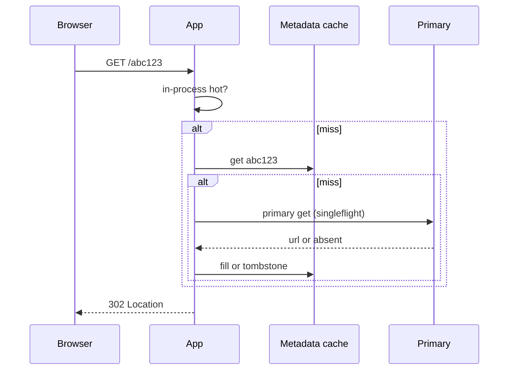
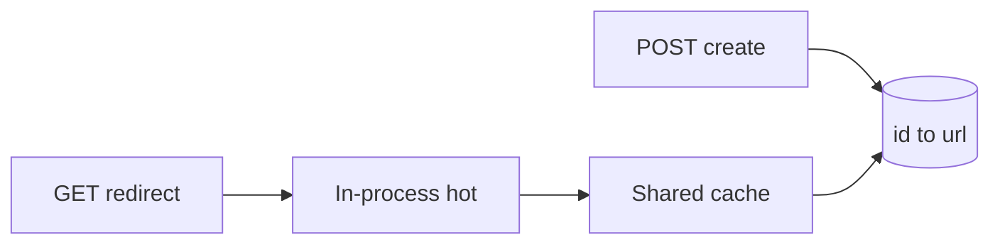

<!-- day-nav -->
[← Day 49 — Mock: warehouse inventory reservation](49-mock-warehouse-inventory-reservation.md) · [Day 51 — News feed →](51-news-feed.md)

# Day 50 — URL shortener

**Do now**

1. Set a timer.
2. Attempt the problem. Stop at the attempt line. Do not scroll.
3. Then read.

## Time box

35 minutes.

| Minutes | Do this |
|---|---|
| 0–12 | Attempt. Create and redirect. Name the hot link problem before you draw a cache. |
| 12–30 | Read. If a viral short link pins one primary row, you missed the deep dive. |
| 30–35 | Say the redirect path that survives a hot key, and the create path that does not wait on a redirect. |

## Intent

Facing a redirect path, leave able to design create and redirect so a hot link cannot pin one row or one cache key. Ranking, vanity campaigns, and analytics pipelines stay out unless they force a number.

## Problem

> Design a URL shortener.
>
> People submit a long URL and get a short link. Anyone who opens the short link is redirected to the long URL.

## Attempt before reading

12 minutes. Do not scroll. You already know pastebin create and a hot-key stampede. This product's read is a **302**, not a body stream. The viral object is one row, not 20 MB.

Write:

1. What create returns, and when. What redirect returns when the id is unknown, expired, or the long URL was deleted.
2. QPS for creates and redirects. Mean and peak. How skewed one short link is at peak.
3. The key for the short id, and where the long URL lives. Whether redirect is allowed to hit the primary every time.
4. What breaks when one short link takes a quarter of redirect traffic. Cache alone is not the whole answer if you leave the fill path unprotected.

---

**Stop. Create and redirect, with a hot link that cannot pin the primary.**

---

## Requirements

**In.** Authenticated or anonymous create of a short link from a long URL. Max long URL **2 KB**. Short id is unguessable, never reused. Redirect is **302** (or 301 if you choose permanence and say the cache cost). Optional TTL from an allow-list; default **365 days**. Creator can delete with a token returned once.

**Ack.** 201 only after the row is durable. Redirect does not create work on the write path.

**Assumptions.** **10 million** creates a day. **100** redirects per create over the life of a link (assumption about click-through, not a law). Peak **3×**. One region. One viral short link takes about a **quarter of peak** redirects — the sensitive skew assumption.

**Out.** Custom vanity strings as the default path (allow as a separate, rate-limited product), A/B on the long URL, click analytics that must be correct to the event, phishing classifiers, multi-region active-active create, preview cards.

**Codes.** Unknown / expired / deleted: **404** same body. Primary / metadata store down on redirect: **503**, not 404 — a blip must not look like a deleted link. Create over limit: **429** before the insert.

## Estimates

10,000,000 / 86,400 ≈ **116** creates/s average, **~350**/s peak.

Redirects: 116 × 100 = **11,600**/s average, **~34,800**/s peak. That is the product. Creates are a pastebin-sized write. Redirects are a hot metadata read.

One viral link at a quarter of peak: 0.25 × 34,800 ≈ **8,700**/s on **one** id. Same stampede shape you already named on day 11. The difference: the payload is a URL string (~100–500 bytes), not 10 KB of paste. Egress at 8,700 × 200 bytes ≈ **1.7 MB/s** — nothing. The cliff is **lookup QPS and lock/cache fill**, not NIC.

Metadata: 10e6 × 365 × ~200 bytes ≈ **730 GB** if every link lives a year. Fine for a keyed store. Not why you add a box.

**10×.** Redirects **~348,000**/s peak. One viral id **~87,000**/s. An in-process cache of hot destinations on each app node becomes mandatory, not optional. Creates at **3,500**/s still fit a partitioned primary if the short id encodes a slot.

Sensitive assumption: redirects per create. If the mean is 10, not 100, peak redirects drop an order of magnitude and the design still needs the hot-key answer — one campaign link can still be 8,700/s.

## API and data

`POST /v1/links` with `{"url":"..."}` and optional `ttl_days`. 201: `id`, `short_url`, `expires_at`, `delete_token` once.

`GET /{id}` → **302** `Location: <long url>` with `Cache-Control: private, max-age=60` (or no-store if you refuse shared caches caching a redirect you may delete). Prefer **not** letting a shared CDN cache 302s for 24 hours unless delete is "best effort tomorrow."

`DELETE /v1/links/{id}` with token → 204.

Row: `id` (8–10 char base62 is enough at 10M/day; birthday math: say it), `url`, `created_at`, `expires_at`, `delete_token_hash`. Primary key `id`. Partition by hash of id into a fixed slot map so create and redirect for one id share a shard. Do not range-partition on create time if a viral id must not pin a "today" tablet alone — hash spreads creates; the viral still pins **one** shard's one row, which cache must absorb.

## Design

### Create path

Validate URL scheme (http/https only), length, mint id, insert, 201. Idempotency key optional; if present, same key returns the same short id. Do not resolve the long URL or fetch it on create — that makes create depend on the destination's availability and turns your shortener into an open proxy probe.

### Redirect path

1. Check in-process hot cache (destination + expiry + tombstone). TTL **1–5 s** for hot ids you have already seen miss the shared cache, longer (**30–60 s**) only if delete lag is acceptable.
2. Else shared metadata cache (cache-aside). Singleflight per process per id on fill.
3. Else primary by id. On miss: cache a **tombstone** briefly so a scan of random ids does not melt the primary.
4. If expired or deleted: 404. Else 302.

**Delete.** Commit row delete (or set deleted), tombstone metadata key, 204. In-process copies die with their short TTL. You refuse "purge every PoP before 204" as the create of correctness — same edge honesty as the pastebin.

### Hot link, as arithmetic

8,700 redirects/s on one id without a cache: every request hits the primary row. With cache-aside and a 60 s TTL, steady state is ~1 fill per process per minute plus the first wave — fine. Expiry of that entry without singleflight: 8,700 × fill_latency. At 2 ms, ~17 in flight; at 50 ms on a busy primary, ~435. Singleflight collapses to one fill per process. Cold shared cache during a viral spike: apps still stampede the primary on distinct *other* ids; shedding random unknown ids (tombstone + 404 budget) matters more than a smarter lock on the one hot key.

**In-process copy.** At 10× (87,000/s on one id), even the shared cache node that owns the key can get awkward. A 1–2 second process-local copy of `{id → url}` for keys above a QPS threshold cuts shared-cache gets. Cost: delete can be wrong for up to that window on that process. Say it.

### What you refuse

- Encoding the destination in the short id (no lookup) — then you cannot delete, expire, or rotate, and the "short" link grows with the long URL.
- 301 everything with year-long CDN cache — delete becomes fiction.
- Analytics counter on the redirect path that must be exact — you just put a write on the hottest read. Outbox or sampled edge logs; exact counts are a different product.
- Vanity strings as the default id space — enumeration and squatting dominate the interview you should be having about hot keys.

## Diagrams

Caption: "Redirect never writes. Fill is singleflighted. Tombstone on unknown. Point at the alt miss path and say what a scanner does without the tombstone."

Caption: "Writes touch the row. Reads fall through caches. Viral traffic dies in the left two boxes — if you drew the viral arrow into the primary, redraw."

## Failure the user sees

**Primary down.** Create 503. Redirect: warm cache and in-process copies still 302 until TTL; cold ids 503, **not** 404. A 404 here would teach the user the link is gone when you cannot know. Page on create error rate and on cold-redirect 503s, not on 404 rate — 404 is a normal miss, expiry, or delete.

**Cache restart during a campaign spike.** Hot key singleflights; long tail of other ids can melt the primary — shed unknown-id floods with short tombstones; page on primary read QPS and on fill latency, not on 404 rate alone. At 8,700/s on the hot id, a 50 ms primary fill without singleflight is ~435 in-flight fills on that key alone (8,700 × 0.05); singleflight collapses it to one per process.

**Delete of a viral link.** New redirects 404 after tombstone; some apps may 302 for 1–2 s from in-process copy. Say the bound out loud. If you also had a shared-cache TTL of 60 s without a tombstone write on delete, that window is a minute of successful redirects to a URL the creator believes is dead — same class of lie as a CDN-cached 301.

**Scanner / enumeration.** Random 8-char ids miss. Without tombstones every miss is a primary get. At even 1,000 miss/s you have bought a read DoS. Tombstone TTL of a few seconds turns that into cache hits returning 404.

**Create succeeds, next redirect 404.** You returned 201 before the row was durable, or you wrote the row to a replica the redirect path does not read. That is a broken ack — day 29 territory. Fix: 201 after primary commit; redirect reads primary or a cache filled from primary, not an async replica as source of truth.

## Trade-offs

**302 + short max-age vs 301 + long CDN cache.** You take 302 and ~60 s (or private) so delete and expiry mean something. You give up edge hit rate on redirect; at 200-byte responses you can afford origin-adjacent cache.

**Shared cache only vs + in-process hot.** Shared is enough at 8,700/s. In-process at 10× or when the cache shard for that key is the bottleneck. Cost is delete lag.

**Hash partition of id vs time-based.** Hash so create load spreads. Viral still one row — that is a cache problem, not a "pick a better shard key" problem. Salting the id would break the lookup.

**Name the refusal inside each alternative.** Against year-long CDN-cached 301s: you refuse a delete that is theater for a day. Against exact click counters on the 302 path: you refuse a write on the hottest read. Against encoding the destination in the short id: you refuse a link you cannot delete, expire, or rotate. Against vanity as the default id space: you refuse an interview that becomes squatting and reserved words. Against reading redirects from an async replica: you refuse a 201 the next GET cannot find. Against salting a viral id to "spread load": you refuse a redirect that no longer has one key to look up.

**10×.** Redirects ~348,000/s peak; one viral id ~87,000/s. In-process hot copy becomes mandatory. Creates at ~3,500/s still fit a partitioned primary if the short id encodes a slot. The design does not grow a new consistency product — it grows process-local copies and shed rules.

## Talking points

**Hand-waving.** "We'll cache it." Where, for how long, what does delete do, and what happens on fill stampede?

**Hand-waving.** "Base62 id, done." Birthday collision math at 10M creates/day: 8 chars of base62 is 62^8 ≈ 2.1×10^14; collision risk is negligible at a year of creates. 6 chars is 62^6 ≈ 5.7×10^10 — still fine for a year at 10M/day (~3.65×10^9 ids) if you check-and-retry on conflict. Say the length and the retry, not "unguessable" as a vibe.

**If they ask about custom vanity.** Separate namespace, reserved words, rate limit per account, and still the same redirect path. Do not let vanity eat the hour.

**If they ask whether redirect increments a counter.** "Not on the 302 path if it has to be exact. Sampled logs or async. Exact click ledgers are a different product."

**If they ask what the user sees when primary is down.** "Creates 503. Warm redirects still 302 until TTL. Cold redirects 503, not 404 — a blip must not look like a deleted link."

**If they ask how delete meets an in-process copy.** "Tombstone the shared cache on delete; in-process dies with its 1–2 s TTL. I say that bound. I do not claim instant global purge."

**If they ask about multi-region create.** "Out today. One region for the row. Active-active create means id allocation and conflict rules I am not buying in this hour."

## Say this in the room

Ten million creates a day is about 116 a second; with a hundred redirects per link that is about 35,000 redirects a second at peak, and one campaign link at a quarter of that is about 8,700 a second on one id — a hot-key problem, not a bandwidth problem: 8,700 × 200 bytes is about 1.7 MB/s. Create inserts an id-to-URL row and returns 201 only after the primary commit; redirect is cache-aside with singleflight and a short in-process copy for keys that are on fire, returning 302 without writing. Delete tombs the shared cache; in-process copies die within a second or two — I refuse year-long CDN-cached 301s because then delete is theater. Unknown ids get a short tombstone so scanners do not melt the primary. Primary down is 503 on cold redirects, not 404.

### Staff depth: the viral redirect is a hot key, not a NIC problem

8,700 redirects/s × 200 bytes ≈ **1.7 MB/s** — your laptop can print that. The cliff is metadata lookups and fill stampedes, the same arithmetic as day 11: in-flight fills ≈ arrival × fill latency. At 50 ms without singleflight that is ~435 in flight on one key; singleflight turns it into fills-per-process. Tombstones on unknown ids stop scanners from making every miss a primary read.

**Create vs redirect capacity.** Creates at ~350/s peak are pastebin-sized writes. Do not let a redesign for viral reads complicate create with synchronous analytics counters. Counters are async or sampled.

**301 vs 302, with delete math.** If max-age is 24 hours on a 301 at the CDN, a delete is a day late for some viewers. If you need delete within a minute, you take short max-age or private cache and pay origin-adjacent hits. At 200-byte responses that cost is fine.

**Birthday length, spoken.** 8-char base62 ≈ 2.1×10^14 space; at 10M/day you are not in birthday trouble. Check-and-retry on the rare conflict. Do not mint ids from a single global counter if that counter is a hotspot — prefer per-slot counters or random-with-retry so create scales with the hash partition.

**What staff sounds like.** Separating the viral id's QPS from egress, putting singleflight on fill, refusing year-long CDN 301s when delete is a product promise, keeping create free of exact click ledgers, and saying 503 not 404 when the primary cannot answer a cold redirect.

## Kit artifact

| Follow-up | You answer with |
|---|---|
| "One link goes viral." | QPS on that id, cache + singleflight, in-process bound, delete lag, what you shed when the cache is cold. |

## Design log

One line: where a hot short link would have hit the primary in your attempt, and what bound you put on delete after caching.

Next: [Day 51 — News feed](51-news-feed.md). Fan-out choices, still no ranking models.

---

<!-- day-nav -->
[← Day 49 — Mock: warehouse inventory reservation](49-mock-warehouse-inventory-reservation.md) · [Day 51 — News feed →](51-news-feed.md)
