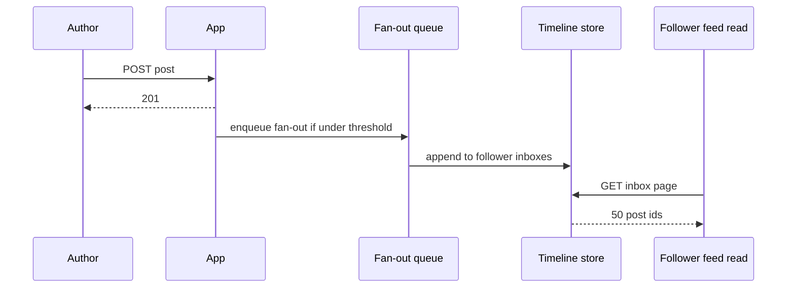
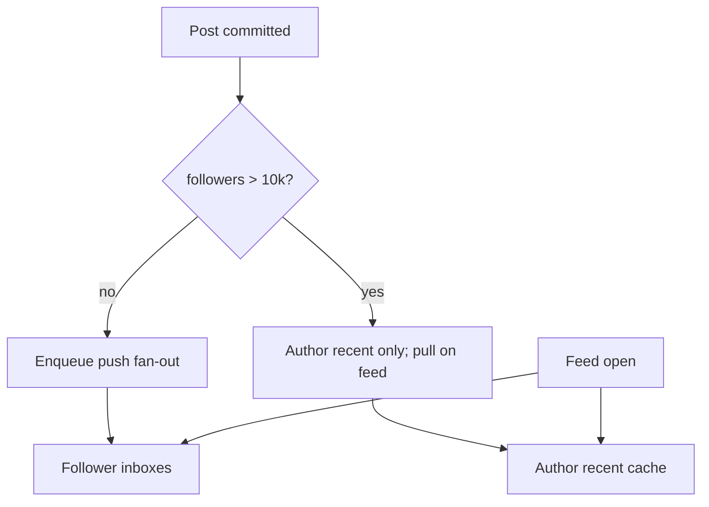

<!-- day-nav -->
[← Day 50 — URL shortener](50-url-shortener.md) · [Day 52 — Celebrity fan-out →](52-celebrity-fan-out.md)

# Day 51 — News feed

**Do now**

1. Set a timer.
2. Attempt the problem. Stop at the attempt line. Do not scroll.
3. Then read.

## Time box

40 minutes.

| Minutes | Do this |
|---|---|
| 0–12 | Attempt. Home feed for a follow graph. Pick fan-out-on-write or fan-out-on-read from skew, not from fashion. |
| 12–32 | Read. If you ranked posts with a model, you left the course. If you ignored celebrity skew, restart the choice. |
| 32–40 | Say which fan-out you take for the median user, what a celebrity post does to that choice, and the lag a follower can see. |

## Intent

Facing a home feed, leave able to choose fan-out-on-write or fan-out-on-read from follower skew, with ranking models left out. Chronological (or a simple recency+author filter) is enough. Day 52 is the celebrity hybrid; today you must feel why the pure forms break.

## Problem

> Design a news feed.
>
> People follow other people. When they open the app, they see a home feed of recent posts from people they follow.

## Attempt before reading

12 minutes. Do not scroll. No ML. No "For You." The graph is follow/unfollow. Posts are small text (or a pointer to media you do not store today).

Write:

1. What a post create returns. What a home feed request returns. What "recent" means in a number.
2. Users, follows per user, posts per day, feed refreshes per day. Peak. How many followers the p99 author has versus the median.
3. Fan-out-on-write: what you write on create, and what a 10-million-follower author does to that path.
4. Fan-out-on-read: what you read on feed open, and what a user who follows 5,000 active authors does to that path.
5. Pick one for the **median** path and name the skew that forces a hybrid tomorrow.

---

**Stop. Fan-out choice from skew. Ranking stays out.**

---

## Requirements

**In.** Create a post (text ≤ 1 KB, or a media id you treat as opaque). Follow and unfollow. Home feed: reverse-chronological posts from people you follow, page size **50**, not older than **7 days** in the default query (older is a different "archive" path you may refuse). Pull model: client asks; you do not push the body over a socket today (that is chat).

**Assumptions.** **100 million** users. **200 million** follows. Median user follows **200** accounts; p99 follows **2,000**. **50 million** posts a day. Median author has **150** followers; p99 author has **100,000**; a few celebrities have **10–50 million** (day 52). Feed opens: **20** per user per day average → rough **23,000**/s average feed reads if evenly spread — use **peak 3× ≈ 70,000**/s feed requests. One region.

**Out.** Ranking models, ads, stories, recommendations, "For You," mutuals ranking, spam classifiers, multi-region active-active timelines, exact global ordering across all authors.

**Lag.** A follower should see a non-celebrity post within **a few seconds** under healthy fan-out-on-write, or on next refresh under fan-out-on-read (bound the merge). Say which.

## Estimates

Posts: 50e6 / 86400 ≈ **580**/s average, **~1,740**/s peak.

Feed reads: if 100e6 users × 20 opens / 86400 ≈ **23,150**/s average, **~70,000**/s peak — planning number. Each open returns 50 post ids + thin metadata.

**Fan-out-on-write cost at median.** 580 posts/s × 150 followers ≈ **87,000** timeline writes/s average. Peak posts × median followers: 1,740 × 150 ≈ **261,000**/s. Large but partitionable by follower id.

**Celebrity bomb.** One post to 50 million followers = **50 million** timeline writes. At 100k writes/s sustained to a timeline store, that is **500 seconds** (~8 minutes) to fan out one post. The create request cannot wait. Even async, you melt the cluster and delay everyone else's fan-out.

**Fan-out-on-read cost at heavy followee.** User follows 2,000 authors. Feed open reads 2,000 "recent post" pointers (or queries), merges, takes top 50. At 70,000 feed opens/s, if even 1% are heavy, you have 700 merges × 2,000 = **1.4 million** author-tail reads/s. Without a cache of author recent posts, the online cluster dies.

**10× posts.** 5,800/s. Median fan-out-on-write → ~870k timeline writes/s. Still a capacity problem; celebrity remains the correctness/latency landmine.

Sensitive assumption: follower skew. If every author has ≤1,000 followers, pure fan-out-on-write is comfortable. Your product is not that.

## API and data

`POST /v1/posts` → 201 `{post_id,...}` after the post row is durable. Fan-out is **not** on that ack if you choose write-time fan-out — enqueue it.

`GET /v1/feed?cursor=` → 200 list of posts (id, author, text, created_at), next cursor.

`POST /v1/follows` / `DELETE` → 204.

**Post row:** `post_id`, `author_id`, `created_at`, `text`. Partition by `author_id` (author's posts together for fan-out-on-read).

**Follow graph:** `(follower_id, followee_id)`. Need both "who I follow" (feed) and "who follows me" (fan-out-on-write). Two edges or one edge + reverse index.

**Timeline inbox (if fan-out-on-write):** key `follower_id`, ordered posts (post_id, created_at, author_id). Trim to ~7 days or ~1,000 entries. Partition by `follower_id`.

## Design

### Pure fan-out-on-write (push)

On post commit, enqueue fan-out. Workers read followers of author, append post id into each follower's timeline. Feed read: read that user's timeline page — cheap.

**Wins.** Median feed is one keyed read. **Loses.** Celebrity create becomes a multi-minute storm; unfollow must remove or filter; silent author with huge fan-out still costs.

### Pure fan-out-on-read (pull)

On post, write only the author's post store. Feed read: load followees, fetch each author's recent posts from cache, merge by time, return 50.

**Wins.** Create is O(1). **Loses.** Heavy follow graphs and thundering herds on popular authors' recent-post caches at peak open times (morning).

### What you take today

**Fan-out-on-write for authors under a follower threshold** (say **10,000**), and **fan-out-on-read for the rest** — but the hybrid detail is day 52. Today, **state the threshold instinct** and pick **fan-out-on-write as the default for median traffic**, with an explicit refusal to push to multimillion fanouts on this path. For a course day: implement median as push; **reject** create-path push for authors over 10k followers — their posts are pulled on read from an author recent cache. That sentence is the bridge to day 52 without stealing it.

**Author recent cache.** Last ~100 post ids per author, Redis/mem cache, filled on write. Feed merge uses it. Hot authors need singleflight on fill (day 11).

**Unfollow.** Push timelines may still show posts until trim; filter on read by current follow set, or issue delete-from-timeline jobs. Filter-on-read is simpler and correct; stale ids in the inbox are harmless if you join against "still following."

**Ordering.** Per-feed merge by `created_at`. No global total order across the product. Clock skew of a few seconds between authors is acceptable; refuse to invent a distributed transaction for feed order.

### Worked numbers on the whiteboard

Median push: 580 posts/s × 150 followers ≈ **87k** timeline writes/s. Celebrity: 5e7 / 1e5 writes/s ≈ **500 s**. Heavy pull without author-recent: 1% of 70k opens × 2,000 followees ≈ **1.4e6** tail reads/s. Write both bombs before you pick a fashion. Threshold instinct (~10k) is the bridge to day 52 — today you must feel why pure forms break.

## Diagrams

Caption: "201 before fan-out. Over-threshold authors skip the queue (pull on read). Point at the queue and say what pages when it stalls."

Caption: "Skew gate. Median push. Celebrity pull. If both arrows from post go into the inbox, you erased the gate."

## Failure the user sees

**Fan-out queue down.** Creates still 201; median followers see posts late or not until repair. Page on oldest unfanned post age and on queue depth, not on create error rate — creates are fine. Pull-path authors unaffected. The user-visible miss is "my friend's post is missing for minutes," not a 500 on compose.

**Timeline store hot partition.** One celebrity who was under threshold and then exploded — inbox writes pile on. Move them to pull; do not "optimize the worker." At 50M followers and 100k writes/s you are still looking at ~500 seconds; a faster worker does not change the product shape.

**Feed open, author-recent cache cold.** Merge stampedes popular authors; singleflight + replica of recent lists. User sees slower refresh, not empty if inbox has push history. If fill fails for one celebrity, drop that author from this page rather than 503 the whole feed.

**Unfollow.** Next feed open filters; old inbox rows may remain until trim. User must not see the unfollowed author after refresh — filter is the contract. A delete-from-timeline job that lags is storage hygiene, not the privacy promise.

**Follow then immediate feed.** Under push, the new followee's older posts are not backfilled into the inbox unless you say so — usually you only get new posts after follow, plus pull of author-recent on the next merge if you choose. Say the backfill rule; "empty until they post again" is a product choice, not a bug you hide.

## Trade-offs

**Push vs pull.** Push for median latency; pull for skew. Pure either form fails a different percentile.

**Filter-on-read vs delete-on-unfollow.** Filter is correct and cheap; inbox garbage is bounded by trim. Delete jobs are nicer storage, worse on large unfollow bursts.

**Exact chronological vs "roughly recent."** You take created_at order with second-level skew. You refuse Lamport-ordering the social graph.

**Name the refusal inside each alternative.** Against pure push for everyone: you refuse a 500-second fan-out of one celebrity post. Against pure pull for everyone: you refuse tens of thousands of feed opens merging thousands of author tails without a cache. Against 201-after-fan-out: you refuse a compose button that is an outage for famous authors. Against ranking in this hour: you refuse a model interview dressed as system design. Against global total order of all posts: you refuse a hotspot that buys nothing the home feed needs.

**10× posts.** ~5,800/s → ~870k median timeline writes/s if still push — shard count and worker pool, not a new fan-out religion. Celebrity remains pull; the bomb scales with followers, not with sitewide post rate.

## Talking points

**Hand-waving.** "We'll use Cassandra timelines." Which key, who writes, what a 50M fan-out does, and when 201 returns.

**Hand-waving.** "Fan-out-on-write, industry standard." At what follower count does your write rate times followers exceed a minute of work? If you cannot say the number, it is fashion.

**If they ask about ranking.** "Out of scope. Chronological. Ranking is a different product on the same candidates."

**If they ask about media.** "Opaque id. Bytes are day 14/28/58. Feed carries the pointer."

**If they ask what a follower of only celebrities sees.** "Pull merge from author-recent caches on every open — day 52 makes that precise. Today I refuse to push those inboxes."

**If they ask about unfollow privacy.** "Filter on read against the current follow set. Stale inbox rows are fine; showing the author after unfollow is not."

## Say this in the room

Fifty million posts a day is about 580 a second; feed opens are about 70,000 a second at peak. Median authors have about 150 followers, so push fan-out is about 87,000 timeline writes a second on average — fine if partitioned by follower. A fifty-million-follower post is not: at 100,000 writes a second that is about 500 seconds of work, so those authors stay pull — feed merge reads author-recent caches and mixes with the push inbox. 201 returns when the post is durable, not when fan-out finishes. Unfollow is filtered on read so I do not issue tens of millions of deletes. No ranking model in this interview.

### Staff depth: push cost vs pull cost, with the celebrity bomb named

Median push: 580 posts/s × 150 followers ≈ **87,000** timeline writes/s — partition by follower and it is capacity. Celebrity push: 5e7 writes at 1e5/s ≈ **500 s**. That number is why the threshold exists. Feed open for a heavy follow graph without author-recent cache is another bomb: 2,000 followees × 70,000 opens/s at even 1% heavy users ≈ 1.4e6 author-tail reads/s.

**201 vs fan-out complete.** If 201 waits on push fan-out, celebrity create is an outage. Outbox after post commit. Followers of pull authors see posts on next merge.

**Sensitive assumption.** Follower skew. If every author has ≤1,000 followers, pure push is comfortable — say when that assumption would change the design, then refuse it for this product.

**What staff sounds like.** Computing both bombs before picking a fashion. Ranking stays out. Unfollow is filter-on-read so you do not issue 50M deletes. 201 never waits on the queue.

## Kit artifact

| Follow-up | You answer with |
|---|---|
| "Why not always push?" | Celebrity arithmetic: followers ÷ write rate = minutes; 201 cannot wait; hybrid threshold. |

## Design log

One line: the follower count where your attempt's pure fan-out broke, and which side you chose for the median user.

Next: [Day 52 — Celebrity fan-out](52-celebrity-fan-out.md). The hybrid becomes the design, not a footnote.

---

<!-- day-nav -->
[← Day 50 — URL shortener](50-url-shortener.md) · [Day 52 — Celebrity fan-out →](52-celebrity-fan-out.md)
