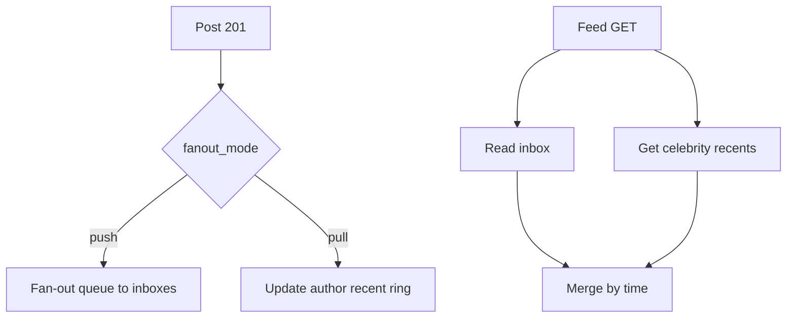
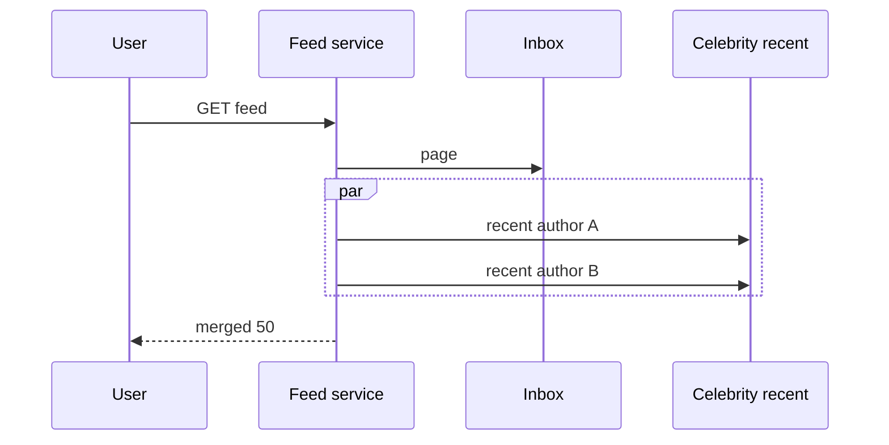

<!-- day-nav -->
[← Day 51 — News feed](51-news-feed.md) · [Day 53 — One-to-one chat →](53-one-to-one-chat.md)

# Day 52 — Celebrity fan-out

**Do now**

1. Set a timer.
2. Attempt the problem. Stop at the attempt line. Do not scroll.
3. Then read.

## Time box

35 minutes.

| Minutes | Do this |
|---|---|
| 0–12 | Attempt. One author, tens of millions of followers. Hybrid fan-out. |
| 12–30 | Read. If the celebrity post still pushes to every inbox, you failed the day. |
| 30–35 | Say the threshold, what 201 waits on, and what a follower of only celebrities sees on open. |

## Intent

Facing one author with a huge audience, leave able to hybrid-fan-out so a single post cannot stampede storage or the online cluster. Day 51's choice becomes a gate, not a slogan.

## Problem

> Design celebrity fan-out for a news feed.
>
> Most authors have hundreds of followers. A few have tens of millions. One post from a celebrity must not melt the timeline store or make create fail.

## Attempt before reading

12 minutes. Do not scroll. Day 51 exists: push for median, pull for huge. Make the hybrid precise.

Write:

1. The follower threshold and how you measure it (cached count? exact?).
2. Create path for a celebrity post: what is durable at 201, what is async.
3. Feed read for a user who follows 50 celebrities and 150 normals.
4. What happens when an author crosses the threshold after you already pushed.
5. The failure if the "celebrity recent" cache is wrong or cold during a morning spike.

---

**Stop. Hybrid fan-out with a hard gate and a pull merge.**

---

## Requirements

**In.** Same feed product as day 51. Explicit: authors with **≥ 10,000** followers (configurable) never push inbox rows on create. Their posts are visible via pull from an author-recent structure. Authors under the threshold push as before.

**Assumptions.** A few hundred celebrities above threshold; a handful above **10 million**. Post rate among celebrities is low (tens per second combined), but each post is huge in audience. Peak feed opens still **~70,000**/s.

**Out.** Ranking, ads, live video of the celebrity (day 59), notification storms (day 55 may mention but not solve here).

## Estimates

Push path unchanged for median: ~**261,000**/s peak timeline writes at day-51 numbers if all posts were median — reality is less because celebrity posts skip push.

One **50 million** follower post on push would be 5e7 writes. At **100,000** timeline writes/s, **500 s**. Hybrid sets that cost to **0** inbox writes. Pull cost: every feed open for users who follow that celebrity must read that author's recent list (cache hit ≈ 1 get). If **20 million** users follow them and open once in a peak hour, that is not 20e6 cache gets in one second — opens are spread. Worst spike: viral alert drives **1 million** opens in **60 s** ≈ **17,000**/s extra gets for that one key — singleflight + in-process copy (day 50/11).

**Crossing threshold.** Author at 9,999 gets a burst of follows to 50,000. In-flight push jobs may still write. New posts pull-only. Old inbox rows remain until trim — fine.

## API and data

Same as day 51, plus:

**Author profile / counters:** `follower_count` updated async (approx is enough for the gate; do not put exact count on the create critical path). Gate reads a cached flag `fanout_mode = push|pull`.

**Celebrity recent:** key `author_id` → ring of last N post ids (N=100) in cache + durable author post partition.

**Feed merge:** read push inbox (normals) + for each pull-followee, peek recent; merge by `created_at`; apply follow filter; paginate.

## Design

### Create

1. Persist post on author partition. 201.
2. Read `fanout_mode` (cached). If push: outbox fan-out job. If pull: update celebrity recent (same commit or async with care — recent must not leave a window where post exists but recent lacks it for longer than your lag SLO; prefer same write path as post for the recent ring if stored in the same row/family).
3. Never enqueue 50e6 inbox writes.

### Feed read

1. Load followee set (cached).
2. Split by mode (cached flags).
3. Inbox page for push followees.
4. Parallel gets of recent for pull followees (cap: if someone follows 2,000 celebrities, you already have a product problem — cap pull-merge followees at **500** and warn; or require that celebrity follows are rare).
5. Merge, return 50.

### Soft vs hard threshold

Hard gate at 10k: simple, a bit unfair near the boundary. Hysteresis: enter pull at 10k, return to push at 8k — avoids flapping. Say hysteresis.

### Notifications

A celebrity post may notify differently (day 55). Do not fan-out push notifications 1:1 to 50e6 devices on the create path either — that is the same bomb with a different store.

## Diagrams

Caption: "Create never waits on 50M writes. Feed pays merge for pull followees."

Caption: "Parallel recent gets; singleflight on each hot author key."

## Failure the user sees

**Wrong mode flag (still push at 50M).** Create 201s; queue depth explodes; other authors' fan-out lags for minutes. Page on fan-out lag and on jobs per post. Mitigation: hard max inbox writes per post (e.g. 20k); overflow aborts to pull and flips flag.

**Celebrity recent cold.** Feed opens miss; singleflight fills from author partition. Brief slow feeds, not missing posts if fill works. If fill fails: user sees feed without that celebrity until next refresh — prefer 503 on that author's slot only if you must, not empty whole feed.

**User follows 500 celebrities.** Merge CPU and fan-out of gets dominate. Cap and degrade: show inbox + top N by recent engagement of followees (without a model: top N by follower_count or last-open affinity you already store). Say the cap.

## Trade-offs

**Cached approx count vs exact for gate.** Approx can be wrong by thousands near boundary — hysteresis absorbs it. Exact count on every follow write is fine; reading it on every create is fine too if local to author shard.

**Sync recent update vs async.** Sync with post commit on author shard: no "post exists, recent misses." Async: faster create, visible gap. Prefer sync for the ring metadata when it lives with the author.

**Push below threshold vs pull everyone.** Pull everyone simplifies create and kills median feed latency. You refuse it for this product shape.

## Talking points

**If they ask "is 10k magic?"** "Order-of-magnitude where push cost exceeds a few hundred ms of worker time at our write rate. Tune with hysteresis. The point is a gate, not the integer."

**If they ask about backfill when crossing down to push.** "Optional. New posts push; history stays pullable from author store. Do not rewrite 50M inboxes."

## Say this in the room

Celebrities never push: a fifty-million-follower post would need about 500 seconds of timeline writes at 100k a second, so the gate flips them to pull and create only updates the author-recent ring. Feed merge reads the push inbox for normal followees and parallel recent gets for celebrities, with singleflight on hot authors. I use hysteresis around the threshold so we do not flap, and a hard cap on inbox writes per post so a bad flag cannot melt the cluster. 201 is post durability, not fan-out completion.

### Staff depth: the hard cap that saves you from a bad flag

Even with a gate, a bad `fanout_mode=push` on a 50M account must not enqueue 50M jobs. **Max inbox writes per post** (e.g. 20k) aborts to pull and flips the flag. Page on jobs-per-post and fan-out lag.

**Hysteresis.** Enter pull at 10k, return to push at 8k — avoids flapping when follower_count is approximate.

**Morning stampede on celebrity recent.** Singleflight + in-process copy (day 11/50). In-process cost: a delete/hide of a celebrity post can lag a second on that process.

**What staff sounds like.** Naming the max-writes fuse before the happy hybrid diagram.

## Kit artifact

| Follow-up | You answer with |
|---|---|
| "Celebrity posts anyway." | Gate, max writes per post, pull merge, singleflight on recent, hysteresis. |

## Design log

One line: the max inbox writes per post you would enforce, and what the user sees if celebrity recent is cold.

Next: [Day 53 — One-to-one chat](53-one-to-one-chat.md). Per-conversation order, not a global feed.

---

<!-- day-nav -->
[← Day 51 — News feed](51-news-feed.md) · [Day 53 — One-to-one chat →](53-one-to-one-chat.md)
