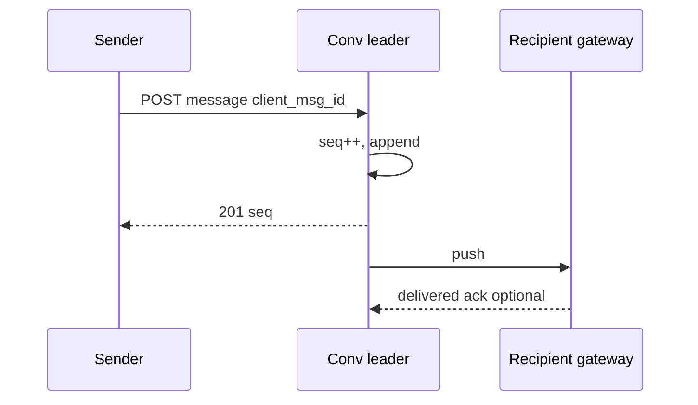
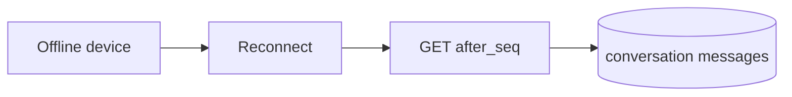

<!-- day-nav -->
[← Day 52 — Celebrity fan-out](52-celebrity-fan-out.md) · [Day 54 — Large-room chat →](54-large-room-chat.md)

# Day 53 — One-to-one chat

**Do now**

1. Set a timer.
2. Attempt the problem. Stop at the attempt line. Do not scroll.
3. Then read.

## Time box

40 minutes.

| Minutes | Do this |
|---|---|
| 0–12 | Attempt. Two people messaging. Order, receipts, offline catch-up. No global total order. |
| 12–32 | Read. If you required a single global sequence for all users, undo it. |
| 32–40 | Say how order is defined, what a duplicate send does, and how offline catch-up works. |

## Intent

Facing two people messaging, leave able to keep per-conversation order, receipts, and offline catch-up without a global total order.

## Problem

> Design one-to-one chat.
>
> Two people exchange messages. They see a conversation history. They should know when the other has received or read a message. If one was offline, they catch up when they return.

## Attempt before reading

12 minutes. Do not scroll.

Write:

1. Send API: what returns before the other party is online?
2. Ordering key inside a conversation. Why not order all messages on the site by one clock.
3. Delivered vs read receipts: what is stored, what is pushed.
4. Offline catch-up: cursor, fan-out to devices, multi-device.
5. Retry after a flaky mobile network: how you avoid double messages.

---

**Stop. Per-conversation sequence, durable inbox, idempotent send.**

---

## Requirements

**In.** Create conversation (or implicit on first message). Send text (≤ 4 KB) or opaque attachment id. List history with cursor. Delivered and read receipts. Multi-device: at least phone + web. Offline catch-up on reconnect.

**Assumptions.** **50 million** MAU. **2 billion** messages/day → ≈ **23,000**/s average, **~70,000**/s peak. Median conversation quiet; some hot pairs (support bots) high. One region for metadata; devices worldwide.

**Out.** Group chat (day 54), E2E encryption product claims (you may encrypt in transit), voice/video, bots platform, spam ML, searchable global message archive across all users as a compliance product (day 76 is audit; here history is per conversation).

**Order.** Messages in a conversation are totally ordered. Messages across conversations are not comparable. Client UI may sort by local receive time for notifications; the history API is authoritative per conversation.

## Estimates

23k msg/s × ~200 bytes ≈ **4.6 MB/s** ingest. Storage: 2e9 × 200 × 365 ≈ **146 TB**/year if you keep a year — retention policy matters; planning **90 days** online, colder after.

Connections: if **5 million** concurrent sockets, that is the realtime fan-out problem — sticky gateway layer, not one chat server.

Hot pair: **100 msg/s** in one conversation — single partition must handle it. Rare, but say the ceiling.

## API and data

`POST /v1/conversations/{id}/messages` with `client_msg_id` (idempotency), body → 201 `{server_msg_id, seq, created_at}`.

`GET .../messages?after_seq=` catch-up.

`POST .../receipts` `{up_to_seq, type: delivered|read}`.

**Conversation row:** `conversation_id`, two user ids (normalized pair), etc.

**Message row:** `(conversation_id, seq)` primary, `server_msg_id`, `client_msg_id` unique per sender, `sender_id`, `body`, `created_at`.

**Seq:** monotonic per conversation, assigned by the **single writer** for that conversation partition (leader or via a compare-and-set on `next_seq`). Do not use device clocks for order.

**Inbox / device streams:** each user has a push channel; payloads are thin (conversation_id, seq) or full message if small.

## Design

### Send path

1. Authenticate; verify membership.
2. Idempotency: if `client_msg_id` seen, return original 201.
3. On conversation leader: allocate `seq`, append message, commit.
4. 201 to sender.
5. Push to recipient device gateways (at-least-once). If offline, durable backlog for catch-up remains the message table — push is optimization.

### Order without global clock

`seq` is the order. `created_at` is informational (server time at assign). Two conversations interleave arbitrarily on a user's merged notification view — that merge is client-side by receive time or server notification timestamp, **not** a global message seq.

### Receipts

Recipient's device sends `delivered` when it persists locally; `read` when the thread is open. Store `delivered_seq`, `read_seq` per user per conversation (high-water). Push receipt updates to the other party. Receipts are **lossy-tolerant**: going backwards is ignored; gaps are OK (device lost a push but catch-up will fill messages; receipt may jump).

### Offline catch-up

On connect: client sends `after_seq` per active conversation (or a user-level event log of "new activity"). Simpler: user mailbox of pointers `(conversation_id, seq)` for messages since last ack; then fetch bodies. Multi-device: each device has its own cursor; read receipt is per user high-water, not per device — define that: **read on one device marks read for the user**.

### Retry

Same `client_msg_id` → same `seq`. Different id → second message. Client must stabilize ids across retry. Server retains idempotency keys **24–72 h**.

### Worked path: send with flaky mobile

1. Client mints `client_msg_id`; POST; timeout.
2. Retry same id → same seq (idempotency 24–72 h).
3. 201 already happened on server; push may have dropped → recipient catch-up on reconnect with `after_seq`.
4. Sender UI shows sent from 201, not from delivered receipt.

## Diagrams

Caption: "Seq assigned in one place. Push is after commit. If push is before commit, a crash fabricates ghosts."

Caption: "Catch-up reads the log; push is not the source of truth. Point at after_seq."

## Failure the user sees

**Leader down for conversation.** Sends 503 for that thread; other conversations fine. Budget election ~30s (~2,100 failed sends if that thread were at a hot 70 msg/s — usually far quieter; still say the window). Do not dual-write seq without a fence — duplicate seq or forks destroy chat. Page on send 503s per conversation partition, not only sitewide error rate.

**Push lost.** Recipient looks offline until catch-up; sender may see no delivered receipt. Message is **not** lost if commit succeeded. The product bug is teaching the sender "failed" when the log has the row — UI should show sent, not retry-as-new without the same client_msg_id.

**Duplicate client_msg_id after retention expiry.** Second insert — rare; document retention (24–72 h). After expiry, a retry becomes a second message; clients must not recycle ids forever.

**Clock skew on clients.** Irrelevant for history order; only seq matters. A client that sorts the thread by device `Date.now()` will reorder — history API order is authoritative.

**Multi-device race on send.** Phone and web both send with different client_msg_ids: two messages, correct. Same client_msg_id from one device after retry: one message. Do not key idempotency only on body hash — identical texts are allowed.

## Trade-offs

**Per-conversation leader vs CRDT merge.** Leader+seq is enough for 1:1. CRDT is for concurrent edits without a leader (day 67). You refuse CRDT for chat bodies here.

**Store receipts on every message vs high-water.** High-water is O(1) per conversation; enough for WhatsApp-style ticks. Per-message receipts explode writes at 70k msg/s.

**Push-as-truth vs log-as-truth.** Log is truth. Push can drop.

**Name the refusal inside each alternative.** Against a global message seq for the site: you refuse a hotspot that does not define 1:1 history. Against CRDT chat bodies: you refuse concurrent merge complexity you do not need when a leader exists. Against per-message receipt rows: you refuse write amplification on every tick. Against push-as-truth: you refuse silent loss when the gateway drops a frame. Against device clocks as order: you refuse reorder bugs on flaky mobiles.

**10×.** ~230k msg/s average. More conversation partitions, same per-conversation single writer. Hot pairs still one seq space — you scale by conversations, not by sharding one thread's seq.

## Talking points

**If they ask for global ordering.** "Not needed. Notification tray order is not the conversation contract."

**If they ask about E2E.** "Bodies encrypted under user keys means server fans out ciphertext and cannot read; receipts and seq still server-side. Out unless they insist — then seq and fan-out stay, search dies."

**If they ask what happens when push drops after 201.** "Sender already has seq. Recipient catch-up with after_seq on reconnect. Delivered receipt may never arrive for that hop — lossy on purpose."

**If they ask how multi-device read works.** "Read high-water is per user: phone open marks read for web. Each device keeps its own catch-up cursor for payloads it has locally."

**If they ask about a hot support bot pair.** "About 100 msg/s on one conversation is still one leader. I do not split seq across shards for that thread."

## Say this in the room

About 23,000 messages a second average, peak near 70,000; each conversation has a single writer that assigns a monotonic seq so order does not depend on device clocks. Send is idempotent on client_msg_id for 24–72 hours, 201 after the append, then at-least-once push; offline devices catch up with after_seq from the message log, which is the source of truth. Delivered and read are high-water marks per user, not per message row — at this QPS I refuse receipt rows per message. I refuse a global total order across the product — it buys nothing for 1:1 history and costs a hotspot. Leader loss is 503 on that thread for the election window, with a fence so seq cannot fork.

### Staff depth: at-least-once push, log as truth

Push can drop. Catch-up with `after_seq` is mandatory. Delivered receipts may jump — high-water, not per-message rows at 70k msg/s.

**Multi-device read.** Read high-water is per user so phone marks web read. Each device still has its own catch-up cursor for which payloads it has.

**Hot pair.** 100 msg/s on one conversation: one partition leader; do not shard the conversation's seq.

**Idempotency retention.** 24–72 h of client_msg_id. After that a retry can double — say it, and make clients mint stable ids for the retry window.

**What staff sounds like.** Refusing global order, fencing the conversation leader, documenting that receipts are lossy, and keeping the log as truth when push lies.

## Kit artifact

| Follow-up | You answer with |
|---|---|
| "Two devices, one read." | User-level read high-water; per-device catch-up cursors. |

## Design log

One line: where seq is assigned, and what happens if push drops after 201.

Next: [Day 54 — Large-room chat](54-large-room-chat.md). Fan-out without per-member copy on send.

---

<!-- day-nav -->
[← Day 52 — Celebrity fan-out](52-celebrity-fan-out.md) · [Day 54 — Large-room chat →](54-large-room-chat.md)
