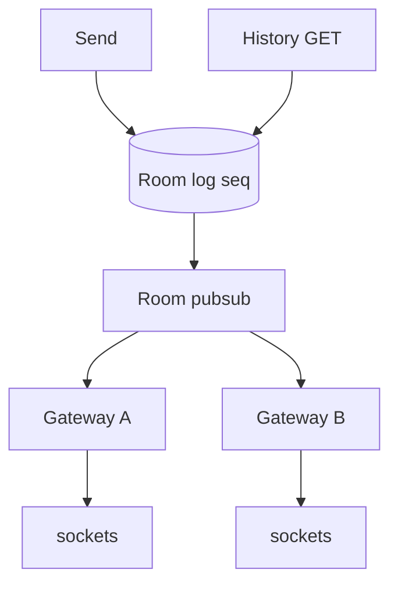
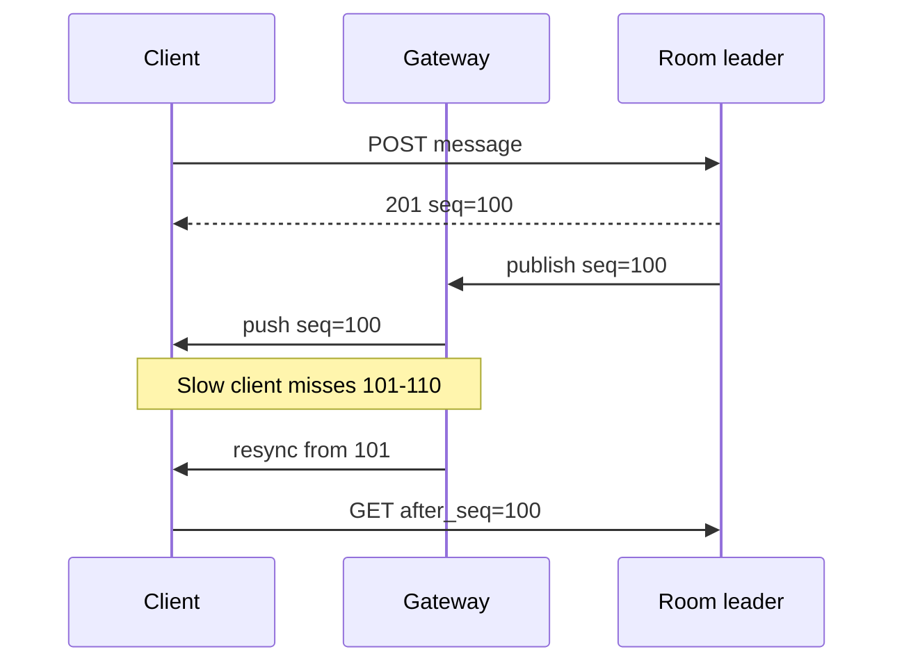

<!-- day-nav -->
[← Day 53 — One-to-one chat](53-one-to-one-chat.md) · [Day 55 — Notifications →](55-notifications.md)

# Day 54 — Large-room chat

**Do now**

1. Set a timer.
2. Attempt the problem. Stop at the attempt line. Do not scroll.
3. Then read.

## Time box

40 minutes.

| Minutes | Do this |
|---|---|
| 0–12 | Attempt. Huge room. History and live fan-out without copying every message to every member on send. |
| 12–32 | Read. If send writes N inbox rows for N members, you rebuilt celebrity fan-out. |
| 32–40 | Say where history lives, how a joiner catches up, and how live delivery scales with room size. |

## Intent

Facing a huge room, leave able to serve history and fan-out without copying every message to every member on the send path.

## Problem

> Design large-room chat.
>
> Thousands to hundreds of thousands of people share one room. They send messages, read history, and see new messages while connected.

## Attempt before reading

12 minutes. Do not scroll. Day 53's per-conversation seq still holds. Day 52 taught you not to push 50M copies.

Write:

1. Send path writes: O(1) or O(members)?
2. How a client receives live messages in a 100k-member room.
3. History pagination when the room has millions of messages.
4. What "delivered to everyone" means — and whether you refuse that receipt.
5. Slow consumers and backpressure on the live path.

---

**Stop. One room log. Fan-out is subscription, not per-member copy.**

---

## Requirements

**In.** Rooms with up to **~500,000** members (hard product cap — say it). Send rate per room capped (e.g. **20 msg/s** sustained, burst 50) so one room cannot eat the site. History for **30–90 days**. Live delivery to connected members. Membership join/leave.

**Assumptions.** **10,000** active rooms; **50** "mega" rooms with **>50k** members; **100k** concurrent connections in the largest room at peak event. Message size ≤ 2 KB.

**Out.** Exact read receipts for every member (refuse: O(members) writes). E2E for megarooms. Threads/reactions as the deep dive unless time remains. 1:1 (day 53).

## Estimates

Largest room: 100k connections × 20 msg/s = **2 million** push fan-outs/s **if** you naively send full messages to each socket from one process — impossible on one box. So: **broadcast tree / pubsub / room channel** sharding, not a loop of 100k writes on send.

Storage: one append log per room. 20 msg/s × 2 KB × 86400 ≈ **3.5 GB/day/room** at cap — mega rooms need retention discipline.

Membership: 500k rows for one room; join checks must be cached.

## API and data

`POST /v1/rooms/{id}/messages` → 201 `{seq, ...}` after append to **room log**.

`GET /v1/rooms/{id}/messages?before_seq=` history.

WebSocket/SSE: subscribe to `room:{id}` from `after_seq`.

**Room log:** `(room_id, seq)` → message. Single writer per room (or partitioned by room_id to one leader).

**Membership:** `(room_id, user_id)`. Cache "is member" on send and subscribe.

**No per-member inbox copy** of each message.

## Design

### Send = append + publish

1. AuthZ membership (cached).
2. Rate limit per room and per user.
3. Append to room log with next `seq` (leader).
4. 201.
5. Publish `{room_id, seq, payload}` to a **room pubsub** topic. Gateways subscribed for connected members deliver. Members offline get nothing live — they catch up from history on next open.

### Fan-out topology

Gateways hold socket interest sets. Pubsub routes room topics to gateways that have ≥1 subscriber in that room (interest gossip or broker filtering). Payload may be thin (seq only) + gateway fetches body once and fans to local sockets — or full body if small. **Single fetch of body per gateway per message**, not per socket.

### History

Cold storage by `(room_id, seq)` ranges. Catch-up: client provides `after_seq`; server pages. For late joiners during a hot event, prefer history API over replaying hours through the socket (backpressure).

### Receipts

**Refuse** per-member delivered/read for megarooms. Optional: "viewer count" approximate, or reactions aggregated. Sender gets 201 = durable in room log, not "everyone saw it."

### Backpressure

Slow socket: drop live frames and send a **resync** notice (`must_catch_up_from_seq`). Do not buffer unbounded per connection (day 19). Room-wide send rate limit protects the log.

### Worked path: keynote room

1. Append to room log (O(1)); 201 = durable seq.
2. Publish to room topic; gateways with interest deliver; one body fetch per gateway via singleflight.
3. Slow phone: resync notice, history `after_seq` — not an hour of buffered frames.
4. Refuse per-member read receipts; optional approx viewer count.

## Diagrams

Caption: "O(1) write to log. Live path is subscription fan-out. History reads the same log. If send fans to N inboxes, redraw."

Caption: "Slow consumer resyncs from log; gateway does not buffer forever. Point at the resync notice."

## Failure the user sees

**Room leader down.** Sends 503 for that room; election window (~30 s). History may be readable from replicas if you allow lag; live publish pauses. Other rooms on other leaders stay healthy — page on per-room send errors, not only global.

**Pubsub partition.** Appends succeed (201) but live silent; clients notice gap (seq jump) and catch up via history. Page on publish lag vs log head — the scary metric is "log advanced, live silent," not create failures.

**Gateway overload in mega room.** Shed connections with retry; prefer sticky regional gateways. User reconnects and catch-ups. Do not buffer unbounded per socket (day 19) — that OOMs the gateway during a keynote.

**Not-a-member send.** 403. Cached membership must invalidate on kick within a bound (e.g. 30 s) — kicked user may send briefly; say it. Same bound applies to subscribe: a kicked socket may get a few more frames.

**Slow consumer.** Misses live frames; receives resync notice with `must_catch_up_from_seq`; history fill. User-visible: a jump, then catch-up, not a melted phone battery from a multi-hour socket buffer.

## Trade-offs

**Per-member inbox vs room log.** Inbox is day 53 at small N. At 100k, inbox is celebrity bomb (100k writes/msg × 20 msg/s = 2M writes/s). Room log wins.

**Full-body pubsub vs seq-only.** Seq-only reduces broker bandwidth; gateways may stampede the log on a hot message — mitigate with gateway-local singleflight get of body by seq.

**Exact presence.** Approximate presence is enough; exact is a different storm.

**Name the refusal inside each alternative.** Against per-member inbox copy on send: you refuse the celebrity bomb in a chat costume. Against per-member read receipts: you refuse O(members) writes on every open. Against unbounded per-socket buffers: you refuse gateway OOM during a spike. Against one process fanning 100k full payloads: you refuse a box that cannot exist. Against exact global presence for 500k: you refuse a second megasystem beside chat.

**10× room size.** Cap stays a product decision (500k). Topology still log + pubsub + gateway interest; you add gateway capacity and shard pubsub, not per-member rows.

## Talking points

**If they demand read receipts for 100k.** "No. Aggregate or refuse. O(members) on every read is the large-room failure mode."

**If they compare to Kafka.** "Room log is Kafka-shaped: one partition per room, consumers are gateways. You do not invent a new broker brand mid-interview — you need the access pattern."

**If they ask what 201 means.** "Durable in the room log. Not delivered to 100k devices. Offline members see it on history when they open."

**If they ask about the 2M fan-outs/s naive math.** "That is why send is O(1) append + publish, not a loop over members. Gateways with interest sets do the fan-out locally."

**If they ask about backpressure.** "Slow socket gets a resync pointer, not an infinite buffer. Room-wide send rate limit protects the log — 429 the chatty sender."

## Say this in the room

A large room is one append log with a monotonic seq, not N copies on send — copying to 100,000 members at 20 messages a second would be about two million writes a second, the celebrity fan-out bomb with a chat costume. 201 means the log has the message; live delivery is pubsub to gateways that hold sockets, with a single body fetch per gateway via singleflight and resync from history when a socket is too slow to buffer. I refuse per-member read receipts at this scale. Catch-up is `after_seq` on the same log offline users already need. Kick invalidates membership within about 30 seconds of cached lag I say out loud.

### Staff depth: gateway singleflight for body fan-out

Seq-only pubsub + per-gateway fetch of body by seq prevents the broker from carrying 100k × 2 KB. Without singleflight, 50k sockets on one gateway stampede the log on one message.

**Room send rate limit.** 20 msg/s sustained protects the log and the humans. Burst then 429 the sender, not the room's history.

**Kicked member lag.** Cached membership may allow send for ~30 s — say the bound; invalidate on kick.

**Storage at cap.** 20 msg/s × 2 KB × 86400 ≈ 3.5 GB/day/room — retention is a spoken budget, not an infinite log.

**What staff sounds like.** O(1) append, subscription fan-out, resync not unbounded buffers, refuse per-member receipts, and the 2M-writes/s naive number said before the diagram.

## Kit artifact

| Follow-up | You answer with |
|---|---|
| "How does everyone get the message?" | Pubsub + gateway interest, not O(N) writes on send; history is the truth. |

## Design log

One line: whether your attempt wrote per-member rows on send, and the resync rule for slow sockets.

Next: [Day 55 — Notifications](55-notifications.md). Push plus inbox when the user is not in the app.

---

<!-- day-nav -->
[← Day 53 — One-to-one chat](53-one-to-one-chat.md) · [Day 55 — Notifications →](55-notifications.md)
