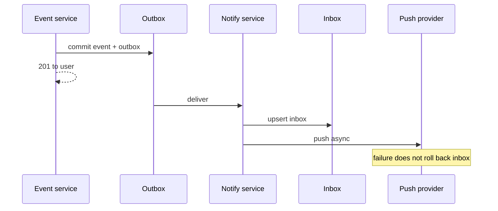

<!-- day-nav -->
[← Day 54 — Large-room chat](54-large-room-chat.md) · [Day 56 — Typeahead →](56-typeahead.md)

# Day 55 — Notifications

**Do now**

1. Set a timer.
2. Attempt the problem. Stop at the attempt line. Do not scroll.
3. Then read.

## Time box

40 minutes.

| Minutes | Do this |
|---|---|
| 0–12 | Attempt. Push + inbox. Preferences, dedupe, dead provider. |
| 12–32 | Read. If a dead APNs/FCM fails the product event, you coupled wrong. |
| 32–40 | Say where the inbox lives, how dedupe works, and what users see when the provider is down. |

## Intent

Facing a user who is not in the app, leave able to design push plus an inbox with preferences, dedupe, and a dead provider.

## Problem

> Design notifications.
>
> When something happens that a user should know about, they get a push if possible, and they can open an in-app inbox of recent notifications.

## Attempt before reading

12 minutes. Do not scroll.

Write:

1. What produces a notification (event → notification), and what 201 on the **event** waits on.
2. Preference checks: quiet hours, per-type toggles, channel (push/email/in-app).
3. Dedupe: same like spammed 50 times; collapse keys.
4. Provider dead: inbox still? retry? user-visible gap?
5. Celebrity post notifying 50M followers — connect to day 52 without solving fan-out again.

---

**Stop. Durable inbox first. Push is best-effort delivery of a pointer.**

---

## Requirements

**In.** Notification types with preferences. In-app inbox (last **30 days**, page size 50). Push via mobile providers. Dedupe/collapse by key. Mark read. Optional email channel (thin).

**Assumptions.** **100 million** users; **5 billion** notification events/day aspirational — planning **500 million**/day after preferences ≈ **5,800**/s average, **~20,000**/s peak writes to inbox. Push attempts similar order but highly filtered.

**Out.** SMS as primary, marketing automation studio, ML priority inbox, exact global ordering of all notifications across types beyond per-user time.

## Estimates

Inbox write 20k/s peak. Row ~300 bytes → ~6 MB/s. Retention 30d × 500e6 × 300 ≈ **4.5 TB**/month-ish at that rate — size the retention.

Push provider latency/timeouts: **2–5 s** budgets; never on the event commit path.

Celebrity: 50M notifications must use the same hybrid as feed (day 52) — **not** 50M synchronous provider calls from one worker.

## API and data

Internal: `Emit(user_id, type, collapse_key, payload, prefer_push)`.

`GET /v1/notifications?cursor=` inbox.

`POST /v1/notifications/read` high-water or ids.

Device token registry: `user_id → [device tokens]`.

**Inbox row:** `(user_id, notification_id)`, `type`, `collapse_key`, `body`, `created_at`, `read`. Unique `(user_id, collapse_key)` where collapse replaces/bumps.

## Design

### Event path

Product event commits (like, comment, ship order). Outbox → notification service. Event's user-facing ack **does not wait** on push.

### Preference + emit

1. Load prefs (cached). Quiet hours → inbox only, or delay push.
2. Upsert inbox by collapse_key (e.g. `like:post:123` updates count and timestamp).
3. Enqueue push job if prefs allow and device tokens exist.

### Push workers

At-least-once to provider. Idempotent on `(user, collapse_key, epoch)` or provider collapse_id if supported. Token invalid → remove token. Provider 503 → retry with jitter; **inbox already has the row**.

### Dead provider

Inbox works. Badge counts from inbox unread. Push delayed. Page on provider error rate and oldest unpushed job. Do not fail the order or the like.

### Celebrity / large fan-out

Emit path must not create 50M jobs synchronously. Use recipient query + partitioned workers, or "pull notification on feed open" for low-priority social types. Cap push for some types to online users only.

### Worked path: like → inbox → push

1. Like service commits like + outbox row; returns 201 to the liker (~ms).
2. Notify consumer loads prefs (cache). Quiet hours → inbox only.
3. Upsert inbox on `(user, collapse_key=like:post:P)` — count++, `created_at=now`.
4. Enqueue push job with device tokens; worker calls APNs with provider collapse_id when available.
5. APNs 503 → retry with jitter; inbox unchanged. Invalid token → delete token row.

**Security vs marketing.** Prefs unknown: still push "new login"; do not push "sale ends tonight." That split is the staff answer when they ask "fail open or closed."

**Celebrity.** Recipient set from follower query in partitions (day 52). Low-priority social may skip push and only upsert inbox lazily on app open — say when you choose that degrade.

## Diagrams

Caption: "Inbox durable before push. Provider is best-effort."

## Failure the user sees

**APNs/FCM down.** In-app inbox complete; no banners until recovery. Users who only look at the lock screen miss updates — product risk you name, not a silent data loss. Page on push lag (oldest unpushed job age) and provider error rate. Do **not** page on "like failed" — the like already 201'd.

**Duplicate push.** Collapse keys and provider collapse_id; user may still see two banners if two devices race — acceptable bound. Inbox stays one row per collapse_key.

**Prefs cache stale.** User disabled push; still gets one within prefs TTL (30–60 s). Prefer fail **closed** for marketing types, fail **open** for security ("login from new device"). Say the split.

**Celebrity emit inline.** A worker that loops 50M provider calls on one post will not finish and will block the queue for everyone else — same bomb as day 52. Partition emit or degrade that type to inbox-on-open; cap push to currently-online if product allows.

**Collapse key wrong.** Fifty likes become fifty rows; inbox melts and UX is spam. The key is part of the product contract (`like:post:123`), not an afterthought.

## Trade-offs

**Inbox-first vs push-first.** Inbox-first. Push-first loses history when provider flakes.

**Per-notification read vs high-water.** High-water for simple inbox; per-id for Gmail-like. Pick high-water unless they demand.

**Email channel.** Separate worker, same inbox flag `emailed`; never block on SMTP.

**Name the refusal inside each alternative.** Against push on the event 201 path: you refuse APNs as a dependency of a like. Against exact global order of all notification types: you refuse a sitewide seq that buys nothing per-user inbox needs. Against 50M inline push jobs: you refuse day 52's bomb. Against one prefs policy for security and marketing: you refuse failing closed on "new login" or failing open on promos. Against SMS as primary: you refuse a carrier path as the durability story.

**10× events.** ~200k inbox writes/s peak. Shard inbox by user_id; collapse still per user. Push workers scale horizontally; provider quotas become the ceiling — shed low-priority types first.

## Talking points

**Hand-waving.** "We send a push." Where is the durable record, collapse key, and provider-down behavior?

**If they ask about 50M fan-out.** "Same gate as celebrity feed. Partitioned emit or degrade to inbox-on-read for that type."

**If they ask whether the like waits on push.** "No. Outbox after the like commit. 201 is the like. Push is best-effort toward the inbox row."

**If they ask what pages.** "Oldest unpushed age and provider 5xx. Not like error rate."

**If they ask about quiet hours.** "Prefs gate the push job; inbox still upserts so the morning open is complete."

**If they ask about multi-device tokens.** "Registry of tokens per user; invalid token on provider response removes that device only."

## Say this in the room

Notifications are an inbox upsert first — collapse by key so fifty likes become one row with a bumped count and time — and push is an async best-effort pointer to that row. At about 20,000 inbox writes a second peak after preferences, that path is the product. The event's 201 never waits on APNs. If the provider is dead, the inbox is still correct and I page on push lag, not on user-visible event failure. Preferences and quiet hours gate the push job; security types fail open when prefs are unknown, marketing fail closed. Celebrity-scale emits use partitioned workers or degrade; they do not loop fifty million provider calls inline.

### Staff depth: collapse keys and provider death

Fifty likes → one inbox row with bumping count/time. Push may still double-banner if devices race — bound, not a distributed transaction with APNs.

**Celebrity notify.** Do not enqueue 50M push jobs inline (day 52). Partition emit or degrade low-priority social to inbox-on-open.

**Prefs cache.** Security notifications fail open (still push); marketing fail closed when prefs unknown. TTL 30–60 s is the bound on "I turned it off and still got one."

**Retention math.** 500M/day × 300 bytes × 30 days ≈ 4.5 TB order — size the table and the trim job; unread older than 30 days drops.

**What staff sounds like.** Inbox-first, event 201 never waits on APNs, page on push lag not on like failure, collapse key named before the provider brand.

### More probes, with the answer

**"What pages?"** Name the user-visible lag or error metric from Failure — not only CPU. **"What do you refuse?"** Pick one refusal from Trade-offs and say the lie it prevents. **"What is the sensitive assumption?"** The estimate that flips the design if wrong by 10×.

## Kit artifact

| Follow-up | You answer with |
|---|---|
| "Push failed." | Inbox has it; retry push; event already succeeded. |

## Design log

One line: whether push was on the event ack path in your attempt, and your collapse key example.

Next: [Day 56 — Typeahead](56-typeahead.md). Prefix suggestions, popularity, staleness bound.

---

<!-- day-nav -->
[← Day 54 — Large-room chat](54-large-room-chat.md) · [Day 56 — Typeahead →](56-typeahead.md)
