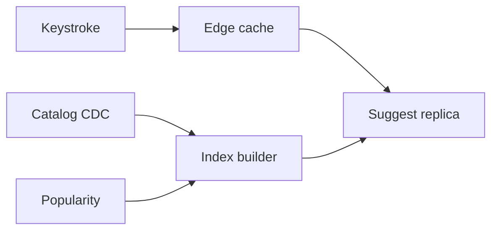

<!-- day-nav -->
[← Day 55 — Notifications](55-notifications.md) · [Day 57 — Product search →](57-product-search.md)

# Day 56 — Typeahead

**Do now**

1. Set a timer.
2. Attempt the problem. Stop at the attempt line. Do not scroll.
3. Then read.

## Time box

35 minutes.

| Minutes | Do this |
|---|---|
| 0–10 | Attempt. Prefix box. Popularity-biased suggestions. Staleness bound. |
| 10–28 | Read. If you query OLTP with LIKE 'foo%', fix the index story. |
| 28–35 | Say the index shape, how popularity enters, and max staleness after a rename. |

## Intent

Facing a prefix box, leave able to serve suggestions from a popularity-biased index and bound how stale a suggestion may be.

## Problem

> Design typeahead.
>
> As a person types into a search box, they see suggested completions. Popular completions should rank higher. New or renamed items should appear within a bound you state.

## Attempt before reading

10 minutes. Do not scroll. Not full product search (day 57). Prefix only.

Write:

1. Latency target for a keystroke (e.g. p99 < 50–100 ms).
2. Index structure for prefixes. Where popularity lives.
3. QPS: keystrokes are hotter than searches.
4. How a rename or new product enters the index; max lag.
5. Abuse: one character `a` returning half the catalog.

---

**Stop. Prefix index + popularity, edge-cached, bounded freshness.**

---

## Requirements

**In.** Suggest top **10** completions for a prefix (Unicode-aware normalization you state). Rank by popularity score with a tie break (alpha). Minimum prefix length **2** (or 1 with aggressive limits). Personalization out unless trivial recent-typed.

**Assumptions.** Catalog **10 million** suggestable strings (products, users, or queries — pick **products**). **100,000** typeahead QPS peak (keystroke stream). Popularity from 7-day counters, updated continuously but index may lag.

**Out.** Full-text search, synonyms, typo correction (optional thin), voice, multi-language morphology beyond normalization, ads in suggestions.

**Staleness.** New item searchable by prefix within **5–15 minutes**. Tombstoned/renamed strings disappear within the same bound. Say **10 minutes**.

## Estimates

100k QPS × 10 results: need an in-memory or local SSD prefix structure; primary SQL LIKE will not survive. Edge or regional replicas of the index.

Index size: 10e6 strings × avg 30 chars × structures (trie/FST/ngram) — planning **a few to tens of GB** RAM for a compact FST + top scores — fits one fat box or a sharded set by first character / hash of prefix.

Build pipeline: streaming updates from popularity and catalog CDC → rebuild segments every **N minutes** or incremental upsert.

## API and data

`GET /v1/suggest?q=widg&limit=10` → `[{text, score}]`.

**Sources:** catalog table (id, canonical name, status); popularity store `(id, score)`; **suggest index** derived.

## Design

### Online path

1. Normalize q (casefold, strip). If len < 2: empty or only branded shorts.
2. Rate limit per IP.
3. Query regional suggest replica (trie/FST/inverted prefix posting of top-K per prefix leaf).
4. Return 10. **No** live join to OLTP on the keystroke path.

### Index contents

For each prefix of length 2..K of each string (or a trie), store top M candidates by score (M≥10). Cap prefix fan-out: for prefix `a`, store only top M globally, not all matches — deep scroll is search, not typeahead.

### Freshness

CDC from catalog: delete/rename → update index within 10 minutes (incremental). Popularity: recompute scores async; index refresh **every 5 minutes** for top movers, slower for long tail. Bound: "suggestions can be 10 minutes stale."

### Cache

CDN/edge cache for popular prefixes (`wi`, `wid`, …) with **30–60 s** TTL. Invalidation not exact; bound by TTL ≤ staleness budget. Hot prefixes must not stampede origin (singleflight).

### Security / abuse

Refuse huge result materialization. Auth optional. Hide suppressed brands. Same-prefix hammering: per-IP QPS.

### Worked path: keystroke → edge → replica

1. Normalize `q`; if `len < 2` return empty (or branded allow-list).
2. Edge cache key = normalized prefix; TTL 30–60 s.
3. Miss → regional suggest replica; top 10 from precomputed top-M for that prefix.
4. No join to catalog primary. No live popularity counter read.

**Builder.** Catalog CDC + popularity snapshots → segment publish every few minutes. A rename is two ops: remove old string's prefixes, add new. Bound end-to-end ≤ 10 minutes including edge.

**Abuse.** Per-IP QPS; captcha only if product already has it — do not invent. Suppressed brands filtered at build time so they never enter top-M.

## Diagrams

Caption: "Keystroke never hits OLTP. Builder owns freshness bound."

## Failure the user sees

**Index replica down.** Fail over to another replica; or return stale edge; or empty suggestions with full search still working — empty typeahead is better than a 5 s OLTP `LIKE`. Never fall back to primary SQL on the keystroke path.

**Builder stalled 2 hours.** Staleness SLO breached; page on build age. Users see old names; renames ghost. Product still sells via full search (day 57). Admin tools read catalog primary.

**Popularity wrong.** Ranking weird but functional; not a hard outage. Exact counters are off-path; online path uses last build's scores.

**Prefix `a` without a cap.** Materializing millions of matches is an outage dressed as helpfulness. Top-M per prefix is mandatory; deep browse is search, not typeahead.

**Edge TTL longer than freshness budget.** Edge alone would show a renamed product for an hour after CDC already fixed the index. Keep edge TTL (30–60 s) **inside** the ~10 minute build bound.

## Trade-offs

**Trie/FST vs "Redis ZSET per prefix."** ZSET per prefix works at moderate scale; memory explodes with many prefixes. FST/segment files are how large typeaheads actually ship. Say access pattern first.

**Personalization.** Refused today — kills edge cache. Recents can be client-side.

**Typo tolerance.** Costs latency; day 57 territory.

**Name the refusal inside each alternative.** Against `LIKE` on the catalog at 100k QPS: you refuse an OLTP outage. Against uncapped short prefixes: you refuse catalog materialization. Against personalization on the online path: you refuse killing the edge cache. Against exact online popularity: you refuse a counter read on every keystroke. Against edge TTL as the only freshness story: you refuse a rename that ghosts for an hour.

**10× QPS.** ~1M keystroke/s. More edge + more suggest replicas; same derived index. Still no OLTP on the path.

## Talking points

**If they LIKE on MySQL.** "At 100k QPS, that is the interview mistake. Derived prefix index."

**If they ask exact popularity.** "Online path uses last build's scores. Exact counters are off-path."

**If they ask how a rename appears.** "CDC to the builder within about 10 minutes; edge may add up to a minute on top. Admin UI reads primary."

**If they ask about one-character queries.** "Empty or branded shorts only, or a hard top-M. I will not return half the catalog."

**If they ask what the user sees when suggest is down.** "Empty suggestions; search box still submits to day 57. I will not block checkout on typeahead."

## Say this in the room

Typeahead is about 100,000 keystroke QPS at peak against a derived prefix index that already stores the top completions by popularity — not LIKE on the catalog. Edge caches hot prefixes for about a minute inside a ten-minute freshness bound fed by CDC and popularity rebuilds. Short prefixes return a capped top-M so `a` cannot materialize the catalog. If the index is down I serve empty or stale edge, never a five-second OLTP fallback on the keystroke path. Personalization stays client-side so the edge cache survives.

### Staff depth: why LIKE dies and why `a` must be capped

100k QPS of `LIKE 'a%'` on 10M rows is an outage. The derived structure stores **top-M per prefix**, so short prefixes cannot materialize the catalog. Edge TTL sits **inside** the 10-minute freshness bound — edge alone does not define correctness.

**Personalization kills edge cache.** Keep recents client-side.

**Index size.** Tens of GB RAM for FST + scores is a fat box or first-character shards — plan it, do not hand-wave "Redis."

**What staff sounds like.** Keystroke path never touches OLTP; empty/stale beats a 5 s LIKE fallback; freshness bound spoken before the trie brand.

### More probes, with the answer

**"What pages?"** Name the user-visible lag or error metric from Failure — not only CPU. **"What do you refuse?"** Pick one refusal from Trade-offs and say the lie it prevents. **"What is the sensitive assumption?"** The estimate that flips the design if wrong by 10×.

## Kit artifact

| Follow-up | You answer with |
|---|---|
| "How fresh?" | Minutes-scale build bound; edge TTL inside it; no exact online popularity. |

## Design log

One line: the staleness bound you stated, and whether keystrokes hit OLTP in your attempt.

Next: [Day 57 — Product search](57-product-search.md). Inverted index, facets, write lag.

---

<!-- day-nav -->
[← Day 55 — Notifications](55-notifications.md) · [Day 57 — Product search →](57-product-search.md)
