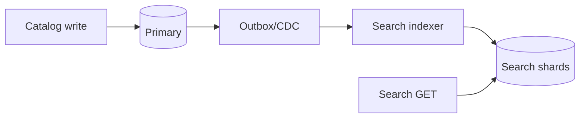

<!-- day-nav -->
[← Day 56 — Typeahead](56-typeahead.md) · [Day 58 — Video on demand →](58-video-on-demand.md)

# Day 57 — Product search

**Do now**

1. Set a timer.
2. Attempt the problem. Stop at the attempt line. Do not scroll.
3. Then read.

## Time box

40 minutes.

| Minutes | Do this |
|---|---|
| 0–12 | Attempt. Catalog search with facets. Explain lag after a write. |
| 12–32 | Read. Typeahead is not enough. Primary DB full scan is not a search engine. |
| 32–40 | Say inverted index + facets, and the bound between catalog write and searchable. |

## Intent

Facing catalog search rather than a prefix, leave able to query an inverted index with facets and explain lag after a write.

## Problem

> Design product search.
>
> Shoppers search a product catalog by keywords and filter by facets such as brand, price range, and category. A newly added or updated product should become searchable within a bound you state.

## Attempt before reading

12 minutes. Do not scroll.

Write:

1. Query API: text + facets + sort + page.
2. Index structure (inverted index). What a document contains.
3. How facets are computed without scanning every hit.
4. Write path: catalog primary vs search index; dual write vs CDC/outbox.
5. Lag: "I updated the price; search still shows old" — bound and user-visible behavior.

---

**Stop. Search replica via CDC. Facets from the index. Lag is spoken.**

---

## Requirements

**In.** Keyword search over title/description/attrs. Facets: brand, category, price bucket, availability. Page size 20. Sort by relevance or price. **Near-realtime** freshness: **≤ 1 minute** typical, **≤ 5 minutes** SLO.

**Assumptions.** **50 million** products. **5,000** search QPS peak. Catalog updates **500**/s peak. One region.

**Out.** Typeahead (day 56), personalized ranking models, image search, voice, multi-warehouse inventory truth (search may show stale availability — link to day 49/61 carefully).

## Estimates

Index size: 50e6 × ~2 KB analyzed ≈ **100 GB** order — sharded. Query 5k QPS with replica set. Update 500/s into index pipeline.

Facet explosion: high-cardinality facets (SKU) refused; brand/category ok.

## API and data

`GET /v1/search?q=&brand=&category=&price_min=&cursor=`

**Catalog primary:** source of truth for product row.

**Search documents:** `product_id`, analyzed fields, facet fields, `updated_at`, `version`.

## Design

### Query path

Query service → search cluster (inverted index). Retrieve top docs; assemble facet counts from pre-agg or docvalues. **Do not** query MySQL with OR LIKE.

Relevance: BM25-ish; say "statistically ranked term match," not a neural model.

### Indexing path

Catalog write commits to primary + outbox. Indexer consumes outbox (or CDC), applies doc upsert by version (ignore stale). Delete → tombstone remove from index.

**Refuse dual-write** app→DB and app→search without shared ordering — day 39.

### Facets

Compute from the candidate set or globally with filters applied in the engine. Price ranges as bucket fields at index time.

### Availability

If inventory is another system, search holds a **denormalized** bool/stock bucket updated async — can be wrong for minutes. Click-through rechecks truth (day 49). Say "search is not the reservation authority."

### Lag the user sees

Merchant saves title; search may show old for up to 5 minutes. Admin UI reads primary. Shopper search reads index. Support ticket: check indexer lag metric.

## Diagrams

Caption: "Primary is truth. Search is derived. Lag is the gap between them."

## Failure the user sees

**Indexer down.** Search increasingly stale; page on lag. Shoppers find old prices; checkout revalidates.

**Search cluster red.** 503 on search; category browse from primary optional degraded mode.

**Mapping explosion.** Too many dynamic fields; refuse merchant arbitrary attrs as indexed facets without a schema gate.

## Trade-offs

**Sync index on write vs async.** Sync makes write latency track search cluster — refuse for 500/s catalog with 5 min SLO.

**Exact inventory in search.** Refuse as authority; denormalize hint only.

## Talking points

**If they put search on the primary.** "Full-text on OLTP collapses under QPS and facet aggregation. Derived index."

**If they ask zero lag.** "Then search is the primary or you accept 2PC. For catalog, minutes are OK; money paths recheck."

## Say this in the room

Product search is an inverted-index cluster fed by CDC from the catalog primary, with facets stored on the documents so filters do not scan the catalog database. Writes commit to the primary first; the index can lag up to about five minutes, and I page on that lag. Availability in search is a hint — reservation still happens on the inventory authority. I refuse dual-writing the app to database and search without an outbox.

### Staff depth: search is not inventory authority

Denormalized `in_stock` in the index can be wrong for minutes. Checkout re-reserves (day 49/61). Merchant admin UI reads primary for the price they just saved; shoppers may see old price until indexer lag clears — support reads the lag metric.

**Dual-write refuse.** Outbox/CDC only (day 39).

**What staff sounds like.** Freshness SLO spoken before relevance theater; facets from the engine, not a primary GROUP BY.

## Kit artifact

| Follow-up | You answer with |
|---|---|
| "Price just changed." | Primary has it; search SLO lag; checkout re-reads truth. |

## Design log

One line: your freshness SLO, and how indexer failure shows up to a shopper.

Next: [Day 58 — Video on demand](58-video-on-demand.md). Upload → transcode → CDN.

---

<!-- day-nav -->
[← Day 56 — Typeahead](56-typeahead.md) · [Day 58 — Video on demand →](58-video-on-demand.md)
