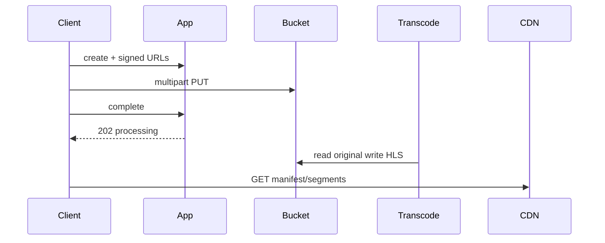

<!-- day-nav -->
[← Day 57 — Product search](57-product-search.md) · [Day 59 — Live video →](59-live-video.md)

# Day 58 — Video on demand

**Do now**

1. Set a timer.
2. Attempt the problem. Stop at the attempt line. Do not scroll.
3. Then read.

## Time box

40 minutes.

| Minutes | Do this |
|---|---|
| 0–12 | Attempt. Upload through transcode to CDN playback. Bytes off the app tier. |
| 12–32 | Read. If the app streams 4 GB files through itself, redo storage. |
| 32–40 | Say 201 vs ready-to-play, and where ABR renditions live. |

## Intent

Facing a long video, leave able to take upload through transcode to CDN playback without bytes sitting on the app tier.

## Problem

> Design video on demand.
>
> People upload a video. Viewers play it with adaptive bitrate. Playback should come from an edge, not from your application servers.

## Attempt before reading

12 minutes. Do not scroll. Day 28 image upload is the cousin; duration and ABR are new.

Write:

1. Upload: direct-to-object-store or through app?
2. When is upload "done"? When is video "playable"?
3. Transcode graph: renditions, packaging (HLS/DASH).
4. Playback path: manifest + segments on CDN.
5. Hot video egress math.

---

**Stop. Direct upload. Async transcode. CDN for manifests and segments.**

---

## Requirements

**In.** Upload up to **10 GB**, **≤ 3 hours**. Transcode to a ladder (e.g. 360p/720p/1080p). HLS or DASH. Playback via CDN. Owner delete. Status: processing | ready | failed.

**Assumptions.** **100,000** uploads/day ≈ **1.2**/s; mean size **500 MB** → **50 TB/day** ingest. Views: **50** per video life mean; hot titles dominate egress. One region origin; CDN global.

**Out.** Live (day 59), recommendations, comments, DRM deep dive (mention Widevine/FairPlay as dependency if asked), mezzanine editing suite.

## Estimates

Ingest 50 TB/day. Transcode CPU: rough **0.5–2× realtime** per rendition — pool sized for backlog, not upload ack. Egress: one viral 4 Mbps stream × 100k concurrent = **400 Gbit/s** — CDN or death.

App NIC must not see segment traffic.

## API and data

`POST /v1/videos` → upload instructions (signed PUT URLs / multipart).

`POST /v1/videos/{id}/complete` → validate object, enqueue transcode, 202.

`GET /v1/videos/{id}` metadata + `playready` + manifest URL when ready.

`GET` manifest/segments via CDN (tokenized).

Row: id, owner, state, duration, renditions[], error.

Objects: `vid/{id}/original`, `vid/{id}/hls/...`.

## Design

### Upload

Signed multipart to private bucket. App never buffers the 10 GB. Complete: head object, size check, virus scan optional async, commit row `processing`, outbox job.

### Transcode

Workers pull original, produce renditions + playlist, write segments, set `ready`. Idempotent by derived keys. Poison file → `failed`, keep original for debug.

### Playback

CDN in front of segment bucket (or packager). Manifest short TTL; segments long immutable cache. Token auth on manifest if private content.

### Delete

Row delete + detach job for objects; CDN purge best-effort; segment immutability means old URLs may work until TTL/purge — tokens should expire.

## Diagrams

Caption: "App authorizes. Bytes skip the app. Play from edge."

## Failure the user sees

**Transcode backlog.** Upload complete; spinner on play until ready. Page on queue age. Original not playable unless you offer progressive mezzanine (usually no).

**CDN origin miss storm on premiere.** Prefetch popular; autoscale origin shield. App still not in path.

**Bucket down on upload.** Complete fails; no processing state.

## Trade-offs

**Client-side vs server-side packaging.** Server ladder controls quality; client upload of all renditions burns user bandwidth — refuse for consumer VOD.

**Ready before all renditions.** Allow play with subset (360p first) — better UX; say it.

## Talking points

**If bytes through app.** "10 GB × concurrent uploads melts us. Signed PUT."

## Say this in the room

Uploads go direct to object storage with signed multipart; complete enqueues transcode and returns 202 until HLS renditions exist. Playback is CDN-fronted manifests and immutable segments — a viral title is an edge problem, maybe hundreds of gigabits, never an app NIC problem. Transcode is idempotent on derived keys; failures mark failed without lying that the video is ready. Delete tombs the row and detaches objects asynchronously.

### Staff depth: ready vs complete, and viral egress

202 on complete means original durable and job queued — not playable. First ladder rung may unlock play before 1080p finishes — say it.

Viral: 100k concurrent × 4 Mbps ≈ **400 Gbit/s** — CDN or death. App never serves segments.

**Delete vs immutable segments.** Tokens expire; purge is best-effort; do not promise instant global unavailability.

**What staff sounds like.** Direct upload, async ladder, edge playback, idempotent derived keys.

## Kit artifact

| Follow-up | You answer with |
|---|---|
| "When can I play?" | State ready after first playable ladder; not on upload complete. |

## Design log

One line: whether upload bytes touched the app in your attempt, and the ready vs complete distinction.

Next: [Day 59 — Live video](59-live-video.md). Ingest, ABR, start stampede.

---

<!-- day-nav -->
[← Day 57 — Product search](57-product-search.md) · [Day 59 — Live video →](59-live-video.md)
