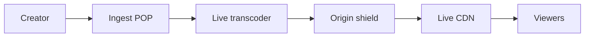

<!-- day-nav -->
[← Day 58 — Video on demand](58-video-on-demand.md) · [Day 60 — Nearby →](60-nearby.md)

# Day 59 — Live video

**Do now**

1. Set a timer.
2. Attempt the problem. Stop at the attempt line. Do not scroll.
3. Then read.

## Time box

40 minutes.

| Minutes | Do this |
|---|---|
| 0–12 | Attempt. Live ingest, ABR, stampede when the stream starts. |
| 12–32 | Read. VOD packaging is not live. DVR buffer is optional and named. |
| 32–40 | Say ingest path, glass-to-glass lag target, and start-of-stream protection. |

## Intent

Facing a live stream, leave able to ingest with adaptive bitrate and survive the stampede when the stream starts.

## Problem

> Design live video.
>
> A creator goes live. Viewers watch with adaptive bitrate. When a popular creator starts, many viewers join at once.

## Attempt before reading

12 minutes. Do not scroll.

Write:

1. Ingest protocol (RTMP/WebRTC/SRT) to what tier.
2. Transcode/packaging for live ABR; latency target (2–15 s vs sub-second).
3. Viewer join path; CDN for live.
4. Stampede when "LIVE" flips: metadata, manifests, chat (optional).
5. Disconnect and resume; what recording becomes VOD.

---

**Stop. Ingest edge → transcoder → live CDN. Protect the start stampede.**

---

## Requirements

**In.** Creator ingest. Server ABR ladder. Viewers via HLS/LL-HLS or similar with **glass-to-glass ~5–15 s** (sub-second is a different product). Concurrent viewers up to **5 million** for top events. Optional DVR window **30–120 minutes**. End → optional VOD asset (day 58).

**Assumptions.** **10,000** concurrent live streams, most tiny; **10** huge. Peak join rate at event start **100k connects/s** for a minute.

**Out.** Ultra-low-latency betting, bidirectional interactive AV as primary, full chat redesign (pointer to day 54).

## Estimates

One 1080p source ~5 Mbps ingest. 5e6 viewers × 3 Mbps avg ≈ **15 Tbit/s** egress — CDN only. Join stampede: manifest QPS and auth service must shed/cache.

## API and data

Creator: allocate stream key; publish to ingest DNS.

Viewer: `GET /v1/streams/{id}` → status + playback URL.

Stream row: state idle|live|ended, ingest region, current playlist epoch.

## Design

### Ingest

Geo ingest POP terminates RTMP/SRT; forwards to transcoder farm; health on bitrate. Key auth. One active publisher per stream id (kick old on conflict or refuse second).

### Package + CDN

Transcoder emits live HLS segments short duration; CDN caches with short TTL / cache-as-you-go. Sticky midgress shields origin.

### Start stampede

1. "Going live" flips state in metadata with high fan-out cache (like day 50 hot key) + push notify (day 55) **throttled**.
2. Manifest URLs are CDN-cached; origin shielded.
3. Auth tokens JWTs minted with short TTL; token service sized for join spike or pre-issued.
4. Join shedding: queue / waiting room when capacity exceeded (day 70 cousin) — return retry-after.

### Failure

Ingest disconnect: hold "live" briefly (e.g. 15–30 s) for reconnect; then ended. Viewers see stall then ended. Recording finalize to VOD async.

### Staff arithmetic: egress and join spike

5e6 viewers × 3 Mbps ≈ **15 Tbit/s** — if that number surprises anyone, the design is already wrong (API serving media). Join spike 100k connects/s for a minute is mostly **metadata + auth + manifest**, not a new transcoder per viewer. Size the token service and put manifests behind CDN with origin shield; shed joins with Retry-After when capacity is gone (waiting room).

Reconnect grace **15–30 s** so a mobile blip does not end the stream. After grace: `ended`, finalize optional VOD async (day 58 path). Dual publishers: one active key; second connect kicks or 409 — say which.

### Worked path: go-live minute

1. Creator "soon live" → pre-warm ingest assignment; optional pre-mint viewer tokens for notified followers.
2. First media → state `live`; celebrity-recent-style hot cache for `GET stream` metadata.
3. Viewers hit CDN manifest; origin shield absorbs miss stampede.
4. Over capacity → 429/503 with Retry-After waiting room (day 70 cousin), not unlimited connects into melted auth.

**Chat.** Attach day-54 room id on the stream row; do not invent a second fan-out theory mid-interview.

## Diagrams

Caption: "Bytes never return to the API tier. API is state and keys."

## Failure the user sees

**Transcoder death.** Brief stall; failover may show a GOP discontinuity. Viewers hard-refresh. Page on ingest health and segment publish lag, not on API 200 rates.

**CDN regional issue.** Viewers in region buffer; others fine. Failover to another POP if the CDN offers it — still not your app tier.

**Metadata hot key "is live".** Singleflight + in-process (day 50). False **idle** stops joins while the creator is live — prefer fail toward "live" with playback retry if package not ready yet. False **live** with no segments: players spin; show "starting" from package health.

**Auth service melts at go-live.** Pre-issue tokens when "soon live," or cache JWTs validation keys everywhere; shed with Retry-After rather than 500 storms.

**Ingest blip longer than grace.** Stream ends; VOD finalize may be partial. Creator restart is a new session or resume policy you state.

## Trade-offs

**LL-HLS vs standard HLS.** Lower latency, more requests, harder cache. Pick based on stated lag (~5–15 s today).

**DVR.** Storage and complexity; refuse unless asked.

**Name the refusal inside each alternative.** Against VOD-style single MP4 upload for live: you refuse wrong semantics. Against API-tier media: you refuse terabit egress. Against no join shedding: you refuse melting auth/manifest origin at go-live. Against sub-second interactive as the default: you refuse a different product. Against ending on first packet loss: you refuse mobile reality — take reconnect grace.

**10× viewers.** Still CDN. Stampede controls grow; transcoder count tracks concurrent **streams**, not viewers.

## Talking points

**If they reuse VOD upload.** "Live is continuous segments and reconnect semantics, not one MP4."

**If they ask glass-to-glass.** "About 5–15 seconds with HLS. Sub-second is WebRTC/LL territory and a different deep dive."

**If they ask what melts first at go-live.** "Is-live metadata, token mint, manifests — not the transcoder count per viewer."

**If they ask about chat.** "Day 54 room alongside; do not redesign chat inside live unless time remains."

**If they ask about recording.** "Optional finalize to VOD when ended; same day-58 playback path."

## Say this in the room

Creators publish to a regional ingest POP with a stream key; transcoders produce a live ABR ladder that a CDN serves to viewers — five million concurrent at 3 Mbps is about 15 terabits, an edge egress problem, not an app problem. Glass-to-glass is about 5–15 seconds with HLS. The start stampede is mostly metadata, auth, and manifests: hot-key cache, origin shield, pre-issued tokens when we can, and join shedding with Retry-After when capacity is gone. Ingest blips get a 15–30 second reconnect grace before we mark ended and finalize optional VOD.

### Staff depth: go-live is a metadata stampede

Bytes already planned for CDN. The spike is "is live", auth tokens, and manifests. Origin shield + hot-key cache + join shedding with Retry-After. Prefetch packaging when "soon live" if product allows.

**Reconnect grace 15–30 s** so mobile blips do not end the stream. Then finalize optional VOD.

**One publisher.** Second ingest gets 409 or kick — say it so two encoders do not fork the ladder.

**What staff sounds like.** Glass-to-glass target stated; 15 Tbit/s said once; stampede controls named without redesigning VOD upload.

### More probes, with the answer

**"What pages?"** Name the user-visible lag or error metric from Failure — not only CPU. **"What do you refuse?"** Pick one refusal from Trade-offs and say the lie it prevents. **"What is the sensitive assumption?"** The estimate that flips the design if wrong by 10×.

## Kit artifact

| Follow-up | You answer with |
|---|---|
| "Everyone joins at once." | Manifest/auth stampede controls + CDN shield + shed joins. |

## Design log

One line: your latency target, and one concrete stampede control at go-live.

Next: [Day 60 — Nearby](60-nearby.md). Geo index, staleness, privacy.

---

<!-- day-nav -->
[← Day 58 — Video on demand](58-video-on-demand.md) · [Day 60 — Nearby →](60-nearby.md)
