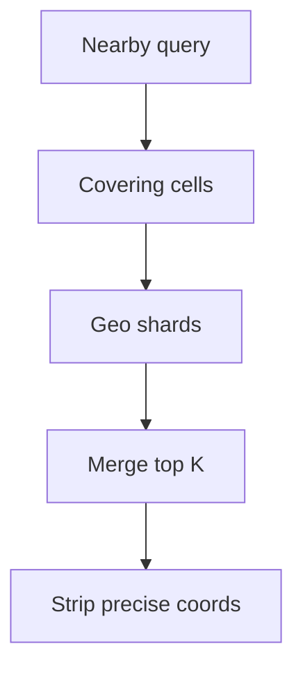

<!-- day-nav -->
[← Day 59 — Live video](59-live-video.md) · [Day 61 — Ticket booking →](61-ticket-booking.md)

# Day 60 — Nearby

**Do now**

1. Set a timer.
2. Attempt the problem. Stop at the attempt line. Do not scroll.
3. Then read.

## Time box

35 minutes.

| Minutes | Do this |
|---|---|
| 0–10 | Attempt. What is near me. Index, staleness, privacy. |
| 10–28 | Read. If you leak precise location in logs or responses, fix it. |
| 28–35 | Say the geo index, freshness of movers, and what you refuse to store. |

## Intent

Facing "what is near me," leave able to index points, bound staleness, and avoid leaking a precise location.

## Problem

> Design nearby.
>
> A person asks for points of interest or people around them. Results should be close to their location. Precise location should not leak beyond what the product needs.

## Attempt before reading

10 minutes. Do not scroll.

Write:

1. Query: radius or "nearest K". Latency target.
2. Index: geohash/S2/quad tree — pick one and justify.
3. Moving points (drivers) vs static POIs — update rate.
4. Privacy: precision stored, precision returned, retention.
5. Hot downtown query QPS.

---

**Stop. Geo index with quantized location. Movers update with a bound. Privacy is a requirement, not an appendix.**

---

## Requirements

**In.** Static POIs and optionally moving entities. Query: nearest K within radius R. Results include coarse distance band, not micrometer coordinates of other users.

**Assumptions.** **50 million** POIs; **1 million** movers updating every **5–30 s** when active. Query **20,000**/s peak in dense cities.

**Out.** Full turn-by-turn maps, traffic ML, stalker-ready live sharing without consent controls.

**Privacy.** Store movers at **~100–200 m** quantization for matching unless the product is navigation for that user (their own precise location may stay on device or short TTL). Other users' exact coords never in client responses. Audit logs scrub.

## Estimates

Mover updates: 1e6 / 10 s = **100k**/s peak write — needs a hot geo store, not a single Postgres table with earthdistance for everything.

Queries 20k/s: in-memory/geo-replicated index shards by region.

## API and data

`GET /v1/nearby?lat=&lng=&r=&k=` with auth. Server may reduce precision of input for logging.

POI: id, cell_id, attrs. Mover: id, cell_id, updated_at, status.

## Design

### Index

S2/geohash cells; shard by coarse cell. Query fans out to cells covering radius; merge by distance on quantized centers. Cap r and k.

### Movers

Update writes new cell; TTL soft-delete if stale (>2× update period). Clients see last known coarse position within staleness SLO (**15–60 s**).

### Privacy controls

- Response: bearing/distance bucket, never raw lat/lng of strangers.
- Storage: quantized; precise ephemeral only for self-navigation session.
- Rate limit nearby queries to reduce stalking.
- Opt-in visibility for people nearby.

### Dense downtown

Hot cells: cache top POIs; movers in separate hotter store. Shed huge r.

### Staff arithmetic: mover writes and downtown reads

1e6 movers × update every 10 s ≈ **100k writes/s** into the geo store — that is why movers are not "a Postgres table with earthdistance" alone. Queries 20k/s in dense cities hit hot cells: cache static POIs; keep movers in a hotter path; **cap radius** so a 50 km downtown query cannot fan out to hundreds of cells.

Distance on quantized centers is approximate — good enough for "nearby," wrong for surveying. Say the quantization (~100–200 m for people) as both a privacy and a correctness bound.

### Worked path: downtown query

1. Auth + rate limit; cap `r` and `k`.
2. Cover query circle with S2/geohash cells at chosen resolution.
3. Parallel get static POIs (cached) + movers from hot store for those cells.
4. Merge by distance on quantized centers; scrub foreign coordinates to distance bands; return.

**Self vs other.** Request may include precise self location for ranking; logs store reduced precision. Other people never leave the server as lat/lng.

## Diagrams

Caption: "Cell fan-out, then privacy scrub before the client."

## Failure the user sees

**Stale movers.** Ghost cars; empty street. Show "location may be up to Xs old" (15–60 s SLO). TTL soft-delete if update older than ~2× period — a mover that stopped updating must disappear, not park forever.

**Shard down.** Regional hole; **503 for that area**, not an empty list that looks like "nothing nearby." Empty and outage must differ.

**Privacy leak.** Other users' raw lat/lng in JSON or logs — treat as a Sev-1 product bug, not a style nit. Scrub on the read path; reduce precision in logs.

**Stalking via query hammering.** Rate limit per account/IP; require opt-in for people-nearby; refuse uncapped r/k.

**Huge radius.** Fan-out across too many cells; latency blows. Hard cap r (e.g. 5–10 km for people, larger for POIs if product needs) and k.

## Trade-offs

**Precise vs quantized storage.** Quantized for people-nearby; precise for own session only (device or short TTL).

**Postgres vs dedicated geo.** Static POIs can live in PG with indexes; movers need purpose-built write path.

**Name the refusal inside each alternative.** Against returning strangers' lat/lng: you refuse a stalking API. Against precise storage of all movers forever: you refuse a retention and leak magnet. Against uncapped radius: you refuse downtown meltdown. Against one PG box for 100k mover writes/s: you refuse a known cliff. Against "empty" when the shard is dead: you refuse masking an outage as no results.

**10× movers.** ~1M writes/s — more geo shards by coarse cell; same privacy scrub. Query caps stay.

## Talking points

**If they return other users' lat/lng.** "Privacy bug. Distance bands only."

**If they ask geohash vs S2.** "Either; I need cell cover of radius, shard by coarse cell, merge by approximate distance. The brand matters less than fan-out and scrub."

**If they ask how fresh drivers are.** "Update every 5–30 s when active; soft-delete after ~2× period; UI bound 15–60 s."

**If they ask about their own navigation blue dot.** "Precise can stay on device or short-TTL server session. That is not what we return about other people."

**If they ask what pages.** "Mover write lag, query p99 in hot cells, and — separately — any response analytics that show raw foreign coordinates (should be zero)."

## Say this in the room

Nearby queries hit a cell-based geo index sharded by region — geohash or S2 — with radius capped and results merged by approximate distance on quantized centers. About a million movers updating every ten seconds is roughly 100k writes a second into a hot geo store, not a single earthdistance table. Static POIs are colder and cacheable downtown. I store and return quantized locations for other people, never raw coordinates, scrub logs, and rate-limit queries so the API is not a stalking tool. A dead shard is a 503 for that area, not an empty list.

### Staff depth: privacy is a read-path scrub

Quantize movers for matching (~100–200 m). Responses return distance bands, never strangers' lat/lng. Rate-limit nearby to reduce stalking. Opt-in for people-nearby.

**Hot downtown.** Cache static POIs; movers in a hotter store; cap radius.

**Stale vanish.** Soft-delete movers that miss ~2× update period so ghosts do not park forever.

**What staff sounds like.** 100k mover writes/s said once; cell fan-out plus scrub; empty≠outage; refuse precise leaks in logs too.

### More probes, with the answer

**"What pages?"** Name the user-visible lag or error metric from Failure — not only CPU. **"What do you refuse?"** Pick one refusal from Trade-offs and say the lie it prevents. **"What is the sensitive assumption?"** The estimate that flips the design if wrong by 10×.

## Kit artifact

| Follow-up | You answer with |
|---|---|
| "How precise?" | Quantization for others; self precise only with short TTL / on device. |

## Design log

One line: your cell scheme and the privacy scrub you put on the response.

Next: [Day 61 — Ticket booking](61-ticket-booking.md). Assigned seats, hold TTL — not day 49 inventory.

---

<!-- day-nav -->
[← Day 59 — Live video](59-live-video.md) · [Day 61 — Ticket booking →](61-ticket-booking.md)
