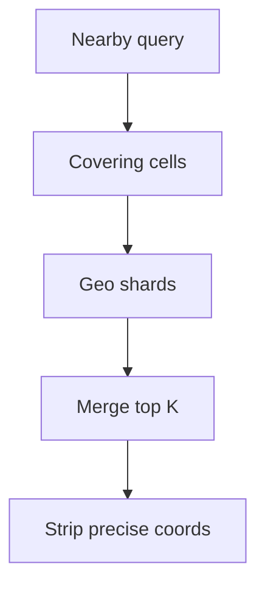

<!-- day-nav -->
[← Day 59 — Live video](59-live-video.md) · [Day 61 — Ticket booking →](61-ticket-booking.md)

# Day 60 — Nearby

**Do now**

1. Set a timer.
2. Attempt the problem. Stop at the attempt line. Do not scroll.
3. Then read.

## Time box

35 minutes.

| Minutes | Do this |
|---|---|
| 0–10 | Attempt. What is near me. Index, staleness, privacy. |
| 10–28 | Read. If you leak precise location in logs or responses, fix it. |
| 28–35 | Say the geo index, freshness of movers, and what you refuse to store. |

## Intent

Facing "what is near me," leave able to index points, bound staleness, and avoid leaking a precise location.

## Problem

> Design nearby.
>
> A person asks for points of interest or people around them. Results should be close to their location. Precise location should not leak beyond what the product needs.

## Attempt before reading

10 minutes. Do not scroll.

Write:

1. Query: radius or "nearest K". Latency target.
2. Index: geohash/S2/quad tree — pick one and justify.
3. Moving points (drivers) vs static POIs — update rate.
4. Privacy: precision stored, precision returned, retention.
5. Hot downtown query QPS.

---

**Stop. Geo index with quantized location. Movers update with a bound. Privacy is a requirement, not an appendix.**

---

## Requirements

**In.** Static POIs and optionally moving entities. Query: nearest K within radius R. Results include coarse distance band, not micrometer coordinates of other users.

**Assumptions.** **50 million** POIs; **1 million** movers updating every **5–30 s** when active. Query **20,000**/s peak in dense cities.

**Out.** Full turn-by-turn maps, traffic ML, stalker-ready live sharing without consent controls.

**Privacy.** Store movers at **~100–200 m** quantization for matching unless the product is navigation for that user (their own precise location may stay on device or short TTL). Other users' exact coords never in client responses. Audit logs scrub.

## Estimates

Mover updates: 1e6 / 10 s = **100k**/s peak write — needs a hot geo store, not a single Postgres table with earthdistance for everything.

Queries 20k/s: in-memory/geo-replicated index shards by region.

## API and data

`GET /v1/nearby?lat=&lng=&r=&k=` with auth. Server may reduce precision of input for logging.

POI: id, cell_id, attrs. Mover: id, cell_id, updated_at, status.

## Design

### Index

S2/geohash cells; shard by coarse cell. Query fans out to cells covering radius; merge by distance on quantized centers. Cap r and k.

### Movers

Update writes new cell; TTL soft-delete if stale (>2× update period). Clients see last known coarse position within staleness SLO (**15–60 s**).

### Privacy controls

- Response: bearing/distance bucket, never raw lat/lng of strangers.
- Storage: quantized; precise ephemeral only for self-navigation session.
- Rate limit nearby queries to reduce stalking.
- Opt-in visibility for people nearby.

### Dense downtown

Hot cells: cache top POIs; movers in separate hotter store. Shed huge r.

## Diagrams

Caption: "Cell fan-out, then privacy scrub before the client."

## Failure the user sees

**Stale movers.** Ghost cars; empty street. Show "location may be up to Xs old."

**Shard down.** Regional hole; 503 for that area, not wrong points from empty.

## Trade-offs

**Precise vs quantized storage.** Quantized for people-nearby; precise for own session only.

**Postgres vs dedicated geo.** Static POIs can live in PG with indexes; movers need purpose-built.

## Talking points

**If they return other users' lat/lng.** "Privacy bug. Distance bands only."

## Say this in the room

Nearby queries hit a cell-based geo index sharded by region — geohash or S2 — with radius capped and results merged by approximate distance. Movers update on the order of every ten seconds into a hot store with a staleness bound; static POIs are colder. I store and return quantized locations for other people, never raw coordinates, and I rate-limit queries so the API is not a stalking tool. Dense downtown cells get caching and separate mover handling so one city does not melt the cluster.

### Staff depth: privacy is a read-path scrub

Quantize movers for matching (~100–200 m). Responses return distance bands, never strangers' lat/lng. Rate-limit nearby to reduce stalking. Opt-in for people-nearby.

**Hot downtown.** Cache static POIs; movers in a hotter store; cap radius.

**What staff sounds like.** Cell fan-out plus scrub; staleness of movers spoken; refuse precise leaks in logs too.

## Kit artifact

| Follow-up | You answer with |
|---|---|
| "How precise?" | Quantization for others; self precise only with short TTL / on device. |

## Design log

One line: your cell scheme and the privacy scrub you put on the response.

Next: [Day 61 — Ticket booking](61-ticket-booking.md). Assigned seats, hold TTL — not day 49 inventory.

---

<!-- day-nav -->
[← Day 59 — Live video](59-live-video.md) · [Day 61 — Ticket booking →](61-ticket-booking.md)
