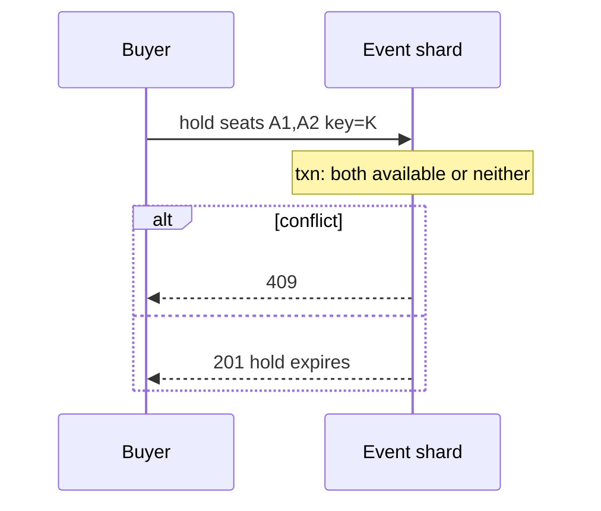

<!-- day-nav -->
[← Day 60 — Nearby](60-nearby.md) · [Day 62 — Metrics ingestion →](62-metrics-ingestion.md)

# Day 61 — Ticket booking

**Do now**

1. Set a timer.
2. Attempt the problem. Stop at the attempt line. Do not scroll.
3. Then read.

## Time box

40 minutes.

| Minutes | Do this |
|---|---|
| 0–12 | Attempt. Assigned seats. Hold with TTL. No venue-wide lock. No oversell. |
| 12–32 | Read. Day 49 was fungible units. Today each seat is unique. Day 70 is the flash queue — not required if arrival fits. |
| 32–40 | Say how a seat is held, what the map read sees, and how payment boundaries work. |

## Intent

Facing assigned seats, leave able to hold specific seats with a TTL so you neither oversell nor lock the whole venue.

## Problem

> Design ticket booking for assigned seats.
>
> A venue has a seating map. A buyer picks specific seats and holds them while checking out. Two buyers must not get the same seat. Holds expire.

## Attempt before reading

12 minutes. Do not scroll.

Write:

1. Seat states: available, held, sold.
2. Hold API: multi-seat atomicity in one order.
3. Map read: can it be slightly stale?
4. Hot seat (front row) concurrency — conditional updates vs venue lock.
5. Relation to day 49 inventory and day 70 flash sale.

---

**Stop. Per-seat conditional hold. Order groups seats. Map is cacheable with care.**

---

## Requirements

**In.** Events with seat maps (**1k–50k** seats). Hold **1–8** seats for **5–10 minutes**. Commit on paid (payment outside — day 65). Release on cancel/expiry. Idempotent holds.

**Assumptions.** **100** events on sale; peak **2,000** hold attempts/s on a hot event; one section hotter. One region.

**Out.** Dynamic pricing engine, resale marketplace, ADA complexity beyond a seat attribute, flash waiting room unless numbers demand (day 70).

## Estimates

50k seats × 100 events = 5M seat rows — small. Correctness is hot-row contention on popular seats, not storage. Hold attempts 2k/s; each touches 1–8 rows in one transaction on the event's seat shard.

## API and data

`POST /v1/events/{id}/holds` `{seat_ids:[], idempotency_key}` → 201 hold_id, expires_at or 409 with conflicts.

`POST /v1/holds/{id}/commit` / `cancel`.

`GET /v1/events/{id}/map` → seat statuses (may lag **1–2 s**).

Seat row: `(event_id, seat_id)`, state, hold_id, expires_at. Partition by `event_id`.

## Design

### Hold transaction

On event leader/shard: for all seat_ids, conditional update `available → held` with hold_id and expiry **only if available**. If any fails, roll back all (transaction) and 409 listing conflicts. Insert hold row + idempotency.

**Refuse** locking the whole venue row. **Refuse** checking seats in app then writing — race.

### Map reads

Cache map snapshots **1 s** or stream invalidations per section. Stale "available" that 409s on hold is OK. Stale "held" that blocks another buyer briefly is false scarcity.

### Sweeper

Same as day 49: expire holds → available. State guard vs commit race.

### Payment

Reserve/hold → pay → commit. Hold TTL > payment budget. Crash window: paid but uncommitted → recovery commits (day 49 payment paragraph).

### vs day 49 / 70

Fungible qty vs unique seats. Flash queue when hold QPS or fairness needs it — not default at 2k/s.

### Staff arithmetic: contention, not storage

5M seat rows is nothing. The cliff is **2,000 hold attempts/s** on one hot event, each CAS-updating 1–8 seats in one transaction on the event shard. A venue-wide lock makes every balcony buyer wait on the front-row fight — refuse it. Map cache at 1–2 s means false "green" → 409 on hold (OK) vs false "red" (false scarcity). Hold TTL (5–10 min) must exceed payment budget; paid-but-uncommitted recovery commits (day 49/65). At hundreds of arrivals/s onto one section, consider day-70 admission — not default at 2k/s if the shard keeps up.

### Worked path: hold two seats

1. Idempotency lookup; if key exists return prior hold.
2. Begin txn on event shard: for each seat, `UPDATE ... SET held WHERE available`.
3. Any miss → rollback → 409 with conflicting ids.
4. Else write hold row + expiry; commit; 201.
5. Map cache may still show green for ~1 s; next hold gets 409.

**Commit after pay.** Payment webhook/ success → `held→sold` if hold valid; else refund. Sweeper only flips `held→available` when `expires_at < now` AND state still held.

## Diagrams

Caption: "All-or-nothing on the named seats. No venue lock."

## Failure the user sees

**Two buyers one seat.** Second 409 with conflicting seat ids. Map may still show available for 1–2 s — user taps, gets 409, picks another. That is correct contention, not data loss.

**Leader/shard down for the event.** Holds 503, **not** 409 empty venue. 409 would teach "sold out" when you cannot know. Page on hold 503s per event.

**Sweeper vs pay race.** Sweeper releases; pay path commits — state guard wins for commit if still held; if already available, recovery must not invent seats (day 49). User who paid gets seats or an automatic refund path you name.

**Idempotent retry of hold.** Same key returns the same hold_id and expiry; must not double-hold different seats.

**Partial selection without a transaction.** A1 held, A2 fails, user thinks they have a pair — refuse; all-or-nothing in one txn.

## Trade-offs

**Atomic multi-seat vs best-effort partial.** Atomic — partial holds anger users mid-checkout.

**Exact map vs cached.** Cached with seconds of lag.

**Name the refusal inside each alternative.** Against venue-wide lock: you refuse balcony latency tied to front-row fights. Against check-then-set in the app: you refuse a race that double-sells. Against salting seat ids: you refuse breaking uniqueness. Against hold TTL shorter than pay budget: you refuse charging for seats you already released. Against treating 503 as 409: you refuse fake sellouts during elections.

**10× hold attempts.** ~20k/s on a hot event — shard by event still; may need section-level leaders or day-70 waiting room. Unique seat CAS stays the correctness tool.

## Talking points

**If they lock the venue.** "Hot seat must not stop the balcony."

**If they salt seats.** "Seat identity is the key; salting breaks uniqueness."

**If they ask vs day 49.** "Fungible qty vs named seats. Same sweeper/commit guard shape; different row shape."

**If they ask about the map lying.** "1–2 s lag: false available → 409 is OK. False held that blocks others is false scarcity — keep map TTL short."

**If they ask what happens after pay succeeds and commit crashes.** "Recovery looks up payment intent and commits the hold if still valid; else refund. Hold TTL must outlive that window."

## Say this in the room

Assigned seats are conditional updates on `(event, seat)` rows inside one transaction so a hold of A1 and A2 is all-or-nothing — not a venue-wide lock and not an app-level check-then-set. At 2,000 hold attempts a second on a hot event the fight is row contention, not storage of 50k seats. Holds expire with a sweeper and a state guard against commit, same shape as warehouse reservation but the SKU is a unique seat. The map can lag a second and show false availability that becomes 409 on hold; leader loss is 503, not a fake sellout. Payment stays outside; the hold must outlive the payment budget so we never release seats we already charged for.

### Staff depth: unique seats vs fungible qty

Day 49 increments a counter; day 61 CAS-updates named seat rows in one transaction (all-or-nothing for the selection). Venue-wide lock is forbidden. Map lag → false availability → 409 on hold is OK; false "sold" briefly is false scarcity.

**Payment boundary.** Hold TTL > pay budget; recovery commits if paid (day 49/65). Flash queue only if arrivals exceed what the event shard can CAS (day 70).

**Idempotency.** Hold key returns the same hold; retries must not grab a second set of seats.

**What staff sounds like.** Conditional multi-seat txn, sweeper vs commit guard, 503 not 409 on leader loss, hold TTL vs pay budget spoken together.

### More probes, with the answer

**"What pages?"** Name the user-visible lag or error metric from Failure — not only CPU. **"What do you refuse?"** Pick one refusal from Trade-offs and say the lie it prevents. **"What is the sensitive assumption?"** The estimate that flips the design if wrong by 10×.

## Kit artifact

| Follow-up | You answer with |
|---|---|
| "Same seat twice?" | Conditional multi-seat txn; 409; no venue lock. |

## Design log

One line: how multi-seat atomicity worked in your attempt, and how it differed from day 49.

Next: [Day 62 — Metrics ingestion](62-metrics-ingestion.md). Firehose with cardinality limits.

---

<!-- day-nav -->
[← Day 60 — Nearby](60-nearby.md) · [Day 62 — Metrics ingestion →](62-metrics-ingestion.md)
