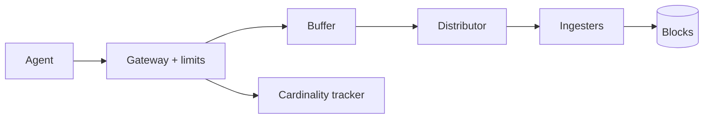

<!-- day-nav -->
[← Day 61 — Ticket booking](61-ticket-booking.md) · [Day 63 — Mock: job scheduler →](63-mock-job-scheduler.md)

# Day 62 — Metrics ingestion

**Do now**

1. Set a timer.
2. Attempt the problem. Stop at the attempt line. Do not scroll.
3. Then read.

## Time box

35 minutes.

| Minutes | Do this |
|---|---|
| 0–10 | Attempt. Firehose of measurements. Cardinality limit so one tenant cannot blow the store. |
| 10–28 | Read. If unbounded label combos are allowed, the store dies. |
| 28–35 | Say the write path, aggregation, and how you enforce cardinality. |

## Intent

Facing a firehose of measurements, leave able to ingest points with a cardinality limit so one tenant cannot blow the store.

## Problem

> Design metrics ingestion.
>
> Services send time-series metrics with labels. You store them for later query and alerting. One noisy tenant must not be able to create infinite series and take the system down.

## Attempt before reading

10 minutes. Do not scroll. Query/alerts are day 64.

Write:

1. Wire format and auth (tenant).
2. Write path: buffer, shard, durable store.
3. What a series key is; cardinality definition.
4. Enforcement when tenant exceeds series budget.
5. Out-of-order / duplicate points.

---

**Stop. Tenant-scoped cardinality. Append-optimized TSDB path. Shed new series hard.**

---

## Requirements

**In.** Multi-tenant push of gauges/counters/histograms. Retention raw **15 days**, downsampled longer (query day). Per-tenant series limit (e.g. **100k–1M** active series). At-least-once delivery from agents.

**Assumptions.** **10 billion** points/day ≈ **116k**/s average, **~500k**/s peak. **5,000** tenants; one whale.

**Out.** Full PromQL surface today, log ingestion, tracing backend, day-64 alert rules deep dive.

## Estimates

500k points/s × 20 bytes compressed ≈ **10 MB/s** — fine; **cardinality** and index of series keys is the cliff. 1e9 series × metadata kills memory.

## API and data

`POST /v1/metrics/write` protobuf/HTTP, tenant key.

Series identity: `tenant + metric_name + ordered labels`.

Store: time-partitioned chunks per series; separate series catalog with counts per tenant.

## Design

### Ingest path

Gateway auth → validate → buffer (queue) → distributors hash by series → ingesters → object/block storage. Ack after durability bar you state (WAL quorum).

### Cardinality control

Track active series per tenant (approx OK with HF counts). On new series insert: if over limit → **reject point** or drop labels into `overflow` bucket — prefer **429/400 with metric** so the customer fixes. Existing series continue. Page tenant owners; do not let one tenant create 50M series overnight.

Relabel / drop rules at gateway for known bad patterns (`user_id` on metric labels).

### Duplicates / order

Same timestamp+series: last write wins or first — say it. Out-of-order window bounded (e.g. 1 h); older rejected or sent to repair path.

### Staff arithmetic: points are cheap, series are not

500k points/s × ~20 bytes compressed ≈ **10 MB/s** — networking is not the story. Active series metadata is: if a tenant invents `user_id` as a label, series count explodes toward hundreds of millions and the inverted index / catalog RAM dies. Per-tenant budget (100k–1M active series) enforced on **new** series at the gateway; existing series keep accepting points. Reject with a clear error (429/400 + metric) — silent drop hides the bug for weeks. Out-of-order window (e.g. 1 h) stated; older samples rejected or repaired offline.

### Worked path: point with a new label combo

1. Gateway authenticates tenant; parses series key.
2. If series known → forward to distributor.
3. If new → check active-series budget; over → 429 with `cardinality_exceeded`; under → create + forward.
4. Ingester appends to WAL/quorum; ack.
5. Relabel config may drop `user_id` before step 2 so the series never exists.

**Whale.** Tenant-local limit trips first. Global series emergency limit protects the cluster if many tenants spike together.

## Diagrams

Caption: "Limits before fan-out. New series are the scarce resource."

## Failure the user sees

**Tenant over card.** New series fail; dashboards miss new pods until they drop labels. Old series keep writing — the tenant sees a **partial** outage of discovery, not a total write black hole. Page the tenant; do not page the whole site as "ingest down."

**Ingester down.** Quorum write may 503; agents retry. Gaps possible — scrape/retry semantics on the agent. Durability bar (WAL quorum) stated on ack.

**Whale tenant.** One of 5,000 tenants tries 50M series overnight — gateway fuse trips; other tenants unaffected if limits are per-tenant. Global fuse also exists as a last resort.

**Silent drop misconfiguration.** Cardinality "fixed" by dropping points — customer thinks metrics work; weeks later cardinality still wrong. Prefer explicit reject.

**Out-of-order flood.** Mis-set clocks write ancient samples; bounded window rejects them so a bad agent cannot rewrite history forever.

## Trade-offs

**Exact vs approx card counts.** Approx can admit slightly over; exact is hotter. Prefer protect-the-store.

**Reject vs silent drop.** Reject — silent drop hides cardinality bugs.

**Name the refusal inside each alternative.** Against unlimited label combos: you refuse catalog RAM death. Against silent drop as the default fuse: you refuse hiding the customer's bug. Against treating point QPS as the scarce resource: you refuse missing the real cliff. Against one shared budget for all tenants: you refuse a noisy neighbor (day 22). Against unbounded out-of-order: you refuse rewrite storms.

**10× points.** ~5M/s — more distributors/ingesters; **same** card budgets. Cardinality fuse does not loosen because bytes grew.

## Talking points

**If they index every label forever.** "That is how tenants melt you. Budgets and gateway drop rules."

**If they ask what the scarce resource is.** "Active series, not points. 10 MB/s is easy; 1e9 series metadata is not."

**If they ask how a new pod appears when over budget.** "It does not until they drop labels or raise the limit. Existing series still write."

**If they ask about ack durability.** "After WAL quorum (or your stated bar). Agents retry on 503 — at-least-once; duplicates last-write-wins for the same timestamp."

**If they ask about query.** "Day 64. Today I keep the firehose from becoming an unbounded index."

## Say this in the room

Ingest is a buffered, hash-sharded write path into a time-series store, but the scarce resource is active series — not raw points. Half a million points a second is about 10 MB/s compressed; a billion series of metadata is a different planet. Each tenant has a hard cardinality budget enforced at the gateway on new series creation so one customer cannot invent infinite label combos overnight. Existing series still accept points; over-budget new series get a clear error, not a silent drop. Duplicates and a bounded out-of-order window have an explicit rule. Query and alerts are tomorrow; today I keep the firehose from becoming an unbounded index.

### Staff depth: series are the scarce resource

500k points/s is easy compressed; **1e9 series** of metadata is not. Per-tenant active-series budget at the gateway on **new** series; existing series keep writing. Reject with a clear error — silent drop hides the bug.

**Drop rules.** Ban `user_id` as a metric label at ingest.

**Noisy neighbor.** Per-tenant limits; global emergency fuse. Whale cannot take the cluster alone.

**What staff sounds like.** Cardinality fuse before naming TSDB brands; out-of-order window stated; reject not silent drop.

### More probes, with the answer

**"What pages?"** Name the user-visible lag or error metric from Failure — not only CPU. **"What do you refuse?"** Pick one refusal from Trade-offs and say the lie it prevents. **"What is the sensitive assumption?"** The estimate that flips the design if wrong by 10×.

## Kit artifact

| Follow-up | You answer with |
|---|---|
| "Tenant explodes labels." | Gateway card limit; reject new series; drop-rule examples. |

## Design log

One line: your per-tenant series limit and whether you reject or silently drop.

Next: [Day 63 — Mock: job scheduler](63-mock-job-scheduler.md). Closed book — not this week's search/video/geo/tickets/metrics.

---

<!-- day-nav -->
[← Day 61 — Ticket booking](61-ticket-booking.md) · [Day 63 — Mock: job scheduler →](63-mock-job-scheduler.md)
