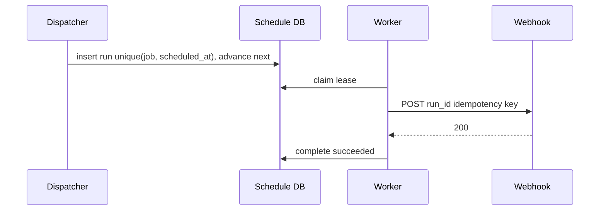
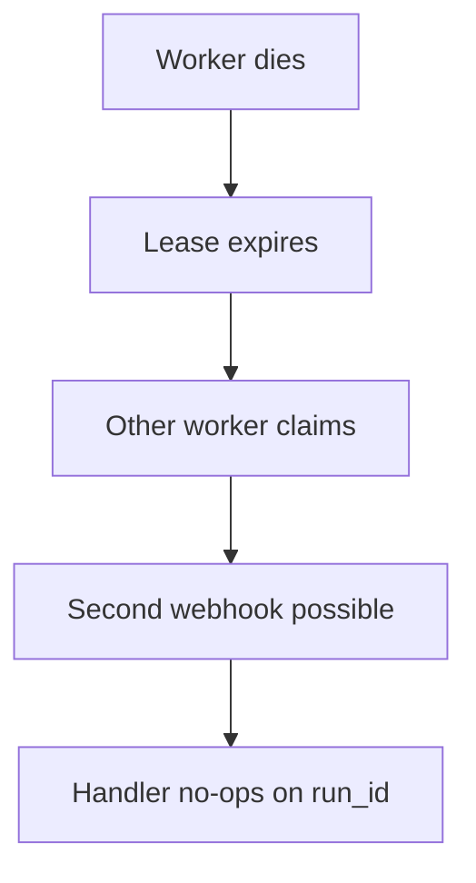

<!-- day-nav -->
[← Day 62 — Metrics ingestion](62-metrics-ingestion.md) · [Day 64 — Metrics query and alerts →](64-metrics-query-and-alerts.md)

# Day 63 — Mock: job scheduler

**Do now**

1. Set a timer.
2. Attempt the problem. Stop at the attempt barrier.
3. Then read.

## Time box

35 minutes for the attempt, then 10 minutes to score and log. The 10 minutes are not part of the interview clock. Do not use them to keep designing.

## Intent

Facing an unseen problem, leave able to design a job scheduler with leases, missed fires, and duplicate runs, not this week's search, video, location, ticket, or metrics lessons.

## How to run

- Blank paper. No notes, no days 50–62, no search, no chat.
- The only card you may have open is the [job scheduler problem](../prompts/job-scheduler.md) in the problem bank (`prompts/`). It does not help you.
- Do not scroll past the attempt barrier. The rubric is above the barrier so you can score. The design is below it.
- This is not product search, not VOD, not nearby, not seats, and not metrics ingest. If you notice yourself designing an inverted index or a CDN ladder, stop and design the scheduler.
- Timer visible. At zero you stop, even mid-arrow.
- Score, then write the log from **your** page, then scroll.

Score what the product does, not which lesson you recognized. A complete page says when a job runs, what happens if the worker dies mid-run, and what happens if the same fire is delivered twice. If one of those is missing, that is a gap. Log it. Do not scroll to find the missing piece.

If you already scrolled, close the page. Run the mock tomorrow from memory, or it measures nothing.

## Timer

| Clock | You are doing | You are not doing |
|---|---|---|
| 0:00–5:00 | What schedule means, what a run returns, missed fire policy. Non-goals. | A tour of cron syntax |
| 5:00–10:00 | How many jobs, how often they fire, how long a run lasts. Peak. | Metrics cardinality from day 62 |
| 10:00–16:00 | API and the row. Lease, run id, idempotency of a fire. | Seat maps or search indexes |
| 16:00–26:00 | Schedule path and worker claim path, separate. | One global lock for all jobs |
| 26:00–33:00 | One deep dive: worker death, clock skew, or duplicate delivery. | Every Phase 4 product, copied in |
| 33:00–35:00 | What you did not build, and the 10× break. | A second product |

## Problem

> Design a job scheduler.
>
> Users define jobs that must run on a schedule. The system fires each run near the planned time, retries failures, and must not leave a job stuck if a worker dies mid-run. The same scheduled fire must not do the side effect twice if the worker retries.

That is the entire problem. Thirty-five minutes. Blank page. No notes.

## Rubric

Same six dimensions as day 7. Score 1–4 from your page only. A senior-shaped interview is mostly 3s. A staff-shaped interview is a 4 on the deep dive and a 4 on failure, not more boxes.

### Requirements

| Score | Anchor |
|---|---|
| 1 | Components first. No non-goals. |
| 2 | Behaviors listed. Constraints are adjectives. |
| 3 | Behavior, constraints, and non-goals locked before the design. The questions you asked would have changed the model. |
| 4 | As a 3, and each non-goal is a product you refused, with a reason. |

### Estimates

| Score | Anchor |
|---|---|
| 1 | No numbers, or one QPS with no numerator. |
| 2 | Numbers exist. Units or assumptions are missing. |
| 3 | Jobs, fire rate, run duration, workers. Average and peak. Assumptions spoken. |
| 4 | As a 3, plus the assumption you trust least, and a 10× move tied to a named limit. |

### API and data

| Score | Anchor |
|---|---|
| 1 | No API. The database brand is the model. |
| 2 | Endpoints exist. Lease, run identity, or missed-fire behavior is vague. |
| 3 | Create/update schedule, claim/complete run, a real key for a fire, defined missed-fire policy. |
| 4 | As a 3, plus a retry that cannot double-apply the side effect, and a distinction you refused to blur (missed vs delayed vs running). |

### Design

| Score | Anchor |
|---|---|
| 1 | A technology tour, or boxes that ignore the numbers. |
| 2 | A plausible system that double-fires, or that sticks forever when a worker dies. |
| 3 | The smallest design that meets the numbers. Leases expire. A fire has an idempotent run identity. Missed fires have a stated policy. |
| 4 | As a 3, and clock skew is named, and you can say what the user sees when the dispatcher is down. |

### Deep dive

| Score | Anchor |
|---|---|
| 1 | You cannot go past the boxes. |
| 2 | Under a push, the answer is a product name. |
| 3 | One dive, with a choice and a cost. |
| 4 | The dive uses arithmetic or a concrete fault. You can name what it did not solve. |

### Failure and ops

| Score | Anchor |
|---|---|
| 1 | "We'll have replicas," and no user-visible behavior. |
| 2 | A dependency is named. Impact is fuzzy. |
| 3 | One dependency down. What the job owner sees. What runs already started. What you page on. |
| 4 | As a 3, plus the crash window you still have after the mitigation you drew. |

Do not average these into one vanity number. The log wants the six scores and **one** gap.

## Attempt first

Do the 35 minutes now.

When the timer stops:

1. Score the six dimensions from the anchors above. Evidence is a phrase on your paper.
2. Copy [design-log/TEMPLATE.md](../design-log/TEMPLATE.md) somewhere private. Fill it from your attempt. Scores are final once written.
3. Only then cross the barrier.

---

# Attempt barrier

You are about to read a reference design for a job scheduler.

If your timer has not hit zero, go back up. If your design log is not filled, go back up. Below is a reference, not search with the nouns swapped, and not a CDN. Use it for one amendment line. Do not edit the scores.

---

## Reference design

One legal design, at interview depth. Yours can differ and still be a 3. It is not a 3 if two workers both apply the same fire's side effect with no idempotency, if a dead worker leaves a job leased forever, or if "cron" is a single process without a durable schedule.

### What this is not

Not day 57 search. Not day 58/59 video. Not day 60 geo. Not day 61 seats. Not day 62 metrics ingest. Those may share queues and leases as **ideas**; the product is scheduled work with side effects.

Not a distributed OS. Not Kubernetes as the answer ("use CronJob") without saying lease, miss policy, and exactly-once **effects** (you will only get at-least-once delivery + idempotent handlers).

### Requirements

**In.** Create/update/delete a job with a schedule (cron or fixed interval), a target (HTTP webhook or queue payload — pick **HTTP callback** with signed requests), and per-fire timeout. Fires should start within **± a few seconds** of plan under health (state **30 s** lag SLO). Missed fires while the system was down: policy **catch up once** (catch-up) or **skip to next** — pick **skip with a missed mark** for sparse jobs; **catch-up capped** (e.g. max 3 missed) for intervals. Workers are your fleet claiming runs.

**Assumptions.** **1 million** jobs. Median interval **5 minutes** → rough fire rate 1e6 / 300 ≈ **3,300**/s average if all 5-minute — too hot; more realistic mix: **100,000** active jobs averaging **1 fire/minute** → ≈ **1,700**/s. Use **2,000**/s average fires, **6,000**/s peak. Mean run **2 s** CPU/IO. One region.

**Out.** DAG workflows (Airflow clone), exactly-once side effects without handler help, ultra-subsecond scheduling, multi-region active-active dispatch, calendar UI.

**Codes.** Claim conflict: another worker has the lease — try another run. Callback 5xx: retry with backoff inside the run record. Callback 2xx: success. Duplicate callback with same `run_id`: handler must no-op (you document; you also send an idempotency key).

### Estimates

2,000 fires/s × 2 s ≈ **4,000** concurrent runs (Little's law). Peak 6,000/s → **12,000** concurrent. Worker pool: if one worker handles 50 concurrent callbacks, need ~**240** workers at peak — order of magnitude, not a shopping list.

Schedule index: next-fire times for 100k–1M jobs — a sorted structure or `WHERE next_fire_at <= now()` on a partitioned table, polled by dispatchers.

**10×.** 20k fires/s → 40k concurrent; dispatcher and lease DB become the hotspot. Shard jobs by `job_id` hash so dispatchers own slices.

Sensitive assumption: mean run duration. If runs are 60 s, concurrency multiplies by 30.

### API and data

`POST /v1/jobs` schedule + webhook URL + secret → 201 job_id.

`POST /v1/jobs/{id}/pause|resume`.

Internal workers: `POST /v1/runs/claim` (or pull from partition queue) → run payload with `run_id`, `job_id`, `scheduled_at`, `lease_until`.

`POST /v1/runs/{id}/heartbeat` extends lease.

`POST /v1/runs/{id}/complete` `{status, error}`.

**Job row:** id, cron/interval, webhook, state, `next_fire_at`, version.

**Run row:** `run_id` (opaque, unique), `job_id`, `scheduled_at` (the fire's identity), state `leased|running|succeeded|failed|missed`, `lease_owner`, `lease_until`, attempt.

**Unique constraint** on `(job_id, scheduled_at)` so the same logical fire cannot insert twice.

### Dispatch and lease

Dispatchers (sharded by job id range) periodically select due jobs (`next_fire_at <= now()`), for each: insert run with `scheduled_at` truncated to the planned tick, advance `next_fire_at`, commit. If insert conflicts on unique, someone already created that fire — skip.

Runs go to a queue or are claimed via `UPDATE ... WHERE state=leased AND lease_until < now() OR free`. Worker sets `lease_owner`, `lease_until = now()+30s`, heartbeat every 10 s. On complete, terminal state. If lease expires, another worker may claim — **at-least-once**. Side effect safety is the webhook **idempotency key = run_id** (and `scheduled_at`).

### Missed fires

If dispatcher was down for 10 minutes, jobs have `next_fire_at` in the past. Policy: **skip**: set `next_fire_at` to next future tick; write a `missed` run record for observability. Or **catch-up capped**: enqueue up to N missed `scheduled_at` values. Say which; **skip** is safer for "send email every hour" than firing 10 emails at once.

### Clocks

Dispatchers use **max(wall, last_seen)** carefully; prefer DB `now()` for due comparison so app clock skew does not double-fire. Workers' lease times also from DB time. NTP assumed; skew of minutes is a page, not a protocol.

### Failure

**Worker death.** Lease expires ≤30 s; another worker claims; duplicate webhook possible → run_id idempotency. Crash window: side effect happened, complete not written → duplicate delivery. Handler must tolerate.

**Dispatcher down.** Fires lag; miss policy applies on recovery. Page on `max(now - next_fire_at)` for active jobs.

**Webhook slow.** Lease heartbeats must continue or lease expires and duplicate workers call — handler idempotency again; also concurrency limit per job (max 1 running) via unique running state.

**Fence.** Two dispatchers for same shard without leadership: unique `(job_id, scheduled_at)` is the fence on insert. Without it, double fire.

### Diagrams you should have had

Caption: "Unique fire identity. Lease for liveness. Idempotent side effect. Point at the unique insert as the double-dispatch fence."

Caption: "At-least-once delivery. Exactly-once effects need the handler. If your diagram ends at the second webhook without idempotency, redraw."

### Failure the user sees, per person

**Job owner, dispatcher lag 2 minutes.** Runs late; dashboard shows delay. Not silently skipped unless past miss policy. Page on `max(now - next_fire_at)` for active jobs — that is the user-visible "cron is late" signal.

**Worker dies after webhook 200 before complete.** Second worker retries webhook; owner must be idempotent — else double charge / double email. You document `run_id` as the key. This is the classic crash window: side effect happened, durable complete did not.

**Paused job.** No new fires; in-flight finishes or cancels per policy you state. User expects pause to mean "no more side effects soon" — bound in-flight drain.

**Lease stuck forever.** If heartbeats continue on a wedged worker that never completes, the run never reclaims — max run wall-clock must kill the lease. Without it, one bad worker pins a job forever.

**Catch-up storm after outage.** Ten missed hourly emails fire at once if catch-up is uncapped — refuse; default skip with missed marks, or cap N.

**10× fire rate.** Shard dispatchers; lease DB write capacity named. Little's law: if mean run becomes 60 s, concurrency ×30 — sensitive assumption.

### Trade-offs you should have named

**Skip vs catch-up.** Skip avoids stampedes after outages; catch-up needed for some accounting jobs — product choice per job.

**Queue vs DB claim.** Queue scales claim QPS; DB claim is simpler at 2k/s. At 10× prefer queue with the run row still authoritative.

**Exactly-once scheduler myth.** You refuse it. At-least-once + idempotent handlers.

**Name the refusal inside each alternative.** Against a single process cron: you refuse a SPOF with no durable next_fire_at. Against exactly-once delivery without handler help: you refuse a lie. Against uncapped catch-up: you refuse a stampede of side effects after repair. Against lease without heartbeat/TTL: you refuse forever-stuck runs. Against Kafka-only as the schedule: you refuse losing pause/miss policy.

### Probes the interviewer will use, with the answer

**"Worker dies mid-run?"** "Lease expires; another claims; webhook may fire twice; run_id is the idempotency key."

**"Two dispatchers?"** "Unique (job_id, scheduled_at) insert; loser no-ops."

**"Missed hour?"** "Skip with missed record, or capped catch-up — I pick per job type; default skip for fan-out emails."

**"Why not only Kafka?"** "Need durable next_fire_at, pause, and miss policy. The log alone is not the schedule."

**"How many workers?"** "Little's law: 6,000 fires/s × 2 s ≈ 12,000 concurrent; at 50 concurrent callbacks per worker ≈ 240 workers — order of magnitude."

**"Clock skew?"** "Due comparison uses DB now(); lease times too. App NTP skew of minutes is a page, not a new protocol."

### What you did not need

Search indexes. Seat maps. Geo cells. Video CDNs. Metrics cardinality budgets as the deep dive — though "max runs concurrent" is capacity of the same family.

## Say this in the room

About two thousand fires a second average with two-second runs is about four thousand in flight — about twelve thousand at six thousand fires a second peak, hundreds of workers if each handles tens of concurrent callbacks. Each job has a next_fire_at; dispatchers shard the due set and insert a run keyed by (job_id, scheduled_at) so the same tick cannot double-insert, then advance next. Workers claim with a lease and heartbeat; if a worker dies the lease expires and another may call the webhook again, so the run_id is the idempotency key for the side effect — I do not promise exactly-once delivery. After an outage I skip missed ticks by default and mark them, unless the job opts into capped catch-up. I page on dispatcher lag, not on a single cron process, and I refuse an uncapped catch-up storm.

### Staff depth: lease + unique fire id are the whole game

Without `(job_id, scheduled_at)` uniqueness, two dispatchers double-fire. Without leases, dead workers pin runs forever or you get uncontrolled duplicates. Idempotency on the webhook is mandatory because the crash window after a 200 is real.

**Sensitive assumption.** Mean run duration. 2 s → 4k concurrent at 2k fires/s; 60 s → 120k concurrent. Say it before shopping for workers.

**What staff sounds like.** Little's law once, unique fire id, lease TTL, skip-by-default miss policy, refuse exactly-once as a scheduler promise.

### After you read this

One amendment line: the concrete miss (no lease, no unique fire id, forever stuck running, catch-up storm, exactly-once claimed without handler help). Leave the scores alone.

Next: [Day 64 — Metrics query and alerts](64-metrics-query-and-alerts.md). Graphs and pages — not ingest.

---

<!-- day-nav -->
[← Day 62 — Metrics ingestion](62-metrics-ingestion.md) · [Day 64 — Metrics query and alerts →](64-metrics-query-and-alerts.md)
