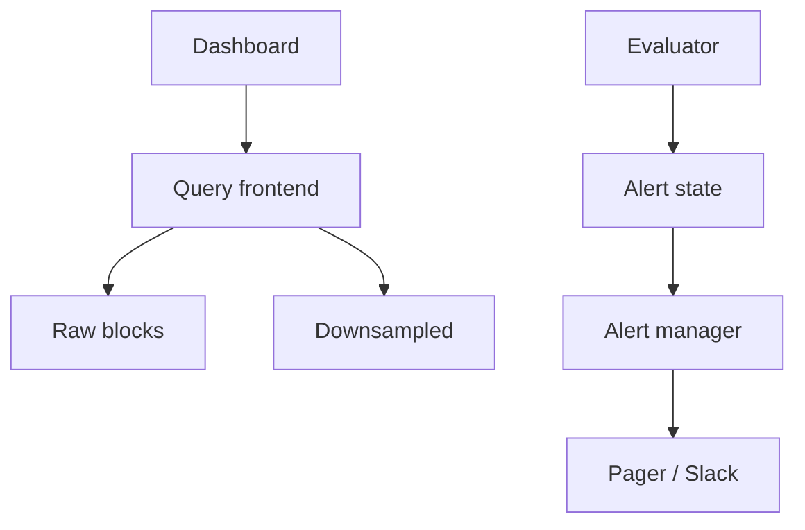

<!-- day-nav -->
[← Day 63 — Mock: job scheduler](63-mock-job-scheduler.md) · [Day 65 — Payments →](65-payments.md)

# Day 64 — Metrics query and alerts

**Do now**

1. Set a timer.
2. Attempt the problem. Stop at the attempt line. Do not scroll.
3. Then read.

## Time box

40 minutes.

| Minutes | Do this |
|---|---|
| 0–12 | Attempt. Graphs and alerts on stored series. Stop one rule from paging on every blip. |
| 12–32 | Read. Ingest was day 62. Today is read path, downsample, and alert fatigue. |
| 32–40 | Say how a dashboard query is served, and how alerts debounce/flap. |

## Intent

Facing graphs and pages rather than ingest, leave able to query downsampled series and stop one alert rule from paging on every blip.

## Problem

> Design metrics query and alerts.
>
> People open dashboards of time-series graphs. Alert rules page a human when a condition holds. A noisy rule must not page on every blip.

## Attempt before reading

12 minutes. Do not scroll.

Write:

1. Query API: range, step, aggregations.
2. Where raw vs downsampled data lives; which the UI hits for 7-day vs 6-hour views.
3. Alert evaluation loop; pending → firing → resolved.
4. Flapping: hysteresis, for-duration, silence, grouping.
5. One bad rule × 10,000 series — cardinality of alerts.

---

**Stop. Downsampled read path. Alert state machine with for-duration. Group pages.**

---

## Requirements

**In.** Range queries with aggregations (sum/avg/p99 over labels). Dashboards at **1–5 s** interactive budget for typical panels. Alerts: threshold/ Prom-like expressions, `for: 5m`, notify Slack/Pager. Silences. Retention: raw 15d, 1m/5m rolls longer (day 62).

**Assumptions.** **50k** dashboard QPS peak? No — **5k** panel queries/s peak more realistic. **20,000** alert rules; eval every **15–30 s**. One region.

**Out.** Building the ingest path again, log search, full anomaly ML.

## Estimates

Eval: 20k rules × scrape of matched series — must index rules carefully; naive Cartesian explodes. Alert managers handle **thousands** of active alerts, not millions of pages/minute.

## API and data

`GET /v1/query_range?query=&start=&end=&step=`

Alert rule store; alert instance state `(rule_id, fingerprint) → pending|firing`.

Notify outbox.

## Design

### Query

Query frontend fans to queriers; choose resolution by range (6h → raw/1s; 30d → 5m). Compactor downsamples in background. Cache recent dashboard queries briefly.

### Alerts

Evaluator loads rules, computes expression over window. **Pending** until `for` duration continuous breach → **firing** → notify. Resolve when clear for a duration. **Hysteresis**: fire at 90%, resolve at 70% optional.

**Grouping / aggregation:** page once per `{alertname, service}` not per replica. Repeat notifications spaced (e.g. 4h).

**Bad rule protection:** max series matched per rule; max alerts created per eval; circuit-break the rule; page the rule owner.

### Failure

Querier down: dashboards 503; alerts may use separate path. Alert manager down: buffer eval or risk delayed pages — page on alert-manager lag. Never let eval stall ingest (already separate).

## Diagrams

Caption: "Reads choose resolution. Alerts are a state machine, not a raw threshold on every sample."

## Failure the user sees

**Flapping CPU.** Without `for`, pages every 30 s — fatigue. With `for: 5m`, only sustained.

**Rule matches 1e6 series.** Shed; disable rule; page owner.

**Downsample lag.** Long-range graphs under-count briefly — say bound.

## Trade-offs

**Eval in query engine vs separate.** Separate so dashboards cannot starve pages.

**Exact p99 on downsampled.** Impossible — refuse lying; store histograms.

## Talking points

**If they page on every sample.** "That is a blip pager. for-duration + group."

## Say this in the room

Dashboards hit a query path that picks raw or downsampled blocks based on the time range so a thirty-day graph does not scan fifteen days of one-second samples. Alerts are evaluated on a loop into a pending/firing state machine with a for-duration, hysteresis if needed, and grouping so one bad service pages once, not once per replica. A rule that expands to a million series gets a hard cap and is disabled rather than melting the notifier. Ingest stays isolated — a dashboard stampede must not stop alert eval, and vice versa.

### Staff depth: for-duration is the anti-flap

A CPU blip every 30 s without `for: 5m` pages forever. Group by service so one outage is one page. Cap series matched per rule; circuit-break Cartesian explosions.

**Downsample honesty.** p99 on 5m averages is a lie — store histograms or refuse the panel.

**What staff sounds like.** State machine + grouping + rule caps; isolate eval from dashboard stampedes.

## Kit artifact

| Follow-up | You answer with |
|---|---|
| "Too many pages." | for-duration, group, silence, rule series cap. |

## Design log

One line: your for-duration and how you stop a Cartesian rule explosion.

Next: [Day 65 — Payments](65-payments.md). Authorize, capture, idempotent ledger.

---

<!-- day-nav -->
[← Day 63 — Mock: job scheduler](63-mock-job-scheduler.md) · [Day 65 — Payments →](65-payments.md)
