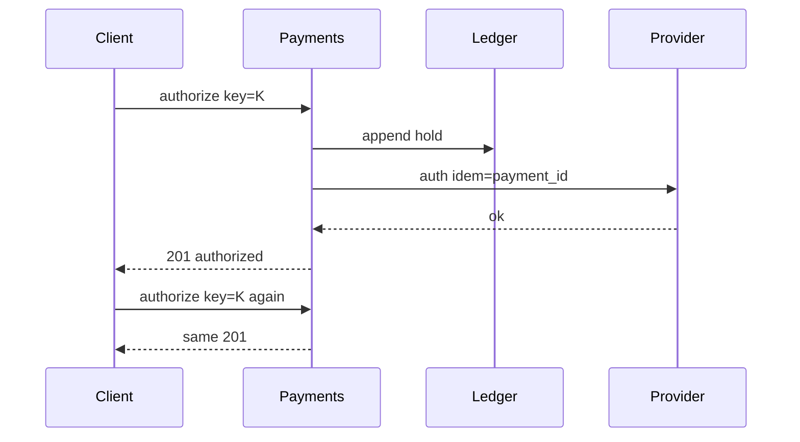

<!-- day-nav -->
[← Day 64 — Metrics query and alerts](64-metrics-query-and-alerts.md) · [Day 66 — Payment reconciliation →](66-payment-reconciliation.md)

# Day 65 — Payments

**Do now**

1. Set a timer.
2. Attempt the problem. Stop at the attempt line. Do not scroll.
3. Then read.

## Time box

40 minutes.

| Minutes | Do this |
|---|---|
| 0–12 | Attempt. Authorize and capture against an idempotent ledger. Retry must not move money twice. |
| 12–32 | Read. If the ledger append is not idempotent, you failed. Provider calls need keys too. |
| 32–40 | Say ledger entries, idempotency keys, and auth vs capture. |

## Intent

Facing money movement, leave able to authorize and capture against an idempotent ledger so a retry cannot move money twice.

## Problem

> Design payments.
>
> A buyer pays for an order. You authorize a card (or similar), then capture when the order is firm. Retries and timeouts must not charge the buyer twice.

## Attempt before reading

12 minutes. Do not scroll. Reconciliation is day 66.

Write:

1. States: created → authorized → captured / voided / failed.
2. Idempotency keys on client, on provider, on ledger.
3. What the ledger row is; append-only?
4. Timeout after authorize request: am I charged?
5. Partial capture / multi-capture — in or out?

---

**Stop. Ledger first. Provider second with idempotent keys. Auth ≠ capture.**

---

## Requirements

**In.** Authorize, capture, void/refund (thin). Amounts in minor units + currency. Idempotency key required on mutating APIs. Ledger of money movements per merchant/customer account.

**Assumptions.** **1,000** payments/s peak. Providers: one PSP (Stripe-shaped). One region for ledger authority.

**Out.** Full multi-PSP smart routing, crypto, ledger for securities (day 74), day-66 reconciliation deep dive (name the need).

## Estimates

1k/s ledger appends — single primary or sharded by merchant. Money correctness > horizontal fashion.

## API and data

`POST /v1/payments/authorize` `{order_id, amount, currency, payment_method, idempotency_key}`

`POST /v1/payments/{id}/capture` `{amount?, idempotency_key}`

**Payment row:** state, amounts, provider_refs, keys.

**Ledger entries:** append-only `(account_id, entry_id)`, amount signed, payment_id, type. Balance = sum (or cached with care).

## Design

### Authorize

1. Idempotency store: same key → same payment id/result.
2. Insert payment `created`.
3. Call PSP with **provider idempotency key** derived from payment id.
4. On success: ledger hold entry (or auth hold), state `authorized`, 201.
5. On uncertain timeout: leave `unknown` / pending; recovery queries PSP by key — **do not** retry authorize with a new key.

### Capture

Conditional on `authorized`. PSP capture with key. Ledger capture entry. State `captured`. Second capture same key: same result.

### Never

Compute "charge" by toggling a mutable balance without a ledger entry. Dual-write balance and provider without ledger. New idempotency key on client retry after timeout.

### Crash windows

Authorized in PSP, local state not updated → recovery poll PSP. Captured locally, PSP uncertain → poll; never capture with new key.

### Staff arithmetic: unknown is a state

Authorize returns success / decline / **unknown** (timeout). Unknown is not "retry with a new idempotency key" — that double-charges. Retry the **same** key until the provider answers or a reconciliation path (day 66) decides. Capture is a second call on a prior auth; void/cancel if capture will not happen. Ledger (your books) is written **before** or in careful order with provider calls — never "provider succeeded, we crashed before ledger" without a recovery story. At checkout QPS of hundreds to low thousands, the cliff is correctness under retries, not NIC.

## Diagrams

Caption: "Same key returns the same money movement. Provider key tied to payment id."

## Failure the user sees

**Timeout on authorize.** Client retries; if you minted a new key, two auths — double hold on the card. Same key → provider returns the first result. User sees one charge path.

**Capture after auth expired.** Provider declines; order must not ship. Ledger shows auth voided/expired.

**Ledger write fails after provider success.** Recovery job finds provider success by idempotency key and completes ledger — or day 66 recon. User must not see "paid" in provider and "unpaid" forever in your app without a ticket.

**Provider outage.** New checkouts 503/unknown; do not pretend decline. Queue and retry with same keys.

**Refund race.** Refund before capture settles — define state machine; refuse silent no-ops without audit.

## Trade-offs

**Auth+capture vs auth-only then capture.** Auth+capture for simple digital goods; separate for delayed fulfillment.

**Ledger-first vs provider-first.** Prefer intent/ledger row first with state `pending`, then provider, then `authorized` — crash windows become recoverable.

**Name the refusal inside each alternative.** Against new idempotency key on retry: you refuse double auth. Against treating unknown as decline: you refuse lying to the user and possibly shipping unpaid. Against provider success without ledger recovery: you refuse money you cannot see. Against refund without audit entries: you refuse an unverifiable books change.

**10× checkout.** More payment workers; same idempotency and ledger rules. Provider rate limits become the ceiling — shed gracefully.

## Talking points

**If they retry with a new key.** "That is how you double-charge. Same key until terminal state."

**If they ask auth vs capture.** "Auth holds; capture takes money. Delayed ship → separate capture. Digital → often auth+capture together."

**If they ask what unknown means in the UI.** "Pending payment — not failed. Poll or webhook; recon if stuck."

**If they ask about PCI.** "Use a provider token / hosted fields; your servers never see PAN. Out of deep dive unless asked."

**If they ask ledger shape.** "Append-only entries (day 66); balances are projections."

## Say this in the room

Payments are a ledger-first state machine: create an intent with an idempotency key, authorize with that key, then capture or void — timeouts are unknown, not a cue to mint a new key. A retry with a new key is how you double-hold a card. The provider can succeed while we crash before the ledger write; recovery and reconciliation (day 66) close that window. I refuse treating unknown as declined, and I refuse shipping on auth alone when capture is still required.

### Staff depth: unknown is a state, not a retry with a new key

Same idempotency key until success/decline/void. Unknown → poll/webhook/recon. Ledger append; balances derived.

**Crash windows.** (1) before provider call — safe retry same key; (2) after provider success before ledger — recovery; (3) after ledger before user 201 — user retries, idempotent read of intent.

**What staff sounds like.** Naming the three crash windows; refusing new keys on retry; auth≠capture spoken.

### More probes, with the answer

**"What pages?"** Name the user-visible lag or error metric from Failure — not only CPU. **"What do you refuse?"** Pick one refusal from Trade-offs and say the lie it prevents. **"What is the sensitive assumption?"** The estimate that flips the design if wrong by 10×.

## Kit artifact

| Follow-up | You answer with |
|---|---|
| "Timeout on authorize." | Unknown state; poll provider by key; never new key. |

## Design log

One line: your idempotency story across client, ledger, and provider.

Next: [Day 66 — Payment reconciliation](66-payment-reconciliation.md). Fix mismatch without rewriting history.

---

<!-- day-nav -->
[← Day 64 — Metrics query and alerts](64-metrics-query-and-alerts.md) · [Day 66 — Payment reconciliation →](66-payment-reconciliation.md)
