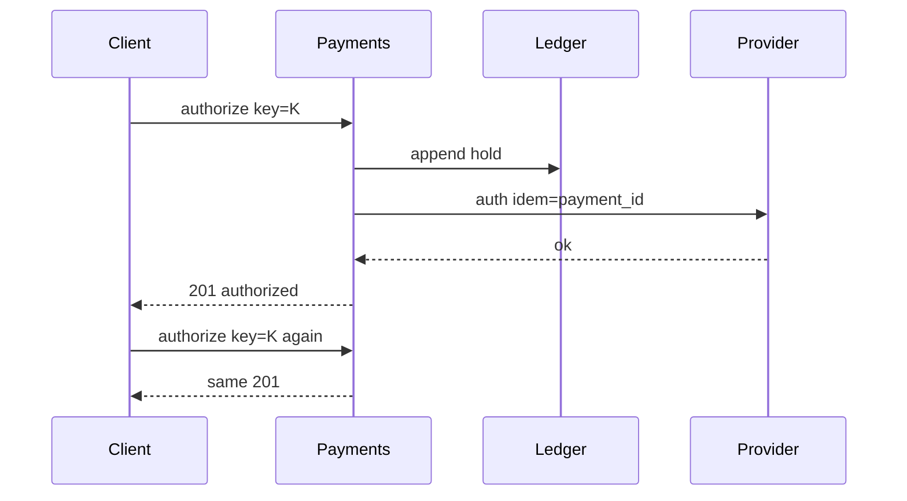

<!-- day-nav -->
[← Day 64 — Metrics query and alerts](64-metrics-query-and-alerts.md) · [Day 66 — Payment reconciliation →](66-payment-reconciliation.md)

# Day 65 — Payments

**Do now**

1. Set a timer.
2. Attempt the problem. Stop at the attempt line. Do not scroll.
3. Then read.

## Time box

40 minutes.

| Minutes | Do this |
|---|---|
| 0–12 | Attempt. Authorize and capture against an idempotent ledger. Retry must not move money twice. |
| 12–32 | Read. If the ledger append is not idempotent, you failed. Provider calls need keys too. |
| 32–40 | Say ledger entries, idempotency keys, and auth vs capture. |

## Intent

Facing money movement, leave able to authorize and capture against an idempotent ledger so a retry cannot move money twice.

## Problem

> Design payments.
>
> A buyer pays for an order. You authorize a card (or similar), then capture when the order is firm. Retries and timeouts must not charge the buyer twice.

## Attempt before reading

12 minutes. Do not scroll. Reconciliation is day 66.

Write:

1. States: created → authorized → captured / voided / failed.
2. Idempotency keys on client, on provider, on ledger.
3. What the ledger row is; append-only?
4. Timeout after authorize request: am I charged?
5. Partial capture / multi-capture — in or out?

---

**Stop. Ledger first. Provider second with idempotent keys. Auth ≠ capture.**

---

## Requirements

**In.** Authorize, capture, void/refund (thin). Amounts in minor units + currency. Idempotency key required on mutating APIs. Ledger of money movements per merchant/customer account.

**Assumptions.** **1,000** payments/s peak. Providers: one PSP (Stripe-shaped). One region for ledger authority.

**Out.** Full multi-PSP smart routing, crypto, ledger for securities (day 74), day-66 reconciliation deep dive (name the need).

## Estimates

1k/s ledger appends — single primary or sharded by merchant. Money correctness > horizontal fashion.

## API and data

`POST /v1/payments/authorize` `{order_id, amount, currency, payment_method, idempotency_key}`

`POST /v1/payments/{id}/capture` `{amount?, idempotency_key}`

**Payment row:** state, amounts, provider_refs, keys.

**Ledger entries:** append-only `(account_id, entry_id)`, amount signed, payment_id, type. Balance = sum (or cached with care).

## Design

### Authorize

1. Idempotency store: same key → same payment id/result.
2. Insert payment `created`.
3. Call PSP with **provider idempotency key** derived from payment id.
4. On success: ledger hold entry (or auth hold), state `authorized`, 201.
5. On uncertain timeout: leave `unknown` / pending; recovery queries PSP by key — **do not** retry authorize with a new key.

### Capture

Conditional on `authorized`. PSP capture with key. Ledger capture entry. State `captured`. Second capture same key: same result.

### Never

Compute "charge" by toggling a mutable balance without a ledger entry. Dual-write balance and provider without ledger. New idempotency key on client retry after timeout.

### Crash windows

Authorized in PSP, local state not updated → recovery poll PSP. Captured locally, PSP uncertain → poll; never capture with new key.

## Diagrams

Caption: "Same key returns the same money movement. Provider key tied to payment id."

## Failure the user sees

**PSP down.** 503; no charge if authorize did not accept. Pending unknowns recovered by poll.

**Double click.** Same key; one auth.

**New key on retry.** Two auths — client bug you cannot always stop; SDKs must reuse keys.

## Trade-offs

**Auth+capture vs charge.** Auth+capture for delayed fulfillment. Direct charge for digital goods — still idempotent.

**Strong ledger vs mutable balance.** Ledger wins for audit (day 76 cousin).

## Talking points

**If they "just call Stripe."** "Where is your ledger and idempotency when Stripe times out?"

## Say this in the room

Every authorize and capture needs an idempotency key that maps to one payment and one ledger append; retries with the same key return the same result and cannot move money twice. The provider call uses an idempotency key derived from the payment id, and a timeout leaves an unknown state we recover by querying the provider — we never mint a new key to "try again." Authorize and capture are separate states so we can void holds. A mutable balance without an append-only ledger is how silent corruption happens.

### Staff depth: unknown is a state, not a retry with a new key

Timeout on authorize → pending unknown → poll provider with the **same** idempotency key. New key is how you double-charge. Ledger append is the local truth that reconciles tomorrow (day 66).

**Auth vs capture.** Holds vs money moved; void releases holds.

**What staff sounds like.** Three keys aligned (client, payment, provider); refuse mutable balance without ledger entries.

## Kit artifact

| Follow-up | You answer with |
|---|---|
| "Timeout on authorize." | Unknown state; poll provider by key; never new key. |

## Design log

One line: your idempotency story across client, ledger, and provider.

Next: [Day 66 — Payment reconciliation](66-payment-reconciliation.md). Fix mismatch without rewriting history.

---

<!-- day-nav -->
[← Day 64 — Metrics query and alerts](64-metrics-query-and-alerts.md) · [Day 66 — Payment reconciliation →](66-payment-reconciliation.md)
