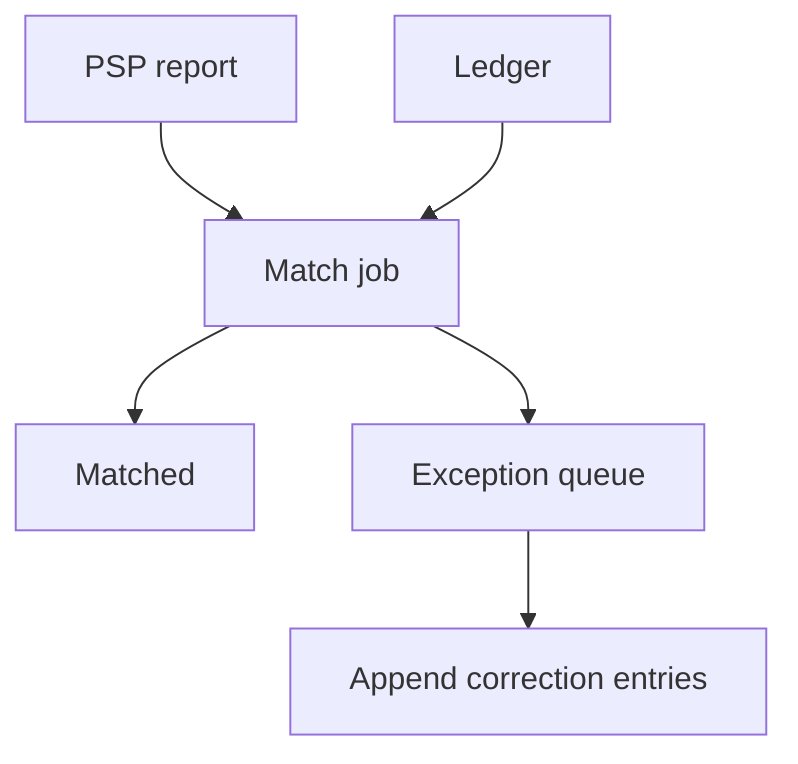

<!-- day-nav -->
[← Day 65 — Payments](65-payments.md) · [Day 67 — Collaborative document →](67-collaborative-document.md)

# Day 66 — Payment reconciliation

**Do now**

1. Set a timer.
2. Attempt the problem. Stop at the attempt line. Do not scroll.
3. Then read.

## Time box

35 minutes.

| Minutes | Do this |
|---|---|
| 0–10 | Attempt. Provider and ledger disagree. Find and repair without silent history rewrite. |
| 10–28 | Read. If you UPDATE ledger amounts in place, undo that. |
| 28–35 | Say the mismatch types, the job that finds them, and the repair entry shape. |

## Intent

Facing a provider and a ledger that disagree, leave able to find the mismatch and repair it without a silent rewrite of history.

## Problem

> Design payment reconciliation.
>
> Your ledger and the payment provider's reports sometimes disagree. You must find mismatches and repair them without silently rewriting history.

## Attempt before reading

10 minutes. Do not scroll.

Write:

1. Sources: ledger entries vs PSP settlement files / API.
2. Match keys (payment id, provider charge id, amount, time window).
3. Mismatch classes: missing local, missing remote, amount differ, duplicate.
4. Repair: compensating ledger entries vs edit-in-place.
5. Who approves automatic vs manual repair.

---

**Stop. Append-only repairs. Recon job with evidence. No silent UPDATE of history.**

---

## Requirements

**In.** Daily (or hourly) recon against PSP reports. Exception queue for humans. Automatic repair for safe classes (e.g. local missing after PSP confirm). Append-only ledger corrections.

**Assumptions.** **1k**/s payments → **~100M**/day entries to match; batch recon with indexed provider refs. One PSP first.

**Out.** Redesigning authorize (day 65), FX multi-currency deep dive, bank ACH rails.

## Estimates

Report file **millions** of rows nightly. Match join on `provider_charge_id`. Exceptions **≪ 0.1%** if healthy — page if exception rate spikes.

## API and data

Recon run records; exception rows `(type, payment_id, evidence)`.

Ledger: `correction` entries referencing original entry ids — never delete originals.

## Design

### Match pipeline

Load PSP report → normalize → join to ledger by provider id. Produce matched / orphan_psp / orphan_ledger / amount_mismatch.

### Repair

- Orphan PSP (they charged, we no row): create payment + ledger capture **correction** after verification; link evidence.
- Orphan ledger (we think captured, they don't): investigate; may void or refund path; may mark `writeoff` with approval.
- Amount mismatch: correction entry for delta; never UPDATE amount column on old entry.

### Automation policy

Auto-repair only when evidence is unambiguous (PSP success id present, amount equals, local unknown state). Else human queue with SLA.

### Audit

Every correction cites recon_run_id and PSP report line. Day 76 will thank you.

### Staff arithmetic: unmatched money is the product

Provider settlement files may lag **T+1**. Your ledger shows captures the provider has not settled yet — normal. The bug is **provider has money you have no ledger row for**, or **ledger row with no provider match past the lag SLO**. Recon job matches on idempotency keys / provider refs; unmatched over SLO → ticket, not a silent `UPDATE amount`. Repair is **append correction entries** (day 29 style honesty), never rewrite history. Volume: tens of thousands of rows/day is a batch; correctness is the interview.

## Diagrams

Caption: "Find, then append. Do not rewrite the past."

## Failure the user sees

**Unmatched provider capture.** Customer charged; your order still `pending`. Support sees recon ticket; repair appends ledger capture tied to provider id; order advances. Do not "fix" by editing the old row's amount in place.

**Unmatched ledger capture.** You think you charged; provider has nothing — likely unknown timeout that later declined. Repair voids/refunds path; customer must not be shipped.

**File late.** Recon lag extends; do not auto-repair inside the normal lag window. Page when lag >> SLA.

**Wrong match on ambiguous keys.** Two payments same amount same minute — match must use unique provider references, not amount+time alone.

**Automated repair too eager.** Auto-correct only with high-confidence keys; else human queue. Money bugs hate confidence.

## Trade-offs

**Auto-repair vs human queue.** Auto for exact key matches; human for amount-only fuzzy.

**Rewrite vs append.** Always append corrections.

**Name the refusal inside each alternative.** Against silent UPDATE of historical ledger rows: you refuse an unauditable books. Against matching on amount+time only: you refuse mis-attribution. Against ignoring T+1 lag as "breakage": you refuse false incidents. Against auto-repair of fuzzy matches: you refuse automated theft/duplication.

**10× payment volume.** Same job, more partitions of the recon batch; rules unchanged.

## Talking points

**If they UPDATE the ledger in place.** "Append a correction. History is evidence."

**If they match on amount alone.** "Collision. Use provider reference / idempotency key."

**If they ask how fast recon runs.** "After settlement file arrival; SLO hours not milliseconds. Online path is day 65."

**If they ask who gets paged.** "Unmatched past lag SLO; repair failure rate; not every T+1 pending."

**If they ask about chargebacks.** "Separate dispute flow appending ledger entries; out unless they insist."

## Say this in the room

Reconciliation is a batch match between provider settlement and our append-only ledger keyed by provider references and idempotency keys — not amount-and-time guesses. Normal T+1 lag is not a break; unmatched past the lag SLO is a ticket. Repairs append correction entries so history stays evidence; I refuse silent UPDATEs of past rows. High-confidence auto-repair only; fuzzy cases go to humans. Day 65 made unknown a state; today closes the money we could not see at request time.

### Staff depth: correction entries are the repair

Debit/credit corrections reference the original intent id and provider id. Balances are projections over the log. Auditors read the log; they do not trust a mutable balance column.

**Lag window.** Inside settlement lag: pending match OK. Outside: incident.

**What staff sounds like.** Append-only repairs, unique match keys, lag SLO vs true unmatched, refuse fuzzy auto-repair.

### More probes, with the answer

**"What pages?"** Name the user-visible lag or error metric from Failure — not only CPU. **"What do you refuse?"** Pick one refusal from Trade-offs and say the lie it prevents. **"What is the sensitive assumption?"** The estimate that flips the design if wrong by 10×.

## Kit artifact

| Follow-up | You answer with |
|---|---|
| "Amounts differ." | Delta correction entry + evidence; no UPDATE. |

## Design log

One line: a mismatch class and whether your repair was append-only.

Next: [Day 67 — Collaborative document](67-collaborative-document.md). Concurrent edits and divergence.

---

<!-- day-nav -->
[← Day 65 — Payments](65-payments.md) · [Day 67 — Collaborative document →](67-collaborative-document.md)
