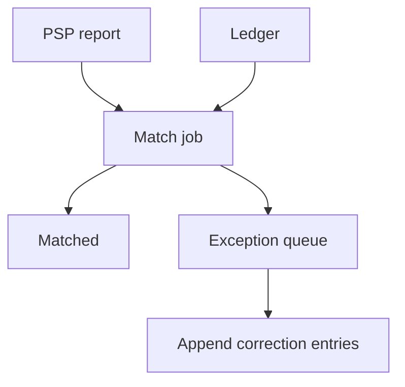

<!-- day-nav -->
[← Day 65 — Payments](65-payments.md) · [Day 67 — Collaborative document →](67-collaborative-document.md)

# Day 66 — Payment reconciliation

**Do now**

1. Set a timer.
2. Attempt the problem. Stop at the attempt line. Do not scroll.
3. Then read.

## Time box

35 minutes.

| Minutes | Do this |
|---|---|
| 0–10 | Attempt. Provider and ledger disagree. Find and repair without silent history rewrite. |
| 10–28 | Read. If you UPDATE ledger amounts in place, undo that. |
| 28–35 | Say the mismatch types, the job that finds them, and the repair entry shape. |

## Intent

Facing a provider and a ledger that disagree, leave able to find the mismatch and repair it without a silent rewrite of history.

## Problem

> Design payment reconciliation.
>
> Your ledger and the payment provider's reports sometimes disagree. You must find mismatches and repair them without silently rewriting history.

## Attempt before reading

10 minutes. Do not scroll.

Write:

1. Sources: ledger entries vs PSP settlement files / API.
2. Match keys (payment id, provider charge id, amount, time window).
3. Mismatch classes: missing local, missing remote, amount differ, duplicate.
4. Repair: compensating ledger entries vs edit-in-place.
5. Who approves automatic vs manual repair.

---

**Stop. Append-only repairs. Recon job with evidence. No silent UPDATE of history.**

---

## Requirements

**In.** Daily (or hourly) recon against PSP reports. Exception queue for humans. Automatic repair for safe classes (e.g. local missing after PSP confirm). Append-only ledger corrections.

**Assumptions.** **1k**/s payments → **~100M**/day entries to match; batch recon with indexed provider refs. One PSP first.

**Out.** Redesigning authorize (day 65), FX multi-currency deep dive, bank ACH rails.

## Estimates

Report file **millions** of rows nightly. Match join on `provider_charge_id`. Exceptions **≪ 0.1%** if healthy — page if exception rate spikes.

## API and data

Recon run records; exception rows `(type, payment_id, evidence)`.

Ledger: `correction` entries referencing original entry ids — never delete originals.

## Design

### Match pipeline

Load PSP report → normalize → join to ledger by provider id. Produce matched / orphan_psp / orphan_ledger / amount_mismatch.

### Repair

- Orphan PSP (they charged, we no row): create payment + ledger capture **correction** after verification; link evidence.
- Orphan ledger (we think captured, they don't): investigate; may void or refund path; may mark `writeoff` with approval.
- Amount mismatch: correction entry for delta; never UPDATE amount column on old entry.

### Automation policy

Auto-repair only when evidence is unambiguous (PSP success id present, amount equals, local unknown state). Else human queue with SLA.

### Audit

Every correction cites recon_run_id and PSP report line. Day 76 will thank you.

## Diagrams

Caption: "Find, then append. Do not rewrite the past."

## Failure the user sees

**Silent in-place edit.** Auditors lose the trail — refuse.

**Auto-repair bug.** Wrong correction — need reverse correction, not delete.

**Recon lag 3 days.** Finance blind; page on age of last successful recon.

## Trade-offs

**Realtime vs batch recon.** Batch is enough for settlement; streaming helps unknown states faster (day 65 recovery).

## Talking points

**If they UPDATE balances.** "That is not reconciliation. That is destroying evidence."

## Say this in the room

Reconciliation joins provider reports to ledger entries by provider charge id and classifies orphans and amount mismatches. Repairs are new ledger correction entries that reference the originals and the recon evidence — never an in-place edit of history. Safe, unambiguous cases may auto-repair; everything else hits a human exception queue. I page on recon lag and on exception rate spikes, not on the happy matched majority.

### Staff depth: correction entries are the repair

Amount mismatch → append delta with evidence pointers. UPDATE of old amounts destroys the audit trail. Auto-repair only unambiguous orphans; else human queue. Page on recon lag and exception rate.

**What staff sounds like.** Match classes named; append-only; threat of silent rewrite refused.

## Kit artifact

| Follow-up | You answer with |
|---|---|
| "Amounts differ." | Delta correction entry + evidence; no UPDATE. |

## Design log

One line: a mismatch class and whether your repair was append-only.

Next: [Day 67 — Collaborative document](67-collaborative-document.md). Concurrent edits and divergence.

---

<!-- day-nav -->
[← Day 65 — Payments](65-payments.md) · [Day 67 — Collaborative document →](67-collaborative-document.md)
