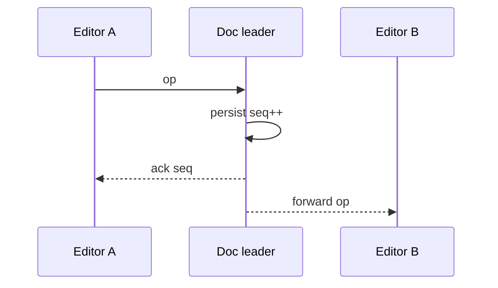

<!-- day-nav -->
[← Day 66 — Payment reconciliation](66-payment-reconciliation.md) · [Day 68 — File sync →](68-file-sync.md)

# Day 67 — Collaborative document

**Do now**

1. Set a timer.
2. Attempt the problem. Stop at the attempt line. Do not scroll.
3. Then read.

## Time box

40 minutes.

| Minutes | Do this |
|---|---|
| 0–12 | Attempt. Two editors. Persist concurrent edits and presence. Say what happens when they diverge. |
| 12–32 | Read. Last-write-wins on the whole doc is usually wrong. Name OT or CRDT at interview depth — not a paper seminar. |
| 32–40 | Say the sync protocol, persistence, and conflict UX. |

## Intent

Facing two editors in one document, leave able to persist concurrent edits and presence and say what you do when they diverge.

## Problem

> Design a collaborative document.
>
> Two or more people edit the same document at once. Edits should appear for everyone quickly. Presence (who is here, where their cursor is) is visible. When edits conflict, you must say what the product does.

## Attempt before reading

12 minutes. Do not scroll.

Write:

1. Primitive: whole-doc LWW, OT, CRDT, or section locking — pick and justify.
2. Wire protocol: ops over WebSocket; ack/persistence.
3. Presence: ephemeral vs durable.
4. Offline edit then reconnect.
5. What the user sees when merge cannot be automatic.

---

**Stop. Op-based sync with durable snapshot+log. Presence ephemeral. Named conflict rule.**

---

## Requirements

**In.** Docs up to **~2 MB** text-equivalent. **≤ 50** concurrent editors typical; hard cap **100**. Sub-second op fan-out. Persist every op or coalesced. Presence cursors. Version history coarse (snapshots).

**Assumptions.** **10 million** docs; **100k** concurrently open. One region authority per doc (sticky).

**Out.** Full Google-Docs feature clone, blames, comments deep dive, E2E encrypted collab without server merge (hard mode — refuse unless asked).

## Estimates

If 100k docs open × 2 ops/s average = **200k**/s ops — shard by doc_id. One hot doc 50 editors × 5 ops/s = **250**/s — single doc leader fine.

## API and data

WebSocket join `doc_id` with authz. Ops: `{client_id, seq, type, payload}`. Server assigns `server_seq`.

Snapshot store + op log since snapshot. Presence in memory / Redis with TTL.

## Design

### Choose merge

**CRDT (e.g. text)** or **OT with central sequencer** — both OK at interview. Central sequencer: doc leader serializes ops, transforms, fans out — simpler to explain. CRDT: clients merge; server still persists and fans for discovery.

**Refuse** LWW whole document for collaborative typing.

### Persistence

Leader appends op to log, periodically snapshots. 201/ack to client means durable enough for your RPO (sync disk / quorum).

### Presence

Ephemeral heartbeats; not in op log. Missed presence ≠ missed text.

### Divergence / offline

Offline clients queue ops; on reconnect transform/merge. If semantic conflict (both set title differently in LWW field), show **conflict marker** or last-writer on that field only — say UX.

### Failure

Leader crash: promote; clients reconnect with `after_server_seq`. Fence old leader (day 36) or dual leaders fork the doc — unforgivable.

### Staff arithmetic: presence vs durable ops

A doc with 50 concurrent editors sending ops at 5/s is 250 ops/s — easy. The cliff is **fork**: two servers accept conflicting histories without a merge rule, or a snapshot that does not include the log prefix it claims. Presence (cursors) is ephemeral and lossy; durable text is op log + periodic snapshot. Offline edit for hours then reconnect needs either CRDT merge or OT with transformation against the missing gap — pick one and name the conflict UX (last-write markers, manual resolve). Blob size: 1 MB doc × versions — trim snapshots; keep log until snapshot covers it.

## Diagrams

Caption: "One sequencer per doc. Fan-out after durable."

## Failure the user sees

**Fork.** Two users see divergent permanent text with no merge path — unforgivable. Root causes: dual primary without fencing, snapshot/log mismatch, client applying ops twice without idempotency.

**Lost presence.** Cursors disappear on reconnect — OK; document must not.

**Offline collision.** Both edited same paragraph; on sync, conflict markers or CRDT merge — say which. Silent overwrite is a product bug.

**Snapshot without log prefix.** New joiner loads snapshot that is ahead of applied ops or behind — gap. Snapshot must name the log sequence it covers; catch-up applies ops after that seq.

**Huge doc.** Op amplify; snapshot more often; refuse unbounded history in RAM per connection.

## Trade-offs

**OT vs CRDT.** OT needs a central sequencer; CRDT merges without it but metadata grows. Pick for the infra you already have (day 53 leader vs day 42 conflicts).

**Presence in the durable log.** Refuse — presence is ephemeral.

**Name the refusal inside each alternative.** Against dual-primary write without merge: you refuse forks. Against presence as durable ops: you refuse log bloat and lying history. Against silent overwrite on offline sync: you refuse data loss dressed as sync. Against snapshot that does not pin a log seq: you refuse gap bugs. Against "Firestore will save us" without naming merge: you refuse a brand as a consistency story.

**10× editors on one doc.** Still one sequencer/shard for OT; CRDT metadata and fan-out of ops dominate — cap concurrent editors per doc if needed.

## Talking points

**If they store every cursor move.** "Presence ephemeral. Durable log is text ops."

**If they ask OT vs CRDT.** "OT with a doc leader if I already have one; CRDT if offline-first without a leader. I name conflict UX either way."

**If they ask how a late joiner loads.** "Snapshot at seq S + ops after S. Snapshot without S is a bug."

**If they ask about binary attachments.** "Pointers like chat; bytes day 14/68. Ops reference ids."

**If they ask what pages.** "Fork detectors (hash divergence), apply lag, snapshot age."

## Say this in the room

A collaborative doc is a durable op log with periodic snapshots pinned to a sequence, plus ephemeral presence that I refuse to put in the log. I pick OT with a per-doc sequencer or CRDT for offline-first — and I name the conflict UX when two offline edits collide. A fork — permanent divergent text — is unforgivable; fencing the writer and pinning snapshots to log seq are how we avoid it. New joiners load snapshot at seq S then catch up. Cursors can drop; characters cannot.

### Staff depth: fork is unforgivable

Dual writers without a merge rule, or snapshot/log mismatch, produce forks. Idempotent apply of ops; snapshot.seq mandatory.

**Presence.** Ephemeral channel; lossy OK.

**Offline.** Named merge or conflict markers — never silent clobber.

**What staff sounds like.** Snapshot pinned to seq; presence out of the log; fork named as the Sev-1.

### More probes, with the answer

**"What pages?"** Name the user-visible lag or error metric from Failure — not only CPU. **"What do you refuse?"** Pick one refusal from Trade-offs and say the lie it prevents. **"What is the sensitive assumption?"** The estimate that flips the design if wrong by 10×.

## Kit artifact

| Follow-up | You answer with |
|---|---|
| "Both edit the title." | Field-level rule or conflict marker; not silent whole-doc LWW. |

## Design log

One line: OT vs CRDT choice, and how you fence the doc leader.

Next: [Day 68 — File sync](68-file-sync.md). Chunks, conflicts, lying clocks.

---

<!-- day-nav -->
[← Day 66 — Payment reconciliation](66-payment-reconciliation.md) · [Day 68 — File sync →](68-file-sync.md)
