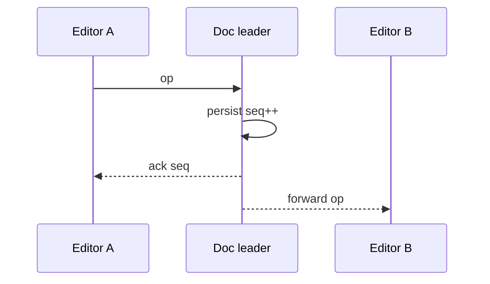

<!-- day-nav -->
[← Day 66 — Payment reconciliation](66-payment-reconciliation.md) · [Day 68 — File sync →](68-file-sync.md)

# Day 67 — Collaborative document

**Do now**

1. Set a timer.
2. Attempt the problem. Stop at the attempt line. Do not scroll.
3. Then read.

## Time box

40 minutes.

| Minutes | Do this |
|---|---|
| 0–12 | Attempt. Two editors. Persist concurrent edits and presence. Say what happens when they diverge. |
| 12–32 | Read. Last-write-wins on the whole doc is usually wrong. Name OT or CRDT at interview depth — not a paper seminar. |
| 32–40 | Say the sync protocol, persistence, and conflict UX. |

## Intent

Facing two editors in one document, leave able to persist concurrent edits and presence and say what you do when they diverge.

## Problem

> Design a collaborative document.
>
> Two or more people edit the same document at once. Edits should appear for everyone quickly. Presence (who is here, where their cursor is) is visible. When edits conflict, you must say what the product does.

## Attempt before reading

12 minutes. Do not scroll.

Write:

1. Primitive: whole-doc LWW, OT, CRDT, or section locking — pick and justify.
2. Wire protocol: ops over WebSocket; ack/persistence.
3. Presence: ephemeral vs durable.
4. Offline edit then reconnect.
5. What the user sees when merge cannot be automatic.

---

**Stop. Op-based sync with durable snapshot+log. Presence ephemeral. Named conflict rule.**

---

## Requirements

**In.** Docs up to **~2 MB** text-equivalent. **≤ 50** concurrent editors typical; hard cap **100**. Sub-second op fan-out. Persist every op or coalesced. Presence cursors. Version history coarse (snapshots).

**Assumptions.** **10 million** docs; **100k** concurrently open. One region authority per doc (sticky).

**Out.** Full Google-Docs feature clone, blames, comments deep dive, E2E encrypted collab without server merge (hard mode — refuse unless asked).

## Estimates

If 100k docs open × 2 ops/s average = **200k**/s ops — shard by doc_id. One hot doc 50 editors × 5 ops/s = **250**/s — single doc leader fine.

## API and data

WebSocket join `doc_id` with authz. Ops: `{client_id, seq, type, payload}`. Server assigns `server_seq`.

Snapshot store + op log since snapshot. Presence in memory / Redis with TTL.

## Design

### Choose merge

**CRDT (e.g. text)** or **OT with central sequencer** — both OK at interview. Central sequencer: doc leader serializes ops, transforms, fans out — simpler to explain. CRDT: clients merge; server still persists and fans for discovery.

**Refuse** LWW whole document for collaborative typing.

### Persistence

Leader appends op to log, periodically snapshots. 201/ack to client means durable enough for your RPO (sync disk / quorum).

### Presence

Ephemeral heartbeats; not in op log. Missed presence ≠ missed text.

### Divergence / offline

Offline clients queue ops; on reconnect transform/merge. If semantic conflict (both set title differently in LWW field), show **conflict marker** or last-writer on that field only — say UX.

### Failure

Leader crash: promote; clients reconnect with `after_server_seq`. Fence old leader (day 36) or dual leaders fork the doc — unforgivable.

## Diagrams

Caption: "One sequencer per doc. Fan-out after durable."

## Failure the user sees

**Forked doc from two leaders.** Silent split brain — fence.

**Lost unacked ops.** Client retries; idempotent client_op_id.

**Presence wrong.** Annoying, not data loss.

## Trade-offs

**OT central vs CRDT.** OT needs leader; CRDT heavier clients. Either fine if you name persistence and reconnect.

**Snapshot frequency.** More snapshots = faster join, more write amp.

## Talking points

**If they LWW the whole buffer.** "Two typists destroy each other. Ops."

## Say this in the room

Each document has a single leader that assigns a server sequence to editing operations, persists them, then fans out — so concurrent typing is merged by OT or by CRDT rules I name, not by last-write-wins on the whole file. Presence is ephemeral heartbeats, not durable ops. Clients reconnect from a snapshot plus op log using after_server_seq. Two leaders without a fence can fork the document, so election fencing is part of the data plane. Semantic conflicts that cannot merge get an explicit UX, not a silent overwrite.

### Staff depth: fork is unforgivable

Two leaders without a fence diverge the doc silently. Epoch fence on apply. Presence is ephemeral — wrong cursors annoy; wrong text loses trust.

**Offline.** Queue ops; transform on reconnect; semantic conflicts get markers, not whole-doc LWW.

**What staff sounds like.** Sequencer or CRDT named; persistence before fan-out; fence drawn.

## Kit artifact

| Follow-up | You answer with |
|---|---|
| "Both edit the title." | Field-level rule or conflict marker; not silent whole-doc LWW. |

## Design log

One line: OT vs CRDT choice, and how you fence the doc leader.

Next: [Day 68 — File sync](68-file-sync.md). Chunks, conflicts, lying clocks.

---

<!-- day-nav -->
[← Day 66 — Payment reconciliation](66-payment-reconciliation.md) · [Day 68 — File sync →](68-file-sync.md)
