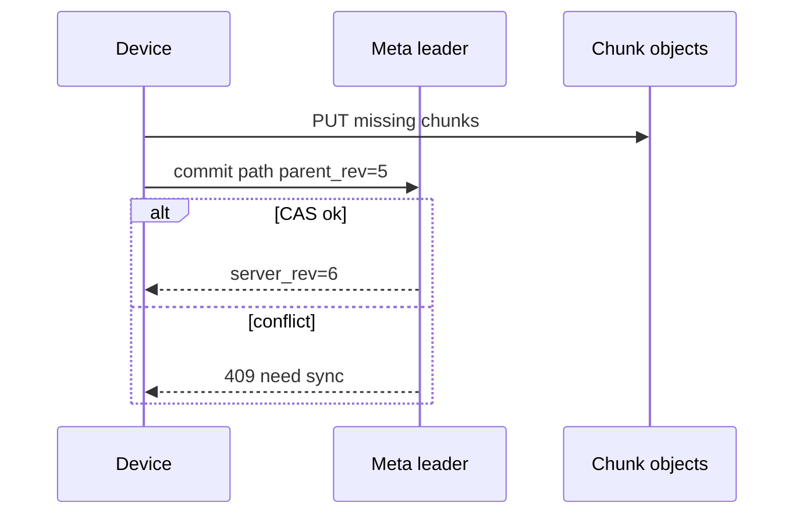

<!-- day-nav -->
[← Day 67 — Collaborative document](67-collaborative-document.md) · [Day 69 — Cart and checkout →](69-cart-and-checkout.md)

# Day 68 — File sync

**Do now**

1. Set a timer.
2. Attempt the problem. Stop at the attempt line. Do not scroll.
3. Then read.

## Time box

40 minutes.

| Minutes | Do this |
|---|---|
| 0–12 | Attempt. Folders match across devices. Chunks, conflicts, lying client clocks. |
| 12–32 | Read. If sync trusts client mtime alone, clocks will corrupt causality. |
| 32–40 | Say chunking, manifest, conflict policy, and server time authority. |

## Intent

Facing folders that must match across devices, leave able to sync chunks, resolve conflicts, and survive a client clock that lies.

## Problem

> Design file sync.
>
> A person's files appear on multiple devices. Changes upload and download efficiently. Conflicts are handled when two devices edit apart. Client clocks may be wrong.

## Attempt before reading

12 minutes. Do not scroll.

Write:

1. Content addressing / chunking strategy.
2. Namespace: path → content id + version.
3. Conflict: same path edited on two devices.
4. Why not trust client mtime for "who wins."
5. Large file resume and dedupe across users (optional).

---

**Stop. Chunked content store. Server-ordered versions. Explicit conflicts. Clocks are not truth.**

---

## Requirements

**In.** Per-user namespace (and optional shared folders thin). Files to **~50 GB**. Chunk ~4 MB. Sync incremental. Conflict copies or block-until-resolve — pick **conflict renamed copy** for consumer sync. Delete with tombstones and retention.

**Assumptions.** **50 million** users; **1%** active syncing; peak metadata ops **50k**/s. Object storage for chunks.

**Out.** Full Google Drive collab editing (day 67), photo dedupe ML, LAN-only sync.

## Estimates

Chunk store is object storage — bytes easy. Metadata (path, rev, chunk list) is the DB. Dedup chunks globally optional (privacy/savings trade-off).

## API and data

Device: list changes `since_token`; upload chunk; commit file rev with chunk hashes; download.

**File rev:** `(namespace_id, path, server_rev)` with parent_rev for CAS. Content = ordered chunk hashes.

**Tombstone** for deletes with server time.

## Design

### Chunks

Client hashes chunks (CDC or fixed); PUT missing to CAS bucket. Commit metadata only when all chunks durable.

### Versioning / conflicts

Commit requires `parent_rev` match latest (compare-and-swap). Fail → client pulls, merges if possible, else creates `file (conflicted copy).ext` with new path. **Server_rev** from leader, not client clock.

### Lying clocks

`mtime` is display metadata only. Sync causality = server_rev / vector of device ops acknowledged. Reject "mine is newer because mtime."

### Deletes

Tombstone wins vs silent resurrect unless client had unseen newer rev — then conflict. Retain tombstones **N days**.

### Resume

Chunk-level; commit atomic at metadata.

## Diagrams

Caption: "Chunks first. Metadata CAS on parent_rev. Server assigns rev."

## Failure the user sees

**Two offline edits.** Conflict copy appears — user merges manually. Say it.

**Clock set to 1970.** File still syncs; sort by server_rev in UI change feed.

**Partial chunk upload.** Commit refused; retry chunks; no half file.

## Trade-offs

**Conflict copy vs block.** Copy keeps sync flowing; block is safer for shared truth folders.

**Global chunk dedup.** Saves storage; timing side channels / privacy — often per-namespace dedup only.

## Talking points

**If they sort by mtime.** "Client clocks lie. Server rev."

## Say this in the room

Files are chunked into content-addressed objects and a metadata commit that CAS-updates on parent_rev so two devices cannot silently overwrite each other — the loser syncs and either merges or creates a conflicted copy. The server assigns revisions; client mtime is cosmetic because clocks lie. Deletes are tombstones with retention so we do not resurrect casually. Large uploads resume at chunk granularity; the file does not appear until the commit lands.

### Staff depth: mtime is not causality

Client clocks lie (1970, future). CAS on `parent_rev` with server-assigned rev. Conflicted copies for consumer sync; chunks content-addressed so resume and dedupe work. Tombstones with retention beat silent resurrect.

**What staff sounds like.** Chunks then metadata commit; refuse mtime winners.

## Kit artifact

| Follow-up | You answer with |
|---|---|
| "Whose clock wins?" | Neither; server_rev / CAS parent. |

## Design log

One line: your conflict policy and how you ignored client mtime for causality.

Next: [Day 69 — Cart and checkout](69-cart-and-checkout.md). Price snapshot, stock hold, safe retry.

---

<!-- day-nav -->
[← Day 67 — Collaborative document](67-collaborative-document.md) · [Day 69 — Cart and checkout →](69-cart-and-checkout.md)
