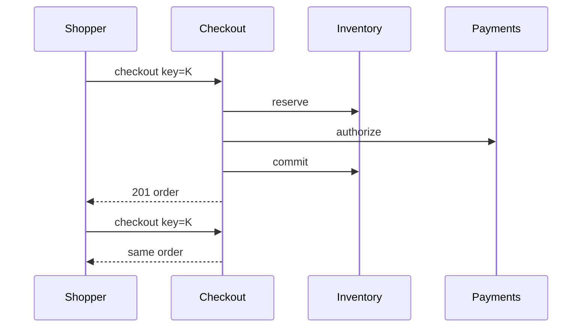

<!-- day-nav -->
[← Day 68 — File sync](68-file-sync.md) · [Day 70 — Flash sale →](70-flash-sale.md)

# Day 69 — Cart and checkout

**Do now**

1. Set a timer.
2. Attempt the problem. Stop at the attempt line. Do not scroll.
3. Then read.

## Time box

40 minutes.

| Minutes | Do this |
|---|---|
| 0–12 | Attempt. Snapshot price, hold stock, checkout idempotent. No double charge or double commit. |
| 12–32 | Read. Tie to days 49/61/65 without redesigning them. Day 70 is the spike queue. |
| 32–40 | Say checkout steps, idempotency, and what stale prices do. |

## Intent

Facing a purchase, leave able to snapshot price and hold stock so a retry cannot double-charge or double-commit inventory.

## Problem

> Design cart and checkout.
>
> A shopper adds items to a cart and checks out. Price and stock can change while they browse. A retry must not charge twice or take inventory twice.

## Attempt before reading

12 minutes. Do not scroll.

Write:

1. Cart vs order: when does price freeze?
2. Stock: soft hold vs commit (day 49).
3. Payment authorize/capture (day 65) order of steps.
4. Idempotency key on checkout.
5. Partial failure: paid but not reserved / reserved but not paid.

---

**Stop. Checkout creates an order with price snapshot + stock hold + payment, all idempotent.**

---

## Requirements

**In.** Cart (mutable). Checkout → order with line prices snapshotted, tax/shipping estimate, stock reservation, payment. Order states. Guest or user carts.

**Assumptions.** **5,000** checkouts/s peak (ambitious); more typically **500**/s — use **500**/s peak. Cart ops higher. One region.

**Out.** Flash waiting room (day 70), multi-warehouse ATP optimization, promotions engine deep dive.

## Estimates

500 checkouts/s; each does reserve + pay + commit — budget latency **2–5 s**. Idempotency store and order primary sized for that.

## API and data

Cart APIs. `POST /v1/checkout` `{cart_id, idempotency_key}` → order_id.

Order: lines with `unit_price_snapshot`, `reservation_id`, `payment_id`, state.

## Design

### Checkout saga (day 41 shape)

1. Idempotency begin.
2. Read cart; snapshot prices from catalog (or refuse if price changed beyond tolerance — product choice: **reprice and show confirm** vs snap whatever). Prefer **snapshot at checkout start**; if stock/price invalid, 409 with reason.
3. Reserve inventory (day 49) for lines.
4. Authorize payment (day 65) for snapshotted total.
5. Commit reservation; mark order `placed`; clear cart.
6. Capture payment async or at ship — product choice; say **capture on place** for digital, **auth now capture on ship** for physical.

Compensations: pay fail → release reserve. Reserve fail → no pay. Pay succeeded, commit reserve fail → recovery commit or refund (day 49/65 crash windows).

### Retries

Same checkout key returns same order. New key = new attempt (may 409 on stock).

### Stale cart prices

Show "price changed" if catalog moved before checkout; do not silently charge old if policy requires confirm.

### Staff arithmetic: saga order

Checkout is a saga (day 41): snapshot price → hold stock → authorize payment → commit order. Wrong order creates money without stock or stock without money. Idempotency key on checkout intent makes retries safe. Cart is soft state; order is the durable purchase. Flash traffic is day 70 — today is correctness under retries and partial failure. Price snapshot freezes what the user saw; post-checkout catalog changes must not rewrite the order.

## Diagrams

Caption: "One key, one order. Compensations on failure paths."

## Failure the user sees

**Pay success, stock fail.** Compensate: void/refund payment; do not create shipped order. User sees payment reversed + apology.

**Stock hold, pay unknown.** Leave hold until pay terminal; then commit or release. Do not release stock while pay may still capture.

**Double checkout click.** Same idempotency key → same order id. New key → risk double order — client must stabilize key.

**Stale cart price.** Item was $10 in cart, now $12; checkout snapshots and may revalidate — say policy (fail if drift > ε, or charge snapshot with disclosure).

**Hold expires mid-pay.** Pay may succeed; stock gone → refund path. Hold TTL > pay budget (day 61/65).

## Trade-offs

**Sync checkout vs async order.** Sync until pay+commit for small carts; async for heavy risk with clear "processing" UI.

**Cart in cookie vs server.** Server cart for logged-in; either way checkout creates server order.

**Name the refusal inside each alternative.** Against pay before stock hold: you refuse charging for unreservable goods. Against new idempotency key on retry: you refuse double orders. Against mutating order prices after commit from catalog: you refuse rewriting receipts. Against releasing hold while pay unknown: you refuse oversell when capture lands.

**10× checkout QPS.** More order shards; same saga. Day 70 if the cliff is fairness/admission.

## Talking points

**If they charge then reserve.** "Compensation hell and angry charged users. Hold first or atomic with clear order."

**If they ask saga vs 2PC.** "Saga with compensations across stock and payment services — day 41. 2PC across provider is fantasy."

**If they ask price changes.** "Snapshot at checkout; policy for drift. Order row immutable on price."

**If they ask abandoned carts.** "Holds expire; carts linger. Not orders."

**If they ask what pages.** "Checkout compensation rate, pay-unknown aged intents, hold expiry during pay."

## Say this in the room

Checkout creates an order intent with an idempotency key, snapshots prices, holds stock, then authorizes payment — and compensates in reverse if a later step fails. A double click with the same key returns the same order; a new key is how you double-charge. I will not release a stock hold while payment is still unknown, and I will not rewrite order prices from a later catalog change. Cart is soft; the order row is the receipt. Flash admission is day 70 if we need it.

### Staff depth: saga order and compensations

Hold → pay → commit. Fail pay → release hold. Fail after pay → refund + release. Idempotent intent.

**TTL.** Hold outlives pay budget.

**What staff sounds like.** Saga steps named in order; compensation paths; idempotent checkout key.

### More probes, with the answer

**"What pages?"** Name the user-visible lag or error metric from Failure — not only CPU. **"What do you refuse?"** Pick one refusal from Trade-offs and say the lie it prevents. **"What is the sensitive assumption?"** The estimate that flips the design if wrong by 10×.

## Kit artifact

| Follow-up | You answer with |
|---|---|
| "Double charge?" | Checkout idempotency key + payment key; same order returned. |

## Design log

One line: your step order and the compensation for pay-success/reserve-fail.

Next: [Day 70 — Flash sale](70-flash-sale.md). Queue buyers; fairness; protect the DB.

---

<!-- day-nav -->
[← Day 68 — File sync](68-file-sync.md) · [Day 70 — Flash sale →](70-flash-sale.md)
