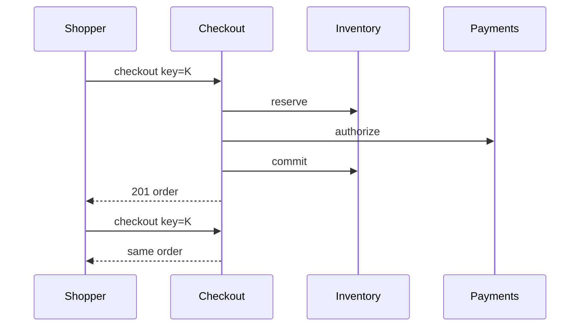

<!-- day-nav -->
[← Day 68 — File sync](68-file-sync.md) · [Day 70 — Flash sale →](70-flash-sale.md)

# Day 69 — Cart and checkout

**Do now**

1. Set a timer.
2. Attempt the problem. Stop at the attempt line. Do not scroll.
3. Then read.

## Time box

40 minutes.

| Minutes | Do this |
|---|---|
| 0–12 | Attempt. Snapshot price, hold stock, checkout idempotent. No double charge or double commit. |
| 12–32 | Read. Tie to days 49/61/65 without redesigning them. Day 70 is the spike queue. |
| 32–40 | Say checkout steps, idempotency, and what stale prices do. |

## Intent

Facing a purchase, leave able to snapshot price and hold stock so a retry cannot double-charge or double-commit inventory.

## Problem

> Design cart and checkout.
>
> A shopper adds items to a cart and checks out. Price and stock can change while they browse. A retry must not charge twice or take inventory twice.

## Attempt before reading

12 minutes. Do not scroll.

Write:

1. Cart vs order: when does price freeze?
2. Stock: soft hold vs commit (day 49).
3. Payment authorize/capture (day 65) order of steps.
4. Idempotency key on checkout.
5. Partial failure: paid but not reserved / reserved but not paid.

---

**Stop. Checkout creates an order with price snapshot + stock hold + payment, all idempotent.**

---

## Requirements

**In.** Cart (mutable). Checkout → order with line prices snapshotted, tax/shipping estimate, stock reservation, payment. Order states. Guest or user carts.

**Assumptions.** **5,000** checkouts/s peak (ambitious); more typically **500**/s — use **500**/s peak. Cart ops higher. One region.

**Out.** Flash waiting room (day 70), multi-warehouse ATP optimization, promotions engine deep dive.

## Estimates

500 checkouts/s; each does reserve + pay + commit — budget latency **2–5 s**. Idempotency store and order primary sized for that.

## API and data

Cart APIs. `POST /v1/checkout` `{cart_id, idempotency_key}` → order_id.

Order: lines with `unit_price_snapshot`, `reservation_id`, `payment_id`, state.

## Design

### Checkout saga (day 41 shape)

1. Idempotency begin.
2. Read cart; snapshot prices from catalog (or refuse if price changed beyond tolerance — product choice: **reprice and show confirm** vs snap whatever). Prefer **snapshot at checkout start**; if stock/price invalid, 409 with reason.
3. Reserve inventory (day 49) for lines.
4. Authorize payment (day 65) for snapshotted total.
5. Commit reservation; mark order `placed`; clear cart.
6. Capture payment async or at ship — product choice; say **capture on place** for digital, **auth now capture on ship** for physical.

Compensations: pay fail → release reserve. Reserve fail → no pay. Pay succeeded, commit reserve fail → recovery commit or refund (day 49/65 crash windows).

### Retries

Same checkout key returns same order. New key = new attempt (may 409 on stock).

### Stale cart prices

Show "price changed" if catalog moved before checkout; do not silently charge old if policy requires confirm.

## Diagrams

Caption: "One key, one order. Compensations on failure paths."

## Failure the user sees

**Double submit.** Same key; one charge.

**Paid, stock lost race.** Refund or fail order with support path — never ship without stock commit.

**Inventory 503.** Checkout 503; no charge.

## Trade-offs

**Auth-on-checkout vs charge-on-checkout.** Auth holds buyer funds; better for ship delays.

**Hard snap vs reprice.** Snap is simpler UX at commit; reprice is fairer when markets move.

## Talking points

**If they charge then reserve.** "You steal money when stock 409s. Reserve then pay, or pay then guarantee recovery."

## Say this in the room

Checkout is a saga: snapshot line prices into an order, reserve inventory, authorize payment, then commit the reservation — with an idempotency key so double-click cannot create two orders or two charges. Failures compensate: payment fail releases the hold; payment success with a lost commit is recovered or refunded, never ignored. Price changes in the cart before checkout either reconfirm or snap at checkout by policy, but the charged amount is always the order snapshot. Flash-sale stampedes are day 70; today arrival fits conditional reserves.

### Staff depth: saga order and compensations

Reserve → pay → commit (or auth-on-place for physical). Pay success + reserve commit fail → recover or refund — never ship without stock. Checkout idempotency key returns the same order. Price snapshot on the order is what you charged.

**What staff sounds like.** Step order, compensations, keys; flash sale deferred to day 70.

## Kit artifact

| Follow-up | You answer with |
|---|---|
| "Double charge?" | Checkout idempotency key + payment key; same order returned. |

## Design log

One line: your step order and the compensation for pay-success/reserve-fail.

Next: [Day 70 — Flash sale](70-flash-sale.md). Queue buyers; fairness; protect the DB.

---

<!-- day-nav -->
[← Day 68 — File sync](68-file-sync.md) · [Day 70 — Flash sale →](70-flash-sale.md)
