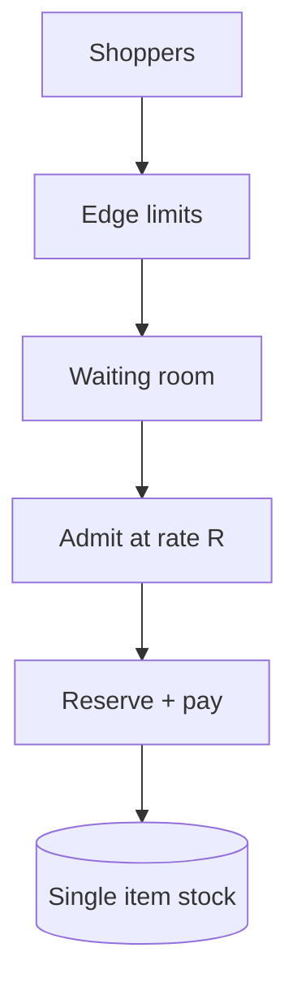

<!-- day-nav -->
[← Day 69 — Cart and checkout](69-cart-and-checkout.md) · [Day 71 — Social graph →](71-social-graph.md)

# Day 70 — Flash sale

**Do now**

1. Set a timer.
2. Attempt the problem. Stop at the attempt line. Do not scroll.
3. Then read.

## Time box

40 minutes.

| Minutes | Do this |
|---|---|
| 0–12 | Attempt. Arrival spike on scarce stock. Queue with fairness — do not pile onto the DB. |
| 12–32 | Read. Day 49/61 conditional writes are not enough at this QPS. Day 69 checkout sits behind the queue. |
| 32–40 | Say admit rate, fairness rule, and what the shopper sees while waiting. |

## Intent

Facing an arrival spike on scarce stock, leave able to queue buyers with a fairness rule instead of letting them pile onto the database.

## Problem

> Design a flash sale.
>
> A scarce item goes on sale at a set time. Far more shoppers arrive than stock can serve. The system must stay up and apply a fairness rule you can state.

## Attempt before reading

12 minutes. Do not scroll.

Write:

1. Peak arrival vs stock and vs DB write ceiling.
2. Waiting room / queue: who gets an admit ticket.
3. Fairness: FIFO, lottery, loyalty — pick and cost.
4. What happens behind the ticket (reserve + checkout).
5. Bots and multi-tab.

---

**Stop. Admission control in front. Tickets. Bounded reserve QPS. Named fairness.**

---

## Requirements

**In.** Sale with **N** units (e.g. **10,000**). Start time known. Arrivals **100k–1M** concurrent. Waiting room. Tickets grant the right to attempt checkout for **T** minutes. Fairness policy stated.

**Assumptions.** Inventory conditional write ceiling ~**500**/s on one item (day 49) — arrivals exceed by 100×. One region + CDN for static.

**Out.** Redesigning payments, dynamic pricing ML, multi-item carts deep dive.

## Estimates

1e6 arrivals at t0. Admit rate **200–500**/s to match reserve capacity (leave headroom). Drain time for 10k units at 300 successful checkouts/s ≈ **33 s** of winners — but many admits fail payment; admit more than N.

Queue messages: 1e6 waits — durable counter + position approx OK.

## API and data

`POST /v1/sales/{id}/join` → position / ticket state.

`GET` poll or WS for ticket grant.

`POST` checkout with `ticket_id` (single use).

Ticket row: user, sale, expires, state.

## Design

### Layers

1. CDN / edge: static sale page; bot rate limits; JS challenge optional.
2. Waiting room service: join assigns lottery number or FIFO seq (FIFO hurts multi-tab; **lottery with one entry per user** is fairer under bots).
3. Admits release tickets at rate R matching inventory+checkout capacity.
4. Checkout path: validate ticket → reserve 1 → pay → commit (day 69). Ticket consumed.

### Fairness

**Lottery:** everyone joining in window gets random rank; sort; admit in order. **FIFO:** first joins win — bots win. **Loyalty:** product bias — say if used. Pick **per-user lottery**.

### Overshoot

Admit rate > success rate because payment fail; stop admits when reserved+sold hits N; remaining waiters get "sold out."

### Failure

Waiting room down at t0: shed new joins with retry; do not open DB. Inventory still protected if checkout requires ticket signed by room.

## Diagrams

Caption: "DB sees R, not the crowd. Tickets gate checkout."

## Failure the user sees

**Wait 20 minutes, sold out.** Honest sold-out; not 500s. Show progress honesty (approx).

**Multi-tab.** One entry per user id; tabs share.

**Bots.** Rate limit + one entry; captcha; still imperfect — say residual.

## Trade-offs

**FIFO vs lottery.** Lottery resists early-bot; FIFO is intuitive.

**Sticky "you will get one" vs probabilistic.** Never promise a unit until reserved.

## Talking points

**If they only scale the DB.** "One hot row still caps ~hundreds/s. Queue is mandatory."

## Say this in the room

A flash sale is admission control: a waiting room issues one lottery entry per user and releases checkout tickets at a rate the single stock row can handle — hundreds a second, not a million. Checkout still does conditional reserve and idempotent pay, but only with a valid ticket. When reserved plus sold hits N, remaining waiters get sold out rather than a melted database. Fairness is the lottery rule I state; FIFO mostly elects bots. The edge sheds junk before it reaches the room.

### Staff depth: why sharding the counter fails

Two writers of one scarce count oversell unless you lock the sum — back to one row. Admit rate tracks that ceiling. Lottery per user beats FIFO under bots. Ticket required at checkout so a waiting-room outage cannot open the DB.

**What staff sounds like.** Crowd ≠ DB QPS; fairness named; never promise a unit before reserve.

## Kit artifact

| Follow-up | You answer with |
|---|---|
| "Why not just shard stock?" | Sharding a single scarce count oversells without a lock on the sum — back to one row; queue instead. |

## Design log

One line: your fairness rule and the admit rate you chose vs inventory ceiling.

Next: [Day 71 — Social graph](71-social-graph.md). Follow, block, privacy on the read path.

---

<!-- day-nav -->
[← Day 69 — Cart and checkout](69-cart-and-checkout.md) · [Day 71 — Social graph →](71-social-graph.md)
