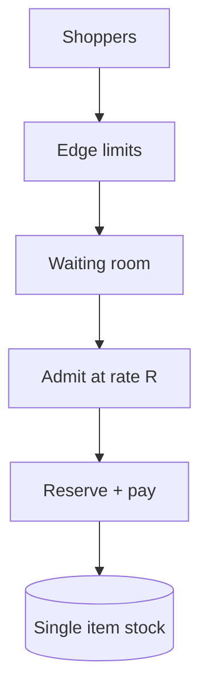

<!-- day-nav -->
[← Day 69 — Cart and checkout](69-cart-and-checkout.md) · [Day 71 — Social graph →](71-social-graph.md)

# Day 70 — Flash sale

**Do now**

1. Set a timer.
2. Attempt the problem. Stop at the attempt line. Do not scroll.
3. Then read.

## Time box

40 minutes.

| Minutes | Do this |
|---|---|
| 0–12 | Attempt. Arrival spike on scarce stock. Queue with fairness — do not pile onto the DB. |
| 12–32 | Read. Day 49/61 conditional writes are not enough at this QPS. Day 69 checkout sits behind the queue. |
| 32–40 | Say admit rate, fairness rule, and what the shopper sees while waiting. |

## Intent

Facing an arrival spike on scarce stock, leave able to queue buyers with a fairness rule instead of letting them pile onto the database.

## Problem

> Design a flash sale.
>
> A scarce item goes on sale at a set time. Far more shoppers arrive than stock can serve. The system must stay up and apply a fairness rule you can state.

## Attempt before reading

12 minutes. Do not scroll.

Write:

1. Peak arrival vs stock and vs DB write ceiling.
2. Waiting room / queue: who gets an admit ticket.
3. Fairness: FIFO, lottery, loyalty — pick and cost.
4. What happens behind the ticket (reserve + checkout).
5. Bots and multi-tab.

---

**Stop. Admission control in front. Tickets. Bounded reserve QPS. Named fairness.**

---

## Requirements

**In.** Sale with **N** units (e.g. **10,000**). Start time known. Arrivals **100k–1M** concurrent. Waiting room. Tickets grant the right to attempt checkout for **T** minutes. Fairness policy stated.

**Assumptions.** Inventory conditional write ceiling ~**500**/s on one item (day 49) — arrivals exceed by 100×. One region + CDN for static.

**Out.** Redesigning payments, dynamic pricing ML, multi-item carts deep dive.

## Estimates

1e6 arrivals at t0. Admit rate **200–500**/s to match reserve capacity (leave headroom). Drain time for 10k units at 300 successful checkouts/s ≈ **33 s** of winners — but many admits fail payment; admit more than N.

Queue messages: 1e6 waits — durable counter + position approx OK.

## API and data

`POST /v1/sales/{id}/join` → position / ticket state.

`GET` poll or WS for ticket grant.

`POST` checkout with `ticket_id` (single use).

Ticket row: user, sale, expires, state.

## Design

### Layers

1. CDN / edge: static sale page; bot rate limits; JS challenge optional.
2. Waiting room service: join assigns lottery number or FIFO seq (FIFO hurts multi-tab; **lottery with one entry per user** is fairer under bots).
3. Admits release tickets at rate R matching inventory+checkout capacity.
4. Checkout path: validate ticket → reserve 1 → pay → commit (day 69). Ticket consumed.

### Fairness

**Lottery:** everyone joining in window gets random rank; sort; admit in order. **FIFO:** first joins win — bots win. **Loyalty:** product bias — say if used. Pick **per-user lottery**.

### Overshoot

Admit rate > success rate because payment fail; stop admits when reserved+sold hits N; remaining waiters get "sold out."

### Failure

Waiting room down at t0: shed new joins with retry; do not open DB. Inventory still protected if checkout requires ticket signed by room.

### Staff arithmetic: admission before reserve

10k arrivals/s onto 500 units cannot each hit the stock row — you need a waiting room / ticket lottery in front so **reserve QPS** is bounded (e.g. hundreds/s) while **fairness** is named (FCFS tickets, random, or paid VIP — pick and say). Sharding the counter into 10 buckets of 50 oversells when each shard sells 50 independently under skew — refuse unless you accept oversell or use a single writer / lua / conditional with a global remaining. Overshoot: some oversell with compensation, or hard stop under remaining — product choice spoken.

## Diagrams

Caption: "DB sees R, not the crowd. Tickets gate checkout."

## Failure the user sees

**Everyone hits inventory.** DB melts; most get 5xx; a few lucky oversell. Failure mode is chaos, not fairness.

**Unfair bot win.** No tickets/rate limits; scrapers take stock. Waiting room + bot controls.

**Shard oversell.** Ten shards × 50 = 500 planned; skew sells 80+80+… → oversell. User buys item you cannot ship → cancel/compensate.

**Ticket starvation.** Valid ticket but stock gone when they arrive — expected; clear UX. Ticket TTL short.

**False "sold out" on blip.** 503 during admission ≠ sold out. Distinguish codes.

## Trade-offs

**Lottery vs FCFS queue.** Lottery resists bots at start; FCFS feels fairer. Pick.

**Hard stop vs slight oversell.** Hard stop leaves leftover under contention; oversell needs cancel rate budget.

**Name the refusal inside each alternative.** Against open reserve at arrival QPS: you refuse melting the stock path. Against sharded counters without a global remaining: you refuse accidental oversell. Against 503 looking like sold out: you refuse lying scarcity. Against "first HTTP wins" without tickets: you refuse bot dominance dressed as fairness.

**10× arrivals.** Waiting room grows; reserve QPS cap stays. Stock correctness unchanged.

## Talking points

**If they shard the qty counter.** "Unless each shard has a split of remaining and you accept skew oversell, you will oversell. Prefer single remaining with admission in front."

**If they ask fairness.** "Tickets: issued by lottery or queue order; redeem within TTL at bounded reserve QPS."

**If they ask sold out vs error.** "Different codes. Retry-After for admission; 409/sold out for remaining=0."

**If they ask bots.** "Admission + device/attestation as product allows; system design still needs the ticket bound."

**If they ask what pages.** "Admission queue wait, reserve QPS, oversell/cancel rate."

## Say this in the room

A flash sale puts admission control in front of inventory so ten thousand arrivals a second do not become ten thousand conditional updates on one row — tickets or a waiting room bound reserve QPS, and I name the fairness rule. I refuse sharding the remaining counter into independent buckets unless I explicitly accept oversell under skew. Sold out and admission-busy are different codes. Oversell, if allowed at all, has a compensation budget; otherwise hard stop when remaining hits zero. Checkout saga underneath is still day 69.

### Staff depth: why sharding the counter fails

Independent shard remainings oversell under skewed redeem. Global remaining + admission, or accept oversell math.

**Fairness.** Spoken lottery/FCFS/VIP.

**What staff sounds like.** Admission before reserve; refuse naive shard; distinct sold-out vs busy.

### More probes, with the answer

**"What pages?"** Name the user-visible lag or error metric from Failure — not only CPU. **"What do you refuse?"** Pick one refusal from Trade-offs and say the lie it prevents. **"What is the sensitive assumption?"** The estimate that flips the design if wrong by 10×.

## Kit artifact

| Follow-up | You answer with |
|---|---|
| "Why not just shard stock?" | Sharding a single scarce count oversells without a lock on the sum — back to one row; queue instead. |

## Design log

One line: your fairness rule and the admit rate you chose vs inventory ceiling.

Next: [Day 71 — Social graph](71-social-graph.md). Follow, block, privacy on the read path.

---

<!-- day-nav -->
[← Day 69 — Cart and checkout](69-cart-and-checkout.md) · [Day 71 — Social graph →](71-social-graph.md)
