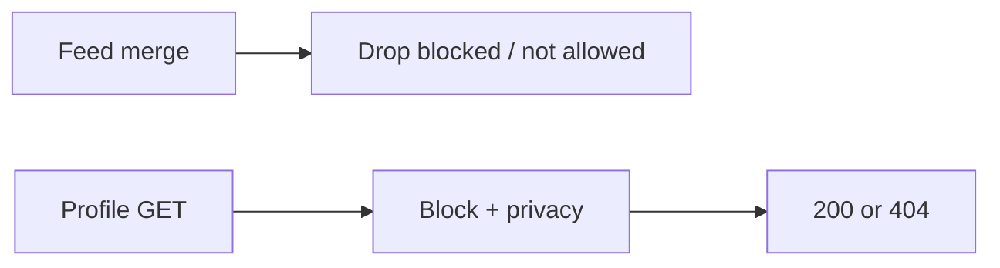

<!-- day-nav -->
[← Day 70 — Flash sale](70-flash-sale.md) · [Day 72 — Ephemeral stories →](72-ephemeral-stories.md)

# Day 71 — Social graph

**Do now**

1. Set a timer.
2. Attempt the problem. Stop at the attempt line. Do not scroll.
3. Then read.

## Time box

35 minutes.

| Minutes | Do this |
|---|---|
| 0–10 | Attempt. Follow and block. Privacy check correct on the read path. |
| 10–28 | Read. Block is not unfollow. Fan-out must honor privacy. |
| 28–35 | Say edge types, indexes, and where block is enforced. |

## Intent

Facing follow and block, leave able to store the graph so a privacy check stays correct on the read path.

## Problem

> Design a social graph.
>
> People follow each other. They can block. Feeds and profile views must respect blocks and private accounts.

## Attempt before reading

10 minutes. Do not scroll.

Write:

1. Edge types: follow, block; direction.
2. Private account + follow request (thin).
3. Where feed (day 51) checks block.
4. Hot celebrity follower list storage.
5. Consistency: unfollow visible how fast?

---

**Stop. Dual indexes for graph walks. Block checked on read and on write fan-out. Bound lag.**

---

## Requirements

**In.** Follow/unfollow, block/unblock, private accounts with approve. Query: followers, following, is-blocked?, can-view?.

**Assumptions.** **100M** users; **200M** follows; blocks rarer. Celebrity **50M** followers — do not materialize full list on one page.

**Out.** Ranking friends, suggestions ML, knowledge graph.

## Estimates

Follow writes **1k**/s peak. Reads dominate. Block checks must be **O(1)** cacheable per pair or bloom + exact.

## API and data

`POST /v1/follows`, `POST /v1/blocks`.

Edges table or wide-column: `(src, type, dest)`, reverse index `(dest, type, src)` for follower lists.

## Design

### Storage

Forward and reverse edges. Sharded by user. Celebrity reverse lists: paginated, never full dump.

### Block semantics

Block(A→B): A does not see B; B does not see A; existing follow edges removed or ignored; notifications stopped. **Enforce on:** profile read, feed merge filter, DM create, search card. Cache `block_pair` with short TTL; on block, invalidate both sides **synchronously enough** (seconds bound).

### Private accounts

Follow request pending; only approved edges fan out (day 51).

### Lag

Unfollow: feed filter on read (day 51) so lag is OK. Block: must not lag minutes — prefer sync invalidate + read filter.

## Diagrams

Caption: "Privacy is on the read path, not only on write."

## Failure the user sees

**Blocked user still in feed for 10 minutes.** Too slow; bug. Bound ≤ few seconds.

**404 vs 403 on private.** Prefer 404 to avoid oracle if product requires.

## Trade-offs

**Materialize allow-list vs check on read.** Check on read with cached edges; materialize for hot paths carefully.

## Talking points

**If block = unfollow.** "Insufficient. Bidirectional hide + invalidate."

## Say this in the room

The graph stores follow and block edges with forward and reverse indexes so we can page followers without loading fifty million ids at once. Block removes or ignores follows and is enforced on feed merge, profile, and messaging — not only as a soft unfollow — with cache invalidation bounded to seconds. Private accounts gate fan-out on approved edges. Celebrity lists are paginated; privacy checks stay on the read path so a stale push inbox cannot resurrect a blocked author after filter.

### Staff depth: block lag SLO

Feed filter + cache invalidate within seconds. Block ≠ unfollow. Celebrity follower lists paginate. 404 vs 403 for private/block oracles — pick and stick.

**What staff sounds like.** Dual indexes, read-path enforcement, seconds not hours.

## Kit artifact

| Follow-up | You answer with |
|---|---|
| "Still seeing them after block?" | Invalidate + feed filter; SLO seconds, not TTL hours. |

## Design log

One line: where block is enforced on read, and the lag bound you stated.

Next: [Day 72 — Ephemeral stories](72-ephemeral-stories.md). Fan-out with real TTL.

---

<!-- day-nav -->
[← Day 70 — Flash sale](70-flash-sale.md) · [Day 72 — Ephemeral stories →](72-ephemeral-stories.md)
