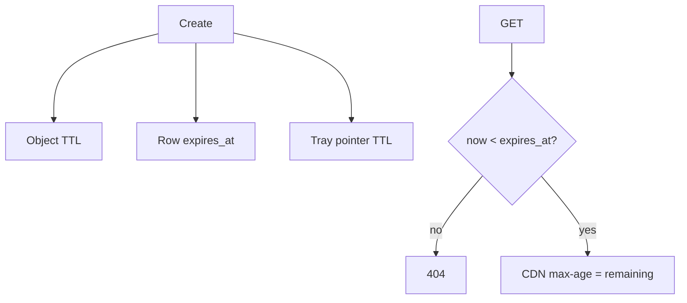

<!-- day-nav -->
[← Day 71 — Social graph](71-social-graph.md) · [Day 73 — Web crawler →](73-web-crawler.md)

# Day 72 — Ephemeral stories

**Do now**

1. Set a timer.
2. Attempt the problem. Stop at the attempt line. Do not scroll.
3. Then read.

## Time box

35 minutes.

| Minutes | Do this |
|---|---|
| 0–10 | Attempt. Posts that disappear. Fan-out with TTL real in storage and caches. |
| 10–28 | Read. UI hiding is not deletion. CDN and inbox must expire. |
| 28–35 | Say TTL in every layer that can resurrect a story. |

## Intent

Facing posts that must disappear, leave able to fan them out with a TTL that is real in storage and caches, not only in the UI.

## Problem

> Design ephemeral stories.
>
> People post stories that should vanish after a fixed time (for example 24 hours). Viewers see them until then. After expiry they must not remain readable via API, cache, or CDN.

## Attempt before reading

10 minutes. Do not scroll.

Write:

1. Create path and fan-out (day 51/52).
2. Where media bytes live; CDN cache headers.
3. Inbox pointers TTL vs media TTL.
4. Screenshot / download — product honesty.
5. After expiry: GET returns what?

---

**Stop. Expiry in row, object lifecycle, cache max-age, and fan-out trim — all four.**

---

## Requirements

**In.** Story create with media; followers view for **24 h** from create. Active viewer list thin. After expiry: **404** same as missing. Delete early by owner.

**Assumptions.** **50M** stories/day; media **2 MB** mean; fan-out hybrid as feed.

**Out.** Permanently archived highlights (separate product), ML ranking of story order.

## Estimates

50e6 × 2 MB = **100 TB/day** ingest if all have media — heavy; often shorter clips. Object lifecycle delete after 24h + grace. Fan-out pointers cheaper than media.

## API and data

`POST /v1/stories` → 201 with expiry. `GET` story if unexpired. Edge list of active stories per followees.

Row: `expires_at`. Object: bucket lifecycle matching expiry + grace for clock skew.

## Design

### Create

Store media; row with expires_at; fan-out pointer with same expiry into follower story trays (or pull author active set).

### Read

Check `expires_at <= now` → 404. CDN: `max-age` ≤ remaining TTL (min with 60s) — **never** cache 24h fixed ignoring remaining. Signed URLs expire.

### After expiry

Sweeper deletes rows and objects; tray trim. CDN may still hit until max-age — bound ≤ 60s after expiry if you set max-age correctly to remaining. Bug: fixed long max-age resurrects stories — refuse.

### Honesty

Clients can screenshot; server TTL is not DRM. Say it.

### Staff arithmetic: four clocks of expiry

Stories die in **~24 h**. Expiry must hit (1) row `expires_at`, (2) object lifecycle/delete, (3) cache/CDN max-age ≤ remaining TTL, (4) fan-out inbox trim — miss any one and a "expired" story still plays. Fan-out is day 51/52 shaped but with aggressive trim. Views counters are approximate; exact view ledgers are a different product on the hottest keys.

## Diagrams

Caption: "Every layer carries the same deadline. UI hide alone is not enough."

## Failure the user sees

**Expired story still plays.** CDN/cache max-age too long, or object not deleted, or inbox still has the id without expiry check on read. Fix all four clocks.

**Story vanishes early.** Clock skew or aggressive trim — bound.

**Celebrity story fan-out.** Same bomb as day 52; pull for huge authors.

**View count exact on read path.** Write amplification on viral story — refuse exact; sample/async.

**Delete by owner.** Must tombstone before max-age; same honesty as pastebin delete vs edge.

## Trade-offs

**TTL in row vs bucket lifecycle only.** Both; row gates reads; bucket cleans bytes.

**Name the refusal inside each alternative.** Against CDN max-age 24h fixed at publish: you refuse serving after expiry when remaining TTL was 1 minute. Against exact view counters on the read path: you refuse a write storm. Against push fan-out for celebrity stories: you refuse day 52's bomb. Against forgetting object delete: you refuse orphan bytes and accidental resurrection via direct URL.

**10× stories.** Same four clocks; more trim workers.

## Talking points

**If they only set DB TTL.** "Cache and CDN and objects too. Four clocks."

**If they ask view counts.** "Approximate. Exact is async and not on the play path."

**If they ask fan-out.** "Day 51/52 hybrid; trim hard at expiry."

**If they ask direct object URL.** "Signed short TTL URLs; bare bucket URLs refused."

**If they ask what pages.** "Served-after-expiry rate (should be ~0), trim lag, object delete lag."

## Say this in the room

Ephemeral stories expire in about a day, and that expiry has to hit the row, the object lifecycle, the cache max-age, and the fan-out trim — miss one and an expired story still plays. Fan-out follows the news-feed hybrid so celebrities do not push millions of inbox rows. View counts are approximate; I refuse exact counters on the play path. Owner delete tombs caches with a bound, same honesty as the pastebin. Signed URLs keep direct object access from resurrecting bytes.

### Staff depth: expiry in row, object lifecycle, cache max-age, and fan-out trim — all four

CDN max-age must be ≤ remaining TTL at publish/refresh. Read path checks `expires_at`.

**Celebrity.** Pull (day 52).

**What staff sounds like.** Four clocks named; refuse exact view writes on play; signed URL bound.

### More probes, with the answer

**"What pages?"** Name the user-visible lag or error metric from Failure — not only CPU. **"What do you refuse?"** Pick one refusal from Trade-offs and say the lie it prevents. **"What is the sensitive assumption?"** The estimate that flips the design if wrong by 10×.

## Kit artifact

| Follow-up | You answer with |
|---|---|
| "Still on CDN?" | max-age = remaining TTL; private bucket + expiring signatures. |

## Design log

One line: a layer you initially forgot to expire in your attempt.

Next: [Day 73 — Web crawler](73-web-crawler.md). Polite frontier, dedupe, freshness.

---

<!-- day-nav -->
[← Day 71 — Social graph](71-social-graph.md) · [Day 73 — Web crawler →](73-web-crawler.md)
