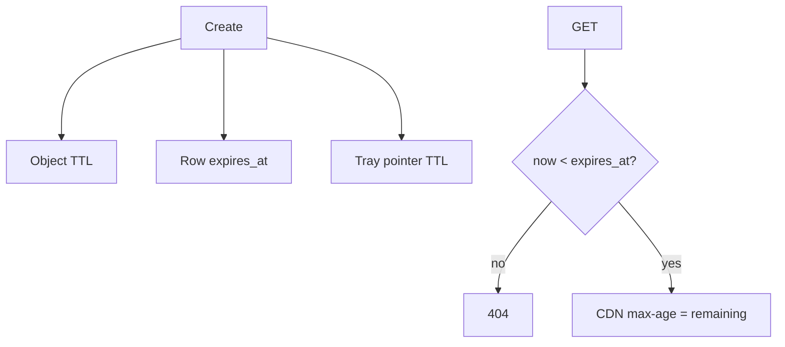

<!-- day-nav -->
[← Day 71 — Social graph](71-social-graph.md) · [Day 73 — Web crawler →](73-web-crawler.md)

# Day 72 — Ephemeral stories

**Do now**

1. Set a timer.
2. Attempt the problem. Stop at the attempt line. Do not scroll.
3. Then read.

## Time box

35 minutes.

| Minutes | Do this |
|---|---|
| 0–10 | Attempt. Posts that disappear. Fan-out with TTL real in storage and caches. |
| 10–28 | Read. UI hiding is not deletion. CDN and inbox must expire. |
| 28–35 | Say TTL in every layer that can resurrect a story. |

## Intent

Facing posts that must disappear, leave able to fan them out with a TTL that is real in storage and caches, not only in the UI.

## Problem

> Design ephemeral stories.
>
> People post stories that should vanish after a fixed time (for example 24 hours). Viewers see them until then. After expiry they must not remain readable via API, cache, or CDN.

## Attempt before reading

10 minutes. Do not scroll.

Write:

1. Create path and fan-out (day 51/52).
2. Where media bytes live; CDN cache headers.
3. Inbox pointers TTL vs media TTL.
4. Screenshot / download — product honesty.
5. After expiry: GET returns what?

---

**Stop. Expiry in row, object lifecycle, cache max-age, and fan-out trim — all four.**

---

## Requirements

**In.** Story create with media; followers view for **24 h** from create. Active viewer list thin. After expiry: **404** same as missing. Delete early by owner.

**Assumptions.** **50M** stories/day; media **2 MB** mean; fan-out hybrid as feed.

**Out.** Permanently archived highlights (separate product), ML ranking of story order.

## Estimates

50e6 × 2 MB = **100 TB/day** ingest if all have media — heavy; often shorter clips. Object lifecycle delete after 24h + grace. Fan-out pointers cheaper than media.

## API and data

`POST /v1/stories` → 201 with expiry. `GET` story if unexpired. Edge list of active stories per followees.

Row: `expires_at`. Object: bucket lifecycle matching expiry + grace for clock skew.

## Design

### Create

Store media; row with expires_at; fan-out pointer with same expiry into follower story trays (or pull author active set).

### Read

Check `expires_at <= now` → 404. CDN: `max-age` ≤ remaining TTL (min with 60s) — **never** cache 24h fixed ignoring remaining. Signed URLs expire.

### After expiry

Sweeper deletes rows and objects; tray trim. CDN may still hit until max-age — bound ≤ 60s after expiry if you set max-age correctly to remaining. Bug: fixed long max-age resurrects stories — refuse.

### Honesty

Clients can screenshot; server TTL is not DRM. Say it.

## Diagrams

Caption: "Every layer carries the same deadline. UI hide alone is not enough."

## Failure the user sees

**CDN serves story +2 hours.** Mis-set max-age — severity high for ephemeral product.

**Row deleted, object remains.** Orphan bytes; lifecycle should catch; not publicly addressed if bucket private + signed URL expired.

## Trade-offs

**Pull active stories vs push trays.** Same hybrid as feed; trays must TTL trim.

## Talking points

**If they only hide in UI.** "API and CDN still serve — fail."

## Say this in the room

Stories carry expires_at into the row, the object lifecycle, the fan-out tray pointers, and the CDN max-age — which is set to the remaining TTL, not a flat day — so a GET after expiry is 404 and an edge cannot resurrect the media for hours. Fan-out follows the feed hybrid; trim expired pointers. Screenshots are outside server TTL; we do not pretend otherwise. Early delete tombs all layers the same way.

### Staff depth: max-age = remaining TTL

Flat 24h CDN cache resurrects stories after expiry. Signed URLs expire; bucket lifecycle matches. Tray pointers trim. UI hide alone fails the product.

**What staff sounds like.** Four layers listed with the same deadline; screenshot honesty.

## Kit artifact

| Follow-up | You answer with |
|---|---|
| "Still on CDN?" | max-age = remaining TTL; private bucket + expiring signatures. |

## Design log

One line: a layer you initially forgot to expire in your attempt.

Next: [Day 73 — Web crawler](73-web-crawler.md). Polite frontier, dedupe, freshness.

---

<!-- day-nav -->
[← Day 71 — Social graph](71-social-graph.md) · [Day 73 — Web crawler →](73-web-crawler.md)
