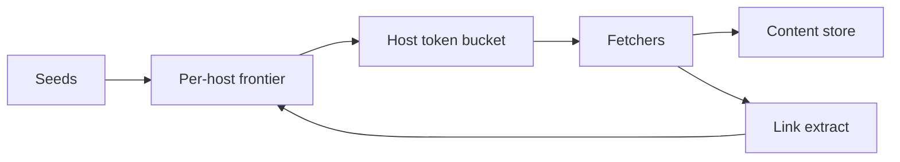

<!-- day-nav -->
[← Day 72 — Ephemeral stories](72-ephemeral-stories.md) · [Day 74 — Order book →](74-order-book.md)

# Day 73 — Web crawler

**Do now**

1. Set a timer.
2. Attempt the problem. Stop at the attempt line. Do not scroll.
3. Then read.

## Time box

40 minutes.

| Minutes | Do this |
|---|---|
| 0–12 | Attempt. Polite frontier, dedupe, freshness. Do not melt one host. |
| 12–32 | Read. robots.txt, per-host budgets, URL normalization. |
| 32–40 | Say frontier structure, politeness, and re-crawl policy. |

## Intent

Facing the public web as input, leave able to run a polite frontier with dedupe and freshness so one host is not melted.

## Problem

> Design a web crawler.
>
> You discover URLs, fetch pages, extract links, and keep content reasonably fresh. You must not overwhelm any single host.

## Attempt before reading

12 minutes. Do not scroll.

Write:

1. Frontier: prioritized URL queue.
2. Per-host rate limit / politeness delay.
3. Dedupe: URL canonicalization + content hash.
4. Freshness: revisit schedule.
5. Failure: soft 404, traps, infinite calendars.

---

**Stop. Host-aware frontier. Canonical dedupe. Budgeted politeness.**

---

## Requirements

**In.** Billions of URLs over time; continuous crawl. Honor robots.txt. Per-host QPS caps. Store raw + extracted links. Recrawl by change rate.

**Assumptions.** Fetch capacity **100k**/s global; per host default **1**/s unless crawl-delay. Seed set large.

**Out.** Full search ranking (day 57 is product catalog; web search ranking out), JS rendering farm deep dive (mention as optional tier), malware detonation.

## Estimates

100k fetches/s × 50 KB = **5 GB/s** ingest — pipeline and storage plan. Frontier size >> RAM; persist prioritized queues per host.

## API and data

Internal: frontier lease URL → fetcher → store → parser → enqueue links.

URL key: canonical form. Host key: pay-level domain / host.

robots cache per host.

## Design

### Frontier

Per-host queues + global scheduler that picks next host with available budget (token bucket). Prefer important URLs (seed, high inlink — simple score, not a model lecture).

### Politeness

Default gap; robots crawl-delay; back off on 5xx/429. Never stampede a host with 1k parallel from many workers — **central host budget**.

### Dedupe

Normalize scheme/host/trailing slash/query allow-list. Content hash: skip store if unchanged; still may refresh discover time.

### Traps

Cap path depth, query params, calendar patterns; cloaking detection thin.

### Freshness

Adaptive revisit: change often → hours; static → weeks. Priority queue by `next_fetch_at`.

## Diagrams

Caption: "Scheduler is host-aware. Workers never bypass the bucket."

## Failure the user sees

**One host melted.** Bug in budget → legal/reputation; page on per-host send rate.

**Frontier deadlock.** All budgets empty; idle capacity — scheduler bug.

**robots stale.** Fetch disallowed path — refresh robots often enough; fail closed on fetch error of robots if policy says.

## Trade-offs

**Per-host vs per-IP budget.** Shared hosting complicates; start per-host.

**Headless render.** Expensive; only for allow-listed needs.

## Talking points

**If they use one global Kafka without host caps.** "Workers will synchronize on popular hosts and melt them."

## Say this in the room

The crawler is a host-aware frontier: each host has a queue and a token bucket so global capacity cannot concentrate on one origin. URLs are canonicalized for dedupe; content hashes skip unchanged bodies; revisit schedules adapt to change rate. robots.txt and crawl-delay gate fetches, with backoff on 429/5xx. Infinite spaces are capped by depth and pattern rules. Fetchers only receive URLs the scheduler admits — they do not self-serve popular hosts.

### Staff depth: centralized host budgets

Many fetchers + one popular host without a token bucket = legal letter. robots + crawl-delay + 429 backoff. Canonical dedupe and trap caps. Adaptive revisit — not one global interval.

**What staff sounds like.** Politeness as scheduler law; workers never self-serve hot hosts.

## Kit artifact

| Follow-up | You answer with |
|---|---|
| "Politeness?" | Per-host token bucket + robots + backoff; centralized budget. |

## Design log

One line: how you prevented many workers from hitting one host in parallel.

Next: [Day 74 — Order book](74-order-book.md). Single sequence matcher; rebuild after crash.

---

<!-- day-nav -->
[← Day 72 — Ephemeral stories](72-ephemeral-stories.md) · [Day 74 — Order book →](74-order-book.md)
