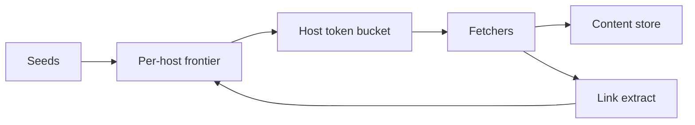

<!-- day-nav -->
[← Day 72 — Ephemeral stories](72-ephemeral-stories.md) · [Day 74 — Order book →](74-order-book.md)

# Day 73 — Web crawler

**Do now**

1. Set a timer.
2. Attempt the problem. Stop at the attempt line. Do not scroll.
3. Then read.

## Time box

40 minutes.

| Minutes | Do this |
|---|---|
| 0–12 | Attempt. Polite frontier, dedupe, freshness. Do not melt one host. |
| 12–32 | Read. robots.txt, per-host budgets, URL normalization. |
| 32–40 | Say frontier structure, politeness, and re-crawl policy. |

## Intent

Facing the public web as input, leave able to run a polite frontier with dedupe and freshness so one host is not melted.

## Problem

> Design a web crawler.
>
> You discover URLs, fetch pages, extract links, and keep content reasonably fresh. You must not overwhelm any single host.

## Attempt before reading

12 minutes. Do not scroll.

Write:

1. Frontier: prioritized URL queue.
2. Per-host rate limit / politeness delay.
3. Dedupe: URL canonicalization + content hash.
4. Freshness: revisit schedule.
5. Failure: soft 404, traps, infinite calendars.

---

**Stop. Host-aware frontier. Canonical dedupe. Budgeted politeness.**

---

## Requirements

**In.** Billions of URLs over time; continuous crawl. Honor robots.txt. Per-host QPS caps. Store raw + extracted links. Recrawl by change rate.

**Assumptions.** Fetch capacity **100k**/s global; per host default **1**/s unless crawl-delay. Seed set large.

**Out.** Full search ranking (day 57 is product catalog; web search ranking out), JS rendering farm deep dive (mention as optional tier), malware detonation.

## Estimates

100k fetches/s × 50 KB = **5 GB/s** ingest — pipeline and storage plan. Frontier size >> RAM; persist prioritized queues per host.

## API and data

Internal: frontier lease URL → fetcher → store → parser → enqueue links.

URL key: canonical form. Host key: pay-level domain / host.

robots cache per host.

## Design

### Frontier

Per-host queues + global scheduler that picks next host with available budget (token bucket). Prefer important URLs (seed, high inlink — simple score, not a model lecture).

### Politeness

Default gap; robots crawl-delay; back off on 5xx/429. Never stampede a host with 1k parallel from many workers — **central host budget**.

### Dedupe

Normalize scheme/host/trailing slash/query allow-list. Content hash: skip store if unchanged; still may refresh discover time.

### Traps

Cap path depth, query params, calendar patterns; cloaking detection thin.

### Freshness

Adaptive revisit: change often → hours; static → weeks. Priority queue by `next_fetch_at`.

### Staff arithmetic: politeness is capacity

Crawl QPS is bounded **per host**, not globally — one huge site would starve the frontier if you only have a global QPS. Frontier is host-aware queues; politeness delay from robots/crawl-delay; budget per domain. Canonicalization + content hash dedupe stop the same page via many URLs from exploding storage. Recrawl priority ≠ BFS forever; freshness budgets matter. 100M URLs × politeness is a scheduling problem, not a wget loop.

## Diagrams

Caption: "Scheduler is host-aware. Workers never bypass the bucket."

## Failure the user sees

**Banned by a major host.** Too aggressive; missing that site's pages. Politeness and shared IP reputation matter.

**Duplicate near-identical pages.** Storage and ranking pollution — canonical + hash dedupe.

**Frontier explosion.** Redirect/calendar traps; budget per host and max depth/URL patterns.

**Stale corpus.** Recrawl never revisits important hosts — freshness policy missing.

**robots.txt ignored.** Legal/product failure; cache robots with TTL and obey.

## Trade-offs

**BFS vs prioritized freshness.** Priority by importance/change rate for production; BFS for teaching.

**Name the refusal inside each alternative.** Against global-only rate limit: you refuse host bans and unfairness. Against storing every URL variant: you refuse dedupe death. Against ignoring robots: you refuse policy violation. Against unbounded JS-rendered crawl as default: you refuse a second browser farm unless required. Against one queue for all hosts: you refuse head-of-line blocking by one slow host.

**10× URLs.** More frontier workers; per-host caps unchanged.

## Talking points

**If they use one global QPS.** "Per-host politeness or you get banned and you starve small hosts."

**If they ask dedupe.** "Canonical URL + content hash. Redirect chains resolve before enqueue."

**If they ask JS rendering.** "Optional expensive path for allow-listed hosts; not default."

**If they ask what pages.** "Per-host error/ban rate, frontier size growth, robots fetch failures."

**If they ask seeding.** "Seed set + sitemaps; not a single homepage forever."

## Say this in the room

A crawler is a host-aware frontier with per-host politeness budgets, not a global wget loop — one huge domain must not starve the rest or get us banned. We canonicalize and content-hash to dedupe, obey robots.txt with a cached copy, and recrawl by freshness priority rather than blind BFS forever. Redirect and calendar traps get depth/budget caps. Rendering JS is an allow-listed expensive path, not the default.

### Staff depth: host-aware frontier

Per-host queues + crawl-delay. Global QPS alone is insufficient.

**Dedupe.** Canonical + hash.

**What staff sounds like.** Politeness as capacity; refuse trap explosion; robots obeyed.

### More probes, with the answer

**"What pages?"** Name the user-visible lag or error metric from Failure — not only CPU. **"What do you refuse?"** Pick one refusal from Trade-offs and say the lie it prevents. **"What is the sensitive assumption?"** The estimate that flips the design if wrong by 10×.

## Kit artifact

| Follow-up | You answer with |
|---|---|
| "Politeness?" | Per-host token bucket + robots + backoff; centralized budget. |

## Design log

One line: how you prevented many workers from hitting one host in parallel.

Next: [Day 74 — Order book](74-order-book.md). Single sequence matcher; rebuild after crash.

---

<!-- day-nav -->
[← Day 72 — Ephemeral stories](72-ephemeral-stories.md) · [Day 74 — Order book →](74-order-book.md)
