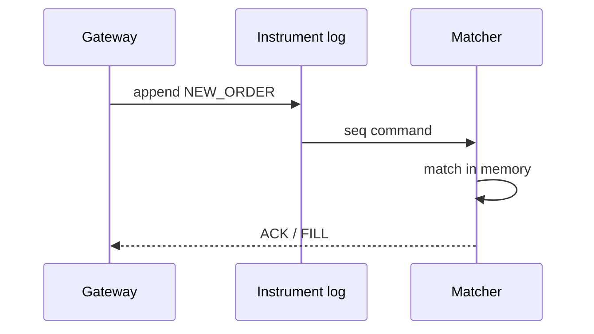
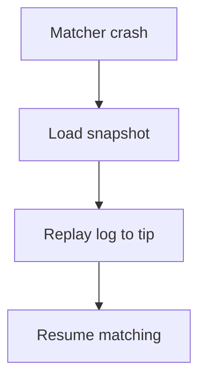

<!-- day-nav -->
[← Day 73 — Web crawler](73-web-crawler.md) · [Day 75 — Feature flags →](75-feature-flags.md)

# Day 74 — Order book

**Do now**

1. Set a timer.
2. Attempt the problem. Stop at the attempt line. Do not scroll.
3. Then read.

## Time box

40 minutes.

| Minutes | Do this |
|---|---|
| 0–12 | Attempt. Match one instrument on a single sequence. Rebuild after matcher crash. |
| 12–32 | Read. Multi-writer matching forks the book. Persistence is the log of orders/events. |
| 32–40 | Say the matching leader, the log, and recovery. |

## Intent

Facing buy and sell orders, leave able to match one instrument on a single sequence and rebuild the book after the matcher crashes.

## Problem

> Design an order book.
>
> Traders submit buy and sell orders for one instrument. The system matches them by price-time priority. If the matcher dies, you must restore the book correctly.

## Attempt before reading

12 minutes. Do not scroll.

Write:

1. Order types in scope (limit only is fine).
2. Why one sequencer / leader per instrument.
3. Persistence: event log vs snapshot+log.
4. Client ack: when is the order "in the book"?
5. Recovery time and what traders see during it.

---

**Stop. Single matcher sequence. Durable event log. Snapshot for fast rebuild.**

---

## Requirements

**In.** Limit orders, cancel, market thin optional. Price-time priority. Trades emit fills. Per-instrument partition. Deterministic replay.

**Assumptions.** **50k** order messages/s peak on a hot instrument; **1,000** instruments (each own matcher). Latency **µs–ms** in-process; network RTT dominates for clients.

**Out.** Multi-venue smart order routing, market data UI polish, regulatory surveillance ML, cross-instrument atomicity.

## Estimates

Hot instrument 50k msgs/s — one thread/core matcher is a known pattern; persistence must not destroy determinism (async replicate log with care, or store-and-match).

## API and data

`NEW_ORDER`, `CANCEL` → gateway → instrument partition.

Outbound: `ACK`, `FILL`, `CANCEL_ACK`, market data diffs.

**Log:** totally ordered events per instrument. **Snapshot:** book hash + last seq.

## Design

### Matching

Single-threaded matcher per instrument consumes seq commands, updates memory book, emits events. **No** concurrent mutators.

### Durability

Append command to log **before** or as part of applying (designer choice): commonly log durable then apply for crash safety of acks. Ack to client after durable for that policy. Snapshot every N ms / M events.

### Recovery

Load latest snapshot; replay log to tip; resume. Gateways buffer or reject with "reconnecting." RPO=0 if ack after durable.

### Fence

Old matcher must not apply after new leader — epoch in log (day 36). Dual matchers = divergent books = catastrophe.

### Staff arithmetic: single matcher sequence

Matching must be **totally ordered** per instrument — one matcher sequence (or deterministic leader) so two sells cannot both match the same bid. Ingress can shard by symbol; within a symbol, one pipeline. Market data fan-out is a read path (day 54 cousin): append an event log, subscribers get streams; do not make every match write N user inboxes. Persistence: command/event log + snapshot for fast rebuild after crash. Self-trade prevention and rate limits are product rules on the hot path.

## Diagrams

Caption: "One sequence. Memory book is a projection of the log."

Caption: "Rebuild is deterministic replay, not inventing state."

## Failure the user sees

**Double match.** Two takers fill the same resting liquidity — money bug. Caused by parallel matchers without a fence.

**Matcher down.** Trading halt on that symbol; 503 cancels/new orders. Snapshot+log rebuild within SLO (seconds to low minutes). Other symbols fine if sharded.

**Gap in market data.** Client sees wrong top of book — resync from seq, like chat catch-up.

**Self-trade.** User hits own order; prevent or cancel-resting per policy.

**Clock for time-priority.** Matcher sequence is priority, not NTP between clients.

## Trade-offs

**In-memory book + log vs DB row per level.** In-memory for latency; log is truth for rebuild.

**Name the refusal inside each alternative.** Against multi-threaded match without ordering: you refuse double fills. Against Kafka-as-matcher without a single consumer per symbol: you refuse races. Against rebuilding only from DB snapshots without the event log: you refuse lost fills. Against client clocks for priority: you refuse unfair ordering.

**10× messages.** Still one sequence per symbol; scale by symbols and hardware; or core-affinity.

## Talking points

**If they shard one symbol's match.** "Only if deterministic merge — usually do not. Shard by symbol."

**If they ask persistence.** "Event log every accept/match/cancel; snapshot periodically; rebuild on boot."

**If they ask fairness.** "Price-time priority inside the matcher sequence. Ingress rate limits per firm."

**If they ask market data.** "Seq'd event stream; clients catch up on gap. Not per-user inbox copies."

**If they ask what pages.** "Matcher lag, rebuild time, sequence gaps on the data feed."

## Say this in the room

An order book for one instrument is a single matcher sequence: orders get a total order, matches are deterministic, and persistence is an event log plus snapshots for rebuild — not concurrent matchers hoping for the best. Market data is a sequenced fan-out stream, not N inbox writes per fill. If the matcher dies we halt that symbol and rebuild from log within a stated SLO. Client clocks do not decide time priority. Self-trade controls sit on the hot path.

### Staff depth: single matcher sequence

One leader/pipeline per symbol. Log + snapshot. Data feed is seq'd.

**What staff sounds like.** Refuse parallel match; rebuild SLO; sequenced market data.

### More probes, with the answer

**"What pages?"** Name the user-visible lag or error metric from Failure — not only CPU. **"What do you refuse?"** Pick one refusal from Trade-offs and say the lie it prevents. **"What is the sensitive assumption?"** The estimate that flips the design if wrong by 10×.

## Kit artifact

| Follow-up | You answer with |
|---|---|
| "Matcher dies." | Snapshot + deterministic replay; fence epoch; pause then resume. |

## Design log

One line: when you ack relative to durable log, and how recovery rebuilds.

Next: [Day 75 — Feature flags](75-feature-flags.md). Low-latency flags, stale bound.

---

<!-- day-nav -->
[← Day 73 — Web crawler](73-web-crawler.md) · [Day 75 — Feature flags →](75-feature-flags.md)
