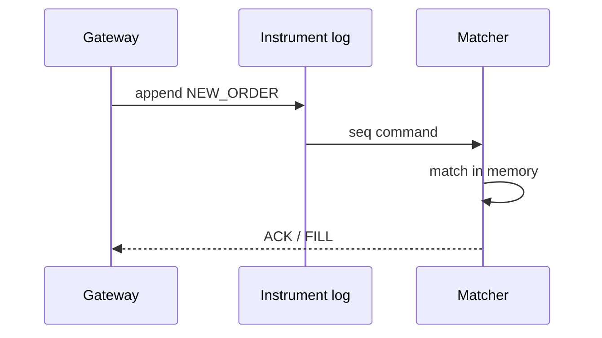
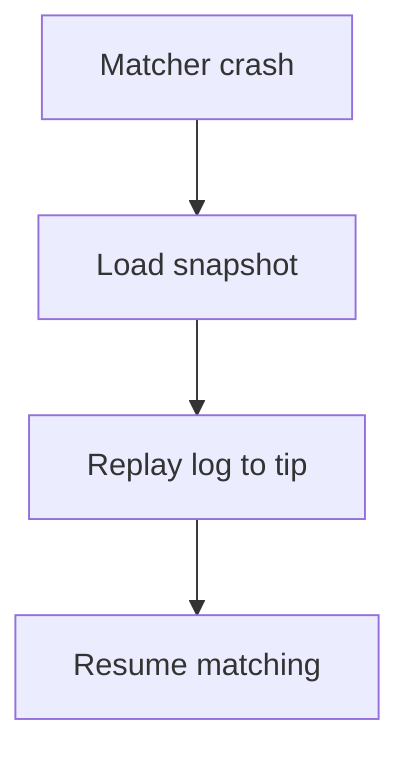

<!-- day-nav -->
[← Day 73 — Web crawler](73-web-crawler.md) · [Day 75 — Feature flags →](75-feature-flags.md)

# Day 74 — Order book

**Do now**

1. Set a timer.
2. Attempt the problem. Stop at the attempt line. Do not scroll.
3. Then read.

## Time box

40 minutes.

| Minutes | Do this |
|---|---|
| 0–12 | Attempt. Match one instrument on a single sequence. Rebuild after matcher crash. |
| 12–32 | Read. Multi-writer matching forks the book. Persistence is the log of orders/events. |
| 32–40 | Say the matching leader, the log, and recovery. |

## Intent

Facing buy and sell orders, leave able to match one instrument on a single sequence and rebuild the book after the matcher crashes.

## Problem

> Design an order book.
>
> Traders submit buy and sell orders for one instrument. The system matches them by price-time priority. If the matcher dies, you must restore the book correctly.

## Attempt before reading

12 minutes. Do not scroll.

Write:

1. Order types in scope (limit only is fine).
2. Why one sequencer / leader per instrument.
3. Persistence: event log vs snapshot+log.
4. Client ack: when is the order "in the book"?
5. Recovery time and what traders see during it.

---

**Stop. Single matcher sequence. Durable event log. Snapshot for fast rebuild.**

---

## Requirements

**In.** Limit orders, cancel, market thin optional. Price-time priority. Trades emit fills. Per-instrument partition. Deterministic replay.

**Assumptions.** **50k** order messages/s peak on a hot instrument; **1,000** instruments (each own matcher). Latency **µs–ms** in-process; network RTT dominates for clients.

**Out.** Multi-venue smart order routing, market data UI polish, regulatory surveillance ML, cross-instrument atomicity.

## Estimates

Hot instrument 50k msgs/s — one thread/core matcher is a known pattern; persistence must not destroy determinism (async replicate log with care, or store-and-match).

## API and data

`NEW_ORDER`, `CANCEL` → gateway → instrument partition.

Outbound: `ACK`, `FILL`, `CANCEL_ACK`, market data diffs.

**Log:** totally ordered events per instrument. **Snapshot:** book hash + last seq.

## Design

### Matching

Single-threaded matcher per instrument consumes seq commands, updates memory book, emits events. **No** concurrent mutators.

### Durability

Append command to log **before** or as part of applying (designer choice): commonly log durable then apply for crash safety of acks. Ack to client after durable for that policy. Snapshot every N ms / M events.

### Recovery

Load latest snapshot; replay log to tip; resume. Gateways buffer or reject with "reconnecting." RPO=0 if ack after durable.

### Fence

Old matcher must not apply after new leader — epoch in log (day 36). Dual matchers = divergent books = catastrophe.

## Diagrams

Caption: "One sequence. Memory book is a projection of the log."

Caption: "Rebuild is deterministic replay, not inventing state."

## Failure the user sees

**Matcher failover 2 s.** Orders pause; then continue. Duplicate NEW if client retries without idemp — use cl_ord_id unique.

**Ack before durable.** Crash loses acked order — refuse that policy for this product.

## Trade-offs

**Log-then-match vs match-then-log.** Log-then-match safer for money; slightly higher latency.

**Snapshot frequency.** Faster recovery vs IO.

## Talking points

**If they shard one instrument's book.** "Breaks price-time. Shard instruments, not the book."

## Say this in the room

Each instrument has one matcher and one totally ordered command log — price-time priority needs a single sequence, not a committee. The in-memory book is a projection; we snapshot and replay the log to recover after a crash, with fencing so an old matcher cannot diverge the book. Client acks follow the durability policy (ack after the command is durable). Retries use client order ids so reconnects do not double-enter. We shard by instrument, never by price level on the same book.

### Staff depth: ack after durable, rebuild by replay

Match-then-lose-log loses acked orders. Snapshot + deterministic replay; fence old matcher. Shard by instrument, never by side of one book.

**What staff sounds like.** Single sequence; RPO policy spoken; dual matcher = catastrophe.

## Kit artifact

| Follow-up | You answer with |
|---|---|
| "Matcher dies." | Snapshot + deterministic replay; fence epoch; pause then resume. |

## Design log

One line: when you ack relative to durable log, and how recovery rebuilds.

Next: [Day 75 — Feature flags](75-feature-flags.md). Low-latency flags, stale bound.

---

<!-- day-nav -->
[← Day 73 — Web crawler](73-web-crawler.md) · [Day 75 — Feature flags →](75-feature-flags.md)
