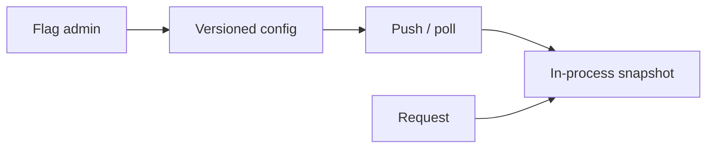
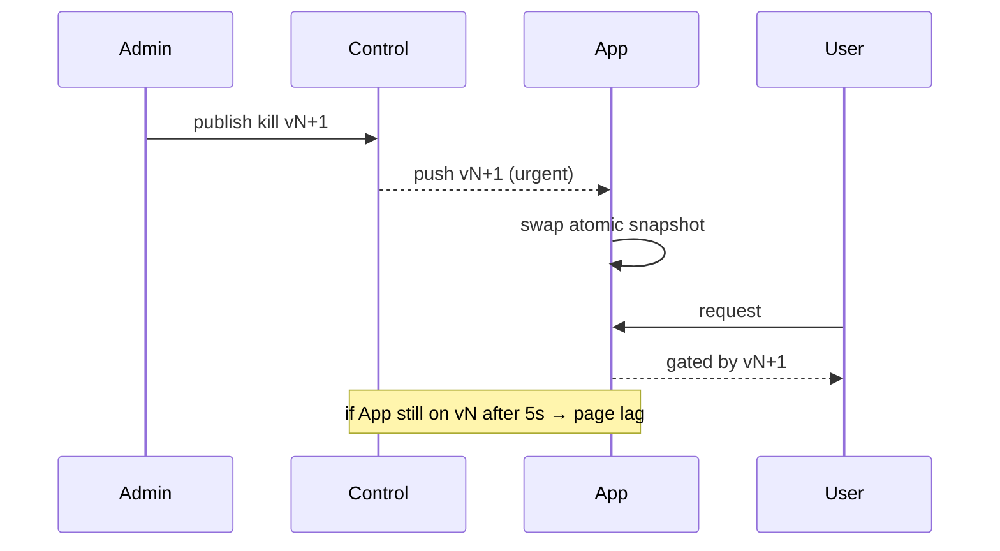

<!-- day-nav -->
[← Day 74 — Order book](74-order-book.md) · [Day 76 — Audit log →](76-audit-log.md)

# Day 75 — Feature flags

**Do now**

1. Set a timer.
2. Attempt the problem. Stop at the attempt line. Do not scroll.
3. Then read.

## Time box

35 minutes.

| Minutes | Do this |
|---|---|
| 0–10 | Attempt. Flag and kill switch at low latency. Bound client staleness. |
| 10–28 | Read. Flag eval on every request needs local data — not a remote call each time. |
| 28–35 | Say publish path, local cache, and kill-switch urgency. |

## Intent

Facing a risky rollout, leave able to serve a flag or kill switch at low latency and bound how stale a client may be.

## Problem

> Design feature flags.
>
> Engineers toggle features and kill switches. Services evaluate flags on requests without adding much latency. When a kill switch flips, the bound until all servers obey must be stated.

## Attempt before reading

10 minutes. Do not scroll.

Write:

1. Flag config model (boolean, percentage, targeting rules — keep rules modest).
2. Eval path latency budget (microseconds–low ms local).
3. How updates propagate; max staleness.
4. Kill switch vs marketing flag — different SLO?
5. Consistency: two servers disagree briefly — OK?

---

**Stop. Control plane publish. Data plane local snapshot. Stale bound. Kill switch faster path.**

---

## Requirements

**In.** CRUD flags; percentage rollout; optional attributes (user id hash bucketing). Eval SDK in-process. Kill switch global. Audit who changed what (pointer day 76).

**Assumptions.** **10,000** services/instances; **1,000** flags; eval **millions**/s across fleet. Change rate low — a few publishes per hour, not per second.

**Out.** Full experimentation platform stats engine, ML targeting.

## Estimates

Payload of all flags **≪ 1 MB** typically — fit memory. Push or poll every **10–30 s**; kill switch **≤ 5 s** bound via urgent push / short poll.

**Staff arithmetic: fleet, bytes, and lag.** 1,000 flags × ~200 B each ≈ **200 KB** snapshot — trivial RAM on every process. At **10,000** instances, a full push fan-out is 10k deliveries of ~200 KB ≈ **2 GB** control-plane egress per publish, not request-path load. Poll every **30 s** means worst-case routine stale ≈ **30 s** plus download time; at 10k instances staggered, control plane sees ~10k/30 ≈ **333** polls/s — fine for a small config service. Kill switch **≤ 5 s**: that bound is a product SLO, not a hope — if 5% of instances are still on the old version after 5 s, you page on `flag_version_lag`, not on CPU. Eval at millions/s is free only because it is a pure function of a local map; one Redis round-trip per request at 1 ms would add **1M ms/s** of fleet wait and couple availability to the flag store.

## API and data

Control API → versioned config document. SDK: `isEnabled(flag, ctx)`.

Store: flag definitions + version. CDN/edge for large fleets optional.

**What you refuse on the wire.** Client-supplied `percentage` or `enabled` that overrides server bucketing for security/payment flags. A public unauthenticated admin API. Eval RPCs on the request path.

## Design

### Data plane

SDK holds atomic snapshot. Eval pure function — **no network on request path**. Missing flag → default safe (fail closed for dangerous features).

### Control plane

Publish new version; push to agents (SSE/websocket) + poll fallback. Instances ack version metrics.

### Kill switch

Separate channel or same with priority; page if % of instances > bound still on old version after deadline.

### Bucketing

Hash user_id + flag → sticky percentage. Server-side only; client-supplied % is not trusted for security flags.

### Split brain

Brief disagreement OK for UX flags; for authz kill switches, prefer fail closed defaults and faster push.

### Staff arithmetic: control plane vs data plane

Flag changes publish from a control plane to many app processes. Data plane keeps a **local snapshot**; evaluate rules in-process (no remote call on every request). Stale bound (e.g. **30–60 s**) spoken — longer is a product risk for kills. Kill switch needs a **faster path** (push/short poll) than routine percentage rollouts. Targeting rules (user id %, country) must be pure functions of attributes you already have — flag service down must fail closed or open **per flag**, not freeze the site.

**Canary the config itself.** A typo that sets `enabled: true` at 100% is a self-DoS or a security hole. Publish to **1% of instances** (or one cell) first; watch error and business metrics; then widen. The flag system needs a rollout for its own documents, not only for the features it gates.

## Diagrams

Caption: "Request path never waits on the control plane."

Caption: "Kill switch is a version race with a deadline, not a Slack message."

## Failure the user sees

**Flag flip takes 30 minutes.** Stale snapshot; kill switch useless. Bound the propagate SLO; push for critical flags.

**Flag service down, apps block.** Every request waits on remote eval — outage. Local snapshot required.

**Wrong default on miss.** New flag missing in snapshot — fail closed for risky, fail open for irreversible UX? Say per flag.

**Percentage sticky?** Same user should see stable bucket (hash user id + flag) unless you want flicker.

**Config typo enables for 100%.** Need review/canary of the flag config itself; progressive rollout.

**Split brain during a kill.** Half the fleet still serves the bad path for minutes. Users see intermittent failures or intermittent exposure. Page on version histogram skew, not only on "publish succeeded."

**Bootstrap cold start.** New instance has empty snapshot and either blocks on fetch (joins the outage) or serves hard-coded defaults. Prefer fail-closed defaults baked into the binary for kill-class flags, then refresh.

## Trade-offs

**Push vs poll.** Poll simple; push for kill. Hybrid common.

**Name the refusal inside each alternative.** Against remote eval on each request: you refuse coupling availability to the flag service. Against unbounded stale: you refuse a kill switch that cannot kill. Against random() per request without stickiness: you refuse flickering UX and broken experiments. Against one global fail-open: you refuse dangerous defaults for payments flags.

**10× apps.** Same publish; more subscribers. Snapshot size stays small. Push fan-out and poll QPS scale linearly with instance count — say when you need a fan-out bus or edge-cached config blob.

**CDN for the snapshot vs direct from control.** CDN absorbs 10× polls; adds a cache-purge problem for kills — kills must bypass or purge with a hard deadline.

## Talking points

**If they call Redis every request.** "Local snapshot. Flag service outage must not be site outage."

**If they ask kill switch.** "Faster propagate path; page on propagate lag for critical flags."

**If they ask percentage.** "Hash(user, flag) sticky. Not coin flip per request."

**If they ask defaults.** "Per-flag fail closed/open. Payments-like flags fail closed."

**If they ask what pages.** "Propagate lag, snapshot age, eval errors — and accidental 100% enables."

**If they say "eventual consistency is fine."** "For a marketing banner, yes — name 60 s. For a payments kill, 60 s is an incident. Different flags, different SLOs."

**If they put targeting rules in the client binary.** "Then a kill needs an app store release. Server-side snapshot, or you do not have a kill switch."

## Say this in the room

Feature flags evaluate from a local snapshot in the data plane so the flag control plane can die without taking the site down. Routine rollouts can poll within about a minute; kill switches use a faster push path with a stated lag SLO — at ten thousand instances I page if a material fraction is still on the old version after five seconds. Percentage targeting is sticky on hash(user, flag), not a coin flip per request. Defaults on missing flags are per-flag — fail closed for risky paths. I canary the config document itself before a 100% enable. I page on propagate lag and version skew for critical flags, not only on control-plane CPU.

### Staff depth: control plane publish, data plane local snapshot

Stale bound spoken. Kill switch faster. Sticky bucketing. Config canary.

**What staff sounds like.** Local eval; refuse remote-per-request; kill lag SLO; version histogram.

### More probes, with the answer

**"What pages?"** `flag_version_lag` (fraction of instances behind kill deadline), snapshot age p99, accidental 100% enable rate, and eval errors — not control-plane CPU alone. **"What do you refuse?"** Remote eval on the request path (site dies with the flag service); unbounded stale on kills; client-supplied bucketing for security flags; one global fail-open default. **"What is the sensitive assumption?"** Instance count and kill lag SLO — at 10× instances, push fan-out and poll QPS force a bus or edge-cached blob; if product needs ≤1 s kill, poll-only is already false. **"Where does the time go?"** Lock local snapshot + per-flag default + kill lag number before debating LaunchDarkly vs home-grown.

## Worked numbers you can reuse

| Quantity | Planning value | Why it matters |
|---|---|---|
| Flags | 1,000 | Snapshot size |
| Snapshot | ~200 KB | Fits every process |
| Instances | 10,000 | Push/poll fan-out |
| Routine poll | 10–30 s | UX stale bound |
| Kill lag SLO | ≤ 5 s | Page on version skew |
| Poll QPS (30 s) | ~333/s | Control-plane sizing |
| Remote eval tax | 1 ms × 1M eval/s | Why local is non-negotiable |

If the interviewer doubles instance count, recompute fan-out before inventing a new store. If they demand ≤1 s kill with poll-only every 30 s, refuse — push or short-poll is required.

## Kit artifact

| Follow-up | You answer with |
|---|---|
| "Kill switch now." | Urgent push + lag SLO + page on old versions. |
| "Flag service is down." | Local snapshot; per-flag defaults; site stays up. |

## Design log

One line: your staleness bound for kill vs normal flags.

Next: [Day 76 — Audit log](76-audit-log.md). Append, query, retention, tamper claim.

---

<!-- day-nav -->
[← Day 74 — Order book](74-order-book.md) · [Day 76 — Audit log →](76-audit-log.md)
