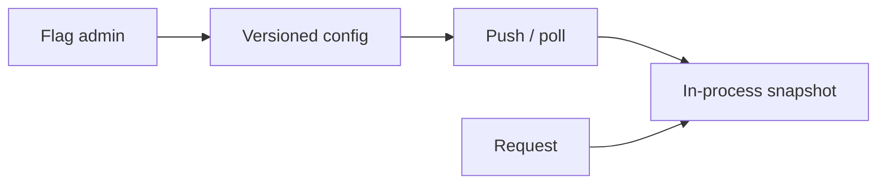

<!-- day-nav -->
[← Day 74 — Order book](74-order-book.md) · [Day 76 — Audit log →](76-audit-log.md)

# Day 75 — Feature flags

**Do now**

1. Set a timer.
2. Attempt the problem. Stop at the attempt line. Do not scroll.
3. Then read.

## Time box

35 minutes.

| Minutes | Do this |
|---|---|
| 0–10 | Attempt. Flag and kill switch at low latency. Bound client staleness. |
| 10–28 | Read. Flag eval on every request needs local data — not a remote call each time. |
| 28–35 | Say publish path, local cache, and kill-switch urgency. |

## Intent

Facing a risky rollout, leave able to serve a flag or kill switch at low latency and bound how stale a client may be.

## Problem

> Design feature flags.
>
> Engineers toggle features and kill switches. Services evaluate flags on requests without adding much latency. When a kill switch flips, the bound until all servers obey must be stated.

## Attempt before reading

10 minutes. Do not scroll.

Write:

1. Flag config model (boolean, percentage, targeting rules — keep rules modest).
2. Eval path latency budget (microseconds–low ms local).
3. How updates propagate; max staleness.
4. Kill switch vs marketing flag — different SLO?
5. Consistency: two servers disagree briefly — OK?

---

**Stop. Control plane publish. Data plane local snapshot. Stale bound. Kill switch faster path.**

---

## Requirements

**In.** CRUD flags; percentage rollout; optional attributes (user id hash bucketing). Eval SDK in-process. Kill switch global. Audit who changed what (pointer day 76).

**Assumptions.** **10,000** services/instances; **1,000** flags; eval **millions**/s across fleet. Change rate low.

**Out.** Full experimentation platform stats engine, ML targeting.

## Estimates

Payload of all flags **≪ 1 MB** typically — fit memory. Push or poll every **10–30 s**; kill switch **≤ 5 s** bound via urgent push / short poll.

## API and data

Control API → versioned config document. SDK: `isEnabled(flag, ctx)`.

Store: flag definitions + version. CDN/edge for large fleets optional.

## Design

### Data plane

SDK holds atomic snapshot. Eval pure function — **no network on request path**. Missing flag → default safe (fail closed for dangerous features).

### Control plane

Publish new version; push to agents (SSE/websocket) + poll fallback. Instances ack version metrics.

### Kill switch

Separate channel or same with priority; page if % of instances > bound still on old version after deadline.

### Bucketing

Hash user_id + flag → sticky percentage. Server-side only; client-supplied % is not trusted for security flags.

### Split brain

Brief disagreement OK for UX flags; for authz kill switches, prefer fail closed defaults and faster push.

## Diagrams

Caption: "Request path never waits on the control plane."

## Failure the user sees

**Stale 2 minutes after kill.** Too long if bound was 5s — incident. Show version lag dashboard.

**Control plane down.** SDKs keep last snapshot; new publishes stall — safe defaults for new processes that never fetched.

## Trade-offs

**Poll vs push.** Push for kill speed; poll as safety net.

**Huge rule engines.** Keep rules small; complexity kills predictability.

## Talking points

**If they HTTP to flag service each request.** "Adds latency and a hard dependency on the hot path. Local snapshot."

## Say this in the room

Flags evaluate from an in-process snapshot so request latency does not include a control-plane hop. The admin API publishes a versioned config that SDKs receive by push with poll backup; ordinary flags may be tens of seconds stale, kill switches have a tighter bound like five seconds and we page on fleet version lag. Bucketing is sticky hashing of user id and flag name. New processes that cannot fetch fail closed on dangerous flags. Brief disagreement across instances is expected inside the stale bound.

### Staff depth: no network on the request path

Local snapshot eval. Kill switch lag SLO tighter than marketing flags; page on fleet version skew. Fail closed for dangerous defaults when snapshot missing. Sticky bucketing server-side.

**What staff sounds like.** Control vs data plane split; stale bound for kill in one breath.

## Kit artifact

| Follow-up | You answer with |
|---|---|
| "Kill switch now." | Urgent push + lag SLO + page on old versions. |

## Design log

One line: your staleness bound for kill vs normal flags.

Next: [Day 76 — Audit log](76-audit-log.md). Append, query, retention, tamper claim.

---

<!-- day-nav -->
[← Day 74 — Order book](74-order-book.md) · [Day 76 — Audit log →](76-audit-log.md)
