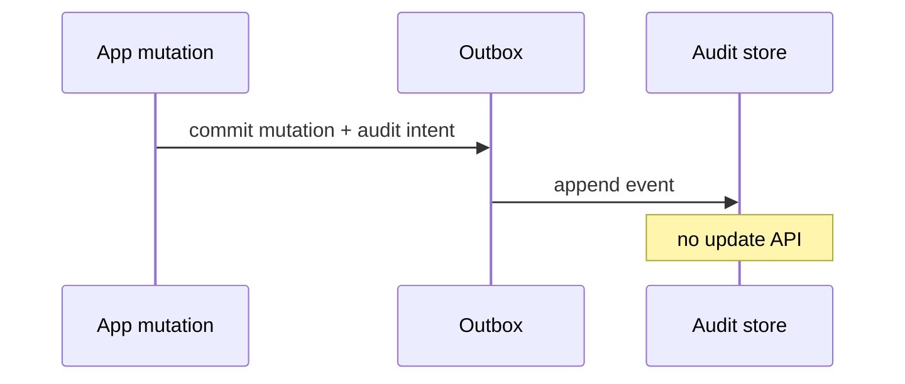

<!-- day-nav -->
[← Day 75 — Feature flags](75-feature-flags.md) · [Day 77 — Mock: email inbox →](77-mock-email-inbox.md)

# Day 76 — Audit log

**Do now**

1. Set a timer.
2. Attempt the problem. Stop at the attempt line. Do not scroll.
3. Then read.

## Time box

35 minutes.

| Minutes | Do this |
|---|---|
| 0–10 | Attempt. Who did that. Append queryable log, retention, tamper claim you can keep. |
| 10–28 | Read. If you claim "immutable" on mutable SQL without evidence, weaken the claim. |
| 28–35 | Say append path, query index, retention, and the honest tamper story. |

## Intent

Facing "who did that," leave able to append a queryable activity log with retention and a tamper claim you can actually keep.

## Problem

> Design an audit log.
>
> Security and support need to know who did what to which resource, when. The log must be queryable, retained for a policy window, and resistant to silent tampering by an ordinary attacker — with an honest claim.

## Attempt before reading

10 minutes. Do not scroll.

Write:

1. Event schema: actor, action, resource, time, evidence.
2. Write path: sync with mutation or async outbox?
3. Query: by actor, by resource, time range.
4. Retention and legal hold.
5. Tamper: what threat model, what mechanism (WORM, hash chain, external notarize)?

---

**Stop. Append-only store with real controls. Outbox from mutations. Honest tamper bound.**

---

## Requirements

**In.** Emit audit events for sensitive mutations. Query by actor/resource/time. Retention **1–7 years** per class. Admin access to audit is itself audited. Export for legal.

**Assumptions.** **5,000** audit writes/s peak. Query QPS low but selective indexes matter.

**Out.** Full SIEM product, packet capture, guaranteeing integrity against root on the cloud account without external notarization — **say the limit**.

## Estimates

5k/s × 500 bytes × year ≈ large object storage + indexed metadata. Hot index recent **90 days**; cold archive.

## API and data

Internal `Emit(event)`. `GET /v1/audit?actor=&resource=&from=&to=`.

Store: append-only table/log + object archive. Hash chain optional per stream.

## Design

### Emit

Prefer **same transaction outbox** as the mutation (day 39) so "user deleted" cannot succeed without audit intent. Async consumer writes to audit store. If audit store down, outbox backs up — **page**; policy choice: block mutation vs allow with backlog risk — for money/security, often **block** or dual-write to local durable spool.

### Query

Indexes on (actor, time), (resource, time). No full-table scan for support.

### Tamper claim (honest)

- App attacker without storage admin: append-only IAM + no update/delete API → strong.
- Compromised admin: need WORM bucket with retention lock / external hash notarization → state what you have.
- Hash chain detects rewrite if chain published externally; alone against DB admin who rewrites chain tip is weak.

Do not claim "blockchain-grade" if you only have Postgres.

### Retention

Lifecycle policies; legal hold flag skips delete. Deletes of audit: highly restricted, dual control.

### Staff arithmetic: append-only and honest tamper bounds

Audit is an **append-only** log of security-relevant actions, fed by outbox from mutating services (day 39) — dual-write from app to primary and audit without ordering drifts. Query by actor, resource, time. Retention years. Tamper evidence: hash chain or WORM storage — say the bound ("detects rewrite after append," not "NSA-proof"). High-cardinality actor spam gets rate limits; the log must not be a DoS path. Hot read path of the product must not sync-wait on audit write — outbox.

## Diagrams

Caption: "Mutation and audit intent share fate. Store is append-only."

## Failure the user sees

**Missing audit rows after an incident.** Dual-write lost or outbox stalled — compliance failure. Page on outbox lag for audit topics.

**Tampered history.** Without WORM/hash chain, a privileged actor rewrites. Speak the detection bound.

**Audit write on request path.** Latency and outage couple to audit store — refuse sync mandatory on every click; outbox.

**PII in clear forever.** Retention + redaction policy; else you built a breach magnet.

**Query without indexes.** Investigations timeout — plan access patterns (actor, resource_id, time).

## Trade-offs

**Hash chain vs WORM bucket.** Either; name what attacks you stop.

**Sync vs async audit.** Async via outbox; accept seconds of lag; sync only for rare ultra-sensitive if product demands.

**Name the refusal inside each alternative.** Against dual-write without outbox: you refuse silent loss. Against mutable audit table UPDATEs: you refuse non-evidence. Against sync audit on every UX read: you refuse availability coupling. Against "we cannot detect tampering": you refuse claiming compliance without a bound. Against infinite PII retention without policy: you refuse a liability pile.

**10× mutations.** Outbox partitions; audit store append scale. Query indexes stay.

## Talking points

**If they UPDATE audit rows.** "Append only. Corrections are new rows."

**If they sync-write audit in the request.** "Outbox. Seconds of lag beat coupling outages."

**If they ask tamper proof.** "WORM or hash chain — detects rewrite after append. Not magical."

**If they ask what to log.** "Authz denials, mutations, admin actions — not every page view unless required."

**If they ask what pages.** "Audit outbox lag, write failures, query p99 for investigations."

## Say this in the room

An audit log is append-only evidence fed by outbox from mutating services so we do not dual-write ourselves into drift. Investigators query by actor, resource, and time on indexes we planned. Tamper evidence is a hash chain or WORM store with an honest bound — detects rewrite after append, not mythology. Audit must not sit synchronously on every user request path. PII retention and redaction are part of the design, not an appendix after a breach.

### Staff depth: append-only store with real controls

Outbox from mutations. Honest tamper bound. Async by default.

**What staff sounds like.** Refuse mutable audit; outbox lag paged; tamper bound spoken without theater.

### More probes, with the answer

**"What pages?"** Name the user-visible lag or error metric from Failure — not only CPU. **"What do you refuse?"** Pick one refusal from Trade-offs and say the lie it prevents. **"What is the sensitive assumption?"** The estimate that flips the design if wrong by 10×.

## Kit artifact

| Follow-up | You answer with |
|---|---|
| "Immutable?" | Append-only IAM + outbox; WORM/notarize against admin; no fairy tales. |

## Design log

One line: your tamper threat model and the mechanism that matches it.

Next: [Day 77 — Mock: email inbox](77-mock-email-inbox.md). Closed book — not this week's graph/stories/crawler/book/flags/audit.

---

<!-- day-nav -->
[← Day 75 — Feature flags](75-feature-flags.md) · [Day 77 — Mock: email inbox →](77-mock-email-inbox.md)
