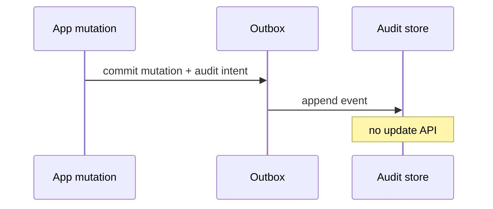

<!-- day-nav -->
[← Day 75 — Feature flags](75-feature-flags.md) · [Day 77 — Mock: email inbox →](77-mock-email-inbox.md)

# Day 76 — Audit log

**Do now**

1. Set a timer.
2. Attempt the problem. Stop at the attempt line. Do not scroll.
3. Then read.

## Time box

35 minutes.

| Minutes | Do this |
|---|---|
| 0–10 | Attempt. Who did that. Append queryable log, retention, tamper claim you can keep. |
| 10–28 | Read. If you claim "immutable" on mutable SQL without evidence, weaken the claim. |
| 28–35 | Say append path, query index, retention, and the honest tamper story. |

## Intent

Facing "who did that," leave able to append a queryable activity log with retention and a tamper claim you can actually keep.

## Problem

> Design an audit log.
>
> Security and support need to know who did what to which resource, when. The log must be queryable, retained for a policy window, and resistant to silent tampering by an ordinary attacker — with an honest claim.

## Attempt before reading

10 minutes. Do not scroll.

Write:

1. Event schema: actor, action, resource, time, evidence.
2. Write path: sync with mutation or async outbox?
3. Query: by actor, by resource, time range.
4. Retention and legal hold.
5. Tamper: what threat model, what mechanism (WORM, hash chain, external notarize)?

---

**Stop. Append-only store with real controls. Outbox from mutations. Honest tamper bound.**

---

## Requirements

**In.** Emit audit events for sensitive mutations. Query by actor/resource/time. Retention **1–7 years** per class. Admin access to audit is itself audited. Export for legal.

**Assumptions.** **5,000** audit writes/s peak. Query QPS low but selective indexes matter.

**Out.** Full SIEM product, packet capture, guaranteeing integrity against root on the cloud account without external notarization — **say the limit**.

## Estimates

5k/s × 500 bytes × year ≈ large object storage + indexed metadata. Hot index recent **90 days**; cold archive.

## API and data

Internal `Emit(event)`. `GET /v1/audit?actor=&resource=&from=&to=`.

Store: append-only table/log + object archive. Hash chain optional per stream.

## Design

### Emit

Prefer **same transaction outbox** as the mutation (day 39) so "user deleted" cannot succeed without audit intent. Async consumer writes to audit store. If audit store down, outbox backs up — **page**; policy choice: block mutation vs allow with backlog risk — for money/security, often **block** or dual-write to local durable spool.

### Query

Indexes on (actor, time), (resource, time). No full-table scan for support.

### Tamper claim (honest)

- App attacker without storage admin: append-only IAM + no update/delete API → strong.
- Compromised admin: need WORM bucket with retention lock / external hash notarization → state what you have.
- Hash chain detects rewrite if chain published externally; alone against DB admin who rewrites chain tip is weak.

Do not claim "blockchain-grade" if you only have Postgres.

### Retention

Lifecycle policies; legal hold flag skips delete. Deletes of audit: highly restricted, dual control.

## Diagrams

Caption: "Mutation and audit intent share fate. Store is append-only."

## Failure the user sees

**Audit down, mutations blocked.** Availability hit; integrity preserved — say the choice.

**Async loss without outbox.** Silent gap — refuse.

## Trade-offs

**Sync vs async emit.** Outbox async from request thread but durable with mutation.

**WORM cost.** Worth it for high-risk; overkill for every button click.

## Talking points

**If they UPDATE audit rows.** "That is not an audit log."

## Say this in the room

Audit events are intended in the same commit as the mutation via an outbox, then appended to a store with no update or delete API for ordinary roles. Queries use actor and resource time indexes; cold retention goes to lifecycle-locked storage. My tamper claim is honest: this stops an app-level attacker from rewriting history; a storage admin requires WORM retention lock or external notarization of hash tips, which I name only if we bought it. Gaps page via outbox age; for the highest-risk actions we may fail closed if audit cannot spool.

### Staff depth: honest tamper claims

Outbox with mutation; append-only IAM. WORM/notarize only if bought — do not claim blockchain against cloud root otherwise. Fail closed vs spool for highest-risk actions — say which.

**What staff sounds like.** Threat model first; mechanism second; no fairy tales.

## Kit artifact

| Follow-up | You answer with |
|---|---|
| "Immutable?" | Append-only IAM + outbox; WORM/notarize against admin; no fairy tales. |

## Design log

One line: your tamper threat model and the mechanism that matches it.

Next: [Day 77 — Mock: email inbox](77-mock-email-inbox.md). Closed book — not this week's graph/stories/crawler/book/flags/audit.

---

<!-- day-nav -->
[← Day 75 — Feature flags](75-feature-flags.md) · [Day 77 — Mock: email inbox →](77-mock-email-inbox.md)
