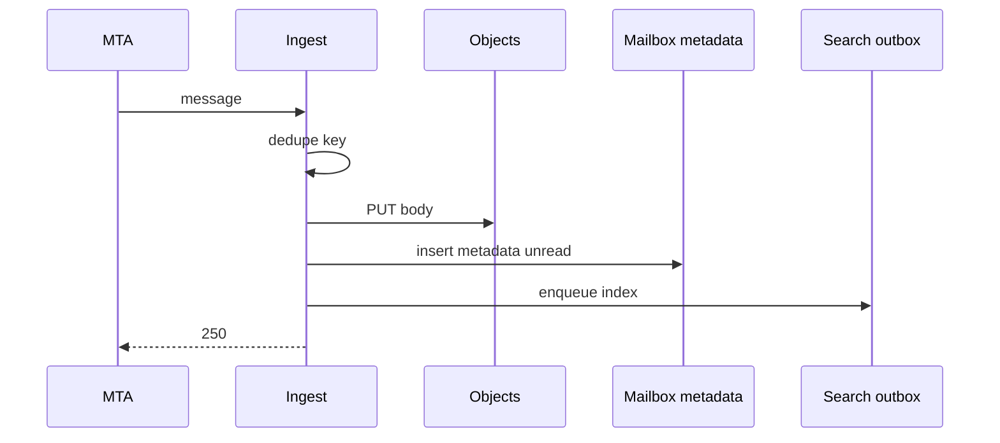
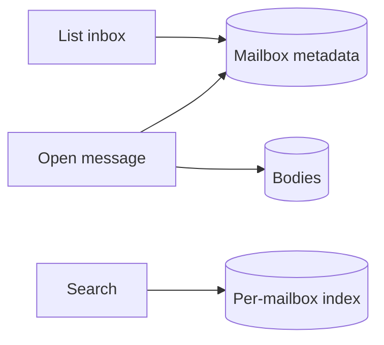

<!-- day-nav -->
[← Day 76 — Audit log](76-audit-log.md) · [Day 78 — SLOs and the miss a user sees →](78-slos-and-the-miss-a-user-sees.md)

# Day 77 — Mock: email inbox

**Do now**

1. Set a timer.
2. Attempt the problem. Stop at the attempt barrier.
3. Then read.

## Time box

35 minutes for the attempt, then 10 minutes to score and log. The 10 minutes are not part of the interview clock. Do not use them to keep designing.

## Intent

Facing an unseen product, leave able to design a large email inbox (ingest, folders, search, attachments), not this week's graph, stories, crawler, book, flags, or audit lessons.

## How to run

- Blank paper. No notes, no days 50–76, no search, no chat.
- The only card you may have open is the [email inbox problem](../prompts/email-inbox.md) in the problem bank (`prompts/`). It does not help you.
- Do not scroll past the attempt barrier. The rubric is above the barrier so you can score. The design is below it.
- This is not the social graph, not stories, not the crawler, not the order book, not feature flags, and not the audit log. If you notice yourself designing a matcher or a kill switch, stop and design mail.
- Timer visible. At zero you stop, even mid-arrow.
- Score, then write the log from **your** page, then scroll.

Score what the product does. A complete page says how mail is accepted, where the body and attachments live, how the inbox lists quickly, how search works, and what happens when the user is offline then returns. If one of those is missing, log the gap. Do not scroll to find it.

If you already scrolled, close the page. Run the mock tomorrow from memory, or it measures nothing.

## Timer

| Clock | You are doing | You are not doing |
|---|---|---|
| 0:00–5:00 | Ingest, list inbox, read, search, attachments. Non-goals. | A tour of SMTP RFCs |
| 5:00–10:00 | Mail/day, mailbox size, attachment bytes, search QPS. Peak. | Crawler fetch QPS from day 73 |
| 10:00–16:00 | API and keys: mailbox, message id, folders, indexes. | Order-book sequencing |
| 16:00–26:00 | Ingest path vs list/read path vs search index path. | One blob store for everything without metadata |
| 26:00–33:00 | One deep dive: huge mailbox, attachment storm, or search lag after ingest. | Flags, audit hash chains, stories TTL |
| 33:00–35:00 | What you did not build, and the 10× break. | A second product |

## Problem

> Design a large email inbox.
>
> People receive and send email. They browse folders, open messages, search, and download attachments. Mailboxes can be very large. Ingest must not make listing the inbox slow.

That is the entire problem. Thirty-five minutes. Blank page. No notes.

## Rubric

Same six dimensions as day 7. Score 1–4 from your page only. A senior-shaped interview is mostly 3s. A staff-shaped interview is a 4 on the deep dive and a 4 on failure, not more boxes.

### Requirements

| Score | Anchor |
|---|---|
| 1 | Components first. No non-goals. |
| 2 | Behaviors listed. Constraints are adjectives. |
| 3 | Behavior, constraints, and non-goals locked before the design. The questions you asked would have changed the model. |
| 4 | As a 3, and each non-goal is a product you refused, with a reason. |

### Estimates

| Score | Anchor |
|---|---|
| 1 | No numbers, or one QPS with no numerator. |
| 2 | Numbers exist. Units or assumptions are missing. |
| 3 | Ingest rate, list QPS, storage, search. Average and peak. Assumptions spoken. |
| 4 | As a 3, plus the assumption you trust least, and a 10× move tied to a named limit. |

### API and data

| Score | Anchor |
|---|---|
| 1 | No API. The database brand is the model. |
| 2 | Endpoints exist. Message key, folder membership, or attachment pointer is vague. |
| 3 | Ingest, list, get, search, attachment fetch. Real keys. Defined unread behavior. |
| 4 | As a 3, plus idempotent ingest, and a distinction you refused to blur (body vs attachment vs index). |

### Design

| Score | Anchor |
|---|---|
| 1 | A technology tour, or boxes that ignore the numbers. |
| 2 | A plausible system where list-inbox scans bodies, or search is only LIKE on primary. |
| 3 | The smallest design that meets the numbers. Metadata list path separate from body/attachment bytes. Search is a derived index with spoken lag. |
| 4 | As a 3, and a huge mailbox still pages, and you can say what the user sees when search lag exists. |

### Deep dive

| Score | Anchor |
|---|---|
| 1 | You cannot go past the boxes. |
| 2 | Under a push, the answer is a product name. |
| 3 | One dive, with a choice and a cost. |
| 4 | The dive uses arithmetic or a concrete fault. You can name what it did not solve. |

### Failure and ops

| Score | Anchor |
|---|---|
| 1 | "We'll have replicas," and no user-visible behavior. |
| 2 | A dependency is named. Impact is fuzzy. |
| 3 | One dependency down. What the user sees. What mail is already durable. What you page on. |
| 4 | As a 3, plus the crash window you still have after the mitigation you drew. |

Do not average these into one vanity number. The log wants the six scores and **one** gap.

## Attempt first

Do the 35 minutes now.

When the timer stops:

1. Score the six dimensions from the anchors above. Evidence is a phrase on your paper.
2. Copy [design-log/TEMPLATE.md](../design-log/TEMPLATE.md) somewhere private. Fill it from your attempt. Scores are final once written.
3. Only then cross the barrier.

---

# Attempt barrier

You are about to read a reference design for a large email inbox.

If your timer has not hit zero, go back up. If your design log is not filled, go back up. Below is a reference, not a social graph or an audit hash chain. Use it for one amendment line. Do not edit the scores.

---

## Reference design

One legal design, at interview depth. Yours can differ and still be a 3. It is not a 3 if listing the inbox reads message bodies from object storage one by one, if search is a table scan, or if a retried SMTP delivery creates two messages the user both sees as new without a dedupe key.

### What this is not

Not day 71 graph. Not day 72 stories. Not day 73 crawler. Not day 74 order book. Not day 75 flags. Not day 76 audit (though mail mutations may emit audits in a real org — out of scope here). Not the day 57 product catalog with different nouns — mail search is per-mailbox first.

### Requirements

**In.** Receive mail (SMTP ingest to the mailbox). Send (outbound thin — can be "accepted for delivery"). List folder (inbox) newest first with unread. Open message (body). Attachments by reference. Search within a mailbox (from/to/subject/body). Folders/labels. Mailboxes with **millions** of messages for power users. Idempotent ingest on provider retries.

**Assumptions.** **500 million** MAU; **100 billion** messages stored; ingest **200,000**/s average globally, **~600,000**/s peak. Average message metadata **2 KB**; body mean **50 KB**; attachments mean add **200 KB** when present (**30%** of mail). List inbox **50k**/s peak. Search **10k**/s peak. One logical region for a mailbox (sticky); multi-region is out.

**Out.** Full spam ML thesis, calendar, contacts sync, E2E encrypted mail that prevents server search (note the conflict if asked), compliance archive product (day 76 cousin), push notifications deep dive (day 55).

**Codes.** Duplicate delivery with same `(mailbox_id, mime_message_id)` or provider dedupe key: same stored message, not two unread. Missing message: 404. Search index lag: results may omit mail younger than the lag bound — say **≤ 30–60 s**.

### Estimates

Ingest 200k/s × 50 KB ≈ **10 GB/s** body ingest average — object storage, not SQL blobs for bodies. Metadata 200k/s × 2 KB = **400 MB/s** — wide-column / sharded SQL by mailbox_id.

Hot mailbox: celebrity **1M messages**; list must be `ORDER BY received_at DESC LIMIT 50` on a per-mailbox index, not scan.

Attachments: 0.3 × 200k × 200 KB ≈ **12 GB/s** peak planning band — same object store, separate keys.

Search index: per-mailbox documents; update rate tracks ingest. Lag SLO 60 s → page on indexer lag.

**10× ingest.** 2M/s — shard ingest and object put; metadata write capacity is the cliff you name. List still OK if keyed by mailbox.

Sensitive assumption: body mean size. If mean is 500 KB, object path dominates more; metadata design unchanged.

### API and data

IMAP/JMAP/HTTP — pick **HTTP JSON** for the interview.

`GET /v1/mailboxes/{id}/folders/{folder}/messages?cursor=` → headers only (from, subject, date, frag, flags).

`GET /v1/messages/{id}` → body + attachment list.

`GET /v1/messages/{id}/attachments/{aid}` → bytes (CDN/signed).

`GET /v1/mailboxes/{id}/search?q=`

Internal ingest: SMTP → MTA → `PutMessage` with dedupe key.

**Message metadata row:** `(mailbox_id, message_id)`, folder/labels, flags, received_at, size, mime_id, body_object_key, attachment keys. Primary access: mailbox_id partition.

**Body/attachment objects:** private bucket keys; never list-inbox them.

**Search doc:** mailbox_id + message_id fields; delete on purge.

### Ingest path

1. Accept mail; compute dedupe key (`mailbox_id + Message-ID` header, or hash of envelope+payload if missing).
2. If exists: return success to SMTP retry (250), do not create second unread.
3. PUT body (and attachments) to object store.
4. Insert metadata + unread + folder membership in one commit; outbox to search indexer.
5. Ack.

**Refuse** storing bodies in the metadata primary. **Refuse** indexing before durable metadata (search hit to missing get).

### List / read path

List: metadata only from mailbox partition, cursor on `(received_at, message_id)`. Cache recent first page per mailbox briefly (seconds) carefully — new mail must appear within bound (invalidate on ingest or short TTL).

Read: metadata + GET object. CDN optional for hot attachments with auth.

### Search path

Async index from outbox. Query hits search cluster filtered by mailbox_id (tenant isolation critical — never miss the filter). Lag ≤ 60 s typical. User may see mail in inbox list before it is searchable — say it.

### Huge mailbox

Partition metadata by mailbox_id; page size 50; optional year folders / archive tier for old mail (cold storage). Do not load 1M ids into RAM on open.

### Failure

**Object store down on ingest.** 421/4xx temp fail SMTP; no metadata row. **On read:** 503 for body, headers may still list.

**Metadata primary down.** No list/ingest; search stale serve optional degraded.

**Indexer down.** Inbox works; search lags; page on lag. Do not block ingest on search.

**Dedupe window.** Keep Message-ID index for **14–30 days** (SMTP retry window); after that, theoretical duplicate — say retention.

### Diagrams you should have had

Caption: "Dedupe, bytes, metadata, then search async. 250 after durable mail."

Caption: "List never walks bodies. Search is derived and can lag."

### Failure the user sees, per person

**SMTP retry after 250.** Same Message-ID; user sees one mail.

**Indexer 10 minutes behind.** Inbox shows mail; search omits it briefly — UI honesty.

**Attachment GET, bucket blip.** 503; retry. List still works.

**Mailbox with 5M messages.** First page fast; search scoped; archive tier for old.

**Metadata down.** User cannot open inbox — 503. Already delivered mail at MTA may tempfail.

### Trade-offs you should have named

**Body in DB vs objects.** Objects — list QPS and size.

**Sync index on ingest vs async.** Async; list is truth for "new mail," search lag spoken.

**Exact IMAP vs HTTP.** HTTP for interview speed; note IMAP as gateway later.

**Global search across users.** Refuse in this product without admin — isolation.

### Probes the interviewer will use, with the answer

**"List slow on big mailbox?"** "Metadata index by mailbox and time; never fetch bodies for list."

**"Duplicate mail?"** "Dedupe on Message-ID per mailbox; 250 on retry."

**"Search missing new mail?"** "Async index lag bound; inbox list still has it."

**"Where do attachments live?"** "Object keys on the message; signed GET; not inline in list."

### What you did not need

Social graph edges. Story CDN TTL as the deep dive. Crawler politeness. Matching engine. Feature flag SDK. Audit hash notarization.

## Say this in the room

Globally we may ingest hundreds of thousands of messages a second, so bodies and attachments go to object storage and the mailbox primary only stores metadata keyed by mailbox_id — listing the inbox is a cursor over headers, not a scan of bodies. SMTP retries use Message-ID dedupe so the user does not get two unread copies. Search is a per-mailbox derived index fed by outbox, allowed to lag up to about a minute while the inbox list stays correct. A power user with millions of messages still pages fifty at a time from the metadata index; cold mail can tier out. If the indexer is down, mail still lands; if the object store is down on ingest, we tempfail the receive and do not write a ghost header.

### After you read this

One amendment line: the concrete miss (list fetched bodies, no dedupe, search on primary LIKE, blocked ingest on search, no huge-mailbox story). Leave the scores alone.

Next up is Phase 5 (failure and senior signal), starting at [Day 78](78-slos-and-the-miss-a-user-sees.md). Do not invent those lessons from this reference.

---

<!-- day-nav -->
[← Day 76 — Audit log](76-audit-log.md) · [Day 78 — SLOs and the miss a user sees →](78-slos-and-the-miss-a-user-sees.md)
