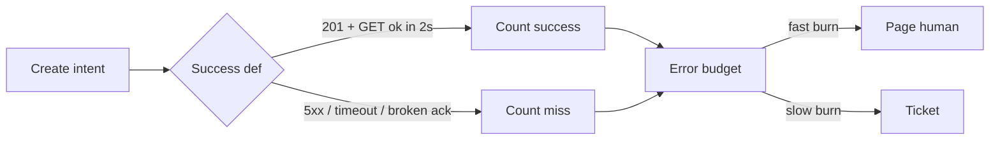
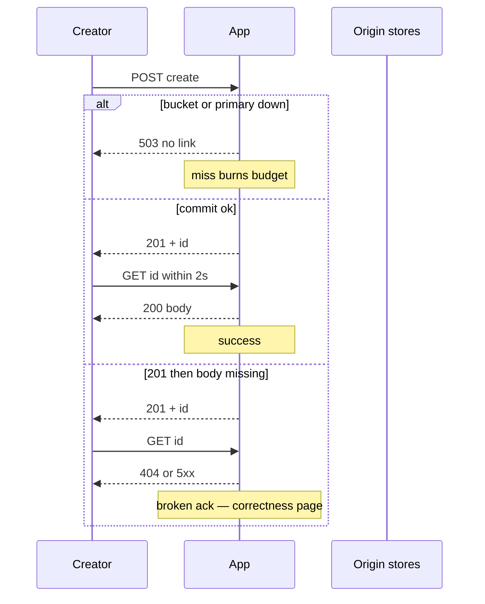

<!-- day-nav -->
[← Day 77 — Mock: email inbox](77-mock-email-inbox.md) · [Day 79 — Degradation under partial failure →](79-degradation-under-partial-failure.md)

# Day 78 — SLOs and the miss a user sees

**Do now**

1. Set a timer.
2. Attempt the problem. Stop at the attempt line. Do not scroll.
3. Then read.

## Time box

35 minutes.

| Minutes | Do this |
|---|---|
| 0–10 | Attempt. One SLO for create success. Name the user-visible miss when it burns. |
| 10–28 | Read. If your SLO is "99.9% uptime" with no operation and no window, rewrite it. |
| 28–35 | Say the objective, the indicator, the burn rate that pages, and the miss the creator sees. |

## Intent

Facing a vague reliability ask, leave able to state an SLO and the user-visible miss when it is breached. Staff signal is not a poster of nines. It is one operation, one window, one miss the customer can feel, and a page that fires before the quarter is already lost.

## Problem

> Design a pastebin. People paste text and share a link.

The interviewer says: "We need this to be highly available. What's your SLO?"

## Attempt before reading

10 minutes. Do not scroll. Creates average **116/s**, peak **350/s**. Public reads are mostly on the CDN. A create must return a link the next GET can find, or you lied. Retention is seven days. You already have timeouts and retries from earlier weeks.

Write:

1. The one operation you put under an SLO (not "the site").
2. The success definition in one sentence the creator would agree with.
3. A target and a window (for example 99.9% over 30 days) and what that allows in failed creates.
4. What the creator sees when you are missing the target today.
5. What you page on — not "error rate high," a burn or a budget that a human can act on.

---

**Stop. The SLO and the miss are below. Do not change the attempt to match.**

---

## Requirements

"Highly available" is not a requirement until you name an **operation**. Pastebin has at least three different products under one domain:

- **Create success.** POST returns 201 with a link, and a GET of that link within a few seconds finds the paste (or a deliberate 404 if you already deleted it). A 201 followed by a 404 for a live row is not success. It is a broken ack.
- **Read availability for origin misses.** Edge hits are not your origin's SLO; they are the CDN's. Origin miss success is a separate number.
- **Delete.** Usually looser. Do not mix it into create.

Pick **create success** as the staff answer unless they force reads. Creates are where a lie about durability hurts, and they are where your numbers are small enough to reason about on a whiteboard.

**Assumptions you may lock.** Window: **30 days**. Target: **99.9%** successful creates (three nines). Peak create rate for budget math: **350/s**. A "failed create" is any attempt that does not meet the success definition within the client's budget (timeout, 5xx, 201-then-missing). Client cancels and retries with a new idempotency key count as separate attempts only if you say so — prefer counting **logical create intents** keyed by the idempotency key so a storm of retries is one miss, not fifty.

**Out.** An availability poster for the whole company. Synthetic "uptime" that pings `/health` while creates 503. Multi-region RPO lectures (day 80). Cost cuts (day 82). Migration (day 83).

## Estimates

30 days × 86,400 s ≈ **2.59 million seconds**. At 99.9% you may miss **0.1%** of creates. If average create rate is 116/s, monthly creates ≈ 116 × 2.59e6 ≈ **300 million**. Allowed failed creates ≈ **300,000** in the month. That sounds large until you translate to a bad hour: at peak 350/s, a **10-minute** total create outage is 350 × 600 ≈ **210,000** failed creates — most of the monthly budget in one incident. Say that out loud. Three nines is not "we can be down a lot." It is "one serious incident can burn the quarter's budget."

Error budget remaining is what lets you ship. If you have burned 80% of the budget by week two, you freeze risky deploys. That sentence is the operability half of the SLO. Without it, the SLO is wallpaper.

**Staff arithmetic: multi-window burn in the room.** You do not need Google's exact multi-window spreadsheet on the whiteboard. You do need two speeds: **fast burn** (exhaust the 30-day budget in ~2 hours at the current miss rate → page now) and **slow burn** (exhaust in ~2 days → ticket, freeze risky deploys, no phone). Absolute "error rate > 1%" without budget context either pages every deploy blip or sleeps through a weekend leak. At 350/s peak, a sustained **5%** miss rate is ~17.5 misses/s ≈ **63,000/hour** — that is a fast-burn Sev, not a ticket.

## API and data

You do not invent a new API. You instrument the one you have:

- Success event: create intent (idempotency key) reaches a terminal state `committed` with row present and body reachable, or a deliberate business rejection (400/413) which **does not** burn the availability SLO.
- Miss event: timeout, 5xx, or `committed` then body missing / row missing within the read-after-write window you promised (planning: **2 seconds**).

Store burn in your metrics path (day 62/64 shape): a counter of successes and misses per minute, and a recorded budget.

**What you refuse to count as success.** HTTP 201 alone. `/health` 200. CDN edge hit ratio. A create that returned 201 while the body PUT was still "pending" on a queue you never drained.

## Design

### Write the SLO as a sentence

**SLO.** Over a rolling **30 days**, **99.9%** of create intents succeed: the client receives a 201, and a GET of the returned id within **2 seconds** returns 200 with the body (or 404 only if a delete already landed).

**SLI.** `successful_creates / (successful_creates + failed_creates)` over the window, excluding client 4xx that are not capacity-related. Capacity 429s **do** burn if the product promise was "you can create," unless you explicitly carved "fairness rejects" out — say which.

**Miss the user sees.** Creator: spinner, then error, no link. Or worse: a link that 404s. Reader of a paste that never committed: nothing to see; that is not this SLO. Reader of a paste that committed then lost the body: that is a **correctness** miss and should page harder than a clean 503.

### Why not "99.9% uptime"

Uptime of what process? An app that returns 200 on `/health` while the bucket is down will look "up" and still fail every create. The SLI must follow the **user journey**, not the process list. Staff interviewers punish journey-free nines.

### Alerting off burn, not off a single spike

A one-minute 50% fail spike at low QPS may be noise. A burn-rate alert: if you continue failing at the current rate, you will exhaust the 30-day budget in **2 hours** — page now. If you would exhaust it in **2 days** — ticket, not page. That is the Google SRE burn-rate idea in interview language: page on fast burn, ticket on slow burn. You do not need their exact multi-window math on the whiteboard; you need the idea that **absolute error rate without budget context** either pages too often or too late.

### What you refuse

- One SLO for create+read+delete as a mushy average.
- Counting only HTTP 200 on POST without the read-after-write check (hides broken acks).
- "We'll add SLOs after launch." The miss already exists; you are only choosing whether to measure it.
- Four nines spoken before you recompute peak-minute burn (see Estimates).
- Treating CDN-green as create-healthy.

### Staff depth: budget arithmetic in the room

Monthly budget ≈ 300k failed creates at 99.9% and ~116/s average. A 10-minute hard outage at 350/s ≈ 210k — most of the budget. Therefore a create outage is a **Sev-level** event even when "the site still serves CDN hits." Separate a **read SLI** on origin fill if they ask; do not let edge cache hits laundry-wash origin death.

**Worked burn example to say aloud.** Budget 300k / month. Current miss rate 20/s sustained → hours-to-exhaust ≈ 300000/20/3600 ≈ **4.2 hours** → still fast enough to page (under a 6h "page" threshold many teams use; tighten to 2h if you want fewer gray zones). Miss rate 0.5/s → ≈ **167 hours** → ticket and deploy freeze, not a 3 a.m. phone ring.

**What staff sounds like.** Operation, window, budget, user-visible miss, page on burn.

## Diagrams

Caption: "The SLI follows the create journey. Burn pages a human before the month is already lost. Edge 200s never enter this box."

Caption: "A 201 without a findable body is a miss, not a success with a retry. Page it harder than a clean 503."

## Failure the user sees

**Clean create outage (bucket down).** Creator gets 503. No link. Misses burn. CDN still serves hot pastes — do not call the product "up."

**Broken ack (201, body missing).** Creator believes they saved. Next GET fails. This is worse than 503. Page on `row_exists_body_missing`, not only on 5xx rate. Support hears "I have the link and it is gone" — that is not a normal miss; it is a lie you already shipped.

**Budget already gone.** You keep missing. Freezing deploys is the operational move; the user still sees errors until the dependency recovers. The SLO did not heal the store; it told you to stop making the hole deeper.

**Slow leak, not a bang.** Create success at 99.7% for two weeks — no single Sev, budget quietly empty by week three. Slow-burn ticket + deploy freeze exists so this is visible before the quarter poster is already fiction.

**Fairness 429 storm counted as success.** Creators cannot save; dashboards look "available." If 429s are how you shed, either carve them out of the SLI explicitly or count them as misses against the product promise.

## Trade-offs

**Tighter SLO (99.99%).** About 30k misses/month at the same rate — one short peak outage blows it. Forces multi-region or sync replication cost (day 80/82). Only buy it if the product pays for it.

**Looser SLO (99.5%).** Easier ops, worse creator trust. Say the miss: more "save failed" weeks.

**Exclude fairness 429s.** Protects the budget from abuse; can hide chronic capacity debt if 429s are how you "succeed."

**Name the refusal inside each alternative.** Against journey-free uptime: you refuse a green `/health` while creates 503. Against averaging all endpoints: you refuse CDN hits laundry-washing create death. Against 201-without-GET: you refuse broken acks counted as success. Against four nines without peak math: you refuse a poster that one five-minute outage already falsifies.

## Talking points

**If they say "four nines."** "Show me the budget at peak. A 5-minute hard outage at 350/s is about 105,000 failures. That is already past a 99.99% month at our rate. We either buy the topology that makes that outage impossible, or we stop saying four nines."

**If they ping only /health.** "That is a process check. Creates still need the bucket and the primary. The SLI is the create journey."

**If they average all endpoints.** "Deletes and CDN hits will wash create failures. One operation."

**If they page on raw error count.** "Without budget context that pages every blip or sleeps through a leak. Fast burn pages; slow burn tickets."

**If they say HA means multi-region.** "Multi-region is a cost and RPO story (day 80). State the create SLO and the miss first; then ask whether the topology can keep it."

**If they ignore broken acks.** "A 201 the next GET cannot find is not availability. It is a correctness page."

## Say this in the room

Create success over 30 days at 99.9%: a 201 whose id GETs within two seconds. That leaves roughly three hundred thousand failed creates a month at our rate, and a ten-minute peak outage burns most of it — so create unavailability is a page, not a shrug while the CDN still looks green. We alert on error-budget burn, not on a one-minute blip alone: exhaust-in-two-hours pages a human; exhaust-in-two-days is a ticket and a deploy freeze. A 201 that cannot be read is a miss, not a success, and it pages harder than a clean 503. Reads get their own SLI if you want edge and origin separated; I will not hide origin death inside cache hits.

### Staff depth: the miss is the product

Nines without a journey are theater. Broken acks are correctness pages. Budget math turns "HA" into a decision about multi-region spend.

**What staff sounds like.** One operation. One miss. One budget. One page.

### More probes, with the answer

**"What pages?"** Fast SLO burn on create (budget exhausts in ~2h at current miss rate), and any sustained broken-ack — not CPU, not CDN hit ratio. **"What do you refuse?"** Journey-free uptime; averaging create with edge reads; counting 201 without read-after-write. **"What is the sensitive assumption?"** Peak create rate and outage duration — 10 minutes at 350/s already spends most of a 99.9% month. **"Where does the time go in the interview?"** Lock the operation and success sentence before debating nines; then do the peak-minute burn math so four-nines talk is forced to buy topology or retreat.

## Worked numbers you can reuse

| Quantity | Planning value | Why it matters |
|---|---|---|
| Average creates | 116/s | Monthly volume ≈ 300M |
| Peak creates | 350/s | Incident burn math |
| SLO | 99.9% / 30d | ≈ 300k misses allowed |
| 10 min hard outage @ peak | ≈ 210k misses | Most of the monthly budget |
| 5 min @ peak | ≈ 105k misses | Already past a 99.99% month |
| Read-after-write window | 2s | Broken ack boundary |
| Fast-burn page threshold | ~2h to exhaust | Phone vs ticket |

If the interviewer changes the target to 99.99%, recompute before arguing topology. Four nines at this peak rate forbids multi-minute region failovers unless creates are multi-region active with sync cost.

### Interviewer pushes

**"Just use multi-region."** Multi-region is a cost and conflict story (days 43/80/82). It can buy a tighter create SLO for a single region loss; it does not invent a journey-based SLI. State the SLO first, then say whether the topology supports it.

**"Reads are the product."** Then write a **separate** read SLI: origin fill success for cache misses. Do not average it with creates. CDN hit success is mostly the edge vendor's path; your origin miss path still needs a number if cold pastes matter.

**"Error budget is corporate theater."** Without budget, every page is either chronic noise or chronic lateness. Budget is how you decide to freeze deploys after a bad week — operability, not bureaucracy.

**"Client retries will hide the misses."** Only if you count logical intents by idempotency key. Counting every HTTP attempt turns one sick minute into a vanity massacre — or hides a real outage inside "eventual success" if you only look at final 201s without latency.

## Kit artifact

| Follow-up | You answer with |
|---|---|
| "What's the SLO?" | Create 99.9%/30d with read-after-write; burn pages; CDN green is not create success. |

## Design log

One line: your SLO sentence and how many peak-minutes of outage burn the monthly budget.

Next: [Day 79 — Degradation under partial failure](79-degradation-under-partial-failure.md).

---

<!-- day-nav -->
[← Day 77 — Mock: email inbox](77-mock-email-inbox.md) · [Day 79 — Degradation under partial failure →](79-degradation-under-partial-failure.md)
