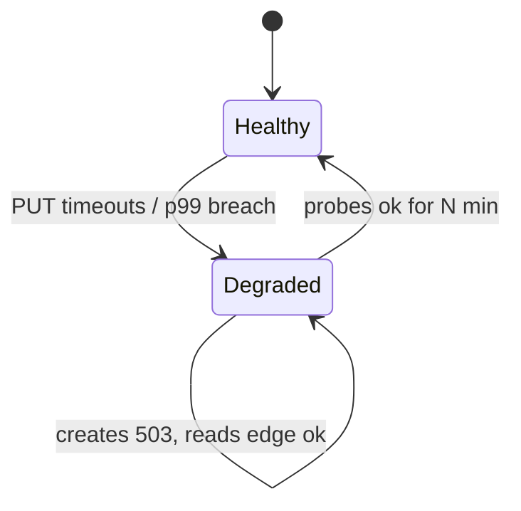
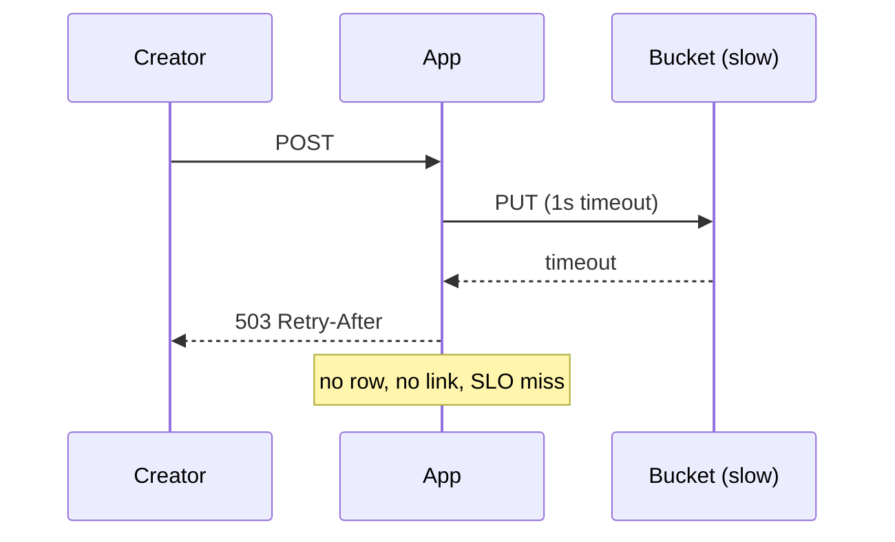

<!-- day-nav -->
[← Day 78 — SLOs and the miss a user sees](78-slos-and-the-miss-a-user-sees.md) · [Day 80 — Losing a region →](80-losing-a-region.md)

# Day 79 — Degradation under partial failure

**Do now**

1. Set a timer.
2. Attempt the problem. Stop at the attempt line. Do not scroll.
3. Then read.

## Time box

35 minutes.

| Minutes | Do this |
|---|---|
| 0–10 | Attempt. One sick dependency. What you keep. What you drop. What you refuse to fake. |
| 10–28 | Read. If your "degrade" is a silent lie (200 with empty meaning), erase it. |
| 28–35 | Say the mode name, the user-visible change, and the signal that exits the mode. |

## Intent

Facing a sick dependency rather than a total outage, leave able to pick a degraded mode and what you refuse to drop. Partial failure is the common case: the store is slow, the queue is deep, one replica is wrong, the provider is 30% erroring. Staff credit is a named mode, not "we retry harder."

## Problem

> Design a pastebin. People paste text and share a link.

The interviewer says: "The object store is not down. It is slow — p99 PUT is 8 seconds and climbing. Creates still have a 2-second budget. What do you do?"

## Attempt before reading

10 minutes. Do not scroll. Create budget **2 seconds**. Normal PUT timeout was **1 second**. Primary and CDN are healthy. Queue and reaper exist. Idempotency keys exist. Day 78's create SLO is in force: a 201 must be findable.

Write:

1. Do you keep accepting creates, refuse them, or accept a different shape of create?
2. What the creator sees (status, message, whether they get a link).
3. What you refuse to do (local disk fallback, fake 201, infinite wait).
4. What read path does while PUTs are sick.
5. The metric that says you left degraded mode.

---

**Stop. The degraded mode is below. Do not change the attempt to match.**

---

## Requirements

Partial failure means the dependency still answers sometimes, but not inside budget. That is different from day 25's hard unavailable overlay and from day 80's region loss.

**In.**

- Protect the create budget and the create SLO (day 78).
- Prefer a **loud** degrade over a quiet lie.
- Keep serving reads that do not need the sick path when you can.
- Have an exit condition a human or a controller can recognize.

**Assumptions.** PUT p99 is **8 s** and rising. About **40%** of PUTs exceed the 1 s timeout if you keep trying once. Primary commit is still ~10–20 ms. CDN still holds hot pastes.

**Out.** Designing a second object store brand mid-interview. Multi-region failover (day 80). Rewriting the product as "metadata only pastes." Cost optimization as the main move (day 82) — cost may be mentioned, not the thesis.

## Estimates

If you block the request thread for 8 s on each create, at 350/s peak you need thousands of blocked workers and you will melt the app tier before the bucket recovers. Shedding is not optional; it is arithmetic. If you queue body uploads and return 202, you must say when the link becomes real — a 202 with a link that 404s for minutes is a broken ack under another status code.

## API and data

Degraded mode is a **behavior**, preferably explicit:

- `503` + `Retry-After` for "cannot create now" (fail closed on durability).
- Or `202` + `paste_id` + `status=pending_body` only if the product allows a link that is not readable yet — usually **refuse** for pastebin, because the share contract is "open this link."
- Optional response header or status page flag: `degraded=object_store_slow` so support is not guessing.

Do not invent a new public API unless you need the pending state. Most pastebin staff answers **fail closed on create** and keep reads.

## Design

### Mode: create fail-closed, reads continue

1. **Detect.** PUT timeout rate and p99 cross a threshold (for example >5% timeouts over 2 minutes, or p99 >2 s). Enter `DEGRADED_OBJECT_STORE`.
2. **Create path.** Do not wait 8 s. Keep the **1 s** PUT timeout. On timeout: no insert, **503**, count a create miss for the SLO. Optionally shed earlier: if the breaker is open, fail create in **20 ms** without calling the bucket (day 19/20).
3. **Read path.** Edge hits still 200. Origin reads that need GET from the bucket will also suffer — apply the same timeout; return **503** on miss path, never **404**. Hot CDN content is your degrade gift; say it expires.
4. **Deletes.** Row delete can proceed; body detach queues and waits. Same as a hard outage for the detach worker.
5. **Exit.** Timeout rate back under threshold for N minutes, breaker half-open probes succeed. Do not flap every 30 s.

### What you refuse

**Local disk / second bucket invents a split brain.** When the slow store recovers you have two authorities. Refuse unless you already designed multi-store with a formal primary (you did not).

**Lengthen the client budget to 10 s.** You will hold every worker, miss the SLO on latency even when PUTs eventually succeed, and teach clients to wait forever.

**Return 201 before PUT.** Broken ack. Day 14 and day 78 both refuse this.

**Retry storms into the sick store.** One retry max with jitter; then shed. Multiplying load on a slow dependency is how partial failure becomes total.

### Soft degrade worth naming (optional)

If leadership accepts "create is temporarily unavailable" on a status page while reads work, that is a product degrade. It is honest. If they demand creates must work, the honest answer is **buy capacity / regional failover / a healthier store**, not a software fairy tale on one sick dependency.

### Staff depth: slow is not down, but the budget still burns

At 40% timeouts, create success cannot stay at 99.9% for long — day 78 budget math applies. Degradation without an SLO story is cosplay. The mode protects the **app and the honesty of codes**; it does not invent durability.

Partial failure on a **replica** (lagging read) is a different mode: refuse lagging replica for read-your-writes (day 34), serve from primary, accept higher primary load — do not serve stale as fresh.

Partial failure on a **queue** (backlog): ack user early only for work the user does not wait on; for create-body, there is no such work. Pastebin create is synchronous durability.

**What staff sounds like.** Named mode. Loud codes. No fake 201. Breaker + timeout remain short. Exit criteria.

## Diagrams

Caption: "Degraded is a state with entry and exit, not harder retries forever."

Caption: "Short timeout plus fail-closed beats waiting out an 8s p99."

## Failure the user sees

**Creator.** Save fails fast with retry guidance. No link to share. Anger without confusion.

**Reader of hot paste.** Still works via CDN until TTL ends.

**Reader of cold paste.** 503 on origin fill, not 404. Support must not call this "deleted."

**Operator.** Page on enter-degraded and on SLO burn, not only on total outage.

## Trade-offs

**Fail closed vs pending create.** Pending needs a product that tolerates unread links; pastebin share UX usually does not.

**Aggressive shed vs retry once.** Retry once can clear a blip; retry thrice melts the bucket. Prefer breaker.

**Status page honesty vs quiet 503.** Honesty reduces duplicate incident tickets; costs PR ownership.

## Talking points

**If they say "queue the upload."** "Then the link is a promise. When is it real? If I hand a URL that 404s for five minutes, I burned trust worse than a clean 503."

**If they say "increase timeout to 10 seconds."** "I will run out of workers at peak. Slow dependency plus long timeout is self-DoS."

**If they want 200 with empty body.** "That is a lie. Degrade loud."

## Say this in the room

Object store slow is a degraded mode, not a longer timeout. I keep a one-second PUT budget, trip a breaker when timeouts spike, and fail creates closed with 503 so I never 201 a paste I could not store. Reads that still hit the CDN keep working; origin fills return 503, never 404. I leave degraded when probes succeed for a stretch, and I watch create-SLO burn the whole time — retries do not get to multiply into the sick store.

### Staff depth: refuse the quiet lie

Partial failure tempts fake success. Staff refuses. Mode name, loud miss, protected codes, exit criteria.

**What staff sounds like.** "Creates are degraded; reads are mostly edge; here is how we leave."

## Mode card (draw this)

| Mode | Creates | Origin reads | Edge reads | Exit |
|---|---|---|---|---|
| Healthy | Normal PUT+insert | Normal | Normal | — |
| `DEGRADED_OBJECT_STORE` | 503 fail-closed, breaker may short-circuit | 503 on bucket GET miss | 200 until TTL | Probe OK N minutes |
| Hard unavailable (day 25) | 503 | 503 | 200 until TTL | Bucket returns |

Partial failure sits between healthy and hard down. The difference is **detection** (timeouts/p99) and **shedding before** you run out of workers.

### Arithmetic why long timeouts fail

350 creates/s × 8 s blocked ≈ **2,800** concurrent blocked create calls. If each holds a worker, you need thousands of threads/connections just to wait on a sick dependency. Cap concurrent bucket PUTs (bulkhead). When the bulkhead is full, fail fast without calling the bucket. That is day 19 applied to a slow store.

### Interviewer pushes

**"Buffer bodies in the app and retry."** Memory becomes a second store; process restart loses "accepted" work unless you spool durably. If you spool to local disk you reinvent day 14's problem. Prefer fail-closed unless the product explicitly wants async create.

**"Serve stale CDN past max-age automatically."** Name it as an emergency switch with a max extension (for example +5 minutes) and accept serve-after-delete risk. Automatic forever-stale is how deleted pastes stay public.

## Kit artifact

| Follow-up | You answer with |
|---|---|
| "Store is slow not down?" | Named degrade; short timeout; 503 not 201; breaker; exit rule. |

## Design log

One line: your degraded mode and the user-visible create behavior.

Next: [Day 80 — Losing a region](80-losing-a-region.md).

---

<!-- day-nav -->
[← Day 78 — SLOs and the miss a user sees](78-slos-and-the-miss-a-user-sees.md) · [Day 80 — Losing a region →](80-losing-a-region.md)
